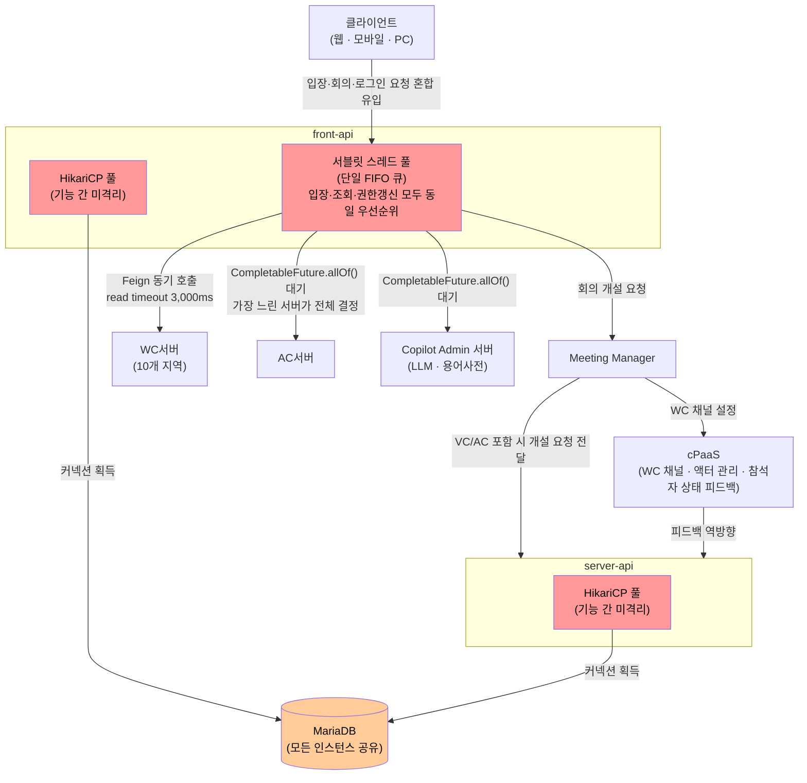

# 1.1. 배경

## 1.1.1. 미팅 서비스 소개

미팅(Meeting)은 사내 임직원과 대외 고객사를 대상으로 제공되는 영상 회의 솔루션이다. 웹, 모바일, 웹 클라이언트, 회의실 장비(VC 단말), 전화 참석(오디오 컨퍼런스) 등 다양한 단말과 참석 방식을 지원하며, 사용자들이 일상적인 업무 회의에 활용한다.

최근에는 다양한 AI 기능이 접목되어, 회의 종료 후 대화 내용을 AI로 요약한 회의록 제공, 자동 언어 인식 기반의 실시간 번역 서비스, 회의 중 AI 코파일럿 기능 등을 사용할 수 있다.

서비스는 현재 대외 고객사 및 공공기관으로의 확대를 진행 중이며, 최대 2만 명 규모의 대규모 스트리밍 서비스 오픈이 예정되어 있다. 이에 따라 특정 시간대에 대규모 동시 접속과 트래픽 집중이 발생할 것으로 예측된다.

## 1.1.2. 미팅 포털 서버의 역할

미팅 포털 서버는 미팅 서비스의 핵심 백엔드 서버로서 다음 기능을 담당한다.

| 기능 영역 | 주요 역할 |
|---------|---------|
| 회의 관리 | 회의 개설, 조회, 삭제, 수정 |
| 회의 입장 | Meeting Manager 조회 후 wyzProParam 생성, 웹/모바일 경유 런처를 통해 클라이언트에 전달 |
| 권한 관리 | 사용자 권한 관리 (AC 권한, LLM 권한, 용어사전 권한) |
| 외부 연계 | WC서버, VC서버, AC서버, AI서버, Copilot Admin 서버 연동 |
| Copilot 연계 | LLM 권한 및 용어사전 권한 관리 |

포털 서버는 10개 지역에 걸쳐 운영 중인 WC서버(웹 컨퍼런스), 3개 지역의 VC서버(비디오 컨퍼런스), AC서버(오디오 컨퍼런스)와 연동하며, 신규로 도입된 AI서버 및 Copilot Admin 서버와도 연계한다. 또한 연계시스템A, B, C 등 10개 이상의 외부 시스템과 통합 운영된다.

## 1.1.3. 현재 시스템 구조 (As-is)

미팅 포털 서버는 Java Spring Boot 기반 단일 코드베이스로 구성되며, URI prefix에 따라 API 역할이 분리되고 역할별로 별도 인스턴스로 배포된다.

| URI prefix | API 인스턴스 | 주요 역할 |
|---|---|---|
| `/front` | front-api | 사용자 요청 수신 · 미팅 타입 결정 · 권한 확인 · 유효성 검사 · 전처리 |
| `/server` | server-api | VC/AC 외부 벤더 연동, 참석자 상태 피드백(Feedback) 처리 |
| `/admin` | admin-api | 관리 기능 |

**모든 API 인스턴스는 동일한 DB를 공유하며**, 각 인스턴스 내 기능 간에도 커넥션 풀이 격리되지 않은 채로 운영된다.

아래 구조도는 As-is의 핵심 문제 지점(단일 풀 공유, 동기 블로킹 호출)을 나타낸다.

### 요청 흐름

회의 생성 흐름은 front-api의 전처리 후 Meeting Manager로 진입한다. front-api는 단순 게이트웨이가 아니며, 미팅 타입 결정·권한 확인·유효성 검사·전처리를 직접 수행한 뒤 Meeting Manager에 회의 개설을 요청한다. Meeting Manager는 WC 채널 설정(cPaaS 경유)을 처리하고, VC/AC가 포함된 경우 개설 요청을 server-api에 전달한다.

- **WC 포함 회의**: `front-api → Meeting Manager → cPaaS (채널 생성·actor 매핑)`. WC 전용 회의는 server-api 호출 없이 Meeting Manager와 cPaaS 사이에서 완결된다.
- **VC/AC 포함 회의**: `front-api → Meeting Manager → server-api → VC서버 / AC서버`. Meeting Manager가 server-api에 개설 요청을 전달하고, server-api가 VC서버·AC서버에 각각 개설을 요청한다. 외부 연동 실패 시 전체 회의 생성 요청 실패.

사용자 요청 외에 백엔드 발생 역방향 흐름도 존재한다. 클라이언트 입장 완료 시 cPaaS → Meeting Manager → server-api (GET /entrance-info) → DB 경로로 처리되며, 퇴장·연결 끊김 등 상태 변경은 cPaaS → server-api → DB로 처리된다(피드백 흐름). 모두 front-api를 거치지 않는다.

### 미팅 타입

| 코드 | 명칭 | 설명 |
|------|------|------|
| w | WC (Web Conference) | 일반 웹 화상 회의 |
| v | VC (Video Conference) | 화상회의실 장비 초대 가능 |
| a | AC (Audio Conference) | 전화 참석자 초대 가능 |

WC/VC 권한은 SDC(DB 조회), AC 권한은 로그인 시 AC 서버 호출 후 DB 저장 방식으로 관리된다.

### 외부 연계 및 환경 구성

외부 연계는 WC서버, VC서버, AC서버, AI서버, Copilot Admin 서버와의 동기·비동기 HTTP 호출로 구성되며, 연계시스템A, B, C 등 10개 이상의 외부 시스템과 통합 운영된다.

동일한 단일 형상이 아래 4개 환경에 배포되며, 환경별 설정은 YML 파일로 분리되어 있다.

| 환경 | 대상 |
|---|---|
| Knox | 사내 임직원 |
| Brity 대외 | B2C — Brity Works에 가입한 외부 기업 임직원 |
| Brity 공공 (행망) | 공공기관 — 행정망 |
| Brity 공공 (공망) | 공공기관 — 공공망 |

## 1.1.4. 아키텍처 개선 필요성

현재 모놀리식 구조에서 다음과 같은 구조적 문제가 존재한다.

**트래픽 집중 구간의 처리 한계**
업무 시작 시간대(오전 9시, 오후 1시 등)에는 다수의 사용자가 동시에 로그인하고 회의에 입장하는 패턴이 반복된다. 2만 명 규모 스트리밍 서비스 오픈 시 이 집중도는 더욱 심화될 것으로 예상된다.

**외부 서버 의존 구조의 지연 누적**
로그인 시 권한 갱신 과정에서 AC서버, Copilot Admin 서버 등 다수의 외부 서버를 동기적으로 호출하며, `CompletableFuture.allOf()`로 모든 응답을 대기하는 구조다. 연계 서버 수가 증가할수록 가장 느린 서버의 응답 시간이 전체 지연을 결정한다.

**DB 커넥션 풀 미격리**
회의 입장 처리, 회의 조회, 회의 개설, 권한 갱신 등 모든 기능이 동일한 DB 커넥션 풀을 공유한다. 특정 기능에서 트래픽 집중이 발생하면 커넥션 고갈이 전체 서비스 장애로 전파될 수 있다.

**단일 형상 기반 다중 환경 운영의 한계**
4개 환경(Knox, Brity 대외, 행망, 공망)의 요구사항이 점점 달라지면서, YML 설정 분리만으로는 대응이 어려워 비즈니스 로직 내부에 환경별 분기 처리가 누적되고 있다. 동시에 환경별로 릴리즈 일정이 상이한 상황에서 단일 형상을 공유하다 보니 형상 관리의 복잡도와 배포 위험이 증가하고 있다.

이러한 배경에서, 본 설계는 모놀리식 미팅 포털 서버의 아키텍처를 개선하여 요청 집중 구간에 안정적으로 대응하기 위한 방향을 도출하고 설계 결정의 근거를 기록하는 것을 목적으로 한다.
