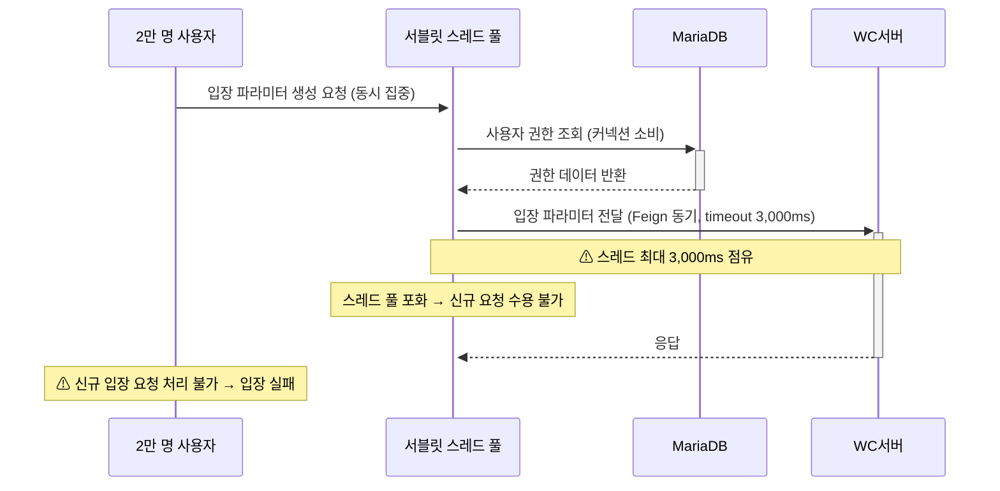

# ISSUE-01. 2만 명 동시 입장 시 스레드·커넥션 풀 고갈

## 현황

2만 명 규모 스트리밍 서비스에서 방송 시작 직전 대규모 사용자가 동시에 입장 버튼을 클릭하는 순간적인 요청 집중이 발생한다. 입장 파라미터 생성 API는 DB에서 사용자 권한을 조회하고 입장 파라미터를 생성한 후, WC서버에 입장 파라미터(사용자 권한 정보 포함)를 Feign 동기 호출(read timeout 3,000ms)로 전달하고 응답을 받아 반환한다.

현재 시스템은 요청을 완충하거나 처리 속도를 조절하는 큐·버퍼 메커니즘 없이, 모든 요청이 단일 서블릿 스레드 풀에 직접 유입된다.

```
2만명 동시 입장 버튼 클릭
  → 입장 파라미터 생성 API 집중
       ├── DB 사용자 권한 조회                                            ← DB 커넥션 소비
       ├── 입장 파라미터 생성 (사용자 권한 정보 포함)
       └── WC서버에 입장 파라미터 전달 (Feign 동기, read timeout 3,000ms)  ← 스레드 점유
```



## 문제점

- WC서버에 입장 파라미터를 전달하는 Feign 동기 호출 동안 해당 요청의 스레드가 최대 3,000ms 점유 상태로 대기한다.
- 2만 요청이 순간적으로 집중될 경우 서버 스레드 풀 고갈과 DB 커넥션 고갈이 동시에 발생할 수 있다.
- 스레드 고갈 시 신규 요청에 대한 응답 자체가 불가능해지며, 입장 실패 사용자 경험으로 이어진다.
- 연계시스템A의 경우 1분간 2만 건 참석 처리가 요구되어 요청 집중 규모가 더 크다.

## 영향

- 2만명 동시 입장 시 DB 커넥션 풀 사용률 80% 초과 위험 (→ QA-02 위반 위험)
- 스레드 고갈로 인한 핵심 기능 성공률 하락 (→ QA-04 위반 위험)
- WC서버 응답 지연 시 입장 처리 전반 지연
