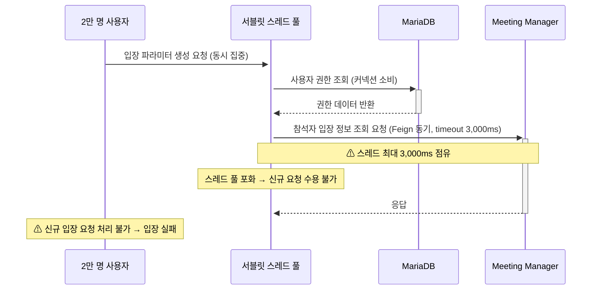

# ISSUE-01. 2만 명 동시 입장 시 스레드·커넥션 풀 고갈

## 현황

2만 명 규모 스트리밍 서비스에서 방송 시작 직전 대규모 사용자가 동시에 입장 버튼을 클릭하는 순간적인 요청 집중이 발생한다. 입장 API는 DB에서 입장 가능 여부를 확인하고 conference-token을 발급한 후, Meeting Manager에 Feign 동기 호출(read timeout 3,000ms)로 참석자 입장 관련 정보를 조회한다. front-api는 MM 응답값과 다른 값들을 조합하여 wyzProParam을 생성하고 웹/모바일에 반환한다. 웹/모바일은 런처를 통해 클라이언트 실행 시 wyzProParam을 전달한다.

현재 시스템은 요청을 완충하거나 처리 속도를 조절하는 큐·버퍼 메커니즘 없이, 모든 요청이 단일 서블릿 스레드 풀에 직접 유입된다.

```
2만명 동시 입장 버튼 클릭
  → 입장 파라미터 생성 API 집중
       ├── DB 사용자 권한 조회                                            ← DB 커넥션 소비
       ├── 입장 파라미터 생성 (사용자 권한 정보 포함)
       └── Meeting Manager에 참석자 입장 정보 조회 (Feign 동기, read timeout 3,000ms)  ← 스레드 점유
            └── front-api에서 MM 응답값 + 기타 값으로 wyzProParam 조립
```



## 문제점

- Meeting Manager에서 참석자 입장 정보를 조회하는 Feign 동기 호출 동안 해당 요청의 스레드가 최대 3,000ms 점유 상태로 대기한다.
- 2만 요청이 순간적으로 집중될 경우 서버 스레드 풀 고갈과 DB 커넥션 고갈이 동시에 발생할 수 있다.
- 스레드 고갈 시 신규 요청에 대한 응답 자체가 불가능해지며, 입장 실패 사용자 경험으로 이어진다.
- 연계시스템A의 경우 1분간 2만 건 참석 처리가 요구되어 요청 집중 규모가 더 크다.

## 영향

- 2만명 동시 입장 시 DB 커넥션 풀 사용률 80% 초과 위험 (→ QA-02 위반 위험)
- 스레드 고갈로 인한 핵심 기능 성공률 하락 (→ QA-04 위반 위험)
- Meeting Manager 응답 지연 시 입장 처리 전반 지연
