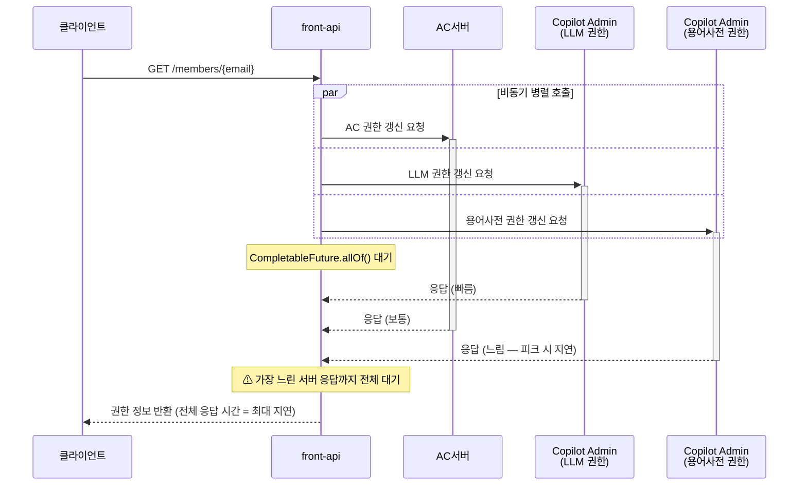

# ISSUE-02. 로그인 시 권한 갱신의 외부 서버 종속

## 현황

로그인(`POST /sign-in`) 완료 후 클라이언트는 자동으로 회원 정보 조회 API(`GET /members/{email}`)를 호출한다. 이 API는 AC서버(AC 회의 권한 갱신), Copilot Admin 서버(LLM 권한), Copilot Admin 서버(용어사전 권한) 등 다수의 외부 서버에 비동기 병렬 호출을 수행하고, `CompletableFuture.allOf()`로 모든 응답이 수신된 후 결과를 반환한다.

```
POST /sign-in → 액세스 토큰 발급
  ↓ (클라이언트 자동 호출)
GET /members/{email}
  ├── [비동기 병렬] AC서버       → AC 권한 갱신 및 조회  (AC 회의 개설·입장에 필요)
  ├── [비동기 병렬] Copilot 서버 → LLM 권한 갱신 및 조회
  ├── [비동기 병렬] Copilot 서버 → 용어사전 권한 갱신 및 조회
  └── [이후 추가될 외부 호출들...]
        ↓
  CompletableFuture.allOf() 대기 → 응답 반환
```



AC 권한은 로그인 시 AC 서버를 호출하여 확인한 뒤 DB에 저장되며, WC/VC 권한(SDC)은 DB 조회로 확인된다. 그러나 AC·LLM·용어사전 권한은 회사 계약 및 관리자 설정 기반으로 변경 빈도가 낮음에도, 매 로그인마다 외부 서버에 갱신을 요청하여 자주 바뀌지 않는 데이터를 반복 조회하는 구조다.

## 문제점

- 비동기 병렬 호출이지만 모든 서버의 응답을 기다리므로, 가장 느린 외부 서버의 응답 시간이 전체 응답 시간을 결정한다.
- 변경 빈도가 낮은 권한 데이터임에도 매 로그인마다 모든 외부 서버에 갱신을 요청하여, 동일한 결과를 얻는 외부 호출이 불필요하게 반복된다.
- 향후 연계 서버 증가가 예정되어 있어 `allOf()` 대기 구조에서 구조적 지연이 심화될 것으로 예상된다.
- 업무 시작 시간대 동시 로그인 집중 시, 외부 서버에 대한 요청도 동시에 집중되어 외부 서버 응답 지연이 가중된다.

## 영향

- 피크 시간대 로그인 응답 시간 1초 초과 위험 (→ QA-01 위반 위험)
- 외부 서버 중 하나라도 응답 지연 발생 시 전체 로그인 흐름 지연
- 반복되는 외부 호출이 피크 시간대 외부 서버 부하를 가중시키는 악순환
- 연계 서버 증가에 따른 구조적 성능 악화
