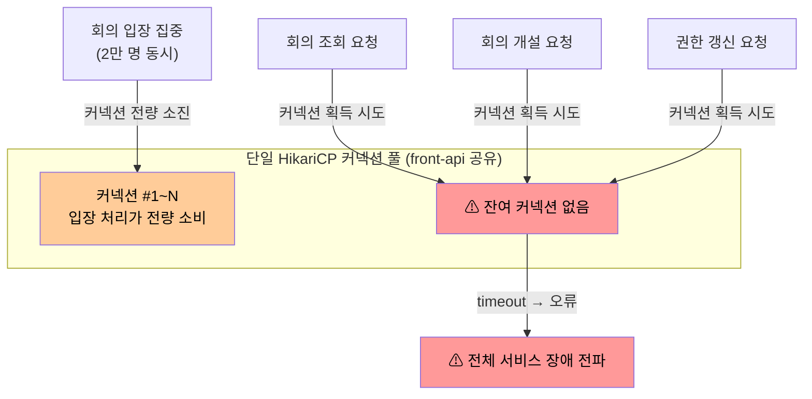

# ISSUE-04. 회의 입장 집중 시 단일 커넥션 풀 고갈의 전체 서비스 장애 전파

## ISSUE-01과의 구분

ISSUE-01은 Feign 동기 호출로 인한 스레드 점유가 커넥션 소진으로 이어지는 **발생 경로**를 다룬다. 본 이슈는 그렇게 고갈된 풀이 단일 공유 구조이기 때문에 피해가 다른 기능으로 번지는 **전파 구조**를 다룬다. ISSUE-01은 비동기 처리·우선순위 큐로 유입 자체를 완충하고, 본 이슈는 Bulkhead로 기능 간 풀을 격리하여 해결한다.

## 현황

front-api와 server-api는 단일 코드베이스에서 역할별로 배포되므로 인스턴스는 분리되어 있지만, 각 인스턴스 내부에서는 회의 입장 처리, 회의 조회, 회의 개설, 권한 갱신 등 모든 기능이 단일 HikariCP 커넥션 풀을 공유한다. 기능 단위로 커넥션 풀이 분리되어 있지 않아, 특정 기능의 DB 부하가 같은 인스턴스 내 전체 기능에 영향을 미치는 구조다. 또한 front-api, server-api, admin-api가 동일한 DB를 공유하므로 DB 서버 전체의 커넥션 수도 인스턴스 간 조율 없이 누적된다.

## 문제점

- 2만 명 동시 입장 처리 시 입장 관련 DB 쿼리가 커넥션 풀 전체를 소진할 수 있다.
- 커넥션 풀 고갈 시 회의 조회, 회의 개설 등 다른 기능도 DB 접근이 불가능해진다.
- 특정 기능의 트래픽 집중이 전체 서비스 장애로 전파되는 연쇄 장애 구조다.
- 커넥션 획득 대기 시간 초과(timeout)가 연쇄적으로 발생하여 오류 응답이 급증한다.

## 영향

- 특정 기능의 커넥션 고갈 시 전체 서비스 가용성 저하 (→ QA-03 위반 위험)
- 핵심 기능(회의 조회, 회의 개설) 성공률 99.9% 미달 위험 (→ QA-04 위반 위험)
- 장애 범위가 입장 처리 기능을 넘어 전체 서비스로 확대
