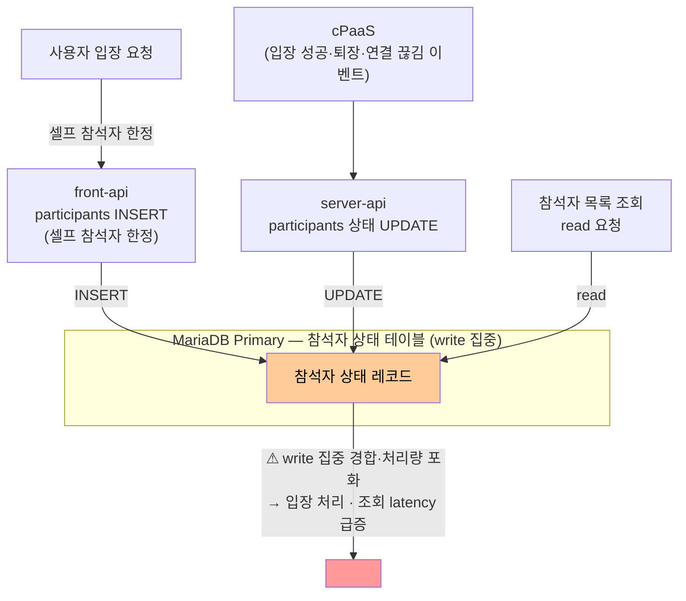

# ISSUE-07. 회의 입장·피드백 동시 유입 시 참석자 상태 write 집중 경합

## 현황

미팅 포털 서버는 MariaDB Primary-Replica 구성을 갖추고 있으며, 일부 응답 지연이 심한 SELECT 쿼리는 개별적으로 Replica로 라우팅되어 있다. 그러나 회의 상태 변경(Command)은 전부 Primary로 집중되고, 대부분의 조회(Query)도 Primary를 거치므로 체계적인 읽기·쓰기 분리는 이루어지지 않은 상태다. 하나의 미팅에 수십~수천 명이 동시에 참여하는 상황에서 입장, 퇴장, 참석자 추가/삭제 등 빈번한 상태 변경이 발생하는 동시에, 참석자 목록·대기실 인원·미팅 상태 등 다수의 조회 요청도 함께 유입된다.

write 경합의 발생 경로는 두 가지다:

- **front-api 경유 (셀프 참석자 한정)**: `User → front-api → participants INSERT`: 오픈회의에 사전 초대 없이 입장하는 셀프 참석자의 경우 입장 API 호출 시 front-api가 participants 테이블에 INSERT한다. 사전 초대된 참석자는 이미 레코드가 존재하므로 이 시점에 DB write가 발생하지 않는다.
- **cPaaS 피드백 경유**: `cPaaS → Meeting Manager → server-api (GET /entrance-info) → participants UPDATE`: 클라이언트가 cPaaS에 접속 성공하면 cPaaS가 입장 이벤트를 감지하여 Meeting Manager를 경유해 server-api의 GET /entrance-info API를 호출한다. server-api가 모든 참석자의 상태를 DB에 업데이트한다. 퇴장·연결 끊김 이벤트는 `cPaaS → server-api` 경로로 전달된다.

셀프 참석자 입장 시 front-api INSERT와 cPaaS 피드백 경유 server-api UPDATE가 동일 테이블을 동시에 타격하며, 여기에 참석자 목록 조회(read)까지 집중되면 동일 테이블에 write·read 부하가 중첩된다.

## 문제점

- 동일 참석자 레코드·인덱스에 INSERT(셀프 참석자)와 UPDATE(cPaaS 피드백)가 집중되어 write 간 경합이 발생하고, 이 write가 Primary 단일 노드에 몰려 처리량이 포화된다. 조회(read)도 같은 노드의 자원(CPU·I/O·버퍼풀)을 함께 사용하므로 latency가 동반 상승한다.
- 대규모 미팅 시작 시점에 수천 명이 동시 입장하면 cPaaS가 server-api에 수천 건의 입장 상태 UPDATE 콜백을 동시에 전달하여 Primary DB에 write가 집중된다. 셀프 참석자 INSERT(front-api 경유)까지 겹치면 write 부하가 더 심화된다.
- 대규모 미팅 시작 시점에 cPaaS 피드백 경유 입장 상태 UPDATE write와 참석자 목록 조회 read가 동시에 집중되면, Primary DB에서 write 경합과 read·write 자원 경합이 최고조에 달한다.
- write 작업이 집중되면 조회 쿼리의 응답 latency가 급격히 증가하고, 반대로 조회 요청이 몰리면 입장 파라미터 생성처럼 DB write가 필요한 처리가 지연된다.
- Command와 Query의 데이터 정합성 요구 수준이 다름에도 동일한 일관성 모델로 처리되어 불필요한 비용이 발생한다.

> **격리 수준 조정만으로 해소되지 않는 이유**: InnoDB 기본 격리 수준(REPEATABLE READ)에서 일반 SELECT는 MVCC 기반 consistent read로 처리되어 공유 lock을 잡지 않으므로, 순수한 read/write lock 경합 자체는 격리 수준 조정(예: READ COMMITTED)으로 상당 부분 완화된다. 그러나 본 이슈의 핵심 병목은 (1) 동일 참석자 레코드·인덱스에 INSERT(셀프 참석자)와 UPDATE(cPaaS 피드백)가 몰리는 **write-write 경합**, (2) 수천 건 동시 write가 Primary 단일 노드에 집중되어 발생하는 **write 처리량 포화**(redo log flush·디스크 I/O·버퍼풀 경합)이며, 이 둘은 격리 수준과 무관하게 해소되지 않는다. write 진행 중 조회 latency 상승 또한 동일 노드의 자원(CPU·I/O·버퍼풀) 경합에서 비롯된다. 따라서 근본 해법은 read를 Replica로 물리 분리(→ AS-07)하여 Primary가 write 처리에 집중하도록 하는 것이다.

## 요청 집중 구간에서의 심화

오후 정시 burst 또는 대규모 스트리밍 서비스처럼 수천 명이 동시에 입장하는 구간에서는:

- cPaaS 피드백 경유 입장 상태 UPDATE (server-api write, 동시 입장 집중)
- cPaaS 피드백(피드백 흐름 경유 write)
- 참석자 목록 · 대기실 상태 조회(read)

세 유형이 동시에 폭발적으로 증가하며 Primary DB에 write·read 부하가 집중된다. 가장 중요한 회의 입장 처리 자체가 피드백 write 및 조회 트래픽에 의해 지연되는 상황이 발생한다.

## 영향

- 대규모 미팅 시작 시점에 입장 처리 및 참석자 목록 조회 latency 동시 증가
- 참석자 상태 write 집중으로 인한 회의 입장 처리 지연 및 타임아웃 위험
- 조회 확장과 상태 변경 처리 확장을 독립적으로 수행할 수 없어 수평 확장 효율 저하
