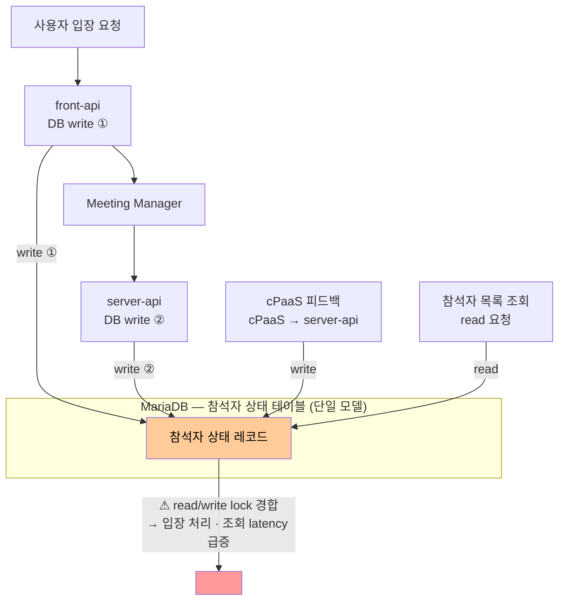

# ISSUE-07. 회의 입장·피드백 동시 유입 시 참석자 상태 DB lock 경합

## 현황

미팅 포털 서버는 회의 상태 변경(Command)과 조회(Query) 요청을 동일한 DB 테이블·도메인 모델로 처리한다. 하나의 미팅에 수십~수천 명이 동시에 참여하는 상황에서 입장, 퇴장, 참석자 추가/삭제, 회의/참석자의 권한 변경 등 빈번한 상태 변경이 발생하는 동시에, 참석자 목록·대기실 인원·미팅 상태 등 다수의 조회 요청도 함께 유입된다.

write 경합의 발생 경로는 두 가지다:

- **사용자 요청 경유**: `User → front-api(DB write) → Meeting Manager → server-api(DB write)` (회의 입장 등) — 단일 입장 처리에서 front-api와 server-api가 각각 독립적인 트랜잭션으로 DB write를 수행한다
- **피드백 흐름 경유**: `cPaaS → server-api → DB write` (퇴장, 연결 끊김 등 참석자 상태 변경)

사용자 요청 경유 흐름에서 front-api와 server-api가 각각 독립적인 트랜잭션으로 동일 테이블에 write를 수행하며, 피드백 흐름의 server-api write까지 더하면 동일 테이블에 write 경로가 세 개, read 경로가 하나가 된다.

## 문제점

- Command(상태 변경)와 Query(조회)가 동일 DB 레코드에 대해 read/write lock을 경쟁하여 lock 경합이 발생한다.
- 사용자 입장 처리 1건에 front-api write → server-api write의 두 단계 트랜잭션이 순차 실행된다. 두 트랜잭션 사이 구간에 조회 요청이 끼어들면 중간 상태를 읽거나 block되며, 동시 입장 시 사용자 요청 경유 write만으로도 최대 2배의 write 트랜잭션이 집중된다.
- 대규모 미팅 시작 시점에 사용자 입장(front-api write + server-api write)과 cPaaS 피드백(write)이 동시에 집중되면, 단일 DB 모델의 lock 경합이 최고조에 달한다.
- write 작업이 집중되면 조회 쿼리의 응답 latency가 급격히 증가하고, 반대로 조회 요청이 몰리면 입장 파라미터 생성처럼 DB write가 필요한 처리가 지연된다.
- Command와 Query의 데이터 정합성 요구 수준이 다름에도 동일한 일관성 모델로 처리되어 불필요한 비용이 발생한다.

## 요청 집중 구간에서의 심화

오후 정시 burst 또는 대규모 스트리밍 서비스처럼 수천 명이 동시에 입장하는 구간에서는:

- 사용자 입장 요청(front-api 경유 write)
- cPaaS 피드백(피드백 흐름 경유 write)
- 참석자 목록 · 대기실 상태 조회(read)

세 유형이 동시에 폭발적으로 증가하며 단일 DB 모델에 부하가 집중된다. 가장 중요한 회의 입장 처리 자체가 피드백 write 및 조회 트래픽에 의해 지연되는 상황이 발생한다.

## 영향

- 대규모 미팅 시작 시점에 입장 처리 및 참석자 목록 조회 latency 동시 증가
- DB lock 경합으로 인한 회의 입장 처리 지연 및 타임아웃 위험
- 조회 확장과 상태 변경 처리 확장을 독립적으로 수행할 수 없어 수평 확장 효율 저하
