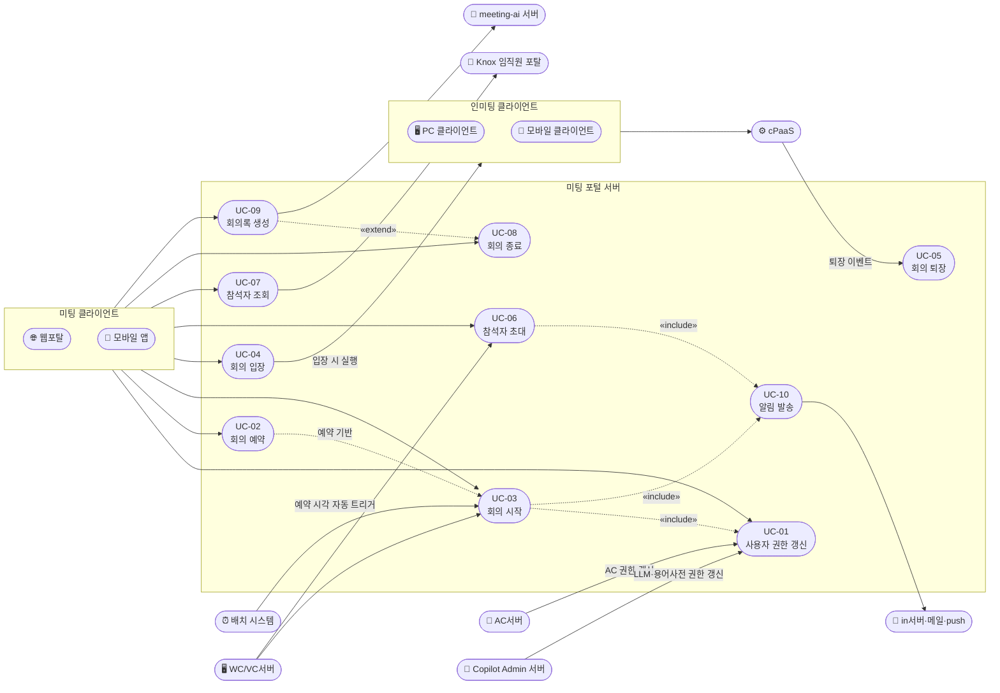

# 2.1. 기능 요구사항

본 절은 미팅 포털 서버 아키텍처 개선 설계의 대상이 되는 기능 요구사항을 정의한다. 각 요구사항은 유스케이스로 상세화되며, 식별된 이슈(→ 1.2 이슈 참조)와 연결된다.

## 2.1.1. 기능 요구사항 목록

| ID | 요구사항명 | 설명 | 우선순위 | 관련 유스케이스 | 관련 이슈 |
|----|-----------|------|---------|--------------|---------|
| FR-01 | 사용자 권한 갱신 | 로그인 완료 후 AC서버로부터 AC 권한을, Copilot Admin 서버로부터 LLM 권한·용어사전 권한을 갱신하여 반환한다. 피크 시간대에도 안정적으로 처리되어야 한다. | 상 | UC-01 | ISSUE-02 |
| FR-02 | 회의 예약 | 미래 시점의 회의를 사전 예약한다. 예약 데이터(시작 시각, 참석자 수)는 피크 트래픽 예측 및 선제 대응(캐시·커넥션 워밍)의 기반이 된다. | 중 | UC-02 | ISSUE-09 |
| FR-03 | 회의 시작 | 사용자 또는 배치 시스템에 의해 트리거되어 회의를 시작한다. 외부 서버(WC/VC/AC) 호출을 포함하며, 회의 시작 시점에 사용자 권한 갱신이 수행된다. 동기 호출 구간을 최소화하여 응답 시간을 단축한다. | 상 | UC-03 | ISSUE-05, ISSUE-06 |
| FR-04 | 회의 입장 처리 | 입장 파라미터를 생성하여 응답한다. 2만 명 동시 입장 상황에서도 안정적으로 처리되어야 한다. | 상 | UC-04 | ISSUE-01, ISSUE-03 |
| FR-05 | 참석자 상태 피드백 처리 | 인미팅 클라이언트 퇴장·연결 끊김 등 이벤트를 cPaaS로부터 수신하여 참석자 상태를 DB에 반영한다. | 상 | UC-05 | ISSUE-07 |
| FR-06 | 참석자 초대 | 회의에 참석자를 추가 초대하고 외부 서버에 참석자 정보를 업데이트한다. | 중 | UC-06 | ISSUE-04, ISSUE-07 |
| FR-07 | 회의 참석자 조회 | Knox 임직원 포탈 서버를 통해 참석자 정보를 조회하여 반환한다. DB 커넥션 고갈 없이 안정적인 응답을 제공한다. | 중 | UC-07 | ISSUE-04, ISSUE-06 |
| FR-08 | 회의 종료 | 진행 중인 회의를 종료하고 외부 서버(WC/VC/AC)에 종료를 전파한다. 회의록 생성의 선행 조건이 된다. | 중 | UC-08 | ISSUE-05, ISSUE-06 |
| FR-09 | 회의록 생성 | 종료된 회의의 참석자·발언·채팅 등 데이터를 meeting-ai 서버를 통해 수집·생성한다. 회의 종료(FR-08) 완료 이후에만 실행 가능하다. | 중 | UC-09 | ISSUE-07 |
| FR-10 | 회의 초대/참석 알림 발송 | 회의 초대 및 참석 관련 알림을 in서버(SMS), 메일 서버, push 서버를 통해 발송한다. 알림 발송 실패가 핵심 회의 기능에 영향을 주지 않아야 한다. | 중 | UC-10 | ISSUE-05, ISSUE-06, ISSUE-08 |

## 2.1.2. 외부 연계 시스템 참조

기능 요구사항 수행에 관련된 외부 연계 시스템은 다음과 같다.

| 시스템 | 역할 | 관련 기능 요구사항 |
|--------|------|----------------|
| WC서버 (약 10개 지역) | 웹 컨퍼런스 시작·종료, 입장 파라미터 생성 | FR-03, FR-04, FR-08 |
| VC서버 (약 3개 지역) | 비디오 컨퍼런스 시작·종료, 회의실 참석 처리 | FR-03, FR-08 |
| AC서버 | 오디오 컨퍼런스 시작·종료, 전화 참석 처리, AC 권한 갱신 | FR-01, FR-03, FR-08 |
| Knox 임직원 포탈 서버 | 임직원 정보 조회를 통한 회의 참석자 확인 | FR-07 |
| cPaaS | 인미팅 클라이언트의 퇴장·연결 끊김 이벤트를 포털 서버로 전달 | FR-05 |
| 배치 시스템 | 예약 회의의 자동 시작 트리거 | FR-03 |
| meeting-ai 서버 | 종료된 회의 데이터를 기반으로 회의록 생성 | FR-09 |
| Copilot Admin 서버 | LLM 권한 갱신, 용어사전 권한 갱신 | FR-01 |
| in서버 (SMS) | SMS 알림 발송 | FR-10 |
| 메일 서버 | 이메일 알림 발송 | FR-10 |
| push 서버 | 모바일 push 알림 발송 | FR-10 |
| 연계시스템A | 동시 1000건 회의 시작, 1분간 10만 건 조회, 1분간 2만 건 참석 | FR-03, FR-04, FR-07 |
| 연계시스템B | 회의실 장비 특정 시간 점유 | FR-03 |
| 연계시스템C | 일반 통합회의 연계 시작 | FR-03 |

## 2.1.3. Use Case 목록

### Use Case 목록표

| UC ID | Use Case명 | 주요 행위자 | 관련 FR | 관련 이슈 |
|-------|-----------|-----------|--------|---------|
| UC-01 | 사용자 권한 갱신 | 미팅 웹포탈, 미팅 모바일 앱 | FR-01 | ISSUE-02 |
| UC-02 | 회의 예약 | 미팅 웹포탈, 미팅 모바일 앱 | FR-02 | ISSUE-09 |
| UC-03 | 회의 시작 | 미팅 웹포탈, 미팅 모바일 앱, 배치 시스템 | FR-03 | ISSUE-05, ISSUE-06 |
| UC-04 | 회의 입장 | 미팅 웹포탈, 미팅 모바일 앱 | FR-04 | ISSUE-01, ISSUE-03 |
| UC-05 | 회의 퇴장 | 인미팅 클라이언트 (via cPaaS) | FR-05 | ISSUE-07 |
| UC-06 | 참석자 초대 | 미팅 웹포탈, 미팅 모바일 앱 | FR-06 | ISSUE-04, ISSUE-07 |
| UC-07 | 회의 참석자 조회 | 미팅 웹포탈, 미팅 모바일 앱 | FR-07 | ISSUE-04, ISSUE-06 |
| UC-08 | 회의 종료 | 미팅 웹포탈, 미팅 모바일 앱 | FR-08 | ISSUE-05, ISSUE-06 |
| UC-09 | 회의록 생성 | 미팅 웹포탈, 미팅 모바일 앱 | FR-09 | ISSUE-07 |
| UC-10 | 회의 초대/참석 알림 발송 | 시스템 (자동 발송) | FR-10 | ISSUE-05, ISSUE-06, ISSUE-08 |

### Use Case 관계

- **«include» (UC-03 → UC-01)**: 회의 시작 시점에 사용자 권한 갱신이 수행된다.
- **«include» (UC-03 → UC-10)**: 회의 시작(초대) 시 알림 발송이 포함된다.
- **«include» (UC-06 → UC-10)**: 참석자 초대 시 알림 발송이 포함된다.
- **«extend» (UC-09 → UC-08)**: 회의록 생성은 회의 종료 후 선택적으로 실행 가능하다.
- **UC-03 시작 경로 (2가지)**:
  - 즉시 개설: 미팅 클라이언트가 UC-03을 직접 트리거한다.
  - 예약 기반: UC-02(회의 예약) 데이터를 배치 시스템이 읽어 예약 시각에 UC-03을 자동 트리거한다.
- **선행 조건 (UC-05)**: 회의 입장(UC-04) 완료 후 인미팅 클라이언트가 실행된 상태에서 퇴장 이벤트가 발생한다.

### Use Case Diagram

