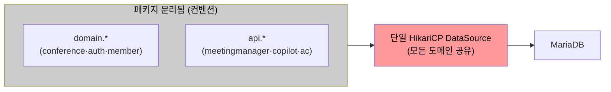
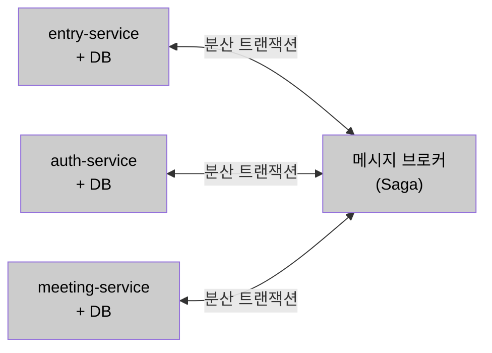
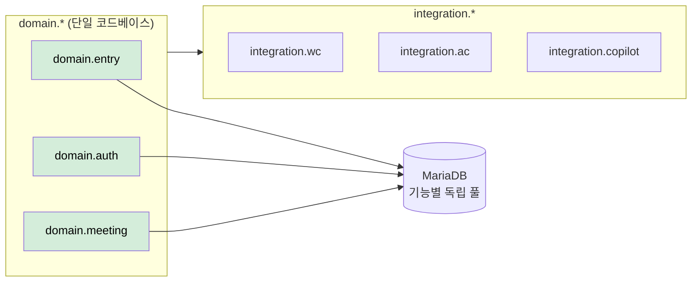

# AS-01. 입장 처리 도메인 경계 분리

## 적용 대상

- **아키텍처 드라이버**: AD-03 (커넥션 풀 장애 격리), AD-04 (핵심 기능 가용성), AD-09 (Java Spring Boot + HikariCP 기술 스택 준수)
- **해결 이슈**:
  - ISSUE-04: 단일 커넥션 풀 구조에서 도메인 경계가 없으므로 Bulkhead 적용 기반 자체가 없음
  - ISSUE-07: 입장 Command와 참석자 조회 Query가 동일 도메인 모델을 공유하여 CQRS 분리 불가
  - ISSUE-08: 10개 이상의 외부 연계 로직이 단일 코드베이스에 혼재하여 연계별 독립 정책(타임아웃·폴백) 조정 시 yml 수정 후 어플리케이션 재구동 필요, 피크 중 런타임 즉시 조정 불가
- **설계 목표**: DG-03 (특정 기능 커넥션 고갈 시 타 기능 정상 운영)
- **관련 유스케이스**: UC-03 (회의 시작), UC-04 (회의 입장)
- **관련 품질 요구사항**: QA-03 (DB 커넥션 풀 격리 신뢰성), QA-04 (핵심 기능 가용성)

## 설계 근거

현행 미팅 포털 서버는 Java Spring Boot 단일 코드베이스에서 front-api / server-api / admin-api 인스턴스로 역할을 분리해 배포한다. 코드 수준에서도 도메인별 패키지(member, auth, conference 등)와 외부 연계 패키지(api/meetingmanager, api/copilot, api/ac 등 서버별 분리)가 이미 존재한다. 그러나 이 분리는 **컨벤션 수준**에 머물러 있어, 파생 전략 적용을 가로막는 두 가지 구조적 문제가 아직 해소되지 않았다.

첫째, 도메인별 패키지가 나뉘어 있어도 모든 Repository가 단일 HikariCP DataSource를 공유한다. 기능별 커넥션 풀 분리(AS-08 격벽 분리)를 적용하려면 `domain.entry`에 전용 DataSource Bean을 분리 주입해야 하는데, DataSource Bean이 하나로 묶여 있으면 입장 처리 Repository와 회의 조회 Repository를 서로 다른 풀에 귀속시킬 수단이 없다. 둘째, 도메인 간 참조 규칙이 강제되지 않아 빌드 타임에 경계 침식을 막을 수 없다. 입장 처리 코드가 권한 갱신 도메인 구현체를 직접 참조해도 이를 잡아내지 못하며, 경계가 이렇게 누수되면 AS-07·AS-08 파생 전략의 도메인별 경계 기준도 함께 흐려진다.

이 제약 조합에서 코드 경계를 세우는 단위가 세 가지 패러다임으로 갈린다.

- 경계를 강제하지 않고 현행 컨벤션 수준의 패키지 분리를 그대로 둔다.
- 서비스·DB·배포 단위를 도메인별로 물리적으로 완전 분리한다(MSA).
- 단일 코드베이스를 유지한 채 도메인 논리 경계를 세우고 빌드 타임 규칙으로 강제한다.

## 후보

### 후보1. 현행 구조 유지 (역할별 인스턴스 배포만)

현행대로 도메인별 패키지(member, auth, conference 등)와 외부 연계 패키지(api/*)가 분리된 구조를 유지하되 DataSource 분리 설정은 추가하지 않는다. 패키지 구조가 나뉘어 있어도 모든 Repository가 단일 HikariCP DataSource를 함께 쓰다 보니, 입장 처리 Repository와 회의 조회 Repository를 서로 다른 풀에 귀속시킬 수단이 없다. DataSource Bean 분리 없이는 AS-08 격벽 분리의 기능별 커넥션 풀 귀속 기준이 없으며, ISSUE-04가 구조적으로 해소되지 않는다.

- 장점
  - 구조 변경이 없어 즉시 운영 가능하고 추가 학습·검증 비용이 없다.
- 단점
  - 단일 DataSource 공유가 유지되어 AS-08 격벽 분리의 귀속 기준을 세울 수 없다.
  - 경계 규칙이 없어 ISSUE-04·08의 구조적 원인이 그대로 잔존한다.

*후보1: 현행 구조 유지 (단일 DataSource 공유)*

### 후보2. 완전한 마이크로서비스 분리

입장 서비스(Entry Service), 권한 서비스(Auth Service), 회의 관리 서비스(Meeting Service), 외부 연계 게이트웨이(Gateway Service)를 각각 독립적인 프로세스·DB·배포 단위로 완전 분리한다. 각 서비스가 독립 DB 스키마를 보유하므로 커넥션 풀 고갈이 서비스 경계 내에서만 영향을 미치고 코드 경계도 물리적으로 명확해진다. 그러나 현재 단일 DB 트랜잭션으로 처리되는 "입장 가능 여부 확인 → conference-token 발급 → 입장 파라미터 생성"이 서비스 경계를 넘어야 하면 Saga 패턴 등 복잡한 보상 트랜잭션 설계가 필요하고, 신규 서비스 인프라·서비스 간 통신·운영 오버헤드가 뒤따른다.

- 장점
  - 서비스·DB·배포 단위가 물리적으로 분리되어 결함·자원 고갈이 서비스 경계 안에 갇힌다.
- 단점
  - 분산 트랜잭션(Saga) 재설계와 신규 인프라가 필요해 C-04(점진적 적용)를 위반한다.
  - 서비스 간 통신·운영 오버헤드가 단기 개선 사이클에서 소화하기 어렵다.

*후보2: 완전한 마이크로서비스 분리*

### 후보3. 선별적 도메인 모듈 분리 (채택)

단일 코드베이스를 유지하면서 도메인별로 패키지 모듈 경계를 명확히 설정한다. 특히 **외부 연계 전담 모듈**을 식별·분리하여 ACL 패턴으로 캡슐화하고, 입장 처리·권한·회의 도메인을 명확한 패키지 경계로 구분한다. 패키지 구조를 `domain.entry`·`domain.auth`·`domain.meeting`·`integration.wc`·`integration.ac`·`integration.copilot` 등으로 재편하고, 각 도메인 패키지는 다른 도메인 패키지를 인터페이스로만 의존하며 ArchUnit으로 빌드 타임에 강제한다. 이 경계를 기반으로 AS-08 Bulkhead는 `domain.entry` 전용 HikariCP DataSource를 분리한다. 같은 JVM·배포 단위를 유지하므로 분산 트랜잭션이 발생하지 않으면서, 논리 경계가 AS-08·AS-07 파생 전략이 적용될 범위의 기준이 된다.

- 장점
  - 배포 구조·기술 스택 변경 없이 AS-08·AS-07 파생 전략의 전제 조건(전용 DataSource·경계 규칙)을 확보한다.
  - 단일 DB 트랜잭션이 유지되어 분산 트랜잭션 문제가 발생하지 않는다.
  - 필요 시 특정 도메인 모듈을 독립 서비스로 추출하는 점진적 MSA 발판이 된다.
- 단점
  - ArchUnit 경계 규칙을 지속 관리해야 하며 위반 시 빌드가 실패한다.
  - 같은 JVM·프로세스를 공유해 완전 MSA 수준의 물리적 격리는 얻지 못한다.

*후보3: 선별적 도메인 모듈 분리 (채택)*

## 후보별 비교 검토

| 비교 축 | 후보1. 현행 구조 유지 | 후보2. 완전한 MSA 분리 | 후보3. 선별적 도메인 모듈 분리 (채택) |
| --- | --- | --- | --- |
| 경계 단위 | 컨벤션(패키지) | 서비스·DB·배포 물리 분리 | 코드 논리 경계(단일 코드베이스) |
| DataSource 분리 기반 | ✗ 단일 풀 공유 | ○ 서비스별 독립 | ○ domain.entry 전용 Bean |
| 경계 규칙 강제 | ✗ 미강제 | ○ 물리적 | ○ ArchUnit 빌드 타임 |
| 트랜잭션 경계 | 단일 DB 유지 | ✗ 분산 트랜잭션(Saga) | ○ 단일 DB 유지 |
| C-04 점진적 적용 | ○ | ✗ 신규 인프라·재설계 | ○ 배포·스택 변경 없음 |
| ISSUE-04·07·08 해소 | ✗ | ○ (과잉) | ○ |
| 물리적 장애 격리 | ✗ | ○ | △ (런타임 격리는 AS-08 보완) |

## 채택

**후보3(선별적 도메인 모듈 분리)을 채택한다.**

배포 구조와 기술 스택을 바꾸지 않으면서 AS-08·AS-07 파생 전략의 전제 조건(전용 DataSource·경계 규칙)을 확보하는 유일한 안이기 때문이다.

후보1은 단일 DataSource 공유가 유지되어 AS-08 격벽 분리의 귀속 기준을 세울 수 없고 ISSUE-04·08이 구조적으로 잔존한다. 후보2는 가장 강한 물리적 격리를 주지만 두 가지가 걸린다.

- 단일 DB 트랜잭션 경계가 서비스 경계를 넘어 Saga 등 분산 트랜잭션 재설계가 필요하다.
- 메시지 브로커 등 신규 인프라 도입이 C-04(점진적 적용)를 위반한다.

후보3은 물리적 격리가 완전 MSA에 못 미치는 약한 격리지만, 단일 코드베이스·단일 DB 트랜잭션을 유지한 채 논리 경계만 세워 파생 전략의 전제 조건을 충족하고, 부족한 런타임 격리는 AS-08(커넥션·스레드 격벽)이 보완한다.

### 설계 원칙

1. **경계 기준:** 도메인은 `domain.entry`·`domain.auth`·`domain.meeting`, 외부 연계는 `integration.*`로 패키지 경계를 세운다.
2. **참조 규칙:** 도메인 간 참조는 인터페이스만 허용하고 직접 구현체 참조를 금지하며, ArchUnit으로 빌드 타임에 강제한다.
3. **DataSource 분리:** `domain.entry` 전용 DataSource Bean(`entryDataSource`)을 분리해 AS-08 격벽 분리의 귀속 기준을 마련한다.
4. **외부 연계 캡슐화:** `integration.*`에 외부 서버별 Feign Client와 AS-09 CB를 캡슐화해 연계 로직을 포털 도메인에서 격리한다.

### 위험 요인

- **R1. ArchUnit 규칙 관리 부담(위반 시 빌드 실패):** CI 파이프라인에 규칙을 포함해 자동 검증으로 흡수
- **R2. 같은 JVM 공유로 물리적 격리 제한:** 런타임 자원 격리는 AS-08(커넥션·스레드 격벽)으로 보완
- **R3. 경계 침식(직접 참조 재발):** 인터페이스 전용 참조 원칙 + ArchUnit 상시 검증

### 파생 전략

- AS-08 (격벽 분리): 분리된 도메인 경계별 HikariCP 커넥션 풀 격리 구현
- AS-07 (DB 경로 분리): 도메인 경계 내에서 Command/Query 모델 분리
