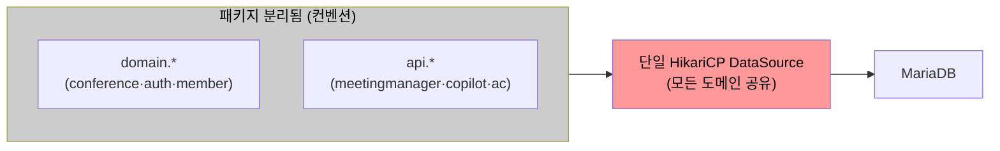
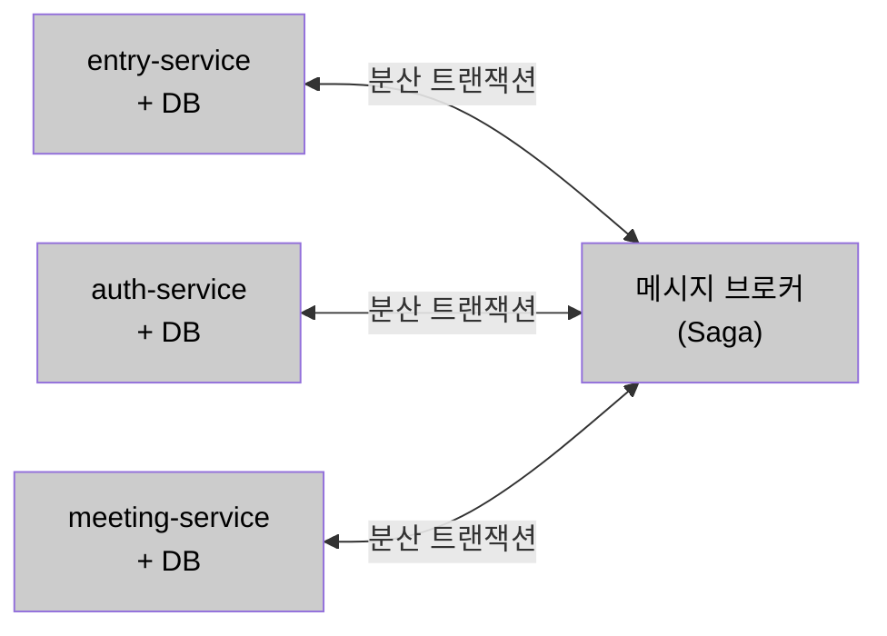
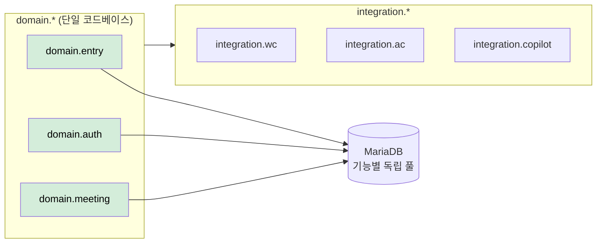

# AS-01. 입장 처리 도메인 경계 분리

## 적용 대상

- **아키텍처 드라이버**: AD-03 (DB 커넥션 풀 장애 격리), AD-09 (Java Spring Boot + HikariCP 기술 스택 준수)
- **해결 이슈**:
  - ISSUE-04: 단일 커넥션 풀 구조에서 도메인 경계가 없으므로 Bulkhead 적용 기반 자체가 없음
  - ISSUE-07: 입장 Command와 참석자 조회 Query가 동일 도메인 모델을 공유하여 CQRS 분리 불가
  - ISSUE-08: 10개 이상의 외부 연계 로직이 단일 코드베이스에 혼재하여 연계별 독립 정책(타임아웃·폴백) 조정 시 yml 수정 후 어플리케이션 재구동 필요, 피크 중 런타임 즉시 조정 불가
- **설계 목표**: DG-03 (특정 기능 커넥션 고갈 시 타 기능 정상 운영)
- **관련 유스케이스**: UC-03 (회의 시작), UC-04 (회의 입장)
- **관련 품질 요구사항**: QA-03 (DB 커넥션 풀 격리 신뢰성), QA-04 (핵심 기능 가용성)

## 설계 근거

현행 미팅 포털 서버는 Java Spring Boot 단일 코드베이스에서 front-api / server-api / admin-api 인스턴스로 역할을 분리해 배포한다. 코드 수준에서도 도메인별 패키지(member, auth, conference 등)와 외부 연계 패키지(api/meetingmanager, api/copilot, api/ac 등 서버별 분리)가 이미 존재한다. 그러나 이 분리는 **컨벤션 수준**에 머물러 있으며, 파생 전략 적용을 가로막는 두 가지 구조적 문제가 해소되지 않은 상태다.

첫째, 도메인별 패키지가 존재하더라도 모든 Repository가 단일 HikariCP DataSource를 공유한다. 기능별 커넥션 풀 분리(AS-08 격벽 분리)를 적용하려면 `domain.entry`에 전용 DataSource Bean을 분리 주입해야 하는데, DataSource Bean이 단일로 묶여 있으면 입장 처리 Repository와 회의 조회 Repository를 서로 다른 풀에 귀속시킬 수단이 없다. 둘째, 도메인 간 참조 규칙이 강제되지 않아 빌드 타임에 경계 침식을 방지할 수 없다. 입장 처리 코드가 권한 갱신 도메인 구현체를 직접 참조하는 상황이 발생해도 감지되지 않으며, 이렇게 경계가 누수되면 AS-07·AS-08 파생 전략의 도메인별 경계 기준도 함께 흐려진다.

AS-01은 이 두 가지 문제의 공통 해법인 **DataSource Bean 분리 기반 마련과 경계 규칙 강제**를 위한 기반 전략이다. AS-08·AS-07은 AS-01이 설정한 경계 위에서 동작하는 파생 전략이다.

AS-01은 이 세 가지 문제의 공통 원인인 **도메인 경계 부재**를 해소하기 위한 기반 전략이다. AS-08·AS-07은 AS-01이 설정한 경계 위에서 동작하는 파생 전략이다.

## 대안

### 대안 1. 현행 구조 유지 (역할별 인스턴스 배포만)

**개념**: 현행대로 도메인별 패키지(member, auth, conference 등)와 외부 연계 패키지(api/*)가 분리된 구조를 유지하되 DataSource 분리 설정은 추가하지 않는다.

**이 시스템 적용 방식**: 현재 상태 그대로 유지.

**한계**: 패키지 구조가 존재하더라도 모든 Repository가 단일 HikariCP DataSource를 공유하는 구조가 유지된다. DataSource Bean 분리 없이는 AS-08 격벽 분리를 위한 기능별 커넥션 풀 귀속 기준이 없으며, ISSUE-04가 구조적으로 해소되지 않는다.

*대안1 — 현행 구조 유지 (단일 DataSource 공유)*

---

### 대안 2. 완전한 마이크로서비스 분리

**개념**: 입장 서비스(Entry Service), 권한 서비스(Auth Service), 회의 관리 서비스(Meeting Service), 외부 연계 게이트웨이(Gateway Service)를 각각 독립적인 프로세스·DB·배포 단위로 완전 분리한다.

**이 시스템 적용 방식**: front-api의 입장 처리 로직 → Entry Service로 추출, 서비스 간 통신은 REST 또는 메시지 큐 사용. 각 서비스가 독립 DB 스키마를 보유하므로 커넥션 풀 고갈이 서비스 경계 내에서만 영향을 미친다.

**한계**: 서비스 분리에 따른 분산 트랜잭션 문제가 즉시 부상한다. 현재 단일 DB 트랜잭션으로 처리되는 "입장 가능 여부 확인 → conference-token 발급 → 입장 파라미터 생성"이 서비스 경계를 넘어야 하면 Saga 패턴 등 복잡한 보상 트랜잭션 설계가 필요하다. 또한 C-04(점진적 적용 제약) 위반 — 신규 서비스 인프라 구성, 서비스 간 통신 설계, 운영 오버헤드가 단기 개선 사이클에서 소화하기 어렵다.

*대안2 — 완전한 마이크로서비스 분리*

---

### 대안 3. 선별적 도메인 모듈 분리 (현행 코드베이스 내 모듈 경계화)

**개념**: 단일 코드베이스를 유지하면서 도메인별로 패키지 모듈 경계를 명확히 설정한다. 특히 **외부 연계 전담 모듈**을 식별·분리하여 ACL 패턴으로 캡슐화하고, 입장 처리·권한·회의 도메인을 명확한 패키지 경계로 구분한다.

**이 시스템 적용 방식**:
- 패키지 구조를 `domain.entry`, `domain.auth`, `domain.meeting`, `integration.wc`, `integration.ac`, `integration.copilot` 등으로 재편
- 각 도메인 패키지가 다른 도메인 패키지를 직접 참조하지 않고 인터페이스를 통해서만 의존
- 외부 연계 패키지(`integration.*`)는 포털 도메인 모델을 직접 알지 못하며, ACL 구조가 변환을 담당
- 이 경계를 기반으로 AS-08 Bulkhead는 `domain.entry` 전용 HikariCP DataSource를 분리

**장점**: C-04(점진적 적용) 준수. 완전 MSA 없이도 AS-08·AS-07 파생 전략의 구현 기반을 확보한다. 필요 시 특정 도메인 모듈을 독립 서비스로 추출하는 점진적 MSA 전환 발판이 된다.

*대안3 — 선별적 도메인 모듈 분리 (채택)*

## 채택

**채택 대안**: 대안 3 — 선별적 도메인 모듈 분리

**채택 근거**: 완전 MSA(대안 2)는 분산 트랜잭션 설계와 신규 인프라 구성이 수반되어 C-04(점진적 적용) 제약을 위반한다. 대안 3은 배포 구조와 기술 스택을 변경하지 않으면서 코드 수준 도메인 경계를 확보한다. 이 경계는 AS-08(Bulkhead)가 기능별 커넥션 풀 DataSource를 어느 범위에 적용할지의 기준이 된다.

**적용 방향**:
- Spring Boot 내 패키지 구조를 도메인 기준으로 재편 (`domain.*`, `integration.*`)
- 도메인 간 참조는 인터페이스만 허용, 직접 구현체 참조 금지 (ArchUnit 등으로 규칙 강제)
- `integration.*` 패키지에 외부 서버별 Feign Client + AS-09 CB 캡슐화
- `domain.entry` 전용 `DataSource` Bean 설정 → AS-08 격벽 분리 기반 마련

**파생 전략**:
- AS-08 (격벽 분리): 분리된 도메인 경계별 HikariCP 커넥션 풀 격리 구현
- AS-07 (DB 경로 분리): 도메인 경계 내에서 Command/Query 모델 분리
