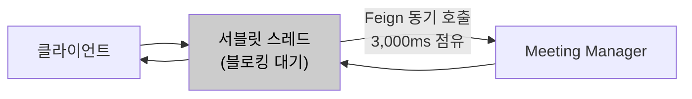
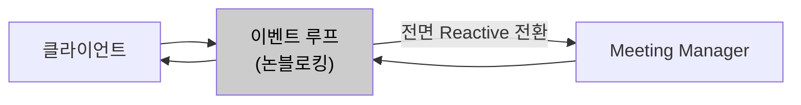
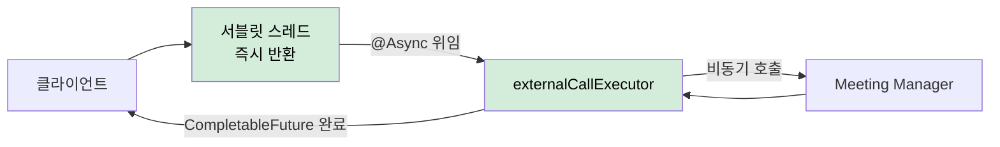

# AS-02. 입장 처리 경로 비동기 전환

## 적용 대상

- **아키텍처 드라이버**: AD-02 (8만 명 동시 입장 처리 성능), AD-04 (핵심 기능 성공률 99.9%)
- **해결 이슈**:
  - ISSUE-01: 입장 API에서 Meeting Manager에 참석자 입장 정보를 조회하는 Feign 동기 호출(read timeout 3,000ms) 동안 해당 요청의 서블릿 스레드가 점유된다. 8만 건 동시 유입 시 스레드 풀 전체가 Meeting Manager 응답 대기 상태로 고갈될 수 있다.
  - ISSUE-05: server-api의 VC서버·AC서버 순차 동기 호출 시 최대 6,000ms(VC 3,000ms + AC 3,000ms)까지 스레드가 고정된다. 피크 시간대 회의 개설 요청 집중 시 server-api 스레드 풀 고갈로 전체 회의 개설이 불가능해진다.
  - ISSUE-06: 외부 서버 장애 시 Feign read timeout 만료까지 스레드가 점유된 채 요청이 누적된다. 장애 격리 구조(AS-09 Circuit Breaker)가 동작하더라도 비동기 처리 기반이 없으면 스레드 즉시 반환 효과가 제한된다.
- **설계 목표**: DG-02 (8만 명 동시 입장 안정 처리), DG-04 (핵심 기능 성공률 99.9%)
- **관련 유스케이스**: UC-03 (회의 시작), UC-04 (회의 입장)
- **관련 품질 요구사항**: QA-02 (동시 입장 처리 성능), QA-04 (핵심 기능 가용성), QA-05 (외부 서버 장애 격리)

## 설계 근거

ISSUE-01의 핵심 병목은 Meeting Manager Feign 동기 호출 구간이다. 현재 UC-04(회의 입장) 흐름을 분석하면, "DB 입장 가능 여부 확인 → conference-token 발급" 단계까지는 포털 서버 내부에서 처리되어 빠르다. 그러나 "Meeting Manager에 참석자 입장 정보 조회(Feign 동기, 3,000ms)"가 완료될 때까지 해당 요청의 서블릿 스레드가 블로킹된다. MM 응답값을 받아야 wyzProParam을 조립하고 클라이언트에 응답할 수 있으므로 이 호출은 생략할 수 없다. 8만 건이 동시에 이 단계에 도달하면 8만 개의 스레드가 Meeting Manager 응답을 대기하는 상태가 된다.

Tomcat 기본 스레드 풀 설정(200스레드)에서 이 시나리오가 발생하면 스레드 풀은 즉시 고갈되고, 신규 요청에 대한 응답 자체가 불가능해진다. Meeting Manager 응답이 1,000ms 지연되더라도 200스레드 풀 기준으로는 200개의 동시 블로킹 요청만으로도 포화에 도달한다는 것을 의미한다. 8만 명 규모에서는 이 문제가 구조적으로 발생할 수밖에 없다.

해결의 핵심은 **외부 서버 호출 구간에서 서블릿 스레드를 즉시 반환**시키는 것이다. 서블릿 스레드가 외부 서버 응답을 기다리지 않고 즉시 반환될 수 있어야, 다음 요청을 수용할 수 있다.

## 대안

### 대안 1. 현행 Feign 동기 호출 유지

**개념**: Feign을 통한 동기 HTTP 호출을 그대로 유지한다. 외부 서버 응답이 올 때까지 서블릿 스레드가 블로킹된다.

**이 시스템 적용 방식**: UC-04 흐름의 마지막 단계에서 Meeting Manager Feign 호출이 완료될 때까지 서블릿 스레드가 점유 상태를 유지한다. 스레드 풀 크기를 늘리는 방식(Tomcat `maxThreads` 증가)으로 일부 완충할 수 있다.

**한계**: 스레드 풀을 200 → 2,000으로 늘려도 8만 건 동시 요청에는 역부족이다. 스레드 수 증가는 컨텍스트 스위칭 오버헤드를 유발하며, 스레드당 메모리 소비(기본 1MB)로 JVM 힙 압박이 증가한다. 근본적으로 외부 서버 응답 시간에 처리량이 종속되는 구조는 변하지 않는다.

*대안1 — 현행 Feign 동기 호출 유지*

---

### 대안 2. Spring WebFlux 전환 (리액티브 논블로킹)

**개념**: Spring MVC에서 Spring WebFlux로 전환하여 이벤트 루프 기반 논블로킹 처리를 전면 적용한다. 외부 서버 호출은 `WebClient`의 비동기 스트림으로 처리하며, 스레드를 블로킹하지 않는다.

**이 시스템 적용 방식**: 전체 컨트롤러·서비스·레포지토리를 Reactive 타입(`Mono`, `Flux`)으로 변환. Meeting Manager 호출은 `WebClient.get().retrieve().bodyToMono()`로 처리.

**한계**: 기존 Spring MVC 코드베이스를 Reactive 모델로 전면 재작성해야 한다. JPA·HikariCP 기반 동기 DB 접근 코드도 `R2DBC`로 대체하거나 별도 스레드 풀 처리가 필요하다. 이는 C-04(점진적 적용) 및 C-01(기술 스택 준수)에 정면으로 충돌한다. Reactive 모델의 디버깅·테스트 복잡도도 급증한다.

*대안2 — Spring WebFlux 전환*

---

### 대안 3. Spring @Async + 전용 처리 큐 하이브리드

**개념**: 외부 서버 호출 구간만 선택적으로 비동기화한다. Spring의 `@Async` + `@EnableAsync`를 활용하여 Feign 호출을 별도의 `AsyncTaskExecutor` 전용 스레드 풀에서 실행한다. 서블릿 스레드는 외부 서버 응답을 기다리지 않고 즉시 반환된다.

**이 시스템 적용 방식**:
- `@Configuration`에서 외부 서버 호출 전용 `ThreadPoolTaskExecutor`를 Bean으로 등록 (corePoolSize/maxPoolSize/queueCapacity 별도 설정)
- Meeting Manager Feign 호출 메서드에 `@Async("externalCallExecutor")` 적용
- 반환 타입을 `CompletableFuture<T>`로 변경하여 비동기 결과 추적 가능
- 컨트롤러 메서드가 `CompletableFuture<ResponseEntity>`를 반환하면, Spring MVC가 서블릿 스레드를 즉시 반환하고 externalCallExecutor에서 Meeting Manager 조회 + wyzProParam 조립이 완료된 후 응답을 전송한다.

**장점**: 기존 Spring MVC 코드베이스 최소 변경으로 점진적 적용 가능(C-04 준수). Feign 호출 메서드에 `@Async` 어노테이션 추가와 `AsyncTaskExecutor` Bean 설정만으로 적용된다. 서블릿 스레드 풀과 외부 서버 호출 스레드 풀이 분리되므로, 외부 서버 응답 지연이 서블릿 처리 용량에 영향을 주지 않는다.

*대안3 — Spring @Async + 전용 처리 큐 하이브리드 (채택)*

## 채택

**채택 대안**: 대안 3 — Spring @Async + 전용 처리 큐 하이브리드

**채택 근거**: 대안 1은 8만 명 동시 입장이라는 QA-02 목표를 구조적으로 달성할 수 없다. 대안 2(WebFlux)는 기술 스택 전면 교체를 요구하여 C-01·C-04 제약을 동시에 위반한다. 대안 3은 현행 Spring MVC와 HikariCP를 그대로 유지하면서 병목 구간(Meeting Manager Feign 호출)만 선별적으로 비동기화하여 서블릿 스레드 고갈 문제를 해소한다.

**적용 방향**:
- `externalCallExecutor`: corePoolSize 100, maxPoolSize 500, queueCapacity 2,000으로 설정하여 피크 시 외부 서버 호출이 서블릿 풀과 독립적으로 처리되도록 구성
- Meeting Manager 참석자 입장 정보 조회 메서드, VC/AC 서버 회의 개설 호출 메서드에 `@Async` 적용
- 컨트롤러에서 `CompletableFuture<ResponseEntity>` 반환 타입 적용 → Spring MVC 비동기 처리로 서블릿 스레드 즉시 반환, externalCallExecutor 완료 시 자동 응답
- 비동기 실패 처리는 AS-09 Circuit Breaker와 연동하여 fallback 처리

