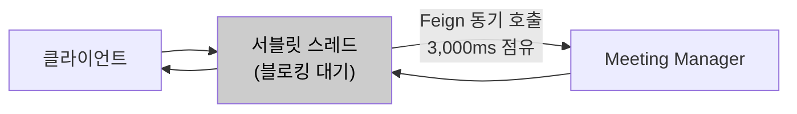
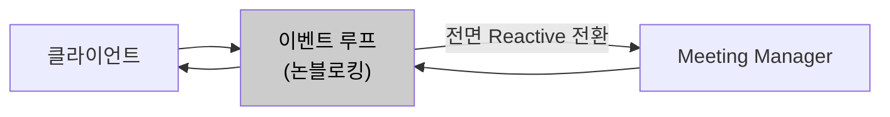
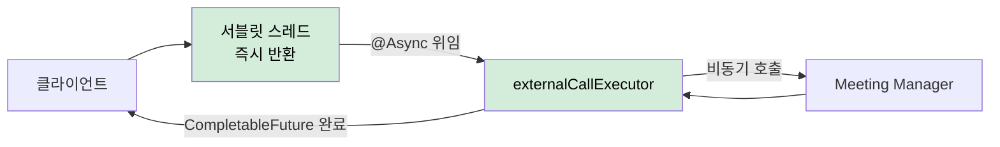

# AS-02. 입장 처리 경로 비동기 전환

## 적용 대상

- **아키텍처 드라이버**: AD-02 (동시 입장 처리 성능), AD-04 (핵심 기능 가용성), AD-05 (외부 서버 장애 격리)
- **해결 이슈**:
  - ISSUE-01: 입장 API에서 Meeting Manager에 참석자 입장 정보를 조회하는 Feign 동기 호출(read timeout 3,000ms) 동안 해당 요청의 서블릿 스레드가 점유된다. 8만 건 동시 유입 시 스레드 풀 전체가 Meeting Manager 응답 대기 상태로 고갈될 수 있다.
  - ISSUE-05: server-api의 VC서버·AC서버 순차 동기 호출 시 최대 6,000ms(VC 3,000ms + AC 3,000ms)까지 스레드가 고정된다. 피크 시간대 회의 개설 요청 집중 시 server-api 스레드 풀 고갈로 전체 회의 개설이 불가능해진다.
  - ISSUE-06: 외부 서버 장애 시 Feign read timeout 만료까지 스레드가 점유된 채 요청이 누적된다. 장애 격리 구조(AS-09 Circuit Breaker)가 동작하더라도 비동기 처리 기반이 없으면 스레드 즉시 반환 효과가 제한된다.
- **설계 목표**: DG-02 (8만 명 동시 입장 안정 처리), DG-04 (핵심 기능 성공률 99.9%)
- **관련 유스케이스**: UC-03 (회의 시작), UC-04 (회의 입장)
- **관련 품질 요구사항**: QA-02 (동시 입장 처리 성능), QA-04 (핵심 기능 가용성), QA-05 (외부 서버 장애 격리)

## 설계 근거

ISSUE-01의 핵심 병목은 Meeting Manager Feign 동기 호출 구간이다. 현재 UC-04(회의 입장) 흐름을 분석하면, "DB 입장 가능 여부 확인 → conference-token 발급" 단계까지는 포털 서버 내부에서 처리되어 빠르다. 그러나 "Meeting Manager에 참석자 입장 정보 조회(Feign 동기, 3,000ms)"가 완료될 때까지 해당 요청의 서블릿 스레드가 블로킹된다. MM 응답값을 받아야 wyzProParam을 조립하고 클라이언트에 응답할 수 있으므로 이 호출은 생략할 수 없다. 8만 건이 동시에 이 단계에 도달하면 8만 개의 스레드가 Meeting Manager 응답을 대기하는 상태가 된다.

Tomcat 기본 스레드 풀 설정(200스레드)에서 이 시나리오가 발생하면 스레드 풀은 즉시 고갈되고, 신규 요청에 대한 응답 자체가 불가능해진다. Meeting Manager 응답이 1,000ms 지연되더라도 200스레드 풀 기준으로는 200개의 동시 블로킹 요청만으로도 포화에 도달한다. 8만 명 규모에서는 이 문제가 구조적으로 발생할 수밖에 없다. 해결의 핵심은 **외부 서버 호출 구간에서 서블릿 스레드를 즉시 반환**시켜, 서블릿 스레드가 외부 서버 응답을 기다리지 않고 다음 요청을 수용하도록 하는 것이다.

이 제약 조합에서 외부 호출 구간의 스레드 점유를 푸는 방식이 세 가지 패러다임으로 갈린다.

- 동기 모델을 유지한 채 스레드 풀을 키워 간접 완충한다.
- 이벤트 루프 기반 논블로킹 모델로 전면 전환한다.
- 병목이 되는 외부 호출 구간만 선택적으로 비동기화한다(하이브리드).

## 후보

### 후보1. 현행 Feign 동기 호출 유지

Feign을 통한 동기 HTTP 호출을 그대로 유지하고, Tomcat `maxThreads`를 늘려 처리 용량을 간접 확대한다. UC-04 흐름의 마지막 단계에서 Meeting Manager Feign 호출이 완료될 때까지 서블릿 스레드가 점유 상태를 유지한다. 스레드 풀을 200 → 2,000으로 늘려도 8만 건 동시 요청에는 역부족이며, 근본적으로 외부 서버 응답 시간에 처리량이 종속되는 구조는 변하지 않는다.

- 장점
  - 코드 변경이 없고 설정만으로 즉시 적용된다.
- 단점
  - 처리량이 외부 서버 응답 시간에 종속되는 구조가 그대로여서 8만 건 규모를 감당하지 못한다.
  - 스레드 증설은 컨텍스트 스위칭 오버헤드와 스레드당 메모리(기본 1MB) 소비로 JVM 힙을 압박한다.

*후보1: 현행 Feign 동기 호출 유지*

### 후보2. Spring WebFlux 전환 (리액티브 논블로킹)

Spring MVC에서 Spring WebFlux로 전환하여 이벤트 루프 기반 논블로킹 처리를 전면 적용한다. 외부 서버 호출은 `WebClient`의 비동기 스트림으로 처리하여 스레드를 블로킹하지 않는다. 그러나 전체 컨트롤러·서비스·레포지토리를 Reactive 타입(`Mono`, `Flux`)으로 변환해야 하고, JPA·HikariCP 기반 동기 DB 접근 코드도 R2DBC로 대체하거나 별도 스레드 풀 처리가 필요하다. 이는 C-04(점진적 적용) 및 C-01(기술 스택 준수)에 정면으로 충돌한다.

- 장점
  - 소수 스레드로 대량 동시 요청을 논블로킹으로 처리해 이론적 처리 효율이 가장 높다.
- 단점
  - 코드베이스 전면 Reactive 재작성 + DB 접근 계층 교체가 필요해 C-01·C-04를 동시에 위반한다.
  - Reactive 모델의 디버깅·테스트 복잡도가 급증한다.

*후보2: Spring WebFlux 전환*

### 후보3. Spring @Async + 전용 처리 큐 하이브리드 (채택)

외부 서버 호출 구간만 선택적으로 비동기화한다. Spring의 `@Async` + `@EnableAsync`를 활용해 Feign 호출을 별도의 `AsyncTaskExecutor` 전용 스레드 풀에서 실행하고, 서블릿 스레드는 외부 서버 응답을 기다리지 않고 즉시 반환된다. `@Configuration`에서 외부 서버 호출 전용 `ThreadPoolTaskExecutor`를 Bean으로 등록하고 Meeting Manager Feign 호출 메서드에 `@Async("externalCallExecutor")`를 적용하며, 반환 타입을 `CompletableFuture<T>`로 변경한다. 컨트롤러가 `CompletableFuture<ResponseEntity>`를 반환하면 Spring MVC가 서블릿 스레드를 즉시 반환하고, externalCallExecutor에서 Meeting Manager 조회 + wyzProParam 조립이 완료된 후 응답을 전송한다.

- 장점
  - 현행 Spring MVC·HikariCP를 유지한 채 병목 구간만 비동기화해 C-01·C-04를 준수한다.
  - 서블릿 스레드 풀과 외부 호출 스레드 풀이 분리되어 외부 지연이 서블릿 처리 용량에 영향을 주지 않는다.
- 단점
  - externalCallExecutor 스레드 풀 자체가 새로운 자원 고갈 지점이 된다.
  - CompletableFuture 반환으로 트랜잭션·보안 컨텍스트(ThreadLocal) 전파와 예외 처리가 복잡해지고, 동기·비동기 코드가 혼재한다.

*후보3: Spring @Async + 전용 처리 큐 하이브리드 (채택)*

## 후보별 비교 검토

| 비교 축 | 후보1. 현행 동기 유지 | 후보2. WebFlux 전면 전환 | 후보3. @Async 하이브리드 (채택) |
| --- | --- | --- | --- |
| 처리 모델 | 동기 블로킹 | 이벤트 루프 논블로킹 | 병목 구간만 비동기 |
| 서블릿 스레드 반환 | ✗ 외부 응답까지 점유 | ○ 논블로킹 | ○ 외부 호출 위임 후 즉시 반환 |
| 8만 건 동시 대응 | ✗ 구조적 한계 | ○ | ○ |
| 기술 스택 변경 | 없음 | ✗ 전면 Reactive·R2DBC | △ @Async·Executor 추가 |
| C-01·C-04 준수 | ○ | ✗ 동시 위반 | ○ |
| 잔여 위험 | 처리량이 외부 응답에 종속 | 디버깅·테스트 복잡도 급증 | Executor 고갈·컨텍스트 전파 복잡도 |

## 채택

**후보3(Spring @Async + 전용 처리 큐 하이브리드)을 채택한다.**

현행 Spring MVC·HikariCP를 유지한 채 병목 구간(Meeting Manager Feign 호출)만 선별 비동기화하여, 기술 스택 제약 안에서 서블릿 스레드 고갈을 해소하기 때문이다.

후보1은 처리량이 외부 서버 응답 시간에 종속되는 구조가 그대로여서 QA-02(8만 명 동시 입장)를 구조적으로 달성할 수 없다. 후보2는 소수 스레드로 대량 요청을 처리하는 이상적 모델이지만, 코드베이스 전면 Reactive 재작성과 DB 접근 계층 교체가 C-01(Spring MVC 유지)·C-04(점진적 적용)를 동시에 위반한다. 후보3은 externalCallExecutor라는 새 고갈 지점과 컨텍스트 전파 복잡도를 남기지만, 이는 설계 원칙과 AS-09로 흡수 가능하다.

### 설계 원칙

1. **선택적 비동기화:** Meeting Manager 참석자 입장 정보 조회, VC/AC 서버 회의 개설 호출 등 외부 서버 호출 메서드에만 `@Async("externalCallExecutor")`를 적용한다.
2. **전용 Executor 분리:** `externalCallExecutor`(corePoolSize 100, maxPoolSize 500, queueCapacity 2,000)를 서블릿 스레드 풀과 분리해 외부 지연이 서블릿 처리 용량에 전이되지 않게 한다.
3. **비동기 응답 계약:** 컨트롤러는 `CompletableFuture<ResponseEntity>`를 반환해 Spring MVC 비동기 처리로 서블릿 스레드를 즉시 반환하고, Executor 완료 시 자동 응답한다.
4. **컨텍스트 전파:** 트랜잭션·보안 컨텍스트(ThreadLocal)는 TaskDecorator로 명시 복사한다.

### 위험 요인

- **R1. externalCallExecutor 자체의 고갈:** AS-09(CB)로 외부 지연을 조기 차단해 스레드 누적을 방지
- **R2. ThreadLocal 컨텍스트 유실:** TaskDecorator로 트랜잭션·보안 컨텍스트를 명시 복사
- **R3. 동기·비동기 코드 혼재로 예외 처리 복잡도 증가:** fallback을 AS-09 장애 차단과 연동해 일관 처리
