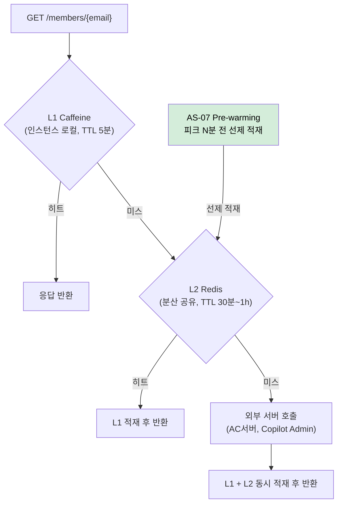

# AS-03. 외부 권한 조회 다층 캐시 적용

## 적용 대상

- **아키텍처 드라이버**: AD-01 (피크 시 권한 갱신 응답시간 1초 이내)
- **해결 이슈**:
  - ISSUE-02: `GET /members/{email}` API는 AC서버·Copilot Admin 서버(LLM 권한)·Copilot Admin 서버(용어사전 권한)에 비동기 병렬 호출 후 `CompletableFuture.allOf()`로 모든 응답을 대기한다. 권한 데이터는 회사 계약·관리자 설정 기반으로 변경 빈도가 낮음에도, 서버사이드 캐시 없이 매 로그인마다 외부 서버를 호출하는 구조다. 피크 시간대 동시 로그인이 집중될수록 외부 서버 부하도 함께 증가하여 응답 지연이 심화된다.
  - ISSUE-05: VC/AC 회의 개설 시 자주 변경되지 않는 회의 설정 정보(권한 정책, 서버 설정 등)도 매 요청마다 외부 서버를 호출하여 불필요한 외부 호출이 반복된다.
  - ISSUE-09: 예약 회의 데이터로 피크 시점을 사전에 알 수 있음에도 캐시 워밍 구조가 없어, 피크 집중 구간 초입에 캐시 미스 상태에서 요청을 처리하게 된다. 가장 많은 사용자가 몰리는 순간이 캐시 히트율이 가장 낮은 순간이 된다.
- **설계 목표**: DG-01 (피크 시 권한 갱신 응답시간 단축), DG-06 (예측 가능한 피크 구간 선제 대응)
- **관련 유스케이스**: UC-01 (사용자 권한 갱신), UC-04 (회의 입장)
- **관련 품질 요구사항**: QA-01 (로그인 권한 갱신 응답 성능), QA-02 (동시 입장 처리 성능)

## 설계 근거

ISSUE-02의 구조적 문제는 `CompletableFuture.allOf()` 대기 패턴이다. AC서버·Copilot Admin 서버 응답이 모두 도달해야 `GET /members/{email}`이 응답을 반환할 수 있으므로, 가장 느린 외부 서버의 응답 시간이 전체 API 응답 시간을 결정한다. 피크 시간대에는 외부 서버 자체도 동시 요청 집중으로 응답 시간이 늘어나므로, 포털 서버와 외부 서버의 부하가 연동되어 응답 지연이 증폭된다.

이 구조에서 QA-01(평균 응답시간 1초 이내)을 충족하려면, **외부 서버 호출 자체를 줄이는 것**이 근본 해법이다. AC 권한·LLM 권한·용어사전 권한은 매 로그인마다 변경되는 데이터가 아니다. 변경이 발생할 때만 갱신하고, 그 사이의 로그인 요청에서는 캐시 결과를 반환하면 외부 서버 호출 빈도를 대폭 줄일 수 있다.

또한 ISSUE-09에서 지적된 cold start 문제는, 캐시가 존재하더라도 피크 진입 시점에 캐시가 비어 있으면 해소되지 않는다. 따라서 캐시 인프라 자체가 AS-07(예약 기반 피크 자원 선제 초기화)의 선제 워밍 기반이 되어야 한다.

## 대안

### 대안 1. 캐시 없음 (현행)

**개념**: 현행 구조 유지. 매 로그인마다 AC서버·Copilot Admin 서버에 권한 갱신 요청을 전송하고, 모든 응답이 수신될 때까지 대기한다.

**이 시스템 적용 방식**: `GET /members/{email}` API에서 `CompletableFuture.allOf(acFuture, llmFuture, glossaryFuture).get()` 패턴 그대로 유지.

**한계**: 피크 시간대 동시 로그인이 집중될수록 외부 서버 요청도 함께 집중되어 응답 지연이 선형 이상으로 증가한다. QA-01(평균 응답시간 1초 이내) 달성이 외부 서버 응답 시간에 전적으로 종속된다.

---

### 대안 2. DB 캐시 전용 (로컬 DB 저장 후 조회)

**개념**: 외부 서버에서 권한을 갱신할 때만 DB에 저장하고, `GET /members/{email}` 조회 시에는 DB에서만 반환한다. 이미 UC-01 예외 흐름에서 "외부 서버 오류 시 DB 저장값으로 대체"하는 패턴이 존재한다.

**이 시스템 적용 방식**: 로그인 후 권한 갱신은 백그라운드로 진행하고, `GET /members/{email}`은 항상 DB 조회로 반환. 외부 서버 호출과 응답 경로를 분리.

**한계**: DB 조회가 응답 경로에 있으므로 피크 시간대 DB 커넥션 소비가 증가한다. 또한 인스턴스 간 캐시 공유가 불가능하여 front-api 인스턴스가 여러 개일 때 인스턴스마다 동일한 DB 조회가 반복된다. ISSUE-09의 cold start 문제(피크 초입 부하 집중)는 해소되지 않는다.

---

### 대안 3. 계층화 캐시 (L1 로컬 + L2 분산)

**개념**: L1 로컬 JVM 캐시(Caffeine)와 L2 분산 캐시(Redis)를 계층화하여 적용한다. 캐시 미스 시 L1 → L2 → 외부 서버 순으로 폴백한다. 권한 유형별로 TTL을 차등 적용하여 변경 빈도에 맞게 캐시 신선도를 유지한다.

**이 시스템 적용 방식**:
- L1 Caffeine: 인스턴스 로컬, TTL 5분. 동일 사용자의 반복 요청(재로그인, 세션 갱신)을 인스턴스 내에서 처리
- L2 Redis: 분산 공유, TTL 30분. 여러 front-api 인스턴스 간 권한 데이터를 공유하여 인스턴스별 외부 서버 중복 호출 방지
- 폴백 경로: L1 miss → L2 hit이면 L2 반환 후 L1에 적재. L2 miss → 외부 서버 호출 후 L1·L2 동시 적재
- 권한 유형별 TTL 차등: AC 권한(계약 기반, 변경 빈도 낮음) TTL 1시간 / LLM·용어사전 권한 TTL 30분
- Cache-Aside 패턴: Spring `@Cacheable` + `CacheManager` Bean 교체만으로 L1/L2 전환 가능

**장점**: 피크 시간대 외부 서버 요청을 L1·L2 캐시 히트로 대부분 흡수하여 외부 서버 부하를 대폭 감소시킨다. 인스턴스 수 증가 시에도 L2 Redis를 공유하므로 외부 서버 요청이 선형 증가하지 않는다. 또한 AS-07(예약 기반 피크 자원 선제 초기화)이 피크 전에 L2 Redis를 선제 적재하면 피크 초입 cold start 없이 캐시 히트율을 유지할 수 있다.

## 캐시 계층 구조

<!-- 이미지 파일명(draw.io → PNG 교체 시): report/images/3.2-as03-cache-flow.png -->

<em>[그림 AS03-1] L1(Caffeine) · L2(Redis) 계층 캐시 조회 흐름</em>

## 채택

**채택 대안**: 대안 3 — 계층화 캐시 (L1 로컬 + L2 분산)

**채택 근거**: 대안 2(DB 캐시)는 외부 서버 호출을 줄이지만 인스턴스 간 캐시 공유 불가, DB 커넥션 추가 소비, cold start 미해소 등의 한계가 있다. 대안 3은 인스턴스 스케일아웃 환경에서도 외부 서버 호출을 일괄 완충하며, AS-07 Pre-warming의 실질적 기반이 된다. Spring `@Cacheable`과 Caffeine·Redis 통합은 Spring Boot 내에서 코드 변경 없이 CacheManager 설정만으로 구현 가능하므로 C-04(점진적 적용) 제약도 준수한다.

**적용 방향**:
- `spring-boot-starter-cache` + `Caffeine` + `spring-data-redis` 의존성 추가
- `@Cacheable(cacheNames = "memberAuth", key = "#email")` 적용
- `CompositeCacheManager`로 L1(CaffeineCacheManager) → L2(RedisCacheManager) 순서 구성
- 권한 갱신 이벤트 발생 시 `@CacheEvict`로 L1·L2 동기 무효화

**파생 전략**:
- AS-07 (Predictive Pre-warming): L2 Redis 캐시가 존재해야 피크 전 선제 적재(Pre-warming) 효과 발생
