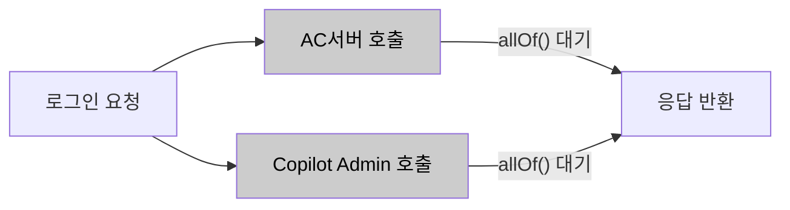
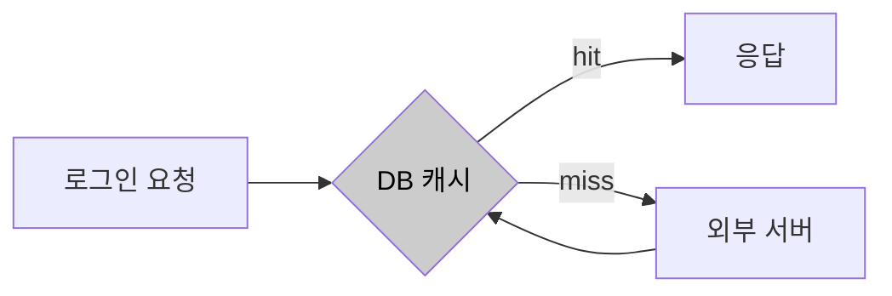
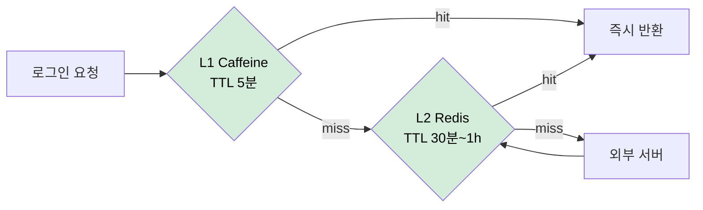
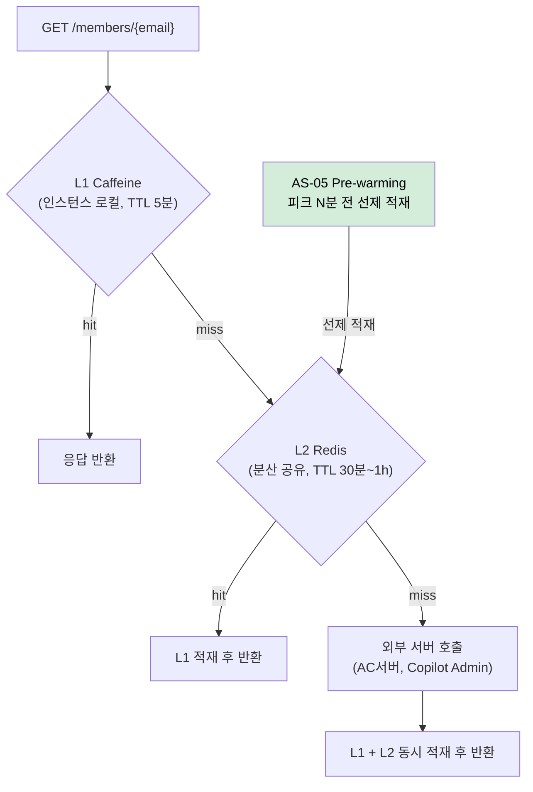

# AS-03. 외부 권한 조회 다층 캐시 적용

## 적용 대상

- **아키텍처 드라이버**: AD-01 (권한 갱신 응답시간), AD-04 (핵심 기능 가용성), AD-05 (외부 서버 장애 격리)
- **해결 이슈**:
  - ISSUE-02: `GET /members/{email}` API는 AC서버·Copilot Admin 서버(LLM 권한)·Copilot Admin 서버(용어사전 권한)에 비동기 병렬 호출 후 `CompletableFuture.allOf()`로 모든 응답을 대기한다. 권한 데이터는 회사 계약·관리자 설정 기반으로 변경 빈도가 낮음에도, 서버사이드 캐시 없이 매 로그인마다 외부 서버를 호출하는 구조다. 피크 시간대 동시 로그인이 집중될수록 외부 서버 부하도 함께 증가하여 응답 지연이 심화된다.
  - ISSUE-05: VC/AC 회의 개설 시 자주 변경되지 않는 회의 설정 정보(권한 정책, 서버 설정 등)도 매 요청마다 외부 서버를 호출하여 불필요한 외부 호출이 반복된다.
  - ISSUE-09: 예약 회의 데이터로 피크 시점을 사전에 알 수 있음에도 캐시 워밍 구조가 없어, 피크 집중 구간 초입에 캐시 miss 상태에서 요청을 처리하게 된다. 가장 많은 사용자가 몰리는 순간이 캐시 hit율이 가장 낮은 순간이 된다.
- **설계 목표**: DG-01 (피크 시 권한 갱신 응답시간 단축), DG-06 (예측 가능한 피크 구간 선제 대응)
- **관련 유스케이스**: UC-01 (사용자 권한 갱신), UC-04 (회의 입장)
- **관련 품질 요구사항**: QA-01 (로그인 권한 갱신 응답 성능), QA-02 (동시 입장 처리 성능)

## 설계 근거

ISSUE-02의 구조적 문제는 `CompletableFuture.allOf()` 대기 패턴이다. AC서버·Copilot Admin 서버 응답이 모두 도달해야 `GET /members/{email}`이 응답을 반환할 수 있으므로, 가장 느린 외부 서버의 응답 시간이 전체 API 응답 시간을 결정한다. 피크 시간대에는 외부 서버 자체도 동시 요청 집중으로 응답 시간이 늘어나므로, 포털 서버와 외부 서버의 부하가 연동되어 응답 지연이 증폭된다.

이 구조에서 QA-01(평균 응답시간 1초 이내)을 충족하려면, **외부 서버 호출 자체를 줄이는 것**이 근본 해법이다. AC 권한·LLM 권한·용어사전 권한은 매 로그인마다 변경되는 데이터가 아니다. 변경이 발생할 때만 갱신하고, 그 사이의 로그인 요청에서는 캐시 결과를 반환하면 외부 서버 호출 빈도를 대폭 줄일 수 있다.

단, AS-03은 **변경 빈도가 낮은 외부 서버 권한 데이터(AC 권한·LLM 권한·용어사전 권한)에만 선택적으로 적용**한다. 실시간 반영이 필요한 참석자 상태·회의 진행 상태 등 강한 정합성이 요구되는 데이터는 AS-03 적용 범위 밖이며, 이 데이터들은 기존대로 DB 직접 조회를 유지한다.

또한 ISSUE-09에서 지적된 cold start 문제는, 캐시가 존재하더라도 피크 진입 시점에 캐시가 비어 있으면 해소되지 않는다. 따라서 캐시 인프라 자체가 AS-05(예약 기반 피크 자원 선제 초기화)의 선제 워밍 기반이 되어야 한다.

이 제약 조합에서 외부 권한 조회 부하를 완충하는 위치가 세 가지 패러다임으로 갈린다.

- 완충 없이 매 로그인마다 외부 서버를 직접 호출한다.
- 단일 저장소(DB)에 캐싱해 외부 호출을 줄인다.
- 인스턴스 로컬(L1)과 분산 공유(L2)를 계층화한 캐시로 완충한다.

## 후보

### 후보1. 캐시 없음 (현행)

현행 구조 유지. 매 로그인마다 AC서버·Copilot Admin 서버에 권한 갱신 요청을 전송하고, 모든 응답이 수신될 때까지 대기한다. `GET /members/{email}` API에서 `CompletableFuture.allOf(acFuture, llmFuture, glossaryFuture).get()` 패턴이 그대로 유지되어, 피크 시간대 동시 로그인이 집중될수록 외부 서버 요청도 함께 집중되어 응답 지연이 선형 이상으로 증가한다.

- 장점
  - 캐시 정합성 관리 부담이 없고 항상 최신 권한을 반영한다.
- 단점
  - QA-01(평균 응답시간 1초 이내) 달성이 가장 느린 외부 서버의 응답 시간에 종속된다.
  - 동시 로그인 집중이 그대로 외부 서버 부하로 전이되어 피크에 지연이 증폭된다.

*후보1: 캐시 없음 (현행)*

### 후보2. DB 캐시 전용 (로컬 DB 저장 후 조회)

외부 서버에서 권한을 갱신할 때만 DB에 저장하고, `GET /members/{email}` 조회 시에는 DB에서만 반환한다. 이미 UC-01 예외 흐름에서 "외부 서버 오류 시 DB 저장값으로 대체"하는 패턴이 존재한다. 그러나 DB 조회가 응답 경로에 있어 피크 시간대 DB 커넥션 소비가 증가하고, 인스턴스 간 캐시 공유가 불가능하여 front-api 인스턴스가 여러 개일 때 인스턴스마다 동일한 DB 조회가 반복된다. ISSUE-09의 cold start 문제도 해소되지 않는다.

- 장점
  - 별도 캐시 인프라 없이 기존 DB만으로 외부 호출을 줄인다.
- 단점
  - 인스턴스 간 캐시 공유가 불가해 스케일아웃 시 인스턴스마다 외부 호출이 반복된다.
  - 응답 경로에 DB 조회가 들어가 피크 시 DB 커넥션을 추가 소비하고, cold start를 해소하지 못한다.

*후보2: DB 캐시 전용*

### 후보3. 계층화 캐시 (L1 로컬 + L2 분산) (채택)

L1 로컬 JVM 캐시(Caffeine)와 L2 분산 캐시(Redis)를 계층화하여 적용한다. 캐시 miss 시 L1 → L2 → 외부 서버 순으로 폴백하고, 권한 유형별로 TTL을 차등 적용해 변경 빈도에 맞게 캐시 신선도를 유지한다. L1 Caffeine(인스턴스 로컬, TTL 5분)은 동일 사용자의 반복 요청을 인스턴스 내에서 처리하고, L2 Redis(분산 공유, TTL 30분)는 여러 front-api 인스턴스 간 권한 데이터를 공유하여 인스턴스별 중복 외부 호출을 방지한다. Cache-Aside 패턴으로 Spring `@Cacheable` + `CacheManager` Bean 교체만으로 L1/L2 전환이 가능하다.

- 장점
  - 피크 외부 요청을 L1·L2 hit로 대부분 흡수하고, 인스턴스가 늘어도 L2 Redis 공유로 외부 호출이 선형 증가하지 않는다.
  - L2 Redis가 AS-05 선제 적재의 저장소가 되어 피크 초입 cold start 없이 캐시 hit율을 유지할 기반이 된다.
- 단점
  - TTL 구간 동안 stale 데이터를 허용해 권한 변경 반영이 지연될 수 있다.
  - Redis가 추가 운영·장애 지점이 되고 L1·L2 무효화 동기화가 복잡해진다.

*후보3: 계층화 캐시 L1+L2 (채택)*

## 캐시 계층 구조

<!-- 이미지 파일명(draw.io → PNG 교체 시): report/images/3.2-as03-cache-flow.png -->

<em>[그림 AS03-1] L1(Caffeine) · L2(Redis) 계층 캐시 조회 흐름</em>

## 후보별 비교 검토

| 비교 축 | 후보1. 캐시 없음(현행) | 후보2. DB 캐시 전용 | 후보3. 계층화 캐시 L1+L2 (채택) |
| --- | --- | --- | --- |
| 완충 위치 | 없음(외부 직접 호출) | 단일 DB | L1 로컬 + L2 분산 |
| 외부 호출 감소 | ✗ | △ 인스턴스별 반복 | ○ L2 공유로 일괄 완충 |
| 스케일아웃 대응 | ✗ | ✗ 인스턴스 간 공유 불가 | ○ L2 Redis 공유 |
| cold start 해소 기반 | ✗ | ✗ | ○ AS-05 선제 적재 기반 |
| DB 커넥션 영향 | 없음 | 응답 경로에서 추가 소비 | 없음 |
| 잔여 위험 | 외부 응답에 종속 | 공유 불가·cold start | TTL stale·Redis 장애·무효화 동기화 |

## 채택

**후보3(계층화 캐시 L1+L2)을 채택한다.**

인스턴스 스케일아웃 환경에서도 외부 서버 호출을 일괄 완충하면서, AS-05 선제 초기화의 실질적 기반(L2 Redis)을 함께 확보하기 때문이다.

후보1은 QA-01 달성이 외부 서버 응답 시간에 전적으로 종속되어 근본 해법이 되지 못한다. 후보2는 외부 호출을 줄이지만 인스턴스 간 캐시 공유가 불가하고 DB 커넥션을 추가 소비하며 cold start를 해소하지 못한다. 후보3은 TTL stale과 Redis 장애 지점을 남기지만, Spring `@Cacheable` + CacheManager 설정만으로 구현되어 C-04(점진적 적용)를 준수하고, 잔여 위험은 설계 원칙으로 흡수된다.

### 설계 원칙

1. **적용 범위 한정:** 변경 빈도가 낮은 권한 데이터(AC 권한·LLM 권한·용어사전 권한)에만 적용하고, 강한 정합성이 필요한 참석자·회의 진행 상태는 DB 직접 조회를 유지한다.
2. **계층 구성:** `CompositeCacheManager`로 L1(CaffeineCacheManager) → L2(RedisCacheManager) 순서를 구성하고, `@Cacheable(cacheNames = "memberAuth", key = "#email")`를 적용한다.
3. **TTL 차등:** AC 권한 1시간 / LLM·용어사전 권한 30분으로 변경 빈도에 맞춰 신선도를 둔다.
4. **무효화:** 권한 갱신 이벤트 발생 시 `@CacheEvict`로 L1·L2를 동기 무효화한다.

### 위험 요인

- **R1. TTL 구간 stale 데이터로 권한 변경 반영 지연:** 적용 범위를 저빈도 권한으로 한정 + 변경 이벤트 시 `@CacheEvict` 즉시 무효화
- **R2. Redis 추가 장애 지점:** 캐시 miss·장애 시 외부 서버/DB 폴백으로 기능 지속(AS-09 연동)
- **R3. L1·L2 무효화 동기화 복잡도:** 무효화 경로를 이벤트 단일 지점으로 표준화

### 파생 전략

- AS-05 (예약 기반 피크 자원 선제 초기화): L2 Redis 캐시가 존재해야 피크 전 선제 적재(Pre-warming) 효과 발생
