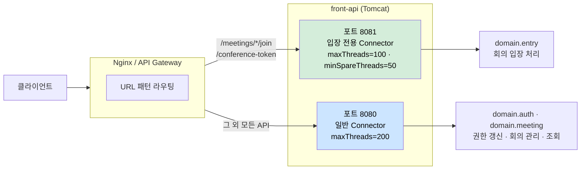

# AS-04. 요청 우선순위 큐

## 적용 대상

- **아키텍처 드라이버**: AD-02 (2만 명 동시 입장 처리 성능)
- **해결 이슈**:
  - ISSUE-01: 스레드 풀 포화 상태에서 신규 요청이 단일 큐에 쌓일 때, 처리 비용이 높은 권한 갱신 요청이나 단순 조회 요청이 회의 입장 요청과 동일한 큐에서 경쟁한다. 완충 수단이 없어 유입되는 그대로 처리된다.
  - ISSUE-03: front-api의 서블릿 스레드 풀은 모든 API 요청을 단일 FIFO 큐로 처리한다. conference-token 발급·입장 파라미터 생성 등 핵심 입장 처리와 단순 조회 API가 동일 우선순위로 경쟁한다. 피크 시간대에 단순 조회 요청이 스레드를 선점하면, 가장 먼저 처리되어야 할 회의 입장 요청이 큐에서 대기하는 역전 현상이 발생한다.
- **설계 목표**: DG-02 (2만 명 동시 입장 안정 처리), DG-05 (요청 유형별 처리 우선순위 제어)
- **관련 유스케이스**: UC-04 (회의 입장)
- **관련 품질 요구사항**: QA-02 (동시 입장 처리 성능), QA-04 (핵심 기능 가용성)

## 설계 근거

오전 9시·오후 1시 업무 시작 시간대와 대규모 스트리밍 서비스 시작 시점에는 회의 입장 요청·로그인 요청·단순 조회 요청이 동시에 폭발적으로 증가한다. 이 구간에서 모든 요청이 동일한 서블릿 스레드 FIFO 큐에 유입되면, 처리 비용이 낮은 단순 조회 요청이 스레드를 먼저 선점하는 상황이 반복된다.

문제의 구체적 메커니즘은 다음과 같다. Tomcat 서블릿 스레드 풀이 포화 상태(예: 200스레드 모두 점유)에 가까워지면, `acceptCount` 큐에 대기 중인 요청들이 선착순으로 스레드를 할당받는다. 이때 단순 조회(GET /meetings 목록 조회, GET /schedules 등)와 conference-token 발급(UC-04의 핵심 처리)이 큐에 혼재하면, 스레드 배정 순서는 요청의 중요도가 아닌 도착 순서에만 따른다. 단순 조회가 먼저 도착했다면 핵심 입장 요청이 대기해야 한다.

이 역전 현상은 개별 요청 단위의 지연이 아니라 **시스템 전체의 처리 우선순위 왜곡**이다. 피크 시간대일수록 중요도 높은 요청이 덜 중요한 요청에 밀리는 현상이 심화된다.

## 대안

### 대안 1. 현행 단일 FIFO 서블릿 스레드 풀

**개념**: Tomcat 기본 동작 유지. 모든 요청이 도착 순서대로 단일 스레드 풀에서 처리된다.

**이 시스템 적용 방식**: `server.tomcat.threads.max`를 늘려 전체 처리 용량을 확대하는 방식으로 간접 대응.

**한계**: 스레드 수 증가는 메모리 소비(스레드당 약 1MB)와 컨텍스트 스위칭 오버헤드를 유발한다. 더 근본적으로, 단순 조회가 회의 입장 요청을 앞질러 처리되는 우선순위 역전 자체는 해소되지 않는다. 피크 시간대일수록 이 역전의 빈도와 영향이 커진다.

---

### 대안 2. URL 패턴 기반 전용 Connector·스레드 풀 분리

**개념**: Tomcat Connector를 포트 단위로 분리하거나, 요청 URL 패턴에 따라 전용 스레드 풀을 할당한다. 핵심 입장 처리 API(`/meetings/*/join`, conference-token 발급 엔드포인트)를 전용 스레드 풀에서 우선 처리한다.

**이 시스템 적용 방식**:
- `TomcatServletWebServerFactory` 커스터마이징으로 핵심 API 전용 Connector 추가 (별도 포트 8081 등)
- 핵심 입장 처리 전용 Connector: 스레드 풀 100개 고정 예약
- 일반 API Connector: 스레드 풀 200개 (단순 조회·권한 갱신 등)
- 로드밸런서/API Gateway 레벨에서 URL 패턴 기반 포트 라우팅

**이 시스템 적용 방식**: Spring Boot의 `TomcatServletWebServerFactory`에서 `Connector`를 추가하는 방식은 Spring Boot 내에서 구현 가능하다. 핵심 입장 경로가 전용 스레드 풀을 보유하므로, 단순 조회 요청이 아무리 많아도 핵심 입장 처리 스레드를 소진할 수 없다.

**장점**: 구현이 단순·명확하다. Tomcat 수준의 격리이므로 애플리케이션 코드를 변경하지 않아도 된다. 전용 스레드 풀이 별도 예약되므로 단순 조회 트래픽 폭증에도 입장 처리 스레드가 보호된다.

---

### 대안 3. HandlerInterceptor + 인메모리 우선순위 큐 재정렬

**개념**: Spring MVC `HandlerInterceptor`에서 요청을 가로채어 우선순위 점수를 부여하고, 인메모리 `PriorityBlockingQueue`에 넣어 우선순위 순서로 꺼내 처리한다.

**이 시스템 적용 방식**: `preHandle`에서 URL 패턴·요청 헤더 기반으로 우선순위 산정 후 큐에 삽입. 별도 dispatcher 스레드가 큐에서 꺼내 실제 처리 실행.

**한계**: 서블릿 모델에서 요청을 큐에 넣고 다른 스레드로 넘기는 구조는 서블릿 스레드의 요청-응답 사이클과 맞지 않아 구현 복잡도가 높다. 응답 객체(`HttpServletResponse`)의 스레드 귀속 문제, 타임아웃 처리, 큐 자체의 메모리 관리 등 부가 문제가 발생한다. 디버깅과 운영 가시성도 저하된다.

## Connector 분리 구조

<!-- 이미지 파일명(draw.io → PNG 교체 시): report/images/as04-priority-connector.png -->

<em>[그림 AS04-1] Tomcat Connector 포트 분리 — 입장 전용(8081)과 일반(8080) 구분</em>

## 채택

**채택 대안**: 대안 2 — URL 패턴 기반 전용 Connector·스레드 풀 분리

**채택 근거**: 대안 3은 서블릿 스레드 모델과 구조적으로 맞지 않아 구현 복잡도와 운영 위험이 크다. 대안 2는 Tomcat이 이미 제공하는 Connector 분리 메커니즘을 활용하므로, 기존 코드 변경 없이 `WebServerFactoryCustomizer` 설정만으로 적용 가능하다. 입장 전용 스레드가 별도 예약되므로 DG-05(요청 유형별 처리 우선순위 제어)가 구조적으로 보장된다.

**적용 방향**:
- `TomcatServletWebServerFactory` Bean 커스터마이징으로 포트 8081에 입장 전용 Connector 추가
- 입장 전용 Connector: `maxThreads=100`, `minSpareThreads=50` (피크 시에도 최소 50스레드 보장)
- 일반 Connector(8080): `maxThreads=200` (단순 조회·권한 갱신 등)
- API Gateway 또는 Nginx에서 `/meetings/*/join`, `/meetings/*/conference-token` URL 패턴을 포트 8081로 라우팅
- AS-09(Bulkhead)와 결합 시: 입장 전용 Connector 스레드는 `join-pool` HikariCP DataSource만 사용하도록 구성
