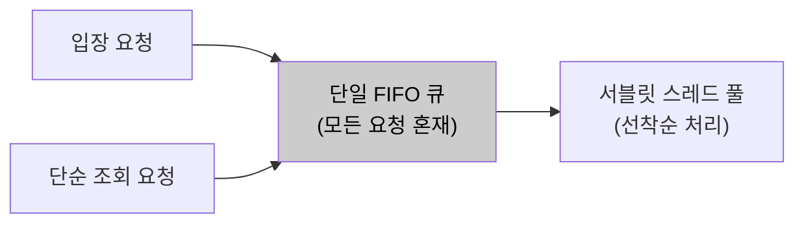
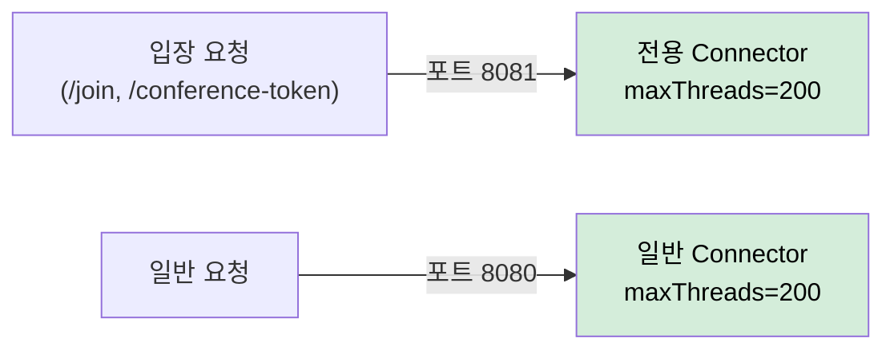
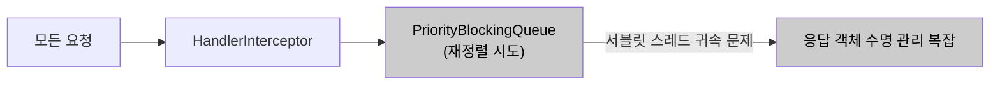
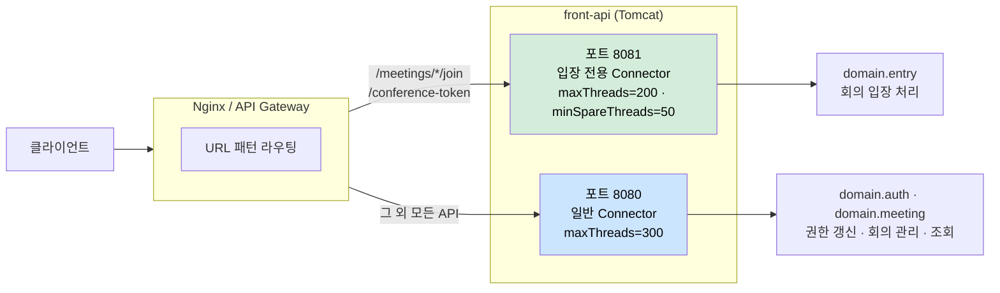

# AS-04. 입장 전용 처리 경로 확보

## 적용 대상

- **아키텍처 드라이버**: AD-02 (동시 입장 처리 성능)
- **해결 이슈**:
  - ISSUE-01: 스레드 풀 포화 상태에서 신규 요청이 단일 큐에 쌓일 때, 처리 비용이 높은 권한 갱신 요청이나 단순 조회 요청이 회의 입장 요청과 동일한 큐에서 경쟁한다. 완충 수단이 없어 유입되는 그대로 처리된다.
  - ISSUE-03: front-api의 서블릿 스레드 풀은 모든 API 요청을 단일 FIFO 큐로 처리한다. conference-token 발급·입장 파라미터 생성 등 핵심 입장 처리와 단순 조회 API가 동일 우선순위로 경쟁한다. 피크 시간대에 단순 조회 요청이 스레드를 선점하면, 가장 먼저 처리되어야 할 회의 입장 요청이 큐에서 대기하는 역전 현상이 발생한다.
- **설계 목표**: DG-02 (8만 명 동시 입장 안정 처리), DG-05 (요청 유형별 처리 우선순위 제어)
- **관련 유스케이스**: UC-04 (회의 입장)
- **관련 품질 요구사항**: QA-02 (동시 입장 처리 성능), QA-04 (핵심 기능 가용성)

## 설계 근거

오전 9시·오후 1시 업무 시작 시간대와 대규모 스트리밍 서비스 시작 시점에는 회의 입장 요청·로그인 요청·단순 조회 요청이 동시에 폭발적으로 증가한다. 이 구간에서 모든 요청이 동일한 서블릿 스레드 FIFO 큐에 유입되면, 처리 비용이 낮은 단순 조회 요청이 스레드를 먼저 선점하는 상황이 반복된다.

문제의 구체적 메커니즘은 다음과 같다. Tomcat 서블릿 스레드 풀이 포화 상태(예: 200스레드 모두 점유)에 가까워지면, `acceptCount` 큐에 대기 중인 요청들이 선착순으로 스레드를 할당받는다. 이때 단순 조회(GET /meetings 목록 조회, GET /schedules 등)와 conference-token 발급(UC-04의 핵심 처리)이 큐에 혼재하면, 스레드 배정 순서는 요청의 중요도가 아닌 도착 순서에만 따른다. 단순 조회가 먼저 도착했다면 핵심 입장 요청이 대기해야 한다.

이 역전 현상은 개별 요청 단위의 지연이 아니라 **시스템 전체의 처리 우선순위 왜곡**이다. 피크 시간대일수록 중요도 높은 요청이 덜 중요한 요청에 밀리는 현상이 심화된다.

이 제약 조합에서 핵심 입장 요청의 우선 처리를 보장하는 위치가 세 가지 패러다임으로 갈린다.

- 단일 FIFO 큐를 유지한 채 스레드를 증설해 간접 완화한다.
- 요청 진입 계층(Connector·포트)에서 입장 전용 경로를 물리적으로 분리한다.
- 애플리케이션 계층에서 우선순위 큐로 요청을 재정렬한다.

## 후보

### 후보1. 현행 단일 FIFO 서블릿 스레드 풀

Tomcat 기본 동작을 유지하고, 모든 요청이 도착 순서대로 단일 스레드 풀에서 처리된다. `server.tomcat.threads.max`를 늘려 전체 처리 용량을 확대하는 방식으로 간접 대응한다. 그러나 스레드 수 증가는 메모리 소비(스레드당 약 1MB)와 컨텍스트 스위칭 오버헤드를 유발하고, 더 근본적으로 단순 조회가 회의 입장 요청을 앞질러 처리되는 우선순위 역전 자체는 해소되지 않는다.

- 장점
  - 설정 변경만으로 즉시 적용되고 별도 라우팅 인프라가 필요 없다.
- 단점
  - 도착 순서로만 스레드를 배정해 우선순위 역전이 구조적으로 남는다.
  - 스레드 증설은 메모리·컨텍스트 스위칭 오버헤드를 키운다.

*후보1: 현행 단일 FIFO 서블릿 스레드 풀*

### 후보2. URL 패턴 기반 전용 Connector·스레드 풀 분리 (채택)

Tomcat Connector를 포트 단위로 분리하여 요청 URL 패턴에 따라 전용 스레드 풀을 할당한다. 핵심 입장 처리 API(`/meetings/*/join`, conference-token 발급 엔드포인트)를 전용 Connector(포트 8081)에서 우선 처리하고, 단순 조회·권한 갱신 등은 일반 Connector(포트 8080)로 수신한다. `TomcatServletWebServerFactory` 커스터마이징으로 Spring Boot 내에서 구현 가능하며, 핵심 입장 경로가 전용 스레드 풀을 보유하므로 단순 조회 요청이 아무리 많아도 입장 처리 스레드를 소진할 수 없다.

- 장점
  - Tomcat이 제공하는 Connector 분리를 활용해 애플리케이션 코드 변경 없이 진입 계층에서 격리한다.
  - 입장 전용 스레드가 예약되어 단순 조회 폭증에도 핵심 입장 처리 스레드가 보호된다.
- 단점
  - 포트 라우팅을 위한 LB·방화벽 설정이 추가된다.
  - 두 풀이 정적 배분이라 트래픽 편중 시 한쪽 유휴·한쪽 포화가 생기고 총 스레드 수가 증가한다.

*후보2: URL 패턴 기반 전용 Connector·스레드 풀 분리 (채택)*

### 후보3. HandlerInterceptor + 인메모리 우선순위 큐 재정렬

Spring MVC `HandlerInterceptor`에서 요청을 가로채어 우선순위 점수를 부여하고, 인메모리 `PriorityBlockingQueue`에 넣어 우선순위 순서로 꺼내 처리한다. `preHandle`에서 URL 패턴·요청 헤더 기반으로 우선순위를 산정해 큐에 삽입하고, 별도 dispatcher 스레드가 큐에서 꺼내 실제 처리를 실행한다. 그러나 서블릿 모델에서 요청을 큐에 넣고 다른 스레드로 넘기는 구조는 서블릿 스레드의 요청-응답 사이클과 맞지 않아, 응답 객체(`HttpServletResponse`)의 스레드 귀속 문제·타임아웃 처리·큐 메모리 관리 등 부가 문제가 발생하고 운영 가시성도 저하된다.

- 장점
  - 포트·인프라 변경 없이 애플리케이션 계층에서 우선순위를 세밀하게 정의할 수 있다.
- 단점
  - 서블릿 스레드-응답 객체 귀속 때문에 다른 스레드로 처리 이전이 구조적으로 불가능하다.
  - 타임아웃·응답 객체 수명·큐 메모리 관리가 복잡하고 운영 가시성이 저하된다.

*후보3: HandlerInterceptor + 인메모리 우선순위 큐 재정렬*

## Connector 분리 구조

<!-- 이미지 파일명(draw.io → PNG 교체 시): report/images/3.2-as04-priority-connector.png -->

<em>[그림 AS04-1] Tomcat Connector 포트 분리: 입장 전용(8081)과 일반(8080) 구분</em>

## 후보별 비교 검토

| 비교 축 | 후보1. 단일 FIFO 유지 | 후보2. Connector·포트 분리 (채택) | 후보3. 우선순위 큐 재정렬 |
| --- | --- | --- | --- |
| 격리 계층 | 없음 | 요청 진입(Tomcat Connector) | 애플리케이션(Interceptor) |
| 우선순위 역전 해소 | ✗ 도착 순서 처리 | ○ 전용 스레드 예약 | △ 재정렬은 되나 처리 이전 불가 |
| 코드 변경 | 설정만 | 없음(설정 커스터마이징) | 큼(dispatcher·큐 구현) |
| 서블릿 모델 적합성 | ○ | ○ | ✗ 응답 객체 귀속 충돌 |
| 추가 인프라 | 없음 | LB·방화벽 포트 라우팅 | 없음 |
| 잔여 위험 | 역전 상시 잔존 | 정적 배분 편중·총 스레드 증가 | 타임아웃·수명 관리·가시성 저하 |

## 채택

**후보2(URL 패턴 기반 전용 Connector·스레드 풀 분리)를 채택한다.**

Tomcat이 이미 제공하는 Connector 분리를 활용해 기존 코드 변경 없이 진입 계층에서 입장 전용 스레드를 예약하여, 우선순위 역전을 구조적으로 차단하기 때문이다. 입장 전용 스레드가 별도 예약되므로 DG-05(요청 유형별 처리 우선순위 제어)가 구조적으로 보장된다.

후보1은 도착 순서로만 스레드를 배정해 우선순위 역전이 그대로 남는다. 후보3은 애플리케이션 계층에서 우선순위를 정의할 수 있으나, 서블릿 스레드-응답 객체 귀속 때문에 재정렬 후 처리를 다른 스레드로 이전하는 것이 구조적으로 불가능하고 타임아웃·수명 관리 복잡도가 크다. 후보2는 정적 배분에 따른 편중·총 스레드 증가를 남기지만, 이는 모니터링 기반 조정으로 흡수 가능하다.

### 설계 원칙

1. **전용 Connector:** `TomcatServletWebServerFactory` 커스터마이징으로 포트 8081에 입장 전용 Connector를 추가한다(`maxThreads=200`, `minSpareThreads=50`으로 피크 시에도 최소 50스레드 보장).
2. **일반 Connector 분리:** 단순 조회·권한 갱신 등은 포트 8080(`maxThreads=300`)으로 수신한다.
3. **URL 라우팅:** API Gateway 또는 Nginx에서 `/meetings/*/join`, `/meetings/*/conference-token`을 포트 8081로 라우팅한다.
4. **AS-08 결합:** 입장 전용 Connector 스레드는 `join-pool` HikariCP DataSource만 사용하도록 구성한다.

### 위험 요인

- **R1. 정적 배분에 따른 한쪽 유휴·한쪽 포화:** 각 Connector `maxThreads`를 트래픽 프로파일 기반으로 설정하고 모니터링으로 조정
- **R2. 포트 라우팅 인프라(LB·방화벽) 추가:** 1회성 설정으로 흡수, 표준 라우팅 규칙으로 관리
- **R3. 총 스레드 수 증가로 자원 압박:** AS-08 커넥션 풀 상한(CR-02)과 정렬해 총량 통제
