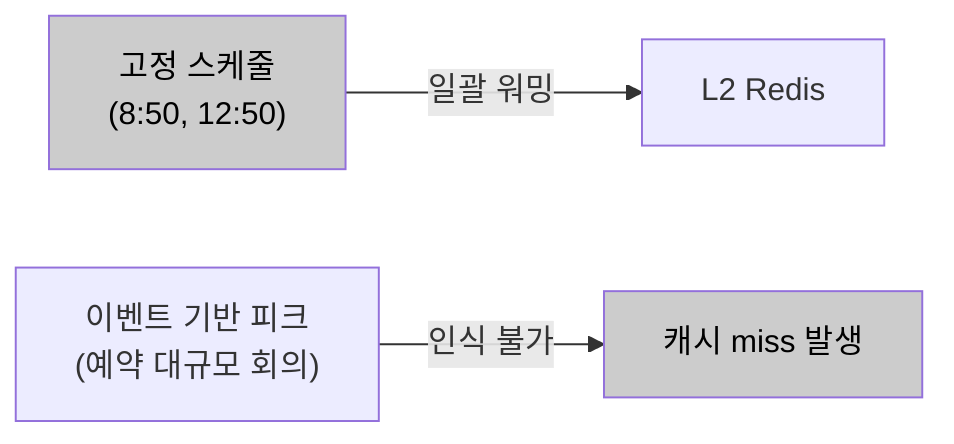
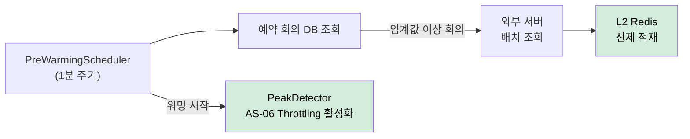

# AS-05. 예약 기반 피크 자원 선제 초기화

## 적용 대상

> **전제**: AS-03(외부 권한 조회 다층 캐시 적용)의 파생 전략. AS-03의 L2 Redis 캐시 인프라가 없으면 Pre-warming 적재 대상이 존재하지 않아 이 전략은 효과가 없다.

- **아키텍처 드라이버**: AD-04 (핵심 기능 가용성)
- **해결 이슈**:
  - ISSUE-09: 예약 회의 데이터와 참석자 수가 DB에 존재함에도 이를 활용한 사전 대응이 없다. 피크 집중 구간 초입에 캐시 miss 상태에서 요청을 처리하게 되어, 가장 많은 사용자가 몰리는 순간이 캐시 hit율이 가장 낮고 외부 서버 부하가 가장 높은 순간이 된다.
- **설계 목표**: DG-06 (예측 가능한 피크 구간 선제 대응)
- **관련 유스케이스**: UC-01 (사용자 권한 갱신), UC-04 (회의 입장)
- **관련 품질 요구사항**: QA-01 (로그인 권한 갱신 응답 성능), QA-02 (동시 입장 처리 성능), QA-04 (핵심 기능 가용성)

## 설계 근거

미팅 서비스의 트래픽 집중 패턴은 두 가지 유형으로 나뉜다. 첫째, **일별 반복 패턴**: 오전 9시·오후 1시 업무 시작 시간대에 로그인·권한 갱신·회의 입장 요청이 집중된다. 이 패턴은 매일 반복되므로 고정 일정으로 예측 가능하다. 둘째, **이벤트 기반 패턴**: DB에 예약된 대규모 회의(8만 명 스트리밍 서비스 등) 시작 시점에 입장 요청이 집중된다. 이 패턴은 예약 회의 데이터와 참석자 수로 피크 시점과 규모를 미리 파악할 수 있다.

AS-03(캐시)이 도입되면, 캐시가 채워진 상태에서는 외부 서버 호출 없이 빠른 응답이 가능하다. 그러나 캐시가 도입되더라도 **피크 진입 시점에 캐시가 비어 있으면** (TTL 만료, 서버 재시작, 신규 사용자 등) 피크 초입의 대량 캐시 miss가 일시에 외부 서버로 쏟아지는 "Thundering Herd" 현상이 발생한다. 이 순간이 역설적으로 시스템이 가장 취약한 순간이다. Pre-warming은 이 역설을 깨는 전략으로, 트래픽이 실제로 집중되기 N분 전에 DB의 예약 회의 데이터를 조회하여 해당 회의 참석자들의 권한 캐시를 선제적으로 L2 Redis에 적재해, 대량 캐시 miss 없이 피크를 맞이한다.

이 제약 조합에서 예측 가능한 피크의 cold start를 대비하는 방식이 세 가지 패러다임으로 갈린다.

- 사후 반응, 즉 트래픽 집중 이후의 자연적 warm-up에 의존한다.
- 매일 고정된 시각에 일괄 캐시 워밍을 수행한다.
- 예약 회의 데이터로 피크 시점·규모를 인식해 동적으로 선제 워밍한다.

## 후보

### 후보1. 현행 피동 대응 (트래픽 집중 후 반응적 처리)

트래픽이 실제로 집중된 후에 캐시가 점진적으로 채워지는 자연적 warm-up에 의존한다. AS-03 캐시가 있더라도 첫 요청들이 캐시 miss로 외부 서버를 호출하고 그 결과가 캐시에 적재되는 방식으로 자연스럽게 채워진다. 그러나 피크 초입에 대량의 요청이 동시에 캐시 miss를 발생시키면 외부 서버에 순간적인 요청 폭증이 발생하고, 이 구간이 사용자 경험이 가장 나쁘며 QA-01(응답시간 1초 이내) 위반 위험이 가장 높은 시점이 된다.

- 장점
  - 추가 구성이 없고 트래픽에 따라 캐시가 자연스럽게 채워진다.
- 단점
  - 피크 초입에 대량 캐시 miss가 외부 서버로 몰려 Thundering Herd가 발생한다.
  - 예측 가능한 문제임에도 가장 취약한 순간(피크 초입)에 사전 대응하지 않는다.

*후보1: 현행 피동 대응*

### 후보2. 고정 스케줄 워밍 (시간대 기반 일괄 워밍)

매일 오전 8:50, 오후 12:50 등 피크 예상 5분 전을 고정 스케줄로 지정하여 일괄 캐시 워밍을 실행한다. Spring `@Scheduled(cron = "0 50 8 * * ?")` 등으로 전체 사용자 권한 데이터를 일괄 적재한다. 그러나 이벤트 기반 피크(예약 대규모 회의)에 대응하지 못하며(특정 날 오후 3시에 8만 명 스트리밍 서비스가 예약된 경우 고정 스케줄은 그 시점을 인식하지 못한다), 워밍 대상을 전체 사용자로 설정하면 불필요한 외부 서버 호출이 대규모로 발생한다.

- 장점
  - 일별 반복 패턴(9시·13시)에 단순한 cron 설정만으로 대응한다.
- 단점
  - 이벤트 기반 피크(예약 대규모 회의)를 인식하지 못한다.
  - 전체 사용자 일괄 워밍은 불필요한 외부 호출을 대규모로 유발한다.

*후보2: 고정 스케줄 워밍*

### 후보3. 예약 회의 데이터 기반 동적 Pre-warming (채택)

DB의 예약 회의 시작 시간·참석자 수를 주기적으로 조회하여, 임계값 이상의 대규모 회의 N분 전에 해당 참석자들의 권한 캐시를 AS-03의 L2 Redis에 선제 적재한다. Spring `@Scheduled`로 1분 주기 실행하여 "현재 시각 + N분 이내에 시작하고 참석자 수 임계값(예: 500명) 이상"인 회의를 선별하고, 그 참석자들의 AC 권한·LLM 권한·용어사전 권한을 외부 서버에 선제 호출해 L2 Redis에 적재한다. 워밍 호출은 서블릿 스레드가 아닌 별도 워밍 전용 스레드 풀에서 배치당 50명씩 분할 실행하며, 워밍 스케줄러가 피크 임박을 감지하면 `PeakDetector` 플래그를 활성화해 AS-06 Throttling도 동시 동작시킨다. 예약 회의 없는 일반 업무 시작 피크는 오전 8:50·오후 12:50 고정 스케줄 병행으로 보완한다.

- 장점
  - 워밍 대상을 실제 참석자 집합으로 한정해 불필요한 외부 호출을 최소화한다.
  - 이벤트 기반 피크를 동적으로 인식해 피크 진입 시점의 캐시 hit율을 높여 Thundering Herd를 방지한다.
- 단점
  - 예측이 실제와 어긋나면 워밍이 낭비되고 대규모 워밍 자체가 외부 부하가 된다.
  - 스케줄러 장애 시 조용히 실패해 보호가 사라질 수 있다.

*후보3: 예약 회의 데이터 기반 동적 선제 초기화 (채택)*

## 후보별 비교 검토

| 비교 축 | 후보1. 사후 대응(현행) | 후보2. 고정 스케줄 워밍 | 후보3. 예약 데이터 동적 선제 초기화 (채택) |
| --- | --- | --- | --- |
| 워밍 시점 | 없음(사후 자연 warm-up) | 고정 시각(8:50·12:50) | 예약 회의 N분 전 동적 |
| 일별 반복 피크 | ✗ | ○ | ○ (고정 스케줄 병행) |
| 이벤트 기반 피크 | ✗ | ✗ 인식 불가 | ○ 예약 데이터로 인식 |
| 워밍 대상 범위 | — | 전체(과다 호출) | 임계값 이상 회의 참석자 한정 |
| 추가 인프라 | 없음 | 없음 | 없음(DB·AS-03 재사용) |
| 잔여 위험 | Thundering Herd 상존 | 이벤트 피크 미대응 | 예측 오차·스케줄러 조용한 실패 |

## 채택

**후보3(예약 회의 데이터 기반 동적 선제 초기화)을 채택한다.**

DB에 이미 존재하는 예약 회의 데이터를 활용해 외부 인프라 추가 없이 이벤트 기반 피크까지 인식하고, AS-03 캐시·AS-06 Throttling과 자연스럽게 연동되기 때문이다.

후보1은 예측 가능한 피크에 사전 대응하지 않아 피크 초입 Thundering Herd를 해소하지 못한다. 후보2는 일별 반복 피크에는 대응하지만 예약 대규모 회의 같은 이벤트 기반 피크를 인식하지 못하고 전체 일괄 워밍이 불필요한 외부 호출을 유발한다. 후보3은 예측 오차·스케줄러 조용한 실패를 남기지만, 워밍이 실패해도 AS-03 캐시가 정상 동작하므로 치명적 실패로 이어지지 않는다.

### 설계 원칙

1. **스케줄러 분리:** `PreWarmingScheduler`는 `@Scheduled(fixedDelay = 60_000)` + `@Async("preWarmExecutor")`로 서블릿 스레드와 완전 분리한다.
2. **대상 선별:** 현재 시각 + N분 이내에 시작하는 참석자 수 임계값(예: 500명) 이상 예약 회의만 워밍 대상으로 조회한다(`... WHERE m.start_time BETWEEN NOW() AND NOW() + INTERVAL {N} MINUTE GROUP BY m.id HAVING COUNT(p.id) >= {THRESHOLD}`).
3. **부하 분산:** 워밍 호출은 50명/배치, 배치 간 100ms 딜레이로 외부 서버 부하를 분산한다.
4. **연동:** 워밍 시작 시 `PeakDetector.setActive(true)`로 AS-06 Throttling을 동시 활성화하고, 오전 8:50·오후 12:50 고정 스케줄을 병행해 예약 회의 없는 일반 피크도 보완한다.

### 위험 요인

- **R1. 예측 오차로 워밍 낭비·외부 부하:** 워밍 대상을 임계값 이상 회의로 좁히고 배치·딜레이로 부하 분산
- **R2. 스케줄러 장애 시 조용한 실패:** 워밍 실패해도 AS-03 캐시가 정상 동작 + 스케줄러 상태 모니터링·알람
- **R3. 대규모 워밍 자체의 외부 서버 부하:** 배치 크기·딜레이로 순간 호출량 상한 통제
