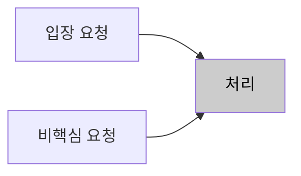
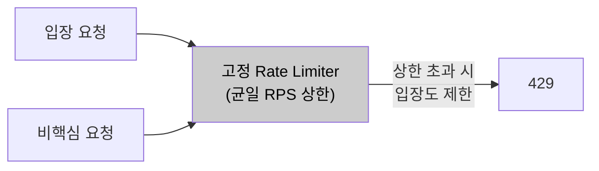
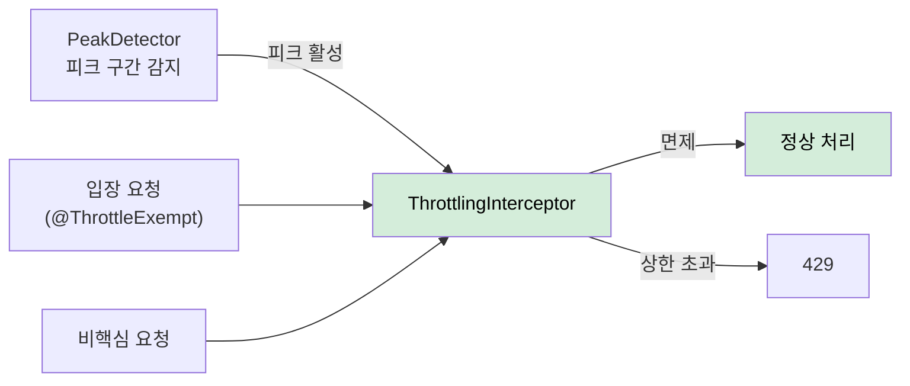

# AS-05. 피크 구간 요청 유입 제한

## 적용 대상

- **아키텍처 드라이버**: AD-02 (8만 명 동시 입장 처리 성능), AD-04 (핵심 기능 성공률 99.9%)
- **해결 이슈**:
  - ISSUE-03: 요청 집중 구간에 단순 조회 API가 스레드를 소비하면 conference-token 발급·입장 파라미터 생성 요청의 처리가 지연된다. 처리 우선순위를 제어할 수단이 없다.
  - ISSUE-09: 예약 회의 데이터로 피크 시점을 사전에 알 수 있음에도, 피크 구간에 유입되는 비핵심 요청(단순 조회, 통계 API 등)의 처리량을 줄이는 수단이 없어 핵심 처리 경로에 과부하가 집중된다.
- **설계 목표**: DG-05 (요청 유형별 처리 우선순위 제어), DG-06 (예측 가능한 피크 구간 선제 대응)
- **관련 유스케이스**: UC-04 (회의 입장), UC-01 (사용자 권한 갱신)
- **관련 품질 요구사항**: QA-02 (동시 입장 처리 성능), QA-04 (핵심 기능 가용성)

## 설계 근거

AS-04(입장 전용 처리 경로 확보)가 "핵심 요청이 비핵심 요청보다 먼저 처리되도록" 하는 전략이라면, AS-05은 "피크 구간에 비핵심 요청의 유입량 자체를 줄여" 핵심 처리 경로의 리소스 여유를 확보하는 전략이다. 두 전략은 보완 관계다.

미팅 서비스의 트래픽 집중 패턴은 상당 부분 예측 가능하다. 오전 9시·오후 1시 업무 시작 시간대의 일별 반복 패턴, 예약된 대규모 스트리밍 서비스(8만 명 규모) 시작 시점은 DB의 예약 회의 데이터로 사전 인식이 가능하다. AS-06(Predictive Pre-warming)이 이 데이터를 활용해 캐시를 선제 적재한다면, AS-05은 동일한 피크 예측 정보를 활용해 **비핵심 요청의 유입을 시간 구간 기반으로 제어**한다.

핵심 요청(회의 입장, conference-token 발급, 회의 시작)과 비핵심 요청(참석자 목록 단순 조회, 예약 목록 조회, 통계 API 등)은 사용자 경험에서 요구되는 즉시성이 다르다. 비핵심 요청은 피크 구간에 수백ms 지연이 발생해도 서비스 품질에 미치는 영향이 작다. 반면 회의 입장 요청이 지연되면 QA-04(핵심 기능 성공률 99.9%)에 직접 영향이 간다.

## 대안

### 대안 1. 스로틀링 없음 (현행)

**개념**: 모든 요청을 제한 없이 수신하고 처리한다.

**이 시스템 적용 방식**: 현행 그대로 유지.

**한계**: 피크 구간에 비핵심 요청이 핵심 처리 경로의 스레드·커넥션을 소비하더라도 이를 제어할 수단이 없다. 시스템 전체 과부하 시 핵심 요청과 비핵심 요청이 동등하게 실패한다.

*대안1 — 스로틀링 없음 (현행)*

---

### 대안 2. 고정 Rate Limiting (전체 API 균일 RPS 제한)

**개념**: 모든 API 엔드포인트에 동일한 RPS(Requests Per Second) 상한을 적용한다. Bucket4j 또는 Resilience4j RateLimiter를 사용.

**이 시스템 적용 방식**: 전체 API에 사용자별 또는 전역 RPS 상한을 설정. 초과 요청은 429 Too Many Requests로 즉시 거부.

**한계**: 핵심 API(회의 입장)와 비핵심 API(단순 조회)에 동일한 상한을 적용하므로, 피크 시 핵심 입장 요청도 제한될 수 있다. 스로틀링이 오히려 QA-02(동시 입장 처리 성능) 달성을 방해하는 역효과를 낼 수 있다.

*대안2 — 고정 Rate Limiting (균일 RPS 제한)*

---

### 대안 3. 피크 예측 기반 차등 스로틀링

**개념**: 예약 회의 데이터를 기반으로 피크 예상 구간을 감지하여, 해당 구간에만 비핵심 API를 선별적으로 처리 속도 제한한다. 핵심 입장·시작 API는 제한 없이 최대 처리. Spring AOP + 피크 시간대 감지 컴포넌트로 구현한다.

**이 시스템 적용 방식**:

1. **피크 감지 컴포넌트**: AS-06 Pre-warming 스케줄러와 공유. 예약 회의 시작 시간 N분 전(예: 5분 전)에 "피크 임박 상태"를 활성화. 업무 시작 시간대(9시, 13시) 전후 30분은 항상 피크 구간으로 인식.

2. **요청 유형 분류**: 핵심 요청(회의 입장, conference-token 발급, 회의 시작)은 `@ThrottleExempt` 어노테이션으로 면제. 비핵심 요청(단순 조회 목록, 예약 조회, 통계)은 피크 구간 중 Bucket4j 슬라이딩 윈도우로 처리량 제한.

3. **피크 구간 외**: 스로틀링 비활성화. 모든 요청 정상 처리.

4. **피크 구간 중**: 비핵심 API에 전역 처리량 상한 적용(예: 비핵심 API 초당 1,000 req). 초과 시 429 응답에 `Retry-After` 헤더 포함.

**장점**: 핵심 입장 처리에는 전혀 영향을 주지 않으면서 비핵심 요청이 소비하는 스레드·커넥션을 줄인다. AS-06과 동일한 피크 예측 데이터를 재사용하므로 별도 인프라 불필요. Spring AOP로 어노테이션 기반 적용이 가능하여 개별 API 코드를 변경하지 않아도 된다.

*대안3 — 피크 예측 기반 차등 스로틀링 (채택)*

## 채택

**채택 대안**: 대안 3 — 피크 예측 기반 차등 스로틀링

**채택 근거**: 대안 2(균일 Rate Limiting)는 핵심 API까지 제한하는 역효과 위험이 있다. 대안 3은 스로틀링 대상을 비핵심 API로 한정하고 피크 예측 구간에만 활성화하여, 핵심 처리 경로에 대한 영향 없이 시스템 전체 리소스 여유를 확보한다. AS-06 Pre-warming 스케줄러와 피크 감지 로직을 공유하므로 구현 중복도 없다.

**적용 방향**:
- `PeakDetector` 컴포넌트: DB 예약 회의 조회(Spring Scheduler로 1분 주기) + 시간대 기반 고정 피크 정의
- `@ThrottleExempt` 커스텀 어노테이션: 핵심 API 컨트롤러 메서드에 적용
- `ThrottlingInterceptor` (HandlerInterceptor): 피크 구간 중 `@ThrottleExempt`가 없는 API에 Bucket4j 적용
- Bucket4j `SlidingWindowCounter`: 비핵심 API 전역 처리량 상한 (피크 구간 중 초당 1,000 req)
- 429 응답 Body: `{ "message": "피크 시간대 일시적 처리 지연. 잠시 후 재시도 바랍니다.", "retryAfter": 3 }`
