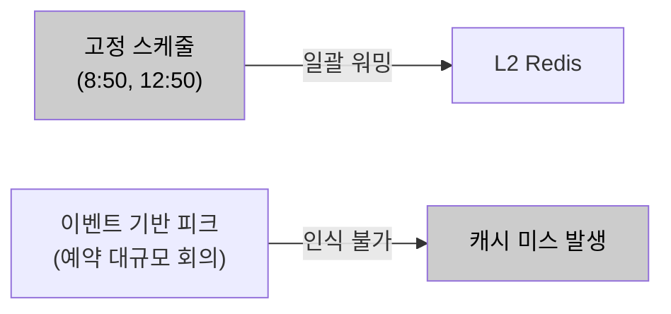
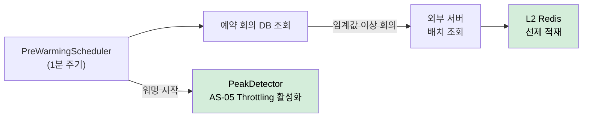

# AS-06. 예약 기반 피크 자원 선제 초기화

## 적용 대상

> **전제**: AS-03(외부 권한 조회 다층 캐시 적용)의 파생 전략. AS-03의 L2 Redis 캐시 인프라가 없으면 Pre-warming 적재 대상이 존재하지 않아 이 전략은 효과가 없다.

- **아키텍처 드라이버**: AD-01 (피크 시 권한 갱신 응답시간 1초 이내), AD-02 (8만 명 동시 입장 처리 성능), AD-04 (핵심 기능 성공률 99.9%)
- **해결 이슈**:
  - ISSUE-09: 예약 회의 데이터와 참석자 수가 DB에 존재함에도 이를 활용한 사전 대응이 없다. 피크 집중 구간 초입에 캐시 미스 상태에서 요청을 처리하게 되어, 가장 많은 사용자가 몰리는 순간이 캐시 히트율이 가장 낮고 외부 서버 부하가 가장 높은 순간이 된다.
- **설계 목표**: DG-06 (예측 가능한 피크 구간 선제 대응)
- **관련 유스케이스**: UC-01 (사용자 권한 갱신), UC-04 (회의 입장)
- **관련 품질 요구사항**: QA-01 (로그인 권한 갱신 응답 성능), QA-02 (동시 입장 처리 성능), QA-04 (핵심 기능 가용성)

## 설계 근거

미팅 서비스의 트래픽 집중 패턴은 두 가지 유형으로 나뉜다. 첫째, **일별 반복 패턴**: 오전 9시·오후 1시 업무 시작 시간대에 로그인·권한 갱신·회의 입장 요청이 집중된다. 이 패턴은 매일 반복되므로 고정 일정으로 예측 가능하다. 둘째, **이벤트 기반 패턴**: DB에 예약된 대규모 회의(8만 명 스트리밍 서비스 등) 시작 시점에 입장 요청이 집중된다. 이 패턴은 예약 회의 데이터와 참석자 수로 피크 시점과 규모를 미리 파악할 수 있다.

AS-03(캐시)이 도입되면, 캐시가 채워진 상태에서는 외부 서버 호출 없이 빠른 응답이 가능하다. 그러나 캐시가 도입되더라도 **피크 진입 시점에 캐시가 비어 있으면** (TTL 만료, 서버 재시작, 신규 사용자 등) 피크 초입의 대량 캐시 미스가 일시에 외부 서버로 쏟아지는 "Thundering Herd" 현상이 발생한다. 이 순간이 역설적으로 시스템이 가장 취약한 순간이다.

Pre-warming은 이 역설을 깨는 전략이다. 트래픽이 실제로 집중되기 N분 전에, DB의 예약 회의 데이터를 조회하여 해당 회의 참석자들의 권한 캐시를 선제적으로 L2 Redis에 적재한다. 피크 진입 시점에 이미 캐시가 채워진 상태이므로, 대량 캐시 미스 없이 피크를 맞이할 수 있다.

## 대안

### 대안 1. 현행 피동 대응 (트래픽 집중 후 반응적 처리)

**개념**: 트래픽이 실제로 집중된 후에 캐시가 점진적으로 채워지는 자연적 warm-up에 의존한다.

**이 시스템 적용 방식**: 변경 없음. AS-03 캐시가 있더라도 첫 요청들이 캐시 미스로 외부 서버를 호출하고 그 결과가 캐시에 적재되는 방식으로 자연적으로 채워진다.

**한계**: 피크 초입에 대량의 요청이 동시에 캐시 미스를 발생시키면 외부 서버에 순간적인 요청 폭증이 발생한다. 이 구간이 사용자 경험이 가장 나쁜 순간이며, 외부 서버 부하 급증으로 QA-01(응답시간 1초 이내) 위반 위험이 가장 높은 시점이다. 예측 가능한 문제임에도 사전 대응하지 않는 것은 비효율적이다.

*대안1 — 현행 피동 대응*

---

### 대안 2. 고정 스케줄 워밍 (시간대 기반 일괄 워밍)

**개념**: 매일 오전 8:50, 오후 12:50 등 피크 예상 5분 전을 고정 스케줄로 지정하여 일괄 캐시 워밍을 실행한다.

**이 시스템 적용 방식**: Spring `@Scheduled(cron = "0 50 8 * * ?")` 등으로 전체 사용자 권한 데이터를 일괄 적재.

**한계**: 이벤트 기반 피크(예약 대규모 회의)에 대응하지 못한다. 특정 날 오후 3시에 8만 명 스트리밍 서비스가 예약된 경우, 고정 스케줄은 그 시점을 인식하지 못한다. 또한 워밍 대상 범위를 전체 사용자로 설정하면 불필요한 외부 서버 호출이 대규모로 발생한다.

*대안2 — 고정 스케줄 워밍*

---

### 대안 3. 예약 회의 데이터 기반 동적 Pre-warming

**개념**: DB의 예약 회의 시작 시간·참석자 수를 주기적으로 조회하여, 임계값 이상의 대규모 회의 N분 전에 해당 참석자들의 권한 캐시를 AS-03의 L2 Redis에 선제 적재한다. Spring Scheduler로 구현하며, AS-05 Throttling 활성화와 연동된다.

**이 시스템 적용 방식**:

1. **Pre-warming 스케줄러**: Spring `@Scheduled`로 1분 주기 실행. DB에서 "현재 시각 + N분 이내에 시작하는 예약 회의" 목록을 조회. 참석자 수 임계값(예: 500명 이상) 이상인 회의만 대상으로 선별.

2. **대상 참석자 권한 적재**: 선별된 회의의 참석자 목록을 조회하여, 각 참석자의 AC 권한·LLM 권한·용어사전 권한을 외부 서버(AC서버, Copilot Admin 서버)에 선제 호출하여 L2 Redis에 적재.

3. **워밍 호출은 저우선순위 실행**: 피크 이전에 실행되므로 서블릿 스레드 풀이 아닌 별도 워밍 전용 스레드 풀에서 실행. 피크 전 외부 서버 부하를 분산하기 위해 배치당 50명씩 분할하여 적재.

4. **AS-05 Throttling 연동**: 워밍 스케줄러가 피크 임박 상태를 감지하면 `PeakDetector` 플래그를 활성화하여 AS-05 Throttling도 동시에 동작.

5. **일별 반복 패턴 보완**: 오전 8:50, 오후 12:50 고정 스케줄도 병행하여 예약 회의 없는 일반 업무 시작 피크에도 대응.

**장점**: 워밍 대상을 "실제 참석자 집합"으로 한정하여 불필요한 외부 서버 호출을 최소화한다. 이벤트 기반 피크(대규모 예약 회의)를 동적으로 인식하여 대응한다. 피크 진입 시점에 L2 Redis 캐시 히트율이 높은 상태이므로 Thundering Herd 없이 피크를 맞이한다.

*대안3 — 예약 회의 데이터 기반 동적 선제 초기화 (채택)*

## 채택

**채택 대안**: 대안 3 — 예약 회의 데이터 기반 동적 Pre-warming

**채택 근거**: 대안 1(피동 대응)은 예측 가능한 피크에 사전 대응하지 않으므로, 가장 중요한 시점(피크 초입)에 시스템이 가장 취약한 상태를 맞이하는 구조적 문제를 해소하지 못한다. 대안 2(고정 스케줄)는 이벤트 기반 피크를 인식하지 못한다. 대안 3은 DB에 이미 존재하는 예약 회의 데이터를 활용하므로 외부 인프라 추가 없이 구현 가능하며, AS-03 Redis 캐시와 AS-05 Throttling 양쪽과 자연스럽게 연동된다.

**적용 방향**:
- `PreWarmingScheduler`: `@Scheduled(fixedDelay = 60_000)` + `@Async("preWarmExecutor")` 조합으로 서블릿 스레드와 완전 분리
- 대상 회의 쿼리: `SELECT m.id, m.start_time, COUNT(p.id) FROM meetings m JOIN participants p ON m.id = p.meeting_id WHERE m.start_time BETWEEN NOW() AND NOW() + INTERVAL {N} MINUTE GROUP BY m.id HAVING COUNT(p.id) >= {THRESHOLD}`
- 워밍 호출 배치 크기: 50명/배치, 배치 간 100ms 딜레이로 외부 서버 부하 분산
- `PeakDetector.setActive(true)`: 워밍 시작 시 AS-05 Throttling 동시 활성화
