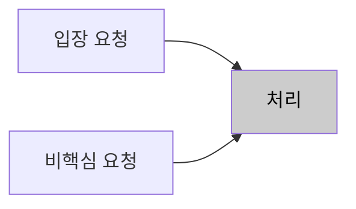
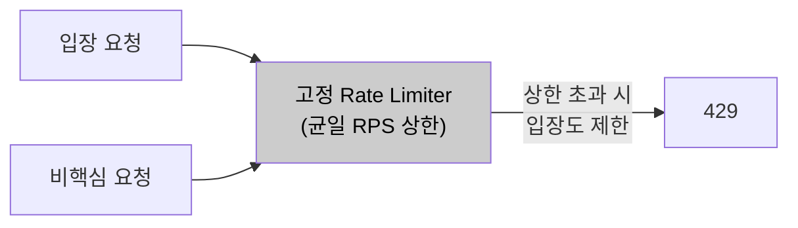
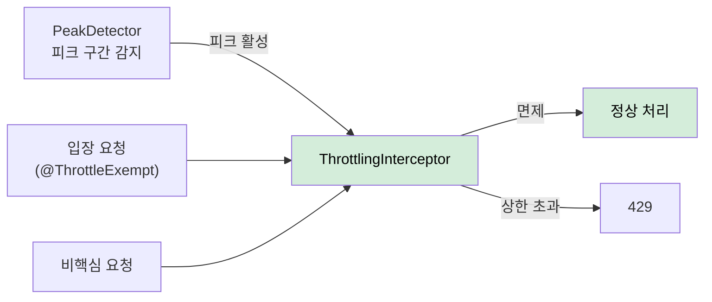

# AS-06. 피크 구간 요청 유입 제한

## 적용 대상

- **아키텍처 드라이버**: AD-02 (동시 입장 처리 성능), AD-04 (핵심 기능 가용성)
- **해결 이슈**:
  - ISSUE-03: 요청 집중 구간에 단순 조회 API가 스레드를 소비하면 conference-token 발급·입장 파라미터 생성 요청의 처리가 지연된다. 처리 우선순위를 제어할 수단이 없다.
  - ISSUE-09: 예약 회의 데이터로 피크 시점을 사전에 알 수 있음에도, 피크 구간에 유입되는 비핵심 요청(단순 조회, 통계 API 등)의 처리량을 줄이는 수단이 없어 핵심 처리 경로에 과부하가 집중된다.
- **설계 목표**: DG-05 (요청 유형별 처리 우선순위 제어), DG-06 (예측 가능한 피크 구간 선제 대응)
- **관련 유스케이스**: UC-04 (회의 입장), UC-01 (사용자 권한 갱신)
- **관련 품질 요구사항**: QA-02 (동시 입장 처리 성능), QA-04 (핵심 기능 가용성)

## 설계 근거

AS-04(입장 전용 처리 경로 확보)가 "핵심 요청이 비핵심 요청보다 먼저 처리되도록" 하는 전략이라면, AS-06은 "피크 구간에 비핵심 요청의 유입량 자체를 줄여" 핵심 처리 경로의 리소스 여유를 확보하는 전략이다. 두 전략은 보완 관계다.

미팅 서비스의 트래픽 집중 패턴은 상당 부분 예측 가능하다. 오전 9시·오후 1시 업무 시작 시간대의 일별 반복 패턴, 예약된 대규모 스트리밍 서비스(8만 명 규모) 시작 시점은 DB의 예약 회의 데이터로 사전 인식이 가능하다. AS-05(Predictive Pre-warming)이 이 데이터를 활용해 캐시를 선제 적재한다면, AS-06은 동일한 피크 예측 정보를 활용해 **비핵심 요청의 유입을 시간 구간 기반으로 제어**한다.

핵심 요청(회의 입장, conference-token 발급, 회의 시작)과 비핵심 요청(참석자 목록 단순 조회, 예약 목록 조회, 통계 API 등)은 사용자 경험에서 요구되는 즉시성이 다르다. 비핵심 요청은 피크 구간에 수백ms 지연이 발생해도 서비스 품질에 미치는 영향이 작다. 반면 회의 입장 요청이 지연되면 QA-04(핵심 기능 성공률 99.9%)에 직접 영향이 간다.

이 제약 조합에서 피크 구간 비핵심 요청의 유입을 제어하는 방식이 세 가지 패러다임으로 갈린다.

- 제어하지 않고 모든 요청을 그대로 수용한다.
- 전체 API에 균일한 RPS 상한을 적용한다.
- 피크 예측 구간에만, 비핵심 API로 한정한 차등 제어를 적용한다.

## 후보

### 후보1. 스로틀링 없음 (현행)

모든 요청을 제한 없이 수신하고 처리한다. 피크 구간에 비핵심 요청이 핵심 처리 경로의 스레드·커넥션을 소비하더라도 이를 제어할 수단이 없어, 시스템 전체 과부하 시 핵심 요청과 비핵심 요청이 동등하게 실패한다.

- 장점
  - 추가 구성이 없고 모든 요청이 지연 없이 수용된다.
- 단점
  - 피크 구간에 비핵심 요청이 핵심 경로 자원을 소비해도 제어할 수단이 없다.
  - 전체 과부하 시 핵심·비핵심 요청이 동등하게 실패한다.

*후보1: 스로틀링 없음 (현행)*

### 후보2. 고정 Rate Limiting (전체 API 균일 RPS 제한)

모든 API 엔드포인트에 동일한 RPS(Requests Per Second) 상한을 적용한다. Bucket4j 또는 Resilience4j RateLimiter를 사용해 전체 API에 사용자별 또는 전역 RPS 상한을 설정하고, 초과 요청은 429 Too Many Requests로 즉시 거부한다. 그러나 핵심 API(회의 입장)와 비핵심 API(단순 조회)에 동일한 상한을 적용하므로 피크 시 핵심 입장 요청도 제한될 수 있어, 스로틀링이 오히려 QA-02(동시 입장 처리 성능) 달성을 방해하는 역효과를 낼 수 있다.

- 장점
  - Bucket4j 등으로 단순하게 구성되고 전체 유입량 상한을 보장한다.
- 단점
  - 핵심 입장 API까지 동일 상한에 걸려 QA-02를 방해하는 역효과 위험이 있다.
  - 피크가 아닌 시간대에도 불필요한 제한이 발생한다.

*후보2: 고정 Rate Limiting (균일 RPS 제한)*

### 후보3. 피크 예측 기반 차등 스로틀링 (채택)

예약 회의 데이터를 기반으로 피크 예상 구간을 감지하여, 해당 구간에만 비핵심 API를 선별적으로 처리 속도 제한한다. 핵심 입장·시작 API는 제한 없이 최대 처리하며, Spring AOP + 피크 시간대 감지 컴포넌트로 구현한다. 피크 감지 컴포넌트는 AS-05 Pre-warming 스케줄러와 공유하여 예약 회의 시작 N분 전 "피크 임박 상태"를 활성화하고 업무 시작 시간대 전후 30분을 항상 피크 구간으로 인식한다. 핵심 요청은 `@ThrottleExempt`로 면제하고, 비핵심 요청은 피크 구간 중 Bucket4j 슬라이딩 윈도우(예: 초당 1,000 req)로 처리량을 제한하며 초과 시 429 응답에 `Retry-After` 헤더를 포함한다.

- 장점
  - 스로틀링을 비핵심 API·피크 구간으로 한정해 핵심 입장 처리에 영향을 주지 않는다.
  - AS-05과 동일한 피크 예측 데이터를 재사용하고 Spring AOP 어노테이션 기반이라 개별 API 코드 변경이 없다.
- 단점
  - 예약에 없는 돌발 급증에는 작동하지 않는다.
  - 스로틀링된 비핵심 요청은 429로 UX가 저하되고 임계값 튜닝이 지속 필요하다.

*후보3: 피크 예측 기반 차등 스로틀링 (채택)*

## 후보별 비교 검토

| 비교 축 | 후보1. 스로틀링 없음(현행) | 후보2. 균일 Rate Limiting | 후보3. 피크 예측 차등 스로틀링 (채택) |
| --- | --- | --- | --- |
| 제어 대상 | 없음 | 전체 API 균일 | 비핵심 API 한정 |
| 활성 구간 | — | 상시 | 피크 예측 구간만 |
| 핵심 입장 영향 | 보호 수단 없음 | ✗ 핵심도 제한 | ○ `@ThrottleExempt` 면제 |
| QA-02 방해 | 과부하 시 동등 실패 | ✗ 역효과 위험 | ○ 방해 없음 |
| 추가 인프라 | 없음 | Rate Limiter | 없음(AS-05 피크 감지 공유) |
| 잔여 위험 | 자원 과점 방치 | 상시·핵심 제한 | 돌발 급증 미작동·429 UX·튜닝 |

## 채택

**후보3(피크 예측 기반 차등 스로틀링)을 채택한다.**

스로틀링 대상을 비핵심 API로 한정하고 피크 예측 구간에만 활성화하여, 핵심 처리 경로에 영향을 주지 않으면서 시스템 전체 리소스 여유를 확보하기 때문이다. AS-05 Pre-warming 스케줄러와 피크 감지 로직을 공유하므로 구현 중복도 없다.

후보1은 비핵심 요청의 자원 과점을 방치해 피크 구간 핵심 경로를 보호하지 못한다. 후보2는 전체 유입량 상한을 보장하지만 핵심 입장 API까지 동일 상한에 걸려 QA-02를 방해하는 역효과 위험이 있고, 피크가 아닌 시간대에도 불필요한 제한이 발생한다. 후보3은 돌발 급증 미작동·429 UX 저하를 남기지만, AS-04(입장 전용 경로)가 최소 안전망으로 핵심 입장을 보호하고 429는 비핵심 API로만 한정된다.

### 설계 원칙

1. **피크 감지 공유:** `PeakDetector`는 DB 예약 회의 조회(Spring Scheduler 1분 주기)와 시간대 기반 고정 피크(9시·13시 전후 30분) 정의를 결합하며, AS-05 Pre-warming 스케줄러와 감지 로직을 공유한다.
2. **핵심 면제:** 회의 입장·conference-token 발급·회의 시작 등 핵심 API에는 `@ThrottleExempt`를 적용해 스로틀링에서 면제한다.
3. **비핵심 한정 제어:** `ThrottlingInterceptor`가 피크 구간 중 `@ThrottleExempt`가 없는 API에만 Bucket4j `SlidingWindowCounter`(피크 구간 중 초당 1,000 req)를 적용한다.
4. **거부 응답 계약:** 상한 초과 시 429 Body에 안내 메시지와 `Retry-After`를 포함한다(예: `{ "message": "피크 시간대 일시적 처리 지연. 잠시 후 재시도 바랍니다.", "retryAfter": 3 }`).

### 위험 요인

- **R1. 예약에 없는 돌발 급증에 미작동:** AS-04(입장 전용 경로)가 최소 안전망으로 핵심 입장 처리를 보호
- **R2. 스로틀링된 비핵심 요청의 429 UX 저하:** 429를 비핵심 API로만 한정하고 `Retry-After`로 재시도 유도
- **R3. 임계값 지속 튜닝 필요:** 부하 프로파일 기반으로 상한을 조정하고 모니터링으로 보정
