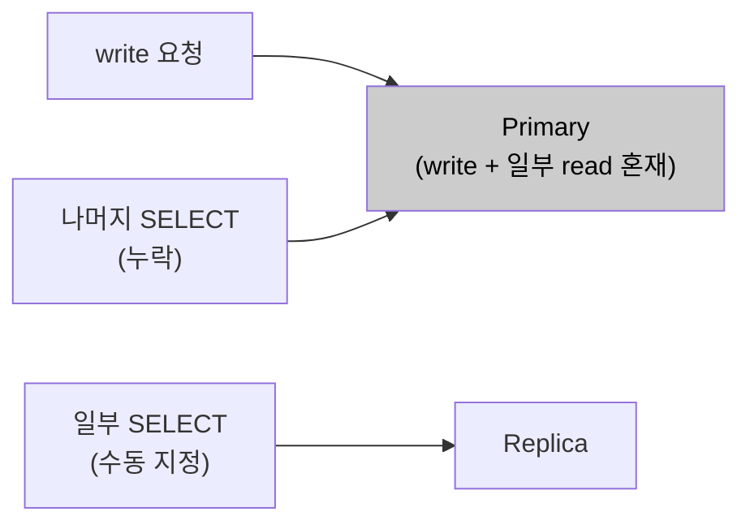
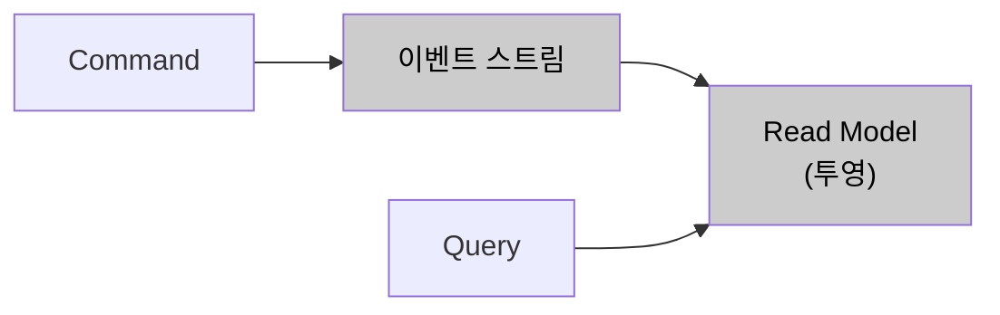
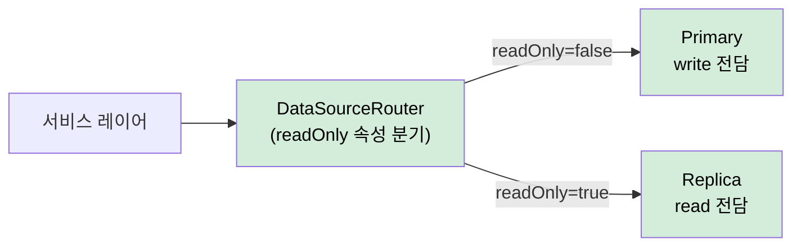
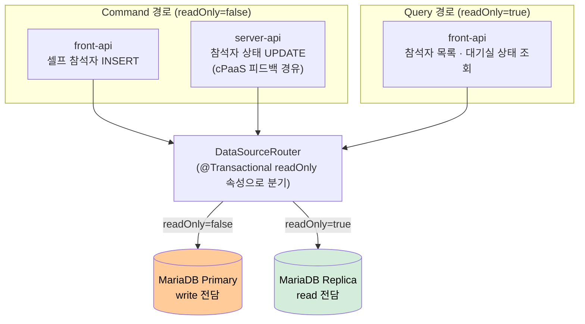

# AS-07. 조회·입장 DB 경로 분리

## 적용 대상

> **전제**: AS-01(입장 처리 도메인 경계 분리)의 파생 전략. AS-01이 설정한 도메인 경계 내에서 Command/Query 경로를 분리한다.

- **아키텍처 드라이버**: AD-04 (핵심 기능 가용성)
- **해결 이슈**:
  - ISSUE-07: 대규모 회의 시작 시점에 사용자 입장 write(front-api 경유), cPaaS 피드백 write(server-api 경유), 참석자 목록·대기실 상태 read가 Primary DB 테이블에 동시 집중된다. 일부 느린 SELECT 쿼리는 이미 Replica로 개별 지정되어 있으나, write 집중 경합과 Primary 처리량 포화로 입장 처리(UC-04) 자체가 지연되는 문제는 해소되지 않고 있다.
- **설계 목표**: DG-03 (특정 기능 커넥션 고갈 시 타 기능 정상 운영), DG-04 (핵심 기능 성공률 99.9%)
- **관련 유스케이스**: UC-04 (회의 입장), UC-05 (회의 퇴장), UC-06 (참석자 초대)
- **관련 품질 요구사항**: QA-03 (DB 커넥션 풀 격리 신뢰성), QA-04 (핵심 기능 가용성)

## 설계 근거

현재 미팅 포털 서버는 MariaDB Primary-Replica 구성을 갖추고 있으며, 응답 지연이 심한 일부 SELECT 쿼리는 개별적으로 Replica로 라우팅되어 있다. 그러나 이 라우팅은 쿼리 단위 수동 지정 방식으로, 트랜잭션 readOnly 속성에 기반한 체계적 분리가 아니다. 적용 기준이 일관되지 않아 누락 위험이 있으며, ISSUE-07의 핵심 원인인 write 경로 간 경합과 Primary 단일 노드의 write 처리량 포화는 여전히 해소되지 않은 상태다.

ISSUE-07의 경합 구조를 상세히 분석하면 두 가지 write 경로가 동시에 동일 테이블을 타격한다.

첫째 **front-api 경유 write (셀프 참석자 한정)**: `User → front-api → participants INSERT` (오픈회의 셀프 참석자 입장 시)

둘째 **cPaaS 피드백 경유 write**: `cPaaS → server-api → participants UPDATE` (입장 성공·퇴장·연결 끊김 등 모든 참석자 상태 변경)

두 write 경로는 사용자 요청과 무관하게 독립적으로 발생하므로, 대규모 회의 시작 시점에는 두 경로의 write가 동시에 최고조에 달한다. 여기에 참석자 목록 조회(read)까지 집중되면, 동일 레코드에 대한 write 경합과 read·write의 노드 자원 경합이 최대화된다. 이 상황에서 입장 처리(write)가 조회(read)의 lock 대기에 의해 지연되거나 역으로 조회가 입장 write lock에 블로킹되는 상황이 반복되며, QA-04(핵심 기능 성공률 99.9%)에서 "가장 중요한 회의 입장 처리가 피드백 write 및 조회 트래픽에 의해 지연된다"는 것은 구조적 설계 결함이다.

해결의 핵심은 **write(Command)와 read(Query)가 서로 다른 물리 노드에서 처리되어 노드 자원을 경쟁하지 않는 구조**를 만들어, Primary가 write 처리에 집중하도록 하는 것이다.

이 제약 조합에서 read/write 노드 경합을 분리하는 방식이 세 가지 패러다임으로 갈린다.

- 현행 쿼리 단위 수동 Replica 라우팅을 그대로 유지한다.
- 이벤트 소싱 + CQRS로 Command·Query 저장소를 완전히 분리한다.
- 기존 Primary-Replica를 readOnly 트랜잭션 기준으로 전면 체계화한다.

## 후보

### 후보1. 현행 선택적 Replica 라우팅 유지

현재 Primary-Replica 구성에서 응답 지연이 심한 일부 SELECT 쿼리에 한해 개별적으로 Replica 라우팅을 지정하는 방식을 유지한다. 그러나 적용 기준이 개별 쿼리 단위의 수동 지정이라 트랜잭션 단위 readOnly 경계를 보장하지 않고 누락 위험이 있으며, 트랜잭션 내부에서 write 후 read가 섞이는 경우 Replica 라우팅이 보장되지 않는다. 가장 근본적으로 ISSUE-07의 핵심인 write 집중 경합(셀프 참석자 front-api INSERT · cPaaS 피드백 경유 server-api UPDATE가 동일 Primary에 집중)은 SELECT를 Replica로 옮겨도 해소되지 않는다.

- 장점
  - 이미 구성된 인프라를 그대로 사용하고 즉시 일관성을 유지한다.
- 단점
  - 쿼리 단위 수동 지정이라 readOnly 경계가 보장되지 않고 누락 위험이 있다.
  - write 집중 경합이 그대로 남아 ISSUE-07을 구조적으로 해소하지 못한다.

*후보1: 현행 선택적 Replica 라우팅 유지*

### 후보2. 완전한 이벤트 소싱 + CQRS

모든 Command를 이벤트 스트림으로 저장하고, Query는 이벤트를 기반으로 생성된 별도의 Read Model(투영)을 조회한다. `participants` 테이블의 변경을 `ParticipantJoined`·`ParticipantLeft` 등의 이벤트로 저장하는 Event Store를 도입하고 별도 Read Model DB에 참석자 목록 투영을 유지한다. Command DB와 Query DB가 완전히 분리되는 이상적 구조이나, 기존 JPA 엔티티 기반 도메인 모델을 이벤트 소싱 모델로 전면 재설계해야 하고 이벤트 순서 보장·투영 복구·이벤트 버저닝 등 복잡한 문제를 수반하여 C-04(점진적 적용) 제약에 정면 충돌한다.

- 장점
  - Command·Query 저장소가 완전히 분리되어 read/write 경합이 원천적으로 사라진다.
- 단점
  - 기존 JPA 도메인 모델을 이벤트 소싱으로 전면 재설계해야 해 C-04를 위반한다.
  - 이벤트 순서 보장·투영 복구·버저닝 등 운영 복잡도가 크다.

*후보2: 완전한 이벤트 소싱 + CQRS*

### 후보3. @Transactional 기반 Primary/Replica 전체 체계화 (채택)

이미 갖추어진 Primary-Replica 인프라를 활용하되, 현행 쿼리 단위 수동 지정을 `@Transactional(readOnly = true)` 기반 체계적 라우팅으로 전환한다. `AbstractRoutingDataSource`로 트랜잭션의 readOnly 여부에 따라 DataSource를 동적으로 선택하여 모든 Query를 Replica로 일관되게 분리한다. 참석자 목록·대기실 상태·회의 목록 조회 등 모든 Query 서비스 메서드에 `@Transactional(readOnly = true)`를 적용해 전면 Replica 라우팅하고, 입장 write·피드백 write는 기존 `@Transactional`을 유지해 Primary로 라우팅한다. 기존 JPA 엔티티·레포지토리 코드 변경 없이 DataSource 설정 교체만으로 적용된다.

- 장점
  - 이미 구성된 Primary-Replica를 활용해 기존 코드 최소 변경으로 C-04를 준수한다.
  - 트랜잭션 단위 readOnly 경계가 보장되어 누락 위험이 없고, Primary가 조회 부하에서 분리된다.
- 단점
  - 복제 지연으로 read-after-write 불일치가 생길 수 있다.
  - readOnly 경계 누락 시 Primary로 회귀하고, Replica 장애 시 read 경로 전체가 영향받는다.

*후보3: @Transactional 기반 Primary/Replica 전체 체계화 (채택)*

## DB 읽기·쓰기 경로 분리 구조

<!-- 이미지 파일명(draw.io → PNG 교체 시): report/images/3.2-as07-cqrs-routing.png -->

<em>[그림 AS07-1] Primary(write) · Replica(read) 분리 라우팅 구조</em>

## 후보별 비교 검토

| 비교 축 | 후보1. 선택적 Replica 유지 | 후보2. 이벤트 소싱 + CQRS | 후보3. @Transactional 체계화 (채택) |
| --- | --- | --- | --- |
| 분리 방식 | 쿼리 단위 수동 지정 | Command·Query 저장소 완전 분리 | readOnly 트랜잭션 기준 전면 라우팅 |
| readOnly 경계 보장 | ✗ 누락 위험 | ○ | ○ 트랜잭션 단위 |
| write 집중 경합 해소 | ✗ | ○ | ○ Primary가 write 전담 |
| 코드 변경 | 없음 | ✗ 도메인 전면 재설계 | DataSource 설정 교체만 |
| C-04 점진적 적용 | ○ | ✗ 위반 | ○ |
| 잔여 위험 | 경합 잔존·누락 | 이벤트 순서·투영 운영 복잡 | 복제 지연 read-after-write |

## 채택

**후보3(@Transactional 기반 Primary/Replica 전체 체계화)을 채택한다.**

이미 갖추어진 Primary-Replica 인프라를 활용해 기존 코드 최소 변경으로 트랜잭션 단위 readOnly 경계를 보장하고, Primary를 write 처리에 집중시켜 ISSUE-07의 경합을 해소하기 때문이다. 대규모 회의 시작 시점에 참석자 목록 조회(read 집중)를 Replica로 전면 분산하면 Primary DB의 write 처리(입장·피드백)가 조회와의 노드 자원 경합에서 벗어나 DG-03·DG-04를 충족한다.

후보1은 쿼리 단위 수동 지정이라 readOnly 경계가 보장되지 않고 write 집중 경합이 그대로 남는다. 후보2는 read/write를 원천 분리하는 이상적 구조이지만 도메인 모델 전면 재설계가 C-04(점진적 적용)를 위반하고 이벤트 순서·투영 운영 복잡도가 크다. 후보3은 복제 지연에 따른 read-after-write 불일치를 남기지만, 강한 정합성이 필요한 경로를 Primary 읽기로 유지해 완화할 수 있다.

### 설계 원칙

1. **라우팅 기준:** `DataSourceRouter extends AbstractRoutingDataSource`가 현재 트랜잭션의 `readOnly` 속성으로 Primary/Replica DataSource를 반환한다.
2. **커넥션 지연 획득:** `LazyConnectionDataSourceProxy`로 래핑해 실제 커넥션 획득을 트랜잭션 시작(readOnly 판단 이후)까지 지연한다.
3. **Query 경계 지정:** 참석자 목록·대기실 상태·회의 목록 조회 등 모든 Query 서비스 메서드에 `@Transactional(readOnly = true)`를 적용해 전면 Replica 라우팅한다.
4. **AS-08 결합:** Primary DataSource는 `join-pool`·`service-pool`, Replica DataSource는 `query-pool`로 별도 HikariCP 풀을 설정한다.

### 위험 요인

- **R1. 복제 지연 read-after-write 불일치:** 입장 직후 재조회가 필요한 경로는 `readOnly=false`로 Primary에서 읽고, 강한 정합성이 필요 없는 조회만 Replica로 분산
- **R2. readOnly 경계 누락 시 Primary 회귀:** Query 메서드 readOnly 지정을 규칙화하고 리뷰로 검증
- **R3. Replica 장애 시 read 경로 전체 영향:** 헬스체크 기반 Primary Fallback 라우팅 구성
