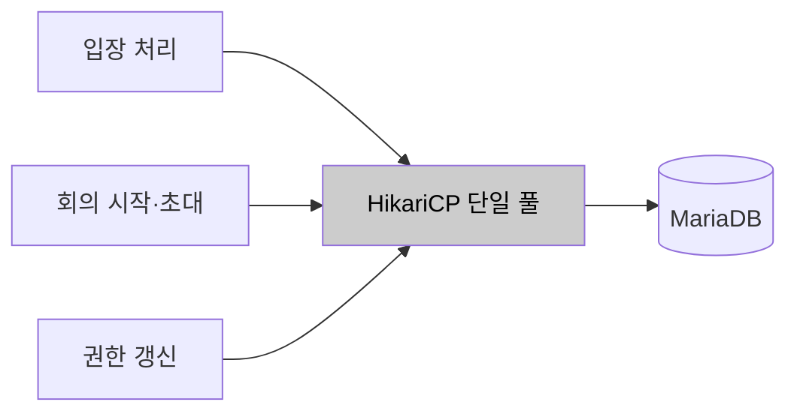
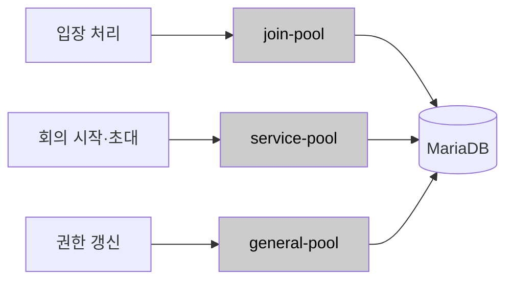
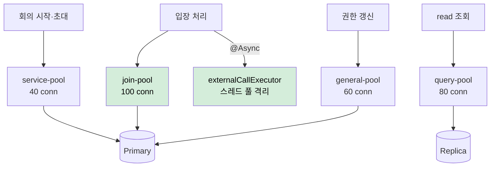
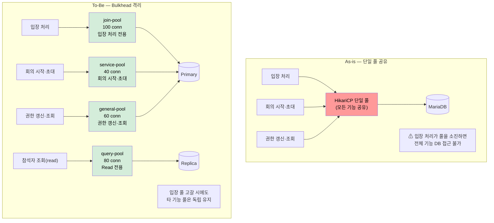

# AS-08. 기능별 커넥션·스레드 격벽 분리

## 적용 대상

> **전제**: AS-01(입장 처리 도메인 경계 분리)의 파생 전략. AS-01이 설정한 도메인 경계별로 HikariCP 커넥션 풀을 분리 구성한다.

- **아키텍처 드라이버**: AD-03 (커넥션 풀 장애 격리), AD-04 (핵심 기능 가용성), AD-05 (외부 서버 장애 격리)
- **해결 이슈**:
  - ISSUE-01: 8만 명 동시 입장 시 입장 처리가 DB 커넥션 풀 전체를 소진할 수 있다. 커넥션 고갈 시 신규 입장 요청에 대한 DB 접근이 불가능해지며, 이 영향이 다른 기능으로 전파된다.
  - ISSUE-04: 단일 HikariCP 풀을 모든 기능이 공유하므로, 입장 처리 부하로 커넥션이 고갈되면 회의 시작·참석자 초대·권한 갱신 등 모든 기능의 DB 접근이 동시에 불가능해진다. 특정 기능의 트래픽 집중이 전체 서비스 장애로 전파되는 연쇄 구조다.
  - ISSUE-06: 외부 서버 장애 시 Hystrix threadpool 스레드가 3,000ms씩 점유되며, 해당 결과를 기다리는 서블릿 스레드도 Future.get()으로 함께 블로킹된다. 블로킹된 서블릿 스레드는 DB 커넥션을 점유한 채 timeout까지 대기하므로 커넥션 고갈이 타 기능으로 전파된다. Hystrix threadpool이 서비스별로 구성되어 있으나(deprecated), DB 커넥션 풀은 여전히 단일 공유 풀이다.
- **설계 목표**: DG-03 (특정 기능 커넥션 고갈 시 타 기능 정상 운영), DG-04 (핵심 기능 성공률 99.9%)
- **관련 유스케이스**: UC-03 (회의 시작), UC-04 (회의 입장), UC-06 (참석자 초대)
- **관련 품질 요구사항**: QA-03 (DB 커넥션 풀 격리 신뢰성), QA-04 (핵심 기능 가용성), QA-05 (외부 서버 장애 격리)

## 설계 근거

현행 구조에서 front-api·server-api·admin-api는 동일한 DB를 공유하며, 각 인스턴스 내 기능 간에도 단일 HikariCP 풀이 공유된다. 8만 명 동시 입장이 발생하면 입장 처리(UC-04)가 DB 조회("입장 가능 여부 확인")를 위해 커넥션을 획득한다. HikariCP 풀 크기(기본 10)를 훨씬 초과하는 요청이 동시에 커넥션을 요구하면 `connectionTimeout` 만료(기본 30초)까지 대기하다 `SQLTransientConnectionException`이 발생하고, 이 예외는 입장 처리에서 그치지 않고 동일 풀을 사용하는 회의 시작(UC-03), 참석자 초대(UC-06)에서도 동일하게 발생한다.

QA-03의 측정 기준은 "입장 전용 커넥션 풀 고갈 시 회의 시작 API 성공률 100%"다. 이를 충족하려면 입장 처리의 커넥션 고갈이 회의 시작의 커넥션 가용성에 물리적으로 영향을 주지 않아야 한다. 즉, **기능별로 독립된 커넥션 풀**이 필요하다. 또한 ISSUE-06의 외부 서버 장애 시나리오에서 AS-02(비동기 처리)가 적용되더라도 비동기 처리 스레드 풀과 그 스레드가 사용하는 커넥션 풀도 격리가 필요하다. 외부 서버 호출 스레드가 서블릿 처리 스레드의 커넥션을 공유하면 외부 서버 장애의 영향이 서블릿 처리 경로로 전파된다.

이 제약 조합에서 기능 간 자원 격리를 어느 차원까지 세우는가가 세 가지 패러다임으로 갈린다.

- 단일 풀을 유지한 채 풀 크기만 키워 고갈을 지연한다.
- DB 커넥션 풀만 기능별로 분리한다.
- DB 커넥션 풀과 외부 호출 스레드 풀을 이중으로 격리한다.

## 후보

### 후보1. 현행 단일 HikariCP 풀

현행대로 단일 HikariCP DataSource를 모든 기능이 공유하고, `maximumPoolSize`를 늘려 고갈을 지연시키는 방식으로 간접 대응한다. 그러나 풀 크기를 늘려도 8만 명 동시 입장이라는 규모에서는 커넥션 고갈 시점이 달라질 뿐 구조적 격리는 없다. 입장 처리 부하가 충분히 크면 늘어난 풀도 결국 소진되며, QA-03(입장 풀 고갈 시 회의 시작 100% 성공)은 단일 풀 구조에서는 원칙적으로 충족 불가능하다.

- 장점
  - 설정 변경만으로 적용되고 풀 관리 단위가 단순하다.
- 단점
  - 구조적 격리가 없어 입장 처리 부하가 커지면 늘린 풀도 결국 소진된다.
  - QA-03(입장 풀 고갈 시 회의 시작 100%)을 단일 풀 구조에서 충족할 수 없다.

*후보1: 현행 단일 HikariCP 풀*

### 후보2. 기능별 HikariCP 풀 분리만 (DB 커넥션 격리)

기능별로 별도 `DataSource` Bean을 정의하여 HikariCP 풀을 분리한다. `joinDataSource`(입장 전용, `maximumPoolSize=50`, `connectionTimeout=3,000ms`), `serviceDataSource`(회의 시작·초대, `maximumPoolSize=30`), `generalDataSource`(권한 갱신·조회, `maximumPoolSize=30`)로 구성하고 각 Repository/Service가 `@Qualifier`로 해당 DataSource를 지정한다. DB 커넥션은 격리되지만 스레드 풀 측면의 구조적 변화는 없다. deprecated Hystrix threadpool이 외부 호출 실행 스레드를 서비스별로 분리하지만 서블릿 스레드는 여전히 Future.get()으로 블로킹되며, AS-02(@Async)가 적용되어 서블릿 스레드가 즉시 반환되면 비동기 스레드 풀이 사용하는 커넥션 풀도 별도 격리가 필요하다.

- 장점
  - 기능별 커넥션 풀 격리로 입장 풀 고갈이 타 기능으로 전파되지 않아 QA-03을 충족한다.
- 단점
  - 스레드 풀 차원의 격리가 없어 외부 서버 장애 시 서블릿 스레드 블로킹이 남는다.
  - AS-02 연계를 통한 서블릿 스레드 즉시 반환 효과를 얻지 못해 ISSUE-06을 완전히 해소하지 못한다.

*후보2: 기능별 HikariCP 풀 분리만*

### 후보3. 이중 Bulkhead (DB 커넥션 풀 + 스레드 풀 동시 격리) (채택)

HikariCP 커넥션 풀을 기능별로 분리(후보 2)하는 동시에, deprecated 상태의 Hystrix threadpool을 `@Async` 기반 `AsyncTaskExecutor`(externalCallExecutor)로 교체한다. AS-02와 결합하면 서블릿 스레드가 외부 서버 응답을 기다리지 않고 즉시 반환되어 두 차원의 격리가 구조적으로 완성된다. DB 커넥션 풀은 `joinDataSource`·`serviceDataSource`·`generalDataSource`로 분리하고 AS-07 CQRS와 결합해 `queryDataSource`(Replica) 조회 전용 풀을 추가한다. 외부 서버 호출 스레드 풀은 `externalCallExecutor`(AS-02 정의, `corePoolSize=100`·`maxPoolSize=500`·`queueCapacity=2,000`)와 `preWarmExecutor`(AS-05 정의)로 분리한다. 그 결과 입장 처리 DB 커넥션이 고갈되어도 `serviceDataSource`는 독립 유지되어 QA-03을 충족하고, WC서버 장애로 `externalCallExecutor` 스레드가 고갈되어도 서블릿 스레드는 영향받지 않아 QA-05를 충족한다.

- 장점
  - 커넥션·스레드 두 차원을 동시에 격리해 ISSUE-01·04·06을 함께 해소한다.
  - AS-02 비동기 기반 위에서 외부 장애가 서블릿 스레드로 전파되지 않아 QA-05도 충족한다.
- 단점
  - 풀 정적 분할로 총 커넥션·스레드 수가 늘어 CR-02(DB 총량 상한)를 압박한다.
  - 배분이 실제 트래픽과 어긋나면 특정 풀만 고갈될 수 있다.

*후보3: 이중 Bulkhead (DB 커넥션 풀 + 스레드 풀 동시 격리) (채택)*

## 격리 구조 비교

<!-- 이미지 파일명(draw.io → PNG 교체 시): report/images/3.2-as08-bulkhead.png -->

<em>[그림 AS08-1] HikariCP 커넥션 풀: 단일 풀(As-is)과 도메인별 Bulkhead(To-Be) 비교</em>

## 후보별 비교 검토

| 비교 축 | 후보1. 단일 풀 유지 | 후보2. 커넥션 풀만 분리 | 후보3. 이중 Bulkhead (채택) |
| --- | --- | --- | --- |
| 격리 차원 | 없음 | DB 커넥션 풀 | 커넥션 풀 + 스레드 풀 |
| 입장 풀 고갈 전파 차단 | ✗ | ○ | ○ |
| 외부 장애 스레드 전파 차단 | ✗ | ✗ Future.get() 블로킹 | ○ @Async 즉시 반환 |
| QA-03 충족 | ✗ | ○ | ○ |
| QA-05 충족 | ✗ | ✗ | ○ |
| 잔여 위험 | 전면 고갈 전파 | ISSUE-06 미해소 | 정적 분할 총량 압박·편중 |

## 채택

**후보3(이중 Bulkhead: DB 커넥션 풀 + 스레드 풀 동시 격리)을 채택한다.**

AS-02의 `@Async` 기반 외부 호출 전환과 함께 DB 커넥션 풀과 스레드 풀을 동시에 격리하여, QA-03(커넥션 격리)과 QA-05(외부 장애 격리)를 모두 충족하기 때문이다.

후보1은 구조적 격리가 없어 늘린 풀도 결국 소진되고 QA-03을 충족할 수 없다. 후보2는 커넥션 풀은 격리하지만 스레드 풀 차원의 격리가 없어 외부 서버 장애 시 서블릿 스레드 블로킹이 남아 ISSUE-06을 완전히 해소하지 못한다. 후보3은 정적 분할로 총량이 늘어 CR-02를 압박하는 위험을 남기지만, 풀 합을 DB 상한 내로 설계하고 사용률 모니터링으로 조정해 완화한다.

### 설계 원칙

1. **커넥션 풀 격리:** `DataSourceConfig`에서 `joinDataSource`·`serviceDataSource`·`generalDataSource`를 별도 HikariCP Bean으로 분리하고, AS-01 도메인 경계 기반으로 각 Repository가 `@Qualifier`로 주입받는다.
2. **읽기 풀 결합:** AS-07 결합으로 Replica 연결 `queryDataSource`(query-pool)를 조회 전용으로 분리한다.
3. **스레드 풀 격리:** deprecated Hystrix threadpool을 `@Async` 기반 `externalCallExecutor`(AS-02 정의)로 교체하고, Pre-warming은 `preWarmExecutor`(AS-05 정의)로 분리한다.
4. **총량 통제·관측:** 풀 크기 합을 DB 서버 세션 상한(CR-02) 내로 설계하고, `HikariPoolMXBean` 메트릭을 Actuator로 노출해 풀별 사용률을 모니터링한다.

### 위험 요인

- **R1. 정적 분할로 총 커넥션·스레드 증가 → CR-02 압박:** 풀 크기 합을 DB 서버 상한 내로 설계
- **R2. 배분이 실제 트래픽과 어긋나 특정 풀만 고갈:** 풀별 사용률 메트릭 모니터링으로 배분 조정
- **R3. Executor 교체 시 컨텍스트 전파·예외 처리:** AS-02 TaskDecorator·fallback 규약 재사용

### 풀 구성

| 풀 이름 | 담당 기능 | maximumPoolSize | connectionTimeout |
|--------|---------|----------------|-----------------|
| join-pool | 입장 처리 전용 | 100 | 3,000ms |
| service-pool | 회의 시작·초대 | 40 | 5,000ms |
| general-pool | 권한 갱신·일반 조회 | 60 | 5,000ms |
| query-pool | Read 전용 (Replica, AS-07) | 80 | 3,000ms |
