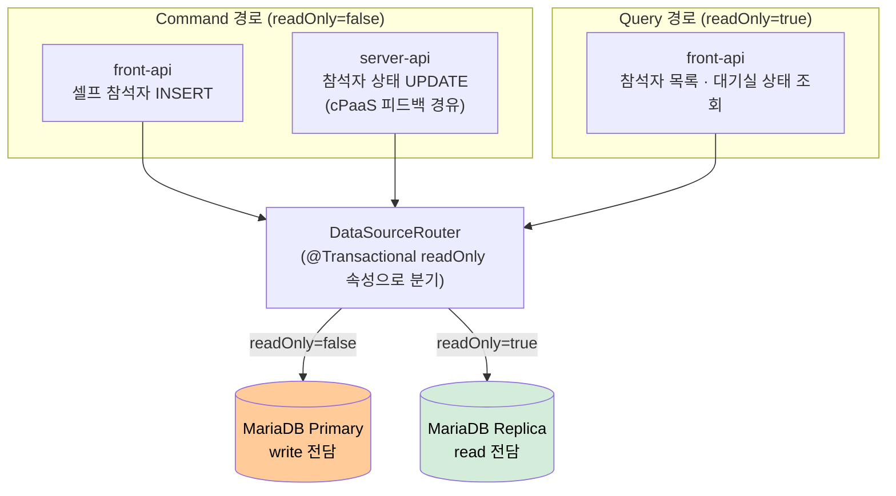

# AS-08. 조회·입장 DB 경로 분리

## 적용 대상

> **전제**: AS-01(입장 처리 도메인 경계 분리)의 파생 전략. AS-01이 설정한 도메인 경계 내에서 Command/Query 경로를 분리한다.

- **아키텍처 드라이버**: AD-03 (DB 커넥션 풀 장애 격리)
- **해결 이슈**:
  - ISSUE-07: 대규모 회의 시작 시점에 사용자 입장 write(front-api 경유), cPaaS 피드백 write(server-api 경유), 참석자 목록·대기실 상태 read가 Primary DB 테이블에 동시 집중된다. 일부 느린 SELECT 쿼리는 이미 Replica로 개별 지정되어 있으나, write lock 경합으로 입장 처리(UC-04) 자체가 지연되는 문제는 해소되지 않고 있다.
- **설계 목표**: DG-03 (특정 기능 커넥션 고갈 시 타 기능 정상 운영), DG-04 (핵심 기능 성공률 99.9%)
- **관련 유스케이스**: UC-04 (회의 입장), UC-05 (회의 퇴장), UC-06 (참석자 초대)
- **관련 품질 요구사항**: QA-03 (DB 커넥션 풀 격리 신뢰성), QA-04 (핵심 기능 가용성)

## 설계 근거

현재 미팅 포털 서버는 MariaDB Primary-Replica 구성을 갖추고 있으며, 응답 지연이 심한 일부 SELECT 쿼리는 개별적으로 Replica로 라우팅되어 있다. 그러나 이 라우팅은 쿼리 단위 수동 지정 방식으로, 트랜잭션 readOnly 속성에 기반한 체계적 분리가 아니다. 적용 기준이 일관되지 않아 누락 위험이 있으며, ISSUE-07의 핵심 원인인 write 경로 간 lock 경합은 여전히 해소되지 않은 상태다.

ISSUE-07의 경합 구조를 상세히 분석하면 두 가지 write 경로가 동시에 동일 테이블을 타격한다.

첫째 **front-api 경유 write (셀프 참석자 한정)**: `User → front-api → participants INSERT` (오픈회의 셀프 참석자 입장 시)

둘째 **cPaaS 피드백 경유 write**: `cPaaS → server-api → participants UPDATE` (입장 성공·퇴장·연결 끊김 등 모든 참석자 상태 변경)

두 write 경로는 사용자 요청과 무관하게 독립적으로 발생하므로, 대규모 회의 시작 시점에는 두 경로의 write가 동시에 최고조에 달한다. 여기에 참석자 목록 조회(read)까지 집중되면, 동일 레코드에 대한 read/write lock 경합이 최대화된다.

이 상황에서 입장 처리(write)가 조회(read)의 lock 대기에 의해 지연되거나, 역으로 조회가 입장 write lock에 블로킹되는 상황이 반복된다. QA-04(핵심 기능 성공률 99.9%)에서 "가장 중요한 회의 입장 처리가 피드백 write 및 조회 트래픽에 의해 지연된다"는 것은 구조적 설계 결함이다.

해결의 핵심은 **write(Command)와 read(Query)가 서로의 DB lock을 경쟁하지 않는 구조**를 만드는 것이다.

## 대안

### 대안 1. 현행 선택적 Replica 라우팅 유지

**개념**: 현재 Primary-Replica 구성이 있으며, 응답 지연이 심한 일부 SELECT 쿼리에 한해 개별적으로 Replica 라우팅을 지정하고 있다. 이 방식을 유지한다.

**이 시스템 적용 방식**: 변경 없음. 일부 느린 SELECT만 Replica로 분산되나, 적용 기준이 개별 쿼리 단위의 수동 지정이며 트랜잭션 단위 readOnly 경계를 보장하지 않는다.

**한계**: 적용 기준이 일관되지 않아 누락 위험이 있으며, 트랜잭션 내부에서 write 후 read가 섞이는 경우 Replica 라우팅이 보장되지 않는다. 가장 근본적으로, ISSUE-07의 핵심인 write lock 경합(셀프 참석자 front-api INSERT · cPaaS 피드백 경유 server-api UPDATE가 동일 Primary에 집중)은 SELECT를 Replica로 옮겨도 해소되지 않는다. 피크 시 입장 write 집중 구간에서는 Primary의 write 간 경합이 여전히 잔존한다.

---

### 대안 2. 완전한 이벤트 소싱 + CQRS

**개념**: 모든 Command를 이벤트 스트림으로 저장하고, Query는 이벤트를 기반으로 생성된 별도의 Read Model(투영)을 조회한다. Command DB와 Query DB가 완전히 분리된다.

**이 시스템 적용 방식**: `participants` 테이블의 변경을 `ParticipantJoined`, `ParticipantLeft` 등의 이벤트로 저장하는 Event Store 도입. 별도 Read Model DB에 참석자 목록 투영 유지.

**한계**: 기존 JPA 엔티티 기반 도메인 모델을 이벤트 소싱 모델로 전면 재설계해야 한다. C-04(점진적 적용) 제약에 정면으로 충돌한다. 이벤트 소싱 도입은 이벤트 순서 보장, 투영 복구, 이벤트 버저닝 등 복잡한 문제를 수반한다. 현재 시스템의 성숙도에서 도입하기에 위험 대비 효과가 높지 않다.

---

### 대안 3. @Transactional 기반 Primary/Replica 전체 체계화

**개념**: 이미 갖추어진 Primary-Replica 인프라를 활용하되, 현행 쿼리 단위 수동 지정을 `@Transactional(readOnly = true)` 기반 체계적 라우팅으로 전환한다. `AbstractRoutingDataSource`로 트랜잭션의 readOnly 여부에 따라 DataSource를 동적으로 선택하여 모든 Query를 Replica로 일관되게 분리한다.

**이 시스템 적용 방식**:
- MariaDB Primary–Replica 복제 설정: 이미 구성됨 (추가 인프라 불필요)
- `RoutingDataSource extends AbstractRoutingDataSource` 구현: `@Transactional(readOnly = true)` 여부로 Replica/Primary 라우팅 결정 — 현행 수동 지정 방식 대체
- 참석자 목록 조회, 대기실 상태 조회, 회의 목록 조회 등 모든 Query 서비스 메서드에 `@Transactional(readOnly = true)` 적용 → 전면 Replica 라우팅
- 입장 write, 피드백 write는 기존 `@Transactional` 유지 → Primary 라우팅
- 기존 JPA 엔티티·레포지토리 코드 변경 없음, DataSource 설정 교체만으로 적용

**장점**: C-04(점진적 적용) 준수. 현행 개별 쿼리 지정 방식보다 누락 위험이 없고, 트랜잭션 단위 readOnly 경계가 보장된다. Primary DB의 write 처리 용량이 조회 부하에서 완전히 분리된다.

## DB 읽기·쓰기 경로 분리 구조

<!-- 이미지 파일명(draw.io → PNG 교체 시): report/images/3.2-as08-cqrs-routing.png -->

<em>[그림 AS08-1] Primary(write) · Replica(read) 분리 라우팅 구조</em>

## 채택

**채택 대안**: 대안 3 — @Transactional 기반 Primary/Replica 전체 체계화

**채택 근거**: 대안 1의 현행 선택적 Replica 라우팅은 적용 기준이 일관되지 않아 ISSUE-07의 write lock 경합을 구조적으로 해소하지 못한다. 대안 2(이벤트 소싱)는 도메인 모델 전면 재설계를 요구하여 C-04 위반이다. 대안 3은 이미 갖추어진 Primary-Replica 인프라를 활용하면서 `AbstractRoutingDataSource`와 `@Transactional(readOnly = true)` 조합으로 현행 수동 라우팅을 체계화한다. 기존 코드 최소 변경으로 구현 가능하며, 대규모 회의 시작 시점에 참석자 목록 조회(read 집중)를 Replica로 전면 분산하면 Primary DB의 write 처리(입장·피드백)가 조회 lock 경합에서 벗어나 DG-03·DG-04를 충족한다.

**적용 방향**:
- `DataSourceRouter extends AbstractRoutingDataSource`: 현재 트랜잭션의 `readOnly` 속성 조회 후 Primary/Replica DataSource 반환
- `LazyConnectionDataSourceProxy`로 래핑하여 실제 커넥션 획득을 트랜잭션 시작까지 지연 (readOnly 판단 이후 커넥션 선택)
- AS-09(기능별 커넥션·스레드 격벽 분리)와 결합: Primary DataSource는 `join-pool`·`service-pool`, Replica DataSource는 `query-pool`로 별도 HikariCP 풀 설정
- `@Transactional(readOnly = true)` 적용 대상: 참석자 목록 조회, 대기실 상태 조회, 회의 목록 조회 등 모든 Query 서비스 메서드
