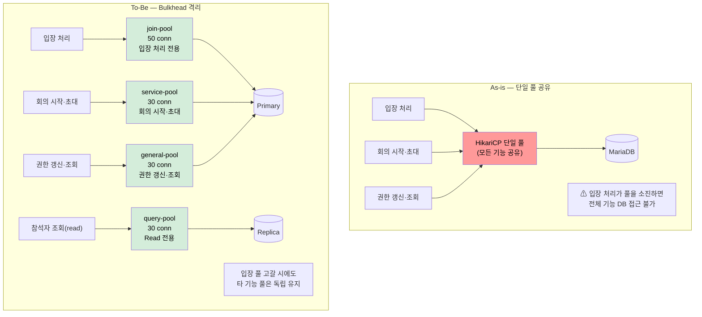

# AS-09. Bulkhead 격리

## 적용 대상

> **전제**: AS-01(MSA / 도메인 서비스 분리)의 파생 전략. AS-01이 설정한 도메인 경계별로 HikariCP 커넥션 풀을 분리 구성한다.

- **아키텍처 드라이버**: AD-03 (DB 커넥션 풀 장애 격리), AD-04 (핵심 기능 성공률 99.9%)
- **해결 이슈**:
  - ISSUE-01: 2만 명 동시 입장 시 입장 처리가 DB 커넥션 풀 전체를 소진할 수 있다. 커넥션 고갈 시 신규 입장 요청에 대한 DB 접근이 불가능해지며, 이 영향이 다른 기능으로 전파된다.
  - ISSUE-04: 단일 HikariCP 풀을 모든 기능이 공유하므로, 입장 처리 부하로 커넥션이 고갈되면 회의 시작·참석자 초대·권한 갱신 등 모든 기능의 DB 접근이 동시에 불가능해진다. 특정 기능의 트래픽 집중이 전체 서비스 장애로 전파되는 연쇄 구조다.
  - ISSUE-06: 외부 서버 장애 시 Feign 동기 호출 스레드가 3,000ms씩 점유된다. 이 스레드들이 서블릿 스레드 풀을 잠식하고, 동시에 DB 커넥션도 점유한 채 timeout을 기다리므로 커넥션·스레드 이중 고갈이 발생한다.
- **설계 목표**: DG-03 (특정 기능 커넥션 고갈 시 타 기능 정상 운영), DG-04 (핵심 기능 성공률 99.9%)
- **관련 유스케이스**: UC-03 (회의 시작), UC-04 (회의 입장), UC-06 (참석자 초대)
- **관련 품질 요구사항**: QA-03 (DB 커넥션 풀 격리 신뢰성), QA-04 (핵심 기능 가용성), QA-05 (외부 서버 장애 격리)

## 설계 근거

현행 구조에서 front-api·server-api·admin-api는 동일한 DB를 공유하며, 각 인스턴스 내 기능 간에도 단일 HikariCP 풀이 공유된다. 이 구조에서 QA-03 시나리오를 시뮬레이션하면 다음과 같다.

2만 명 동시 입장이 발생하면 입장 처리(UC-04)가 DB 조회("입장 가능 여부 확인")를 위해 커넥션을 획득한다. HikariCP 풀 크기(기본 10)를 훨씬 초과하는 요청이 동시에 커넥션을 요구하면, `connectionTimeout` 만료(기본 30초)까지 대기하다 `SQLTransientConnectionException`이 발생한다. 이 예외는 입장 처리에서 그치지 않고, 동일 풀을 사용하는 회의 시작(UC-03), 참석자 초대(UC-06)에서도 동일하게 발생한다.

QA-03의 측정 기준은 "입장 전용 커넥션 풀 고갈 시 회의 시작 API 성공률 100%"다. 이를 충족하려면 입장 처리의 커넥션 고갈이 회의 시작의 커넥션 가용성에 물리적으로 영향을 주지 않아야 한다. 즉, **기능별로 독립된 커넥션 풀**이 필요하다.

또한 ISSUE-06의 외부 서버 장애 시나리오에서, AS-02(비동기 처리)가 적용되더라도 비동기 처리 스레드 풀과 그 스레드가 사용하는 커넥션 풀도 격리가 필요하다. 외부 서버 호출 스레드가 서블릿 처리 스레드의 커넥션을 공유하면 외부 서버 장애의 영향이 서블릿 처리 경로로 전파된다.

## 대안

### 대안 1. 현행 단일 HikariCP 풀

**개념**: 현행대로 단일 HikariCP DataSource를 모든 기능이 공유한다.

**이 시스템 적용 방식**: HikariCP `maximumPoolSize`를 늘려 고갈을 지연시키는 방식으로 간접 대응.

**한계**: 풀 크기를 늘려도 2만 명 동시 입장이라는 규모에서는 커넥션 고갈 시점이 달라질 뿐 구조적 격리는 없다. 입장 처리 부하가 충분히 크면 늘어난 풀도 결국 소진된다. QA-03(입장 풀 고갈 시 회의 시작 100% 성공)은 단일 풀 구조에서는 원칙적으로 충족 불가능하다.

---

### 대안 2. 기능별 HikariCP 풀 분리만 (DB 커넥션 격리)

**개념**: 기능별로 별도 `DataSource` Bean을 정의하여 HikariCP 풀을 분리한다. 입장 전용 풀, 서비스 전용 풀, 일반 풀로 구성.

**이 시스템 적용 방식**:
- `joinDataSource`: 입장 처리 전용 (`maximumPoolSize=50`, `connectionTimeout=3,000ms`)
- `serviceDataSource`: 회의 시작·초대 등 (`maximumPoolSize=30`, `connectionTimeout=5,000ms`)
- `generalDataSource`: 권한 갱신·조회 등 (`maximumPoolSize=30`, `connectionTimeout=5,000ms`)
- 각 Repository/Service에서 `@Qualifier`로 해당 DataSource를 명시적으로 지정

**한계**: DB 커넥션은 격리되지만 **서블릿 스레드 풀은 여전히 공유**된다. ISSUE-06의 외부 서버 장애 시나리오에서 Feign 호출 스레드가 서블릿 스레드를 점유하면, 커넥션 풀을 분리했더라도 스레드 고갈로 인한 전체 서비스 장애 전파는 막을 수 없다. AS-02(비동기 처리)가 적용되면 이 한계는 일부 해소되나, 비동기 스레드 풀도 별도 격리가 필요하다.

---

### 대안 3. 이중 Bulkhead (DB 커넥션 풀 + 스레드 풀 동시 격리)

**개념**: HikariCP 커넥션 풀을 기능별로 분리(대안 2)하는 동시에, 외부 서버 호출을 전담하는 `AsyncTaskExecutor` 스레드 풀을 서블릿 스레드 풀과 완전히 분리한다. 두 차원의 격리를 동시에 적용한다.

**이 시스템 적용 방식**:

**[DB 커넥션 풀 격리]**
- `joinDataSource`: `maximumPoolSize=50`, `connectionTimeout=3,000ms` (입장 처리)
- `serviceDataSource`: `maximumPoolSize=30`, `connectionTimeout=5,000ms` (회의 시작·초대)
- `generalDataSource`: `maximumPoolSize=30`, `connectionTimeout=5,000ms` (권한 갱신·조회)
- AS-08 CQRS와 결합: `queryDataSource`(Replica 연결)를 `generalDataSource`에서 분리하여 조회 전용 풀 추가

**[외부 서버 호출 스레드 풀 격리]**
- `externalCallExecutor` (AS-02에서 정의): 외부 서버(WC서버, VC서버, AC서버) Feign 호출 전담 (`corePoolSize=50`, `maxPoolSize=200`, `queueCapacity=1,000`)
- `preWarmExecutor` (AS-07에서 정의): Pre-warming 전담 (저우선순위, 분리된 스레드 풀)
- 서블릿 스레드 풀: 외부 서버 호출을 직접 실행하지 않으므로 외부 서버 장애·지연 영향으로부터 격리

**격리 효과**:
- 입장 처리 DB 커넥션이 고갈되어도 → `serviceDataSource` 커넥션은 독립적으로 유지 → QA-03 충족
- WC서버 장애로 `externalCallExecutor` 스레드가 고갈되어도 → 서블릿 스레드는 영향 없음 → QA-05 충족

**장점**: 두 차원의 격리가 결합되어 ISSUE-01·04·06이 동시에 해소된다. AS-02 비동기 처리 기반 위에서 스레드 풀 격리가 의미를 가진다.

## 격리 구조 비교

<!-- 이미지 파일명(draw.io → PNG 교체 시): report/images/as09-bulkhead.png -->

<em>[그림 AS09-1] HikariCP 커넥션 풀 — 단일 풀(As-is)과 도메인별 Bulkhead(To-Be) 비교</em>

## 채택

**채택 대안**: 대안 3 — 이중 Bulkhead (DB 커넥션 풀 + 스레드 풀 동시 격리)

**채택 근거**: 대안 2는 스레드 풀 격리가 없어 ISSUE-06(외부 서버 장애 시 스레드 고갈 전파) 해소 불가. 대안 3은 AS-02의 `@Async` 기반 외부 서버 호출 분리가 전제된 상태에서 커넥션 풀과 스레드 풀을 동시에 격리하여 QA-03·QA-05를 모두 충족한다.

**적용 방향**:
- `DataSourceConfig`: `@Bean("joinDataSource")`, `@Bean("serviceDataSource")`, `@Bean("generalDataSource")` 각 HikariCP 설정 분리
- AS-01 도메인 모듈 경계를 기반으로 각 Repository가 `@Qualifier`로 해당 DataSource 주입
- `@Bean("externalCallExecutor")` `ThreadPoolTaskExecutor`: 외부 서버 호출 전담 (AS-02 정의 활용)
- `@Bean("preWarmExecutor")` `ThreadPoolTaskExecutor`: Pre-warming 전담 (AS-07 정의 활용)
- HikariCP 메트릭(`HikariPoolMXBean`)을 Actuator로 노출하여 풀별 사용률 모니터링

| 풀 이름 | 담당 기능 | maximumPoolSize | connectionTimeout |
|--------|---------|----------------|-----------------|
| join-pool | 입장 처리 전용 | 50 | 3,000ms |
| service-pool | 회의 시작·초대 | 30 | 5,000ms |
| general-pool | 권한 갱신·일반 조회 | 30 | 5,000ms |
| query-pool | Read 전용 (Replica, AS-08) | 30 | 3,000ms |
