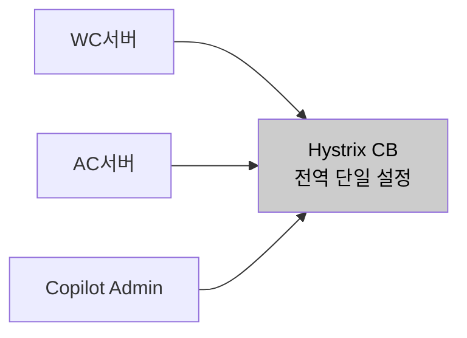
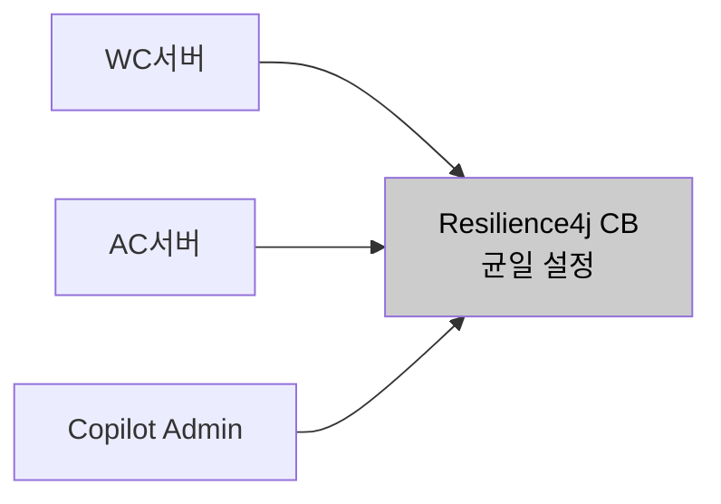
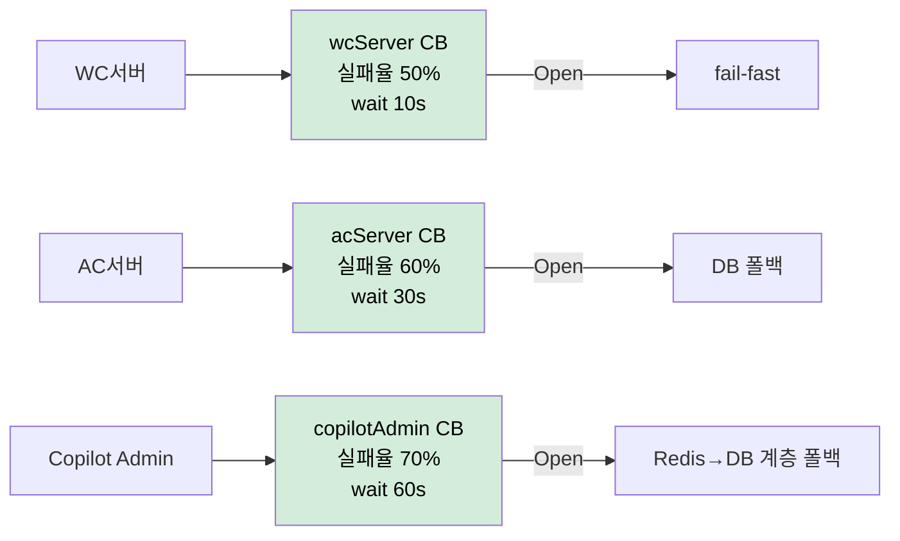
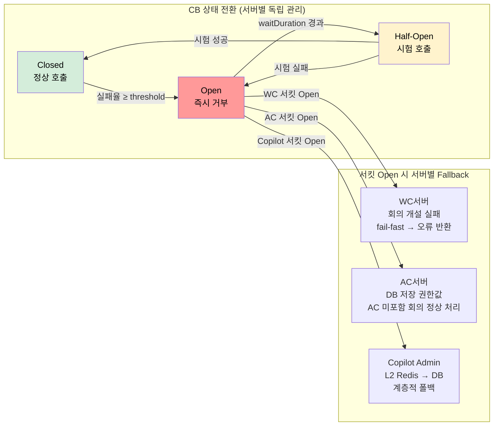

# AS-09. 외부 서버 장애 차단 및 계층 복구

## 적용 대상

- **아키텍처 드라이버**: AD-04 (핵심 기능 성공률 99.9%)
- **해결 이슈**:
  - ISSUE-02: `GET /members/{email}` API에서 외부 서버(AC서버, Copilot Admin 서버)가 장애 상태에 빠지면, `CompletableFuture.allOf()` 대기 중 해당 Future가 timeout(3,000ms)까지 블로킹된다. 서킷이 없으면 장애 외부 서버에 대한 호출이 계속 누적된다.
  - ISSUE-06: WC서버·VC서버·AC서버 장애 시 Feign read timeout(3,000ms) 만료까지 스레드가 점유된다. VC + AC 순차 호출 시 최대 6,000ms. AS-08 Bulkhead로 스레드 풀이 격리되더라도, 서킷 브레이커 없이는 `externalCallExecutor` 스레드 풀 자체가 장애 외부 서버 호출로 소진된다.
  - ISSUE-08: 10개 이상의 외부 연계가 단일 코드베이스에 혼재하면 외부 서버별로 차별화된 CB 정책 적용이 사실상 불가능하다. as-is의 `integration.*` 모듈 구조가 연계별로 이미 분리되어 있어, 각 모듈 내에서 독립적인 CB 정책 적용이 가능하다.
- **설계 목표**: DG-04 (핵심 기능 성공률 99.9%)
- **관련 유스케이스**: UC-01 (사용자 권한 갱신), UC-03 (회의 시작), UC-04 (회의 입장)
- **관련 품질 요구사항**: QA-04 (핵심 기능 가용성), QA-05 (외부 서버 장애 격리)

## 설계 근거

피크 구간에 외부 서버 장애가 겹치면, 서킷 브레이커가 개방되기 전까지 Feign 호출은 read timeout(3,000ms) 만료까지 블로킹된다. 8만 명 동시 입장 구간에 WC서버 장애가 겹치면, CB 개방 이전 구간에만 `externalCallExecutor` 스레드 풀에 3,000ms씩 블로킹된 스레드가 빠르게 누적된다. AS-08 Bulkhead로 스레드 풀이 격리되더라도, 서킷 브레이커 없이는 `externalCallExecutor` 스레드 풀 자체가 장애 외부 서버 호출로 소진된다. 서킷 브레이커는 외부 서버의 연속 실패율이 임계값을 넘으면 서킷을 Open 상태로 전환하고, 이후 호출 시도를 즉시 거부(fail-fast)하여 스레드 블로킹 없이 fallback을 수행함으로써 장애 전파를 차단한다.

현행 시스템은 `application.yml`에 `hystrix.command.default.*` 전역 기본값만 설정되어 있어, 모든 외부 서버에 동일한 CB 임계값이 적용된다. 그러나 외부 서버들은 특성이 서로 다르다. Meeting Manager는 회의 입장(UC-04) 처리에 필수적이어서 빠른 감지·차단이 필요하고, Copilot Admin 서버(LLM·용어사전 권한)는 장애 시 DB 저장값으로 폴백 가능하여 관대한 임계값을 허용한다. AC서버 장애 시에는 AC 미포함 회의의 입장·시작은 계속 가능해야 한다. 전역 단일 설정으로는 이 차이를 반영한 정밀 제어가 불가능하며, 피크 구간에 한 서버의 장애가 다른 서버의 처리 경로까지 동일하게 차단하는 과도한 제한이 발생할 수 있다.

## 대안

### 대안 1. 현행 Feign + Hystrix CB 유지

**개념**: 현행 Feign + Hystrix 서킷 브레이커를 그대로 유지한다. Hystrix는 Feign과 결합하여 연계 서버별로 타임아웃·CB 임계값을 개별 설정할 수 있으며, 현행 시스템에도 서버별 Hystrix Feign 설정이 적용되어 있다.

**이 시스템 적용 방식**: 변경 없음.

**한계**: 첫째, `application.yml`의 전역 단일 CB 설정으로는 서버 역할·특성에 따른 임계값·fallback 전략의 차등 적용이 불가능하다. 피크 구간에 WC서버(필수)와 Copilot Admin 서버(폴백 가능)에 동일 정책이 적용되어 과도한 차단 또는 과소한 차단이 발생할 수 있다. 둘째, Hystrix는 Netflix가 2018년 유지보수를 중단하고 Spring Cloud에서도 공식 지원이 종료되어, 이후 보안 패치·버그픽스를 기대할 수 없다. 셋째, Hystrix의 fallback 메서드 구조로는 AS-03(L2 Redis → DB) · AS-02(비동기 재시도 큐)와 연동하는 계층적 fallback 체인을 구현하기 어렵다.

*대안1 — 현행 Feign + Hystrix CB 유지*

---

### 대안 2. Resilience4j Circuit Breaker 일괄 적용 (모든 외부 서버 동일 설정)

**개념**: Resilience4j `@CircuitBreaker` 어노테이션을 모든 외부 서버 Feign 호출에 동일한 설정으로 일괄 적용한다.

**이 시스템 적용 방식**: `application.yml`에 글로벌 CB 설정 (`slidingWindowSize=10`, `failureRateThreshold=50%`, `waitDurationInOpenState=30s`) 적용.

**한계**: 외부 서버 특성을 무시한 균일 정책이므로, 응답이 느리지만 정상인 서버(예: AC서버, 처리 시간 2,000ms)를 과도하게 차단하거나, 빠르게 장애가 확대되는 서버(WC서버 대규모 장애)를 늦게 감지할 수 있다. 또한 fallback 전략이 모든 서버에 동일하게 적용되어 서버 특성에 맞는 세밀한 복구 처리가 불가능하다.

*대안2 — Resilience4j CB 일괄 적용 (균일 설정)*

---

### 대안 3. 외부 서버별 차등 CB + 계층적 Fallback

**개념**: 외부 서버 특성에 따라 timeout·실패율 임계값·halfOpen 요청 수를 차등 적용한다. Fallback 전략도 각 서버의 특성과 포털 서비스에서의 역할에 맞게 차별화한다. 각 연계 모듈(`integration.*`) 내에서 CB 정책을 독립 관리한다.

**이 시스템 적용 방식**:

**[외부 서버별 CB 설정]**

| 외부 서버 | slidingWindowSize | failureRateThreshold | waitDuration | 근거 |
|---------|-------------------|---------------------|-------------|------|
| WC서버 | 20 | 50% | 10s | 회의 개설·종료 필수. 빠른 감지·복구 필요 |
| VC서버 | 10 | 60% | 30s | AC 포함 회의 개설에만 영향. 일시 장애 허용 범위 넓음 |
| AC서버 | 10 | 60% | 30s | AC 권한 갱신. DB 폴백 가능하므로 관대한 임계값 |
| Copilot Admin | 5 | 70% | 60s | 권한 변경 빈도 낮음. DB 폴백으로 충분히 운영 가능 |

**[계층적 Fallback 전략]**

- **Copilot Admin 서버 장애** → AS-03 L2 Redis 캐시(마지막 적재값)로 폴백. Redis도 miss 시 DB 저장값 반환. 권한 갱신 실패이므로 기능에 영향 없음.
- **WC서버 장애** → 회의 개설(UC-03) 실패. fail-fast 후 사용자에게 오류 반환. 진행 중인 회의의 입장 흐름(front-api → Meeting Manager → cPaaS)은 직접 영향 없음.
- **AC서버 장애** → AC 권한 DB 저장값으로 폴백. WC 전용·VC 포함 회의는 정상 처리 계속. AC 포함 회의 개설만 부분 차단.
- **VC서버 장애** → VC 포함 회의 개설 실패. WC 전용 회의 입장·시작은 정상. 에러 응답에 명확한 원인 메시지 포함.

**장점**: 외부 서버 특성에 맞는 정책으로 과도 차단·과소 차단 없이 정밀하게 동작한다. 서버별 fallback 전략이 AS-03 캐시, AS-02 비동기 큐와 연동하여 서비스 연속성을 최대화한다. 각 연계 모듈 내에 CB 설정이 캡슐화되므로 정책 변경 시 해당 모듈만 수정하면 된다.

*대안3 — 외부 서버별 차등 CB + 계층적 Fallback (채택)*

## CB 상태 전환 및 Fallback 구조

<!-- 이미지 파일명(draw.io → PNG 교체 시): report/images/3.2-as09-circuit-breaker.png -->

<em>[그림 AS10-1] CB 상태 전환(Closed · Open · Half-Open)과 외부 서버별 계층적 Fallback 경로</em>

## 채택

**채택 대안**: 대안 3 — 외부 서버별 차등 CB + 계층적 Fallback

**채택 근거**: 대안 1은 전역 일괄 설정으로 서버별 정밀 제어가 불가능하고 Hystrix 유지보수 중단으로 장기 관리 부담이 있어 QA-04·QA-05 달성 불충분. 대안 2는 Resilience4j로 전환하나 균일 정책이라 서버 특성 무시. 대안 3은 각 외부 서버의 역할과 장애 영향 범위를 반영한 차등 정책과 계층적 Fallback으로 피크 구간 스레드 고갈 전파를 차단하고 QA-05(장애 격리)를 정밀하게 충족한다. AS-02 비동기 처리, AS-03 캐시, integration.* 모듈 구조와 연동하여 fallback 효과가 극대화된다.

**적용 방향**:
- `spring-boot-starter-actuator` + `resilience4j-spring-boot3` 의존성 추가
- `application.yml`에 외부 서버별 `resilience4j.circuitbreaker.instances.{name}` 설정 분리
- 각 연계 모듈(`integration.wc`, `integration.ac`, `integration.copilot`) 내에 `@CircuitBreaker(name = "wcServer", fallbackMethod = "wcFallback")` 어노테이션 적용
- fallback 메서드: AS-03 캐시 조회 → DB 조회 → 서비스 부분 제공 순서의 계층적 폴백 구현
- Actuator endpoint `/actuator/circuitbreakers`로 CB 상태 실시간 모니터링
