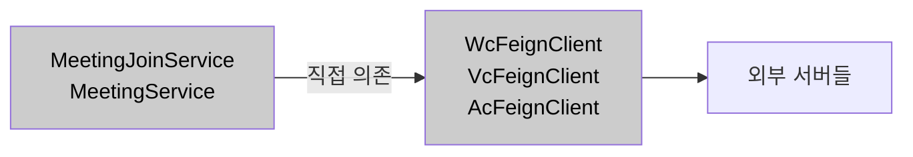
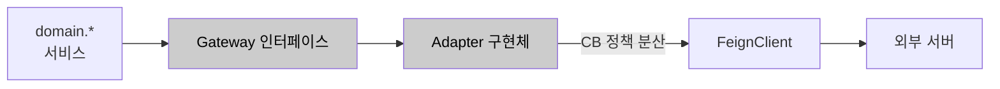
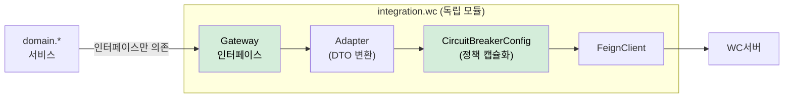

# AS-10. 외부 연계 의존성 캡슐화

## 적용 대상

- **아키텍처 드라이버**: AD-09 (Java Spring Boot + HikariCP 기술 스택 준수), AD-10 (기존 API 하위 호환성 유지)
- **해결 이슈**:
  - ISSUE-08: 10개 이상의 외부 연계 로직(WC서버, VC서버, AC서버, Copilot Admin 서버, 연계시스템A·B·C 등)이 단일 코드베이스의 서비스 레이어에 혼재한다. 특정 연계의 타임아웃·폴백·재시도 정책을 변경하려면 yml 수정 후 어플리케이션 재구동이 필요하며, 한 연계의 변경이 인접 로직에 의도치 않게 영향을 줄 수 있다. 피크 대응을 위한 긴급 연계 정책 조정 시 재구동이 강제되어 런타임 즉각 대응이 불가능한 것은 DG-07(외부 연계 의존성 격리 및 독립 제어) 달성을 구조적으로 불가능하게 한다.
- **설계 목표**: DG-07 (외부 연계 의존성 격리 및 독립 제어)
- **관련 유스케이스**: UC-01 (사용자 권한 갱신), UC-03 (회의 시작), UC-04 (회의 입장)
- **관련 품질 요구사항**: QA-04 (핵심 기능 가용성), QA-05 (외부 서버 장애 격리)

## 설계 근거

현행 서비스 레이어의 외부 연계 구조를 살펴보면, `MeetingJoinService`가 `WcServerFeignClient`를 직접 의존하고, `MeetingService`가 `VcServerFeignClient`와 `AcServerFeignClient`를 직접 의존하며, `AuthService`가 `CopilotAdminFeignClient`를 직접 의존하는 패턴이 반복된다. 이 구조의 문제는 두 가지다.

첫째, **포털 도메인 모델이 외부 서버의 API 스키마에 직접 노출**된다. WC서버가 API 스키마를 변경하면 `WcServerFeignClient`의 DTO가 변경되고, 이 DTO를 사용하는 서비스 레이어와 심한 경우 컨트롤러까지 변경 파급이 일어난다. AD-10(기존 API 하위 호환성 유지)에서 요구하는 "클라이언트 변경 없이 서버 측만 개선"이 외부 서버 스키마 변경에 의해 위협받을 수 있다.

둘째, **연계별 정책이 단일 코드베이스에 산재하여 독립적으로 변경·배포할 수 없다**. 연계별 타임아웃·재시도 정책은 Hystrix Feign 설정으로 개별 적용되어 있으나, 모두 같은 코드베이스에 묶여 있다. WC서버 타임아웃을 1,500ms로 줄이거나 AC서버 재시도 로직을 조정하려면, 해당 연계 설정 하나의 변경도 yml 수정 후 어플리케이션 재구동을 거쳐야 한다. 피크 대응 시 재구동 없이 런타임에서 긴급하게 특정 연계만 정책을 조정하는 것이 구조적으로 불가능하다.

ACL은 이 두 문제를 동시에 해결한다. 각 외부 연계를 독립 모듈로 캡슐화하여, 포털 도메인 모델과 외부 서버 모델 사이에 변환 레이어를 명시하고, 연계별 정책(CB, timeout, fallback)을 해당 모듈 내에서 독립 관리한다.

## 대안

### 대안 1. 현행 서비스 레이어 직접 연계 (연계 로직 혼재)

**개념**: 현행대로 서비스 레이어에서 Feign Client를 직접 의존하고 호출한다. 연계 로직이 서비스 레이어에 혼재한다.

**이 시스템 적용 방식**: 변경 없음.

**한계**: 포털 도메인 모델이 외부 서버 API 스키마에 직접 종속된다. 외부 서버 스키마 변경 시 서비스 레이어까지 변경 파급이 발생한다. 연계별 독립 정책 관리 불가, 어플리케이션 재구동 강제. ISSUE-08이 구조적으로 해소되지 않는다.



*대안1 — 현행 서비스 레이어 직접 연계*

---

### 대안 2. 외부 서버별 Adapter 인터페이스 추상화 (변환 레이어만)

**개념**: 각 외부 서버에 대해 포털 도메인 인터페이스를 정의하고, Feign Client 기반 구현체를 별도로 작성하여 포털 도메인 모델과 외부 모델 간 변환을 담당한다.

**이 시스템 적용 방식**: `WcServerGateway` 인터페이스를 정의하고, `WcServerFeignGateway implements WcServerGateway`에서 Feign 호출과 DTO 변환을 처리. 서비스 레이어는 `WcServerGateway` 인터페이스만 의존.

**한계**: 변환 레이어(Adapter)는 생기지만 **연계별 독립 정책 관리 구조는 없다**. `WcServerFeignGateway`가 서비스 레이어와 같은 코드베이스에 있으면 WC서버 CB 정책을 변경해도 어플리케이션 재구동이 필요하다. ISSUE-08의 핵심 요구사항인 "재구동 없이 런타임에서 연계별 정책 변경"은 충족되지 않는다.



*대안2 — 외부 서버별 Adapter 인터페이스 추상화*

---

### 대안 3. 연계별 독립 모듈 ACL (정책 캡슐화 + 도메인 격리)

**개념**: AS-01에서 설정한 도메인 모듈 구조를 기반으로, 각 외부 연계를 독립 패키지 모듈(`integration.*`)로 분리한다. 각 연계 모듈 내에 Feign Client, DTO 변환, AS-09 CB 정책, 타임아웃, 폴백 전략을 캡슐화한다. 포털 도메인 레이어(`domain.*`)는 연계 모듈이 노출하는 인터페이스만 알고 있으며, 외부 서버의 존재를 직접 알지 못한다.

**이 시스템 적용 방식**:

**[패키지 모듈 구조]**
```
integration/
  wc/
    WcServerGateway.java          ← 포털 도메인이 의존하는 인터페이스
    WcServerFeignClient.java      ← Feign Client (외부 WC서버 스키마 매핑)
    WcServerAdapter.java          ← DTO 변환 (외부 모델 ↔ 포털 도메인 모델)
    WcCircuitBreakerConfig.java   ← CB 정책 (slidingWindowSize, threshold, timeout 등)
    WcFallbackHandler.java        ← Fallback 전략 (AS-09 Circuit Breaker 연동)
  ac/
    AcServerGateway.java
    AcServerFeignClient.java
    AcCircuitBreakerConfig.java   ← CB 정책 독립 설정
    AcFallbackHandler.java        ← DB 저장값 폴백 등
  copilot/
    CopilotAdminGateway.java
    CopilotFeignClient.java
    CopilotCircuitBreakerConfig.java
    CopilotFallbackHandler.java   ← Redis → DB 계층적 폴백
  ...

domain/
  entry/
    MeetingJoinService.java       ← WcServerGateway 인터페이스만 의존
  meeting/
    MeetingService.java           ← AcServerGateway, VcServerGateway 인터페이스만 의존
  auth/
    AuthService.java              ← CopilotAdminGateway 인터페이스만 의존
```

**[AD-10 기여]**: 외부 서버(WC서버 등)가 API 스키마를 변경하면 `integration.wc` 모듈 내부만 수정된다. 포털 도메인 모델과 클라이언트에 노출되는 REST API 스키마는 변하지 않는다. 이를 통해 AD-10(기존 API 하위 호환성 유지) 제약을 구조적으로 보장한다.

**[독립 정책 변경]**: WC서버 CB 임계값을 변경해야 할 때 `integration.wc` 모듈의 `application.yml` 설정 또는 `WcCircuitBreakerConfig` 클래스만 수정하면 된다. 다른 연계 모듈과 도메인 레이어에는 영향이 없다. 향후 특정 연계를 독립 서비스(Sidecar 등)로 분리할 때도 해당 `integration.*` 모듈 단위로 추출하면 된다.

**장점**: ISSUE-08의 핵심 요구(재배포 없이 연계별 정책 변경)와 AD-10(외부 서버 변경으로부터 클라이언트 API 보호)을 동시에 충족한다. AS-09 CB 정책이 연계 모듈 내에 캡슐화되므로 정책 가시성과 관리 용이성이 향상된다. AS-01 도메인 모듈 구조와 자연스럽게 결합된다.



*대안3 — 연계별 독립 모듈 ACL (채택)*

## 채택

**채택 대안**: 대안 3 — 연계별 독립 모듈 ACL

**채택 근거**: 대안 2(Adapter 추상화)는 변환 레이어만 제공하며 연계별 독립 정책 관리 구조가 없다. 대안 3은 AS-01이 설정한 패키지 모듈 구조를 활용하여 연계별 완전한 캡슐화를 달성한다. 포털 도메인 모델이 외부 서버 스키마로부터 격리되므로 AD-10의 "클라이언트 API 불변" 보장이 강화된다. CB 정책(AS-09)·폴백 전략(AS-03 캐시 활용)이 연계 모듈 내에 캡슐화되어 피크 대응 시 해당 연계만 긴급 정책 조정 가능.

**적용 방향**:
- AS-01에서 정의한 `integration.*` 패키지를 ACL 모듈로 확정
- 도메인 레이어(`domain.*`)에서 `integration.*`으로의 직접 참조를 금지하고 인터페이스만 허용 (ArchUnit 규칙으로 빌드 타임 강제)
- `integration.wc.WcCircuitBreakerConfig`: `@Bean ResilienceCircuitBreaker wcCircuitBreaker()` 독립 Bean 정의
- 외부 서버 스키마 DTO는 `integration.*` 패키지 내부에만 존재하며, `domain.*`에 노출되지 않음
- 신규 외부 연계 추가 시 `integration.{newServer}` 패키지 모듈 신설만으로 완결
