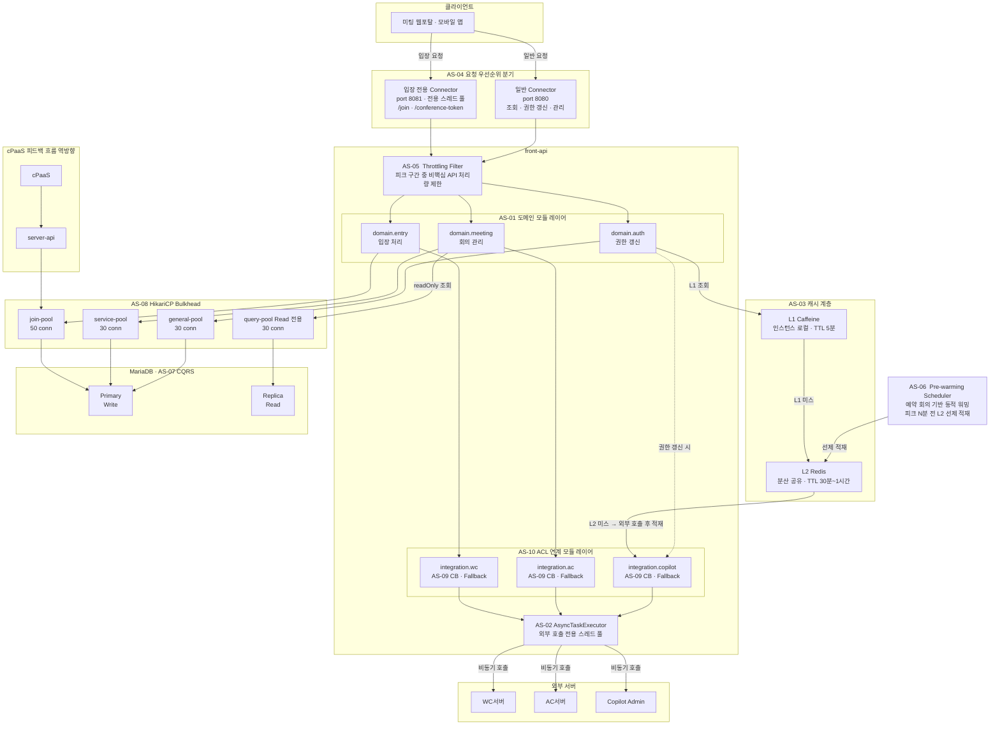

# 4.1.1. 아키텍처 개념도

본 개념도는 3.2절의 설계 전략(AS-01 ~ AS-10)이 적용된 **To-Be 아키텍처**의 전체 구조를 나타낸다.
요청 집중 구간 대응을 중심으로 각 전략이 어느 경계에서 동작하는지를 시각화한다.

---

## 개념도

---

## 주요 설계 결정 요약

| 경계 | 적용 전략 | 해결 이슈 |
|------|---------|---------|
| 요청 진입 분기 | AS-04 우선순위 큐 · AS-05 Throttling | ISSUE-01, ISSUE-03, ISSUE-09 |
| 도메인 모듈 경계 | AS-01 도메인 분리 | ISSUE-04, ISSUE-07, ISSUE-08 |
| 캐시 계층 | AS-03 L1+L2 캐시 · AS-06 Pre-warming | ISSUE-02, ISSUE-05, ISSUE-09 |
| 외부 연계 경계 | AS-10 ACL · AS-09 Circuit Breaker | ISSUE-06, ISSUE-08 |
| 외부 호출 스레드 | AS-02 Async | ISSUE-01, ISSUE-05, ISSUE-06 |
| 커넥션 풀 격리 | AS-08 HikariCP Bulkhead | ISSUE-01, ISSUE-04, ISSUE-06 |
| DB 읽기/쓰기 분리 | AS-07 경량 CQRS (Primary/Replica) | ISSUE-07 |

---

## 흐름별 설명

### 주 요청 흐름 (회의 입장)

1. 클라이언트가 `/join` 요청을 전송한다.
2. **AS-04**: 입장 전용 Connector(port 8081)가 전용 스레드 풀에서 요청을 수신한다.
3. **AS-05**: 피크 구간 중 일반 요청은 Throttling이 처리량을 제한한다. 입장 요청은 면제.
4. **AS-01**: `domain.entry`가 입장 처리를 담당한다.
5. **AS-10 + AS-09**: `integration.meetingManager`(ACL 모듈)를 통해 Meeting Manager를 호출한다. CB가 장애를 감지하면 fallback 처리.
6. **AS-02**: Meeting Manager 참석자 입장 정보 조회는 `AsyncTaskExecutor`에서 비동기 실행. 컨트롤러가 `CompletableFuture`를 반환하여 서블릿 스레드를 즉시 반환하고, MM 응답 후 wyzProParam을 조립하여 응답한다.
7. **AS-08**: `domain.entry` → `join-pool` → MariaDB Primary. 다른 기능의 풀과 격리.

### 권한 갱신 흐름

1. 로그인 후 `GET /members/{email}` 호출.
2. **AS-03**: `domain.auth`가 L1 Caffeine 조회 → 미스 시 L2 Redis 조회.
3. L2도 미스인 경우에만 `integration.copilot`(ACL)을 통해 Copilot Admin 서버 호출 후 L1·L2 동시 적재.
4. **AS-06**: Pre-warming Scheduler가 피크 N분 전에 대상 참석자 권한을 L2에 선제 적재하여 cold start 방지.

### cPaaS 피드백 흐름 (역방향)

- `cPaaS → Meeting Manager → server-api (GET /entrance-info) → join-pool → MariaDB Primary`
- 참석자 상태 변경(퇴장, 연결 끊김)이 사용자 요청과 독립적으로 발생한다.
- **AS-07**: 참석자 목록 조회(read)는 `query-pool → Replica`로 라우팅하여 피드백 write와 lock 경합을 분리한다.
