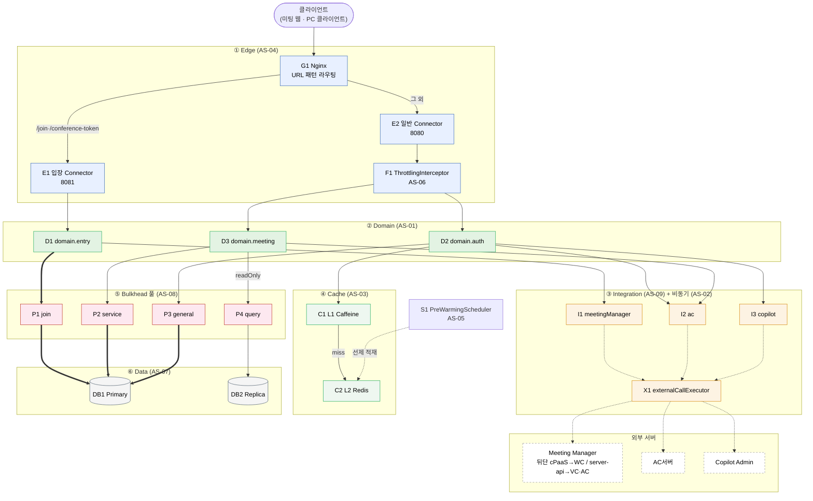

# 4.2.1.1. Overall: 시스템 C&C View

front-api의 런타임 컴포넌트는 6개 계층으로 결합하며, 연결자는 네 종류(REST 동기 호출, DB 프로토콜, 캐시 조회, @Async 비동기 위임)다. 본 View는 *회의 입장 백본*(클라이언트 → 입장 Connector → domain.entry → join-pool → Primary)을 주축(굵은 화살표)으로 두고, 권한 캐시 경로와 비동기·선제 적재 경로를 그 위에 얹는다.

> **표기 규약**: 굵은 화살표는 회의 입장 백본(핵심 DB 경로), 점선은 @Async 비동기 위임, 실선은 REST 동기·캐시 조회다. 외부 서버 세 개만 front-api가 직접 연계하며, WC·VC 서버는 Meeting Manager 뒤단이라 직접 결합이 아니다.

## 표. 컴포넌트별 역할

| ID | 컴포넌트 | 역할 | 관련 AS |
|---|---|---|---|
| G1 | Nginx | URL 패턴으로 입장 요청(8081)과 그 외(8080)를 물리 분리 라우팅 | AS-04 |
| E1 | 입장 Connector | `/join`·`/conference-token` 전용 Tomcat Connector. 단순 조회와 스레드 경합 없이 입장 스레드 예약 | AS-04 |
| E2 | 일반 Connector | 조회·권한 갱신·관리 요청 수용. ThrottlingInterceptor가 앞단에 위치 | AS-04 |
| F1 | ThrottlingInterceptor | 피크 구간 중 비핵심 API 처리량 제한(Bucket4j) | AS-06 |
| D1 | domain.entry | 입장 처리 도메인. join-pool 귀속, Meeting Manager 연계 | AS-01 |
| D2 | domain.auth | 권한 갱신 도메인. L1·L2 캐시와 AC·Copilot 연계 | AS-01 |
| D3 | domain.meeting | 회의 관리 도메인. service/query-pool 귀속, CQRS 라우팅 | AS-01 |
| I1~I3 | integration.* | Meeting Manager·AC·Copilot 연계(ACL). 서버별 차등 CB | AS-09 |
| X1 | externalCallExecutor | 외부 호출 전용 비동기 스레드 풀. 서블릿 스레드 즉시 반환 | AS-02 |
| C1·C2 | L1 Caffeine / L2 Redis | 인스턴스 로컬·분산 공유 계층 캐시로 외부 권한 호출 완충 | AS-03 |
| P1~P4 | join/service/general/query 풀 | 기능별 HikariCP Bulkhead. 한 풀 고갈이 타 풀에 전파되지 않음 | AS-08 |
| DB1·DB2 | Primary / Replica | Write 전담·Read 전담. readOnly 트랜잭션으로 라우팅 | AS-07 |
| S1 | PreWarmingScheduler | 피크 N분 전 예약 회의 기반 L2 선제 적재 | AS-05 |

## 데이터 흐름 세 줄기

**(가) 입장 백본** (핵심 동기 경로): 클라이언트 → G1 → E1 → D1 → P1 → DB1로 입장 가능 여부 확인과 conference-token을 처리하고, 이어 D1 → I1 → (@Async X1) → Meeting Manager로 참석자 입장 정보를 받아 조립한다. 이 경로가 QA-02(8만 동시 입장) 임계의 주 대상이다.

**(나) 권한 캐시** (조회 완충 경로): D2 → C1 → C2 순으로 캐시를 조회하고, 양쪽 miss 시에만 I2·I3(@Async X1)로 AC·Copilot 권한을 병렬 조회해 두 계층에 적재한다. QA-01(권한 갱신 1초) 임계를 캐시 hit로 지탱한다.

**(다) 비동기·선제 적재** (동기 응답 경로와 분리): 외부 호출은 모두 X1(@Async)이 담당해 서블릿 스레드를 즉시 반환하고, S1이 피크 진입 전 C2를 선제 적재해 cold start를 제거한다. 어느 쪽도 입장·권한의 동기 응답 경로에 끼어들지 않는다.
