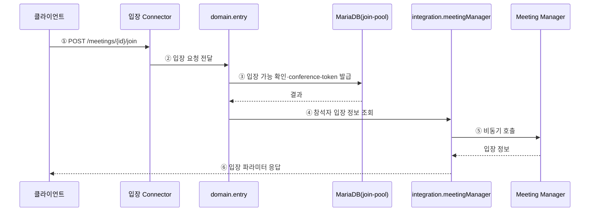

# 4.2.1.2. UC-04 회의 입장 (AS-04·AS-02·AS-08)

피크 시간대 8만 명 동시 입장 요청을 AS-04·AS-02·AS-08이 협력해 처리하는 흐름이다. Overall View의 E1·D1·P1·I1 구간을 확대한다.

## AS 적용 지점 요약

| 스텝 | 지점 | 적용 AS | 효과 |
|:---:|---|:---:|---|
| ① | 입장 Connector 수신(8081) | AS-04 | 단순 조회·권한 갱신과 스레드 경합 차단, 입장 스레드 예약 |
| ③ | join-pool 커넥션 획득 | AS-08 | 입장 커넥션 고갈이 service·general 풀에 전파되지 않음 |
| ④ | integration.meetingManager(ACL) | AS-09 | CB 감지·fallback, 외부 API 스키마의 포털 도메인 노출 차단 |
| ⑤ | externalCallExecutor 비동기 위임 | AS-02 | 서블릿 스레드 즉시 반환, 8만 건 동시 요청 수용 |
| ⑤ | CB Closed 상태 | AS-09 | 정상 시 Meeting Manager 직접 호출 |
