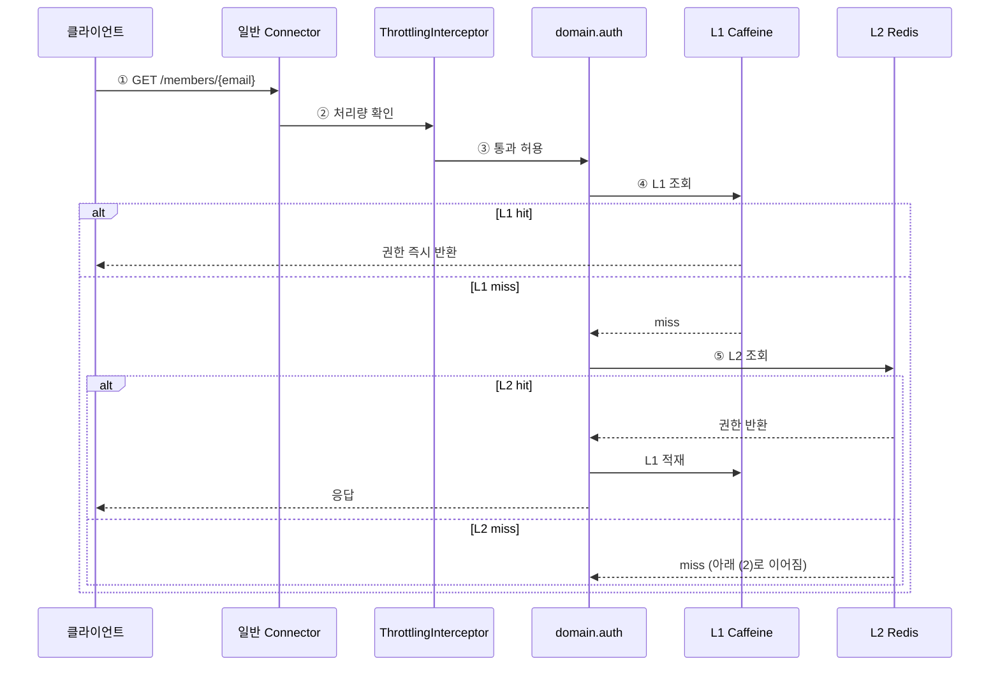
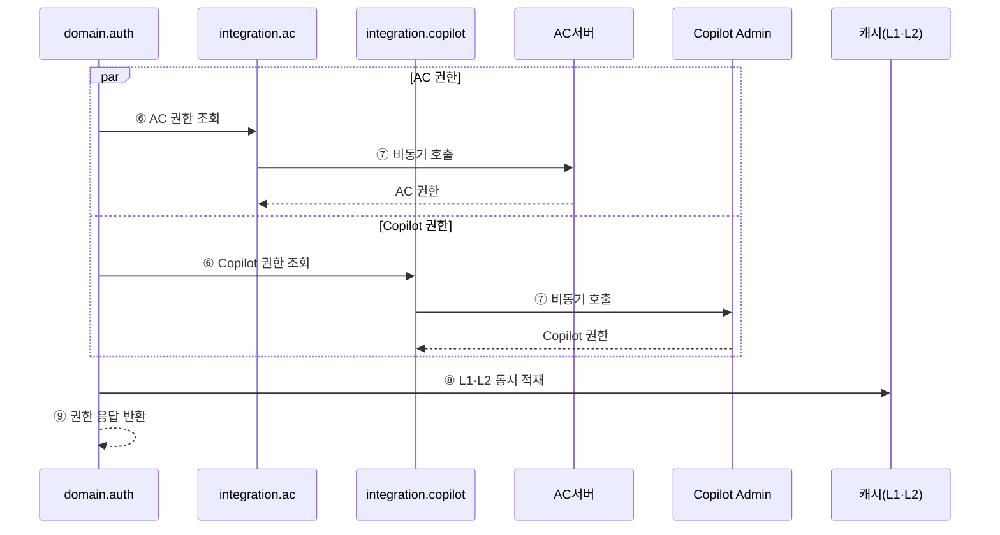

# 4.2.1.3. UC-01 권한 갱신: 캐시 hit/miss (AS-03·AS-02·AS-09)

로그인 후 권한 갱신 시 L1·L2 캐시 분기 흐름이다. 캐시 적중 경로와 L2 miss 시 외부 권한 병렬 조회 경로로 나눈다. Overall View의 F1·D2·C1·C2·I2·I3 구간을 확대한다.

## (1) 캐시 적중 경로

## (2) L2 miss 시 외부 권한 병렬 조회·적재

## AS 적용 지점 요약

| 스텝 | 지점 | 적용 AS | 효과 |
|:---:|---|:---:|---|
| ② | ThrottlingInterceptor | AS-06 | 피크 구간 비핵심 API 처리량 제한(권한 갱신에 상한 적용) |
| ④ | L1 Caffeine 조회 | AS-03 | 인스턴스 로컬 hit로 네트워크 없이 즉시 반환 |
| ⑤ | L2 Redis 조회 | AS-03 | 인스턴스 간 공유 캐시로 외부 중복 호출 방지 |
| ⑦ | externalCallExecutor 비동기 병렬 | AS-02+AS-09 | AC·Copilot CompletableFuture 병렬 조회, CB 보호 |
| ⑧ | L1·L2 동시 적재 | AS-03 | miss 후 외부 결과를 양 계층에 적재해 후속 hit 보장 |
