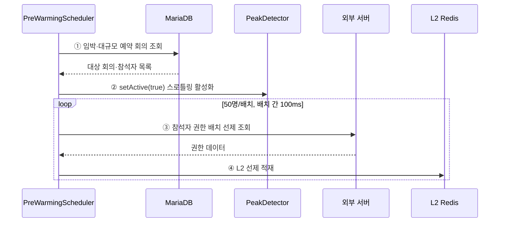

# 4.2.1.4. AS-05 Pre-warming 선제 적재

피크 N분 전 PreWarmingScheduler가 L2 Redis를 선제 적재하고 ThrottlingInterceptor를 활성화하는 흐름이다. 서블릿 스레드와 완전히 분리된 스케줄 경로다. Overall View의 S1·C2 구간을 확대한다.

## AS 적용 지점 요약

| 스텝 | 지점 | 적용 AS | 효과 |
|:---:|---|:---:|---|
| ① | PreWarmingScheduler(preWarmExecutor, 1분 주기) | AS-05 | 예약 회의 데이터 기반 동적 피크 감지, 서블릿 스레드와 분리 |
| ② | PeakDetector setActive | AS-06 | 워밍 시작과 동시에 비핵심 API 처리량 제한 활성화 |
| ③ | 50명/배치 + 100ms 딜레이 | AS-05 | 워밍 호출이 외부 서버에 순간 부하를 주지 않도록 분산 |
| ④ | L2 선제 적재 | AS-05+AS-03 | 피크 진입 시 cold start 없이 캐시 hit율 유지(Thundering Herd 방지) |
