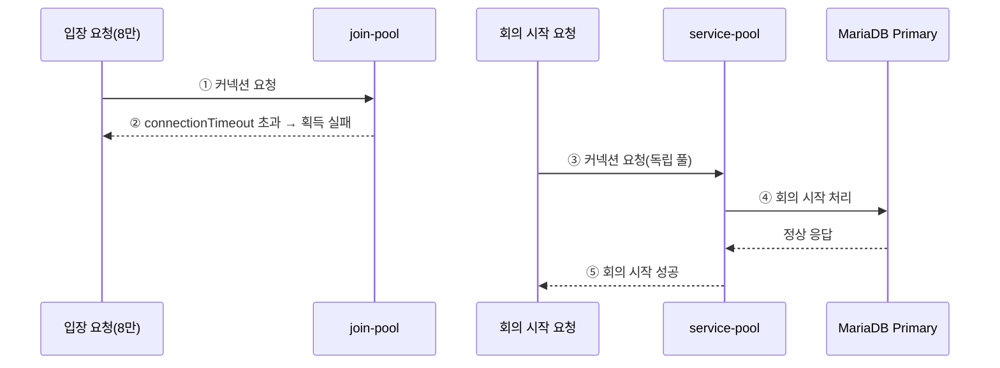

# 4.2.1.5. AS-08 Bulkhead 격리

join-pool이 포화 상태여도 service-pool을 사용하는 회의 시작(UC-03)이 독립적으로 정상 처리됨을 보여준다. AS-01 도메인 경계가 DataSource 분리의 귀속 기준을 제공한다. Overall View의 P1·P2 구간을 확대한다.

## AS 적용 지점 요약

| 스텝 | 지점 | 적용 AS | 효과 |
|:---:|---|:---:|---|
| ② | join-pool 독립 DataSource | AS-08 | 입장 커넥션 고갈이 회의 시작·초대 커넥션에 영향 없음 |
| ③ | service-pool 독립 DataSource | AS-08 | join-pool 포화 상태와 무관하게 독립 운영 |
| ④~⑤ | QA-03 달성 구조 | AS-01+AS-08 | domain 경계 기반 DataSource 분리로 물리 격리, 성공률 100% |
