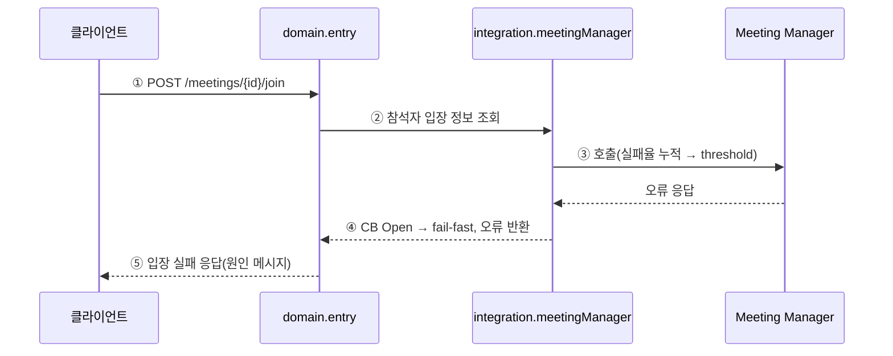
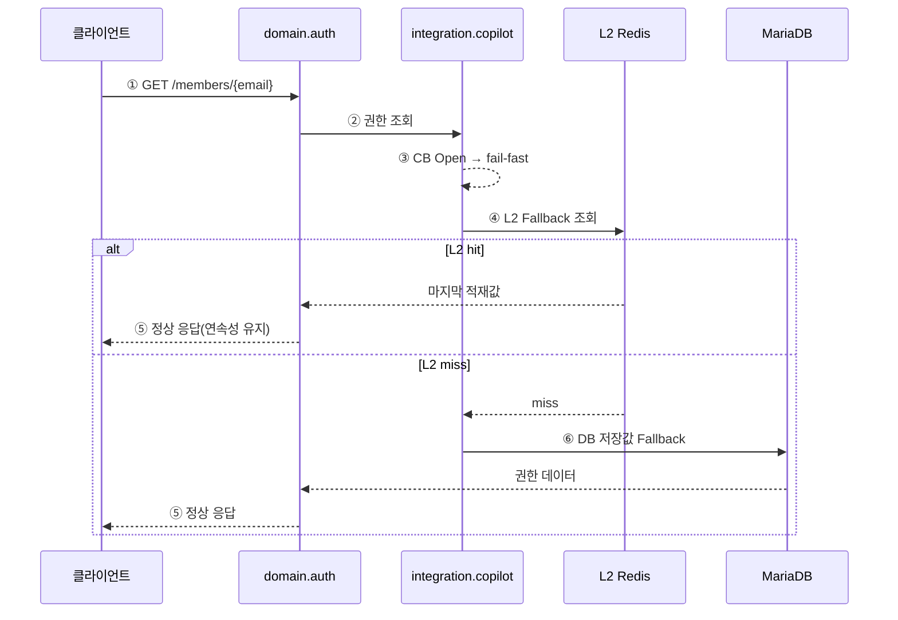

# 4.2.1.6. AS-09 Circuit Breaker: 서버별 차등 fallback

외부 서버 장애 시 CB Open 전환과 서버별 차등 fallback 흐름이다. 필수 서버(Meeting Manager)의 fail-fast와 Fallback 가능 서버(Copilot Admin)의 계층적 복구를 나눠 기술한다. Overall View의 I1·I3 구간을 확대한다.

## (1) Meeting Manager 장애: CB Open → fail-fast

## (2) Copilot Admin 장애: 계층적 Fallback (L2 → DB)

## AS 적용 지점 요약

| 스텝 | 지점 | 적용 AS | 효과 |
|:---:|---|:---:|---|
| (1)④ | meetingManager CB Open → fail-fast | AS-09 | Meeting Manager 장애 시 timeout 없이 즉시 거부, 스레드 블로킹 방지 |
| (2)③④ | copilotAdmin CB Open → L2 Fallback | AS-09+AS-03 | Copilot Admin 장애 시 캐시 기반 계층 복구 |
| (2)⑥ | DB 저장값 최종 Fallback | AS-09 | L2 miss 시 DB 저장 권한값으로 서비스 연속성 유지 |
| 전체 | 서버별 독립 CB 정책 | AS-09 | Meeting Manager 50%/10s, AC서버 60%/30s, Copilot Admin 70%/60s 차등 |
