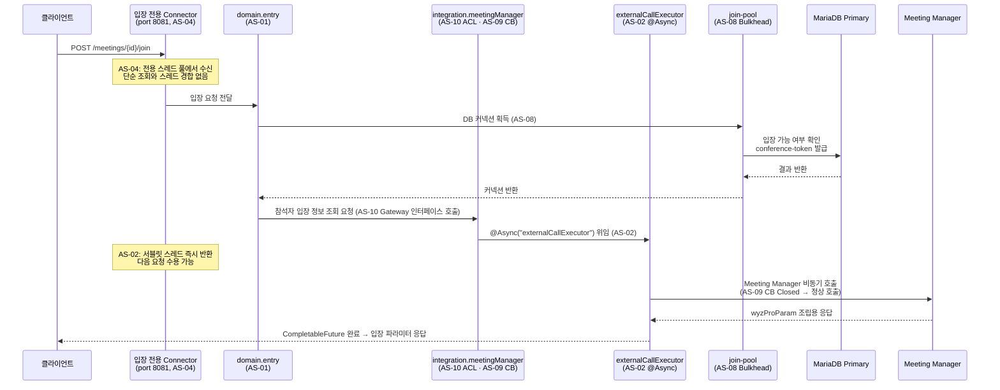
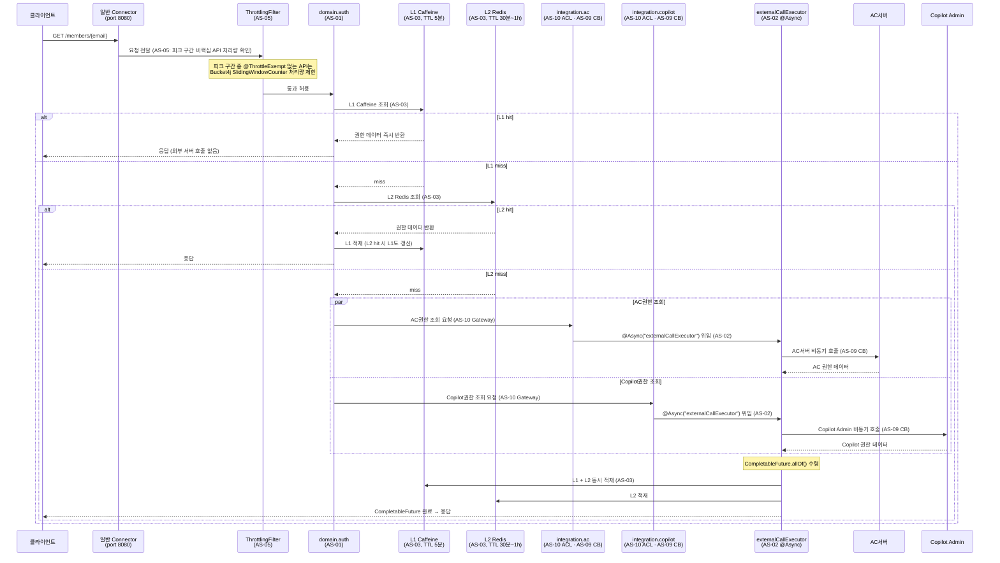
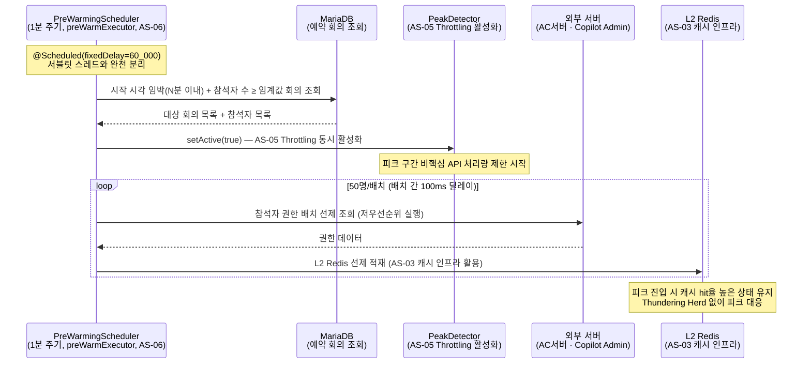
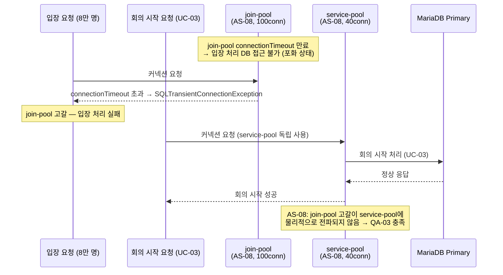
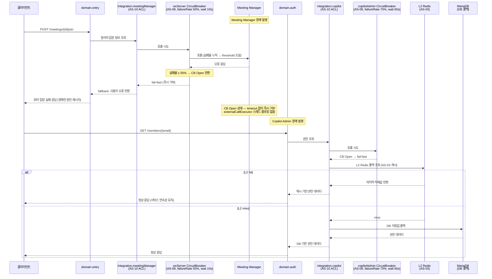

# 4.2.1. 실행 뷰 (Runtime View)

실행 뷰는 주요 유스케이스에서 컴포넌트 간 런타임 상호작용을 시퀀스 다이어그램으로 기술한다. 각 시나리오에서 AS 설계 전략이 어느 지점에서 동작하는지를 명시한다.

---

## 시나리오 1. UC-04 회의 입장 — 피크 집중 정상 처리

피크 시간대 8만 명 동시 입장 요청을 AS-04·AS-02·AS-08·AS-10이 협력하여 처리하는 흐름이다.

**AS 적용 지점 요약**

| 지점 | 적용 AS | 효과 |
|-----|--------|------|
| 입장 전용 Connector (port 8081) | AS-04 | 단순 조회·권한 갱신 요청과 스레드 경합 차단 |
| domain.entry → join-pool | AS-08 | 입장 커넥션 고갈이 service-pool·general-pool에 전파되지 않음 |
| integration.meetingManager Gateway | AS-10 | 포털 도메인 모델이 Meeting Manager API 스키마 직접 노출 차단 |
| externalCallExecutor @Async | AS-02 | 서블릿 스레드 즉시 반환 → 8만 건 동시 요청 스레드 풀 고갈 방지 |
| CB 상태 (Closed) | AS-09 | 정상 상태에서 Meeting Manager 직접 호출 |

---

## 시나리오 2. UC-01 권한 갱신 — 캐시 hit/miss 분기

로그인 후 권한 갱신 시 L1·L2 캐시 분기 흐름이다. AS-03의 핵심 동작을 보여준다.

**AS 적용 지점 요약**

| 지점 | 적용 AS | 효과 |
|-----|--------|------|
| ThrottlingFilter | AS-05 | 피크 구간 비핵심 API 처리량 제한 (권한 갱신은 피크 구간 처리량 상한 적용) |
| L1 Caffeine 조회 | AS-03 | 인스턴스 로컬 hit → 네트워크 없이 즉시 반환 |
| L2 Redis 조회 | AS-03 | 분산 인스턴스 간 공유 캐시로 외부 서버 중복 호출 방지 |
| AC·Copilot 병렬 호출 | AS-10 + AS-02 | AC권한·Copilot권한 CompletableFuture 병렬 조회 후 L1·L2 동시 적재 |
| L1 + L2 동시 적재 | AS-03 | L2 miss 후 외부 호출 결과를 양 계층에 동시 적재 |

---

## 시나리오 3. AS-06 Pre-warming 동작

피크 N분 전 PreWarmingScheduler가 L2 Redis를 선제 적재하고 ThrottlingFilter를 활성화하는 흐름이다.

**AS 적용 지점 요약**

| 지점 | 적용 AS | 효과 |
|-----|--------|------|
| PreWarmingScheduler (preWarmExecutor) | AS-06 | 예약 회의 데이터 기반 동적 피크 감지 |
| setActive(true) → PeakDetector | AS-05 | 워밍 시작과 동시에 비핵심 API 처리량 제한 활성화 |
| L2 Redis 선제 적재 | AS-06 + AS-03 | 피크 진입 시점 cold start 없이 캐시 hit율 유지 |
| 50명/배치 분할 + 100ms 딜레이 | AS-06 | 워밍 호출이 외부 서버에 순간 부하를 주지 않도록 분산 |

---

## 시나리오 4. AS-08 Bulkhead 격리 — join-pool 고갈 시 service-pool 독립

join-pool이 포화 상태에서도 service-pool을 사용하는 UC-03(회의 시작)이 독립적으로 정상 처리됨을 보여준다.

**AS 적용 지점 요약**

| 지점 | 적용 AS | 효과 |
|-----|--------|------|
| join-pool 독립 DataSource | AS-08 | 입장 커넥션 고갈이 회의 시작·초대 커넥션에 영향 없음 |
| service-pool 독립 DataSource | AS-08 | join-pool 상태와 무관하게 독립 운영 |
| QA-03 달성 구조 | AS-01 + AS-08 | domain.entry 경계 기반 DataSource Bean 분리로 격리 구현 |

---

## 시나리오 5. AS-09 Circuit Breaker 동작

외부 서버 장애 발생 시 CB Open 상태 전환 및 서버별 차등 fallback 처리 흐름이다.

**AS 적용 지점 요약**

| 지점 | 적용 AS | 효과 |
|-----|--------|------|
| wcServer CB Open → fail-fast | AS-09 | Meeting Manager 장애 시 timeout 없이 즉시 거부 → 스레드 블로킹 방지 |
| copilotAdmin CB Open → L2 Redis 폴백 | AS-09 + AS-03 | Copilot Admin 장애 시 캐시 기반 계층적 복구 |
| DB 저장값 최종 폴백 | AS-09 | L2 miss 시 DB 저장 권한값으로 서비스 연속성 유지 |
| 서버별 독립 CB 정책 | AS-09 + AS-10 | WC서버(50%, 10s) vs Copilot Admin(70%, 60s) 차등 적용 |
