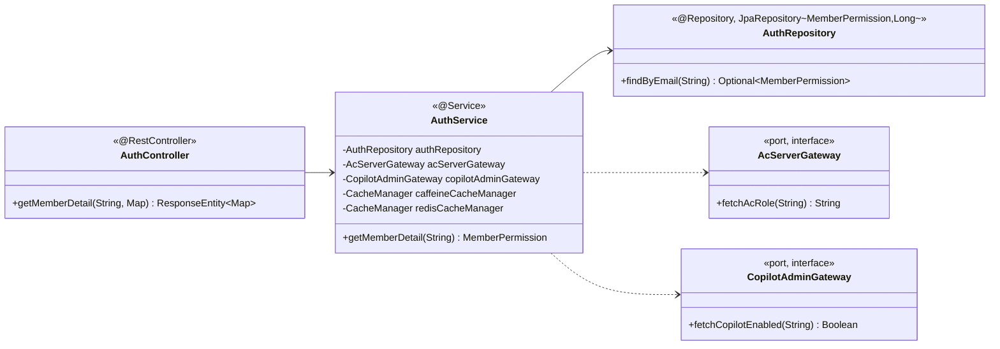

# 4.2.2.2. domain.auth 모듈

## 본 절의 범위

권한 갱신 도메인의 클래스 구성·결합·핵심 다이어그램을 다룬다. 본 패키지는 UC-01 회원 권한 조회(`GET /members/{email}/detail`)를 책임진다. 핵심 관심사는 **AS-03 캐시 완충**과 **AS-09 계층 Fallback**으로, 외부 권한 서버(AC·Copilot) 호출을 L1 캐시로 완충하고 장애 시 DB로 Fallback해 응답시간(QA-01)을 지키는 데 있다.

## 구성

| 클래스 | 스테레오타입 | 책임 | 관련 AS |
|---|---|---|---|
| `AuthController` | @RestController | `/members/{email}/detail` endpoint | — |
| `AuthService` | @Service (application) | `@Cacheable`(L1) 캐시, AC·Copilot 조회, DB Fallback 조립 | AS-03·09 |
| `AuthRepository` | @Repository (JpaRepository) | `MemberPermission` 조회(Fallback값 포함) | AS-08 |
| `MemberPermission` | entity | 회원 권한(AC 역할·Copilot 여부 등) | — |
| `AcServerGateway` · `CopilotAdminGateway` | port (interface) | 외부 권한 조회 계약 | AS-09 |

## 클래스 다이어그램

## 클래스별 상세

- **`AuthController`**: 회원 상세 권한 요청을 `AuthService`에 위임한다. 일반 Connector(8080) 경로다.
- **`AuthService`**: `@Cacheable("member-permissions", cacheManager="caffeineCacheManager")`(AS-03 L1)로 반복 조회를 완충한다. miss 시 `acServerGateway.fetchAcRole()`·`copilotAdminGateway.fetchCopilotEnabled()`를 호출하고, CB Open으로 null 반환 시 `authRepository`의 DB 저장값으로 Fallback한다. L2 Redis는 Copilot Fallback 경로와 공유 캐시로 쓰인다.
- **`AuthRepository`**: `JpaRepository<MemberPermission, Long>`로 `findByEmail`을 제공하며 general-pool로 라우팅된다.

## 핵심 관심사 · AS 결합

| 관심사 | 결합 | AS |
|---|---|---|
| 캐시 완충 | `AuthService` `@Cacheable`(caffeineCacheManager) | AS-03 |
| 외부 장애 Fallback | AC: null→DB · Copilot: Redis→DB (Adapter fallback) | AS-09·03 |
| DB 커넥션 격리 | `AuthRepository` → general-pool | AS-08 |

## 타 패키지·외부 의존

- **`integration.ac`·`integration.copilot`**(`AcServerGateway`·`CopilotAdminGateway` port)에 의존.
- **`config`**: caffeineCacheManager·redisCacheManager(AS-03), generalDataSource(AS-08) Bean 주입.
