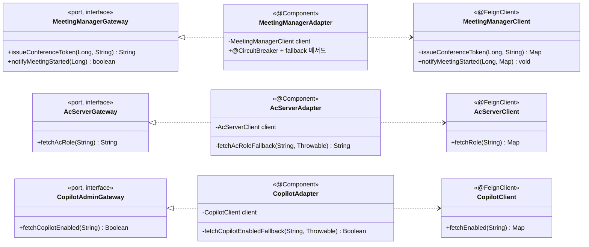

# 4.2.2.4. integration.* 연계 레이어 (ACL + AS-09)

## 본 절의 범위

외부 서버 연계를 캡슐화하는 ACL(Anti-Corruption Layer)의 클래스 구성·결합을 다룬다. front-api가 직접 연계하는 외부 서버는 **Meeting Manager·AC서버·Copilot Admin** 세 개이며, WC·VC 서버는 Meeting Manager 뒤단(cPaaS·server-api)이라 직접 연계 대상이 아니다. 핵심 관심사는 **AS-09 서버별 차등 Circuit Breaker**와 도메인의 외부 스키마 격리다.

## 구성

세 연계 패키지가 동일한 `port(Gateway) + adapter(Adapter) + client(@FeignClient)` 3요소 구조를 갖는다. Adapter가 `@FeignClient`(동기 호출)에 위임하고 그 위에 `@CircuitBreaker`와 내부 fallback 메서드를 얹는다(별도 Fallback 클래스는 없다).

| 패키지 | port (interface) | adapter (@Component) | client (@FeignClient) | 대상 서버 |
|---|---|---|---|---|
| `integration.meetingmanager` | `MeetingManagerGateway` | `MeetingManagerAdapter` | `MeetingManagerClient` | Meeting Manager |
| `integration.ac` | `AcServerGateway` | `AcServerAdapter` | `AcServerClient` | AC서버 |
| `integration.copilot` | `CopilotAdminGateway` | `CopilotAdapter` | `CopilotClient` | Copilot Admin |

## ACL 구조

각 `Adapter`(@Component)는 서버별 `@FeignClient`(`MeetingManagerClient` 등, 동기 호출)에 위임해 외부를 호출하고, 각 메서드에 `@CircuitBreaker`(Resilience4j)와 **내부 fallback 메서드**가 붙는다. Feign timeout은 `application.yml`의 `feign.client.config`로 서버별 설정한다. 도메인은 `Gateway` 인터페이스만 보며, Adapter가 Feign 응답을 도메인 값(역할 문자열·Boolean 등)으로 변환해 외부 스키마 노출을 차단한다.

## 연계별 상세 · 서버별 차등 Circuit Breaker

`@CircuitBreaker(name = ...)` 인스턴스 설정은 `application.yml`의 `resilience4j.circuitbreaker.instances.*`에 서버별로 분리한다.

| 연계 | 메서드 | failureRate | wait | fallback 처리 |
|---|---|:---:|:---:|---|
| `MeetingManagerAdapter` | `issueConferenceToken`·`notifyMeetingStarted` | 50% | 10s | fail-fast (입장 필수, 빠른 감지) |
| `AcServerAdapter` | `fetchAcRole` | 60% | 30s | null 반환 → `AuthService`가 DB 저장값 Fallback |
| `CopilotAdapter` | `fetchCopilotEnabled` | 70% | 60s | L2 Redis → DB 계층 Fallback |

- **Meeting Manager**: 입장(UC-04)·회의 시작에 필수라 임계를 낮춰 빠르게 차단, fail-fast로 사용자 오류 반환.
- **AC서버**: DB 저장 권한값 Fallback이 가능해 관대한 임계값. CB Open 시 fallback이 null을 반환하고 `AuthService`가 DB로 Fallback한다.
- **Copilot Admin**: 권한 변경 빈도가 낮아 가장 관대한 임계값. Redis 마지막 적재값 → DB 순으로 계층 Fallback.

## 타 패키지·외부 의존

- **의존받음**: `domain.entry`·`domain.meeting`(MeetingManagerGateway), `domain.auth`(AcServerGateway·CopilotAdminGateway).
- **의존함**: 각 패키지의 `@FeignClient`(`MeetingManagerClient` 등)가 외부 서버를 직접 호출한다. 앱의 `@EnableFeignClients`로 활성화하고 timeout은 `feign.client.config`(application.yml)로 설정한다. 도메인에는 역의존하지 않는다(단방향).
