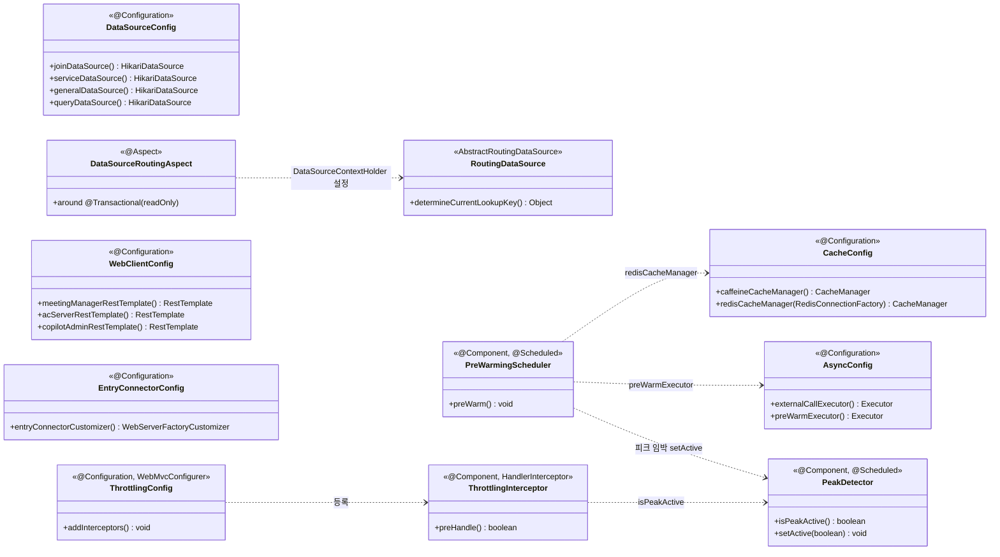

# 4.2.2.5. config.* · scheduler.* 모듈

## 본 절의 범위

전략별 인프라 Bean을 정의하는 `config` 패키지와 피크 선제 적재를 수행하는 `scheduler` 패키지의 클래스 구성·결합을 다룬다. 도메인·연계 패키지가 비즈니스를 담당한다면, 본 패키지들은 *스레드 풀·DataSource·캐시·라우팅·Connector·외부 클라이언트*라는 횡단 인프라를 조립한다. 핵심 관심사는 AS-02·03·04·05·07·08 다수 전략의 실행 기반 제공이다.

## 구성

관심사별로 config 클래스를 묶는다.

| 관심사 | 클래스 | 역할 | AS |
|---|---|---|---|
| 비동기 | `AsyncConfig` | externalCallExecutor·preWarmExecutor 정의 | AS-02·05 |
| 캐시 | `CacheConfig` | caffeineCacheManager(L1)·redisCacheManager(L2) | AS-03 |
| DataSource | `DataSourceConfig` | join·service·general·query HikariDataSource | AS-08 |
| CQRS 라우팅 | `RoutingDataSource`·`DataSourceRoutingAspect`·`DataSourceContextHolder`·`DataSourceType` | readOnly 트랜잭션 → Replica 라우팅 | AS-07 |
| 입장 Connector | `EntryConnectorConfig` | 8081 전용 Tomcat Connector 등록 | AS-04 |
| 외부 클라이언트 | `WebClientConfig` | 서버별 RestTemplate 3개 | AS-09 |
| 스로틀링 | `ThrottlingConfig`·`PeakDetector`·`ThrottlingInterceptor`·`@ThrottleExempt` | 피크 구간 비핵심 API 유입 제한 | AS-06 |
| 스케줄 | `PreWarmingScheduler` | 예약 회의 기반 L2 선제 적재 | AS-05 |

## 클래스 다이어그램

## 클래스 그룹별 상세

- **비동기(`AsyncConfig`)**: 외부 호출 전용 `externalCallExecutor`(core 100·max 500·queue 2,000)와 Pre-warming 전용 `preWarmExecutor`(core 10·max 50)를 분리 정의한다(AS-02·05).
- **CQRS 라우팅 그룹**: `DataSourceRoutingAspect`(@Aspect)가 `@Transactional(readOnly)` 여부를 보고 `DataSourceContextHolder`(ThreadLocal `DataSourceType`)를 설정하면, `RoutingDataSource`(AbstractRoutingDataSource)가 그 키로 Primary/Replica를 선택한다(AS-07).
- **입장 Connector(`EntryConnectorConfig`)**: `WebServerFactoryCustomizer`로 8081 전용 Connector를 추가해 입장 경로를 물리 분리한다(AS-04).
- **외부 클라이언트(`WebClientConfig`)**: 서버별 `RestTemplate` 3개를 connect/read timeout과 함께 정의하고, 각 Adapter가 `@Qualifier`로 주입받는다.
- **스케줄(`PreWarmingScheduler`)**: `@Scheduled(fixedDelay=60_000)`로 예약 회의를 조회해 L2에 선제 적재한다(AS-05).

## 주요 Bean 목록

| Bean | 타입 | AS |
|---|---|---|
| `externalCallExecutor`·`preWarmExecutor` | Executor | AS-02·05 |
| `joinDataSource`·`serviceDataSource`·`generalDataSource`·`queryDataSource` | HikariDataSource | AS-07·08 |
| `routingDataSource` | RoutingDataSource | AS-07 |
| `caffeineCacheManager`·`redisCacheManager` | CacheManager | AS-03 |
| `meetingManagerRestTemplate`·`acServerRestTemplate`·`copilotAdminRestTemplate` | RestTemplate | AS-09 |
| `entryConnectorCustomizer` | WebServerFactoryCustomizer | AS-04 |
| `preWarmingScheduler` | PreWarmingScheduler | AS-05 |

> 서버별 Circuit Breaker는 `@Bean`이 아니라 `application.yml`의 `resilience4j.circuitbreaker.instances.*` + adapter의 `@CircuitBreaker` 어노테이션으로 적용된다. AS-06 스로틀링은 `ThrottlingConfig`(WebMvcConfigurer)가 `ThrottlingInterceptor`를 등록하는 구조로 구현되어 있다. `PeakDetector`는 고정 시간창(기본 08:30~09:30·12:30~13:30) 자동 판정에 더해 `PreWarmingScheduler`가 피크 임박 시 `setActive(true)`로 선제 활성화하며, 활성 구간에서 `@ThrottleExempt`가 없는 비핵심 API에만 Bucket4j 상한(기본 초당 1,000)을 적용하고 초과 시 429를 반환한다. 전용 부하 검증 시나리오는 프로토타입 범위에 포함하지 않는다.

## 타 패키지 의존

- **의존받음**: 모든 `domain.*`·`integration.*`이 config Bean을 주입받는다. `PreWarmingScheduler`는 `CacheConfig`·`AsyncConfig`를 사용한다.
- 본 패키지는 도메인에 역의존하지 않는다(단방향).
