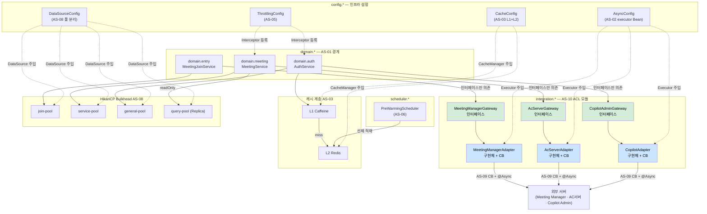

# 4.2.2. 모듈 뷰 (Module View)

모듈 뷰는 front-api 코드베이스의 패키지 구조, 컴포넌트 간 의존 관계, 주요 Spring Bean 목록을 기술한다. AS-01이 설정한 도메인 경계가 실제 패키지 모듈로 어떻게 구현되는지를 보여준다.

---

## 패키지 구조

```
front-api/
  domain/
    entry/                 ← AS-01: 입장 처리 전용 도메인
      MeetingJoinService.java
      MeetingJoinController.java
      EntryRepository.java (joinDataSource 주입)
    auth/                  ← AS-01: 권한 갱신 도메인
      AuthService.java
      AuthController.java
      AuthRepository.java (generalDataSource 주입)
    meeting/               ← AS-01: 회의 관리 도메인
      MeetingService.java
      MeetingController.java
      MeetingRepository.java (serviceDataSource 주입)
      MeetingQueryRepository.java (queryDataSource 주입, readOnly)

  integration/             ← AS-10 ACL 연계 모듈 레이어
    meetingManager/        ← AS-10 ACL + AS-09 CB
      MeetingManagerGateway.java     (포털 도메인이 의존하는 인터페이스)
      MeetingManagerFeignClient.java (외부 API 스키마 매핑)
      MeetingManagerAdapter.java     (DTO 변환 — 외부 모델 ↔ 포털 도메인)
      MeetingManagerCBConfig.java    (CB 정책: failureRate 50%, wait 10s)
      MeetingManagerFallback.java    (fail-fast → 오류 반환)
    ac/                    ← AS-10 ACL + AS-09 CB
      AcServerGateway.java
      AcServerFeignClient.java
      AcServerAdapter.java
      AcServerCBConfig.java          (CB 정책: failureRate 60%, wait 30s)
      AcServerFallback.java          (DB 저장 권한값 폴백)
    copilot/               ← AS-10 ACL + AS-09 CB
      CopilotAdminGateway.java
      CopilotFeignClient.java
      CopilotAdapter.java
      CopilotCBConfig.java           (CB 정책: failureRate 70%, wait 60s)
      CopilotFallback.java           (L2 Redis → DB 계층적 폴백)

  config/
    AsyncConfig.java       ← AS-02: externalCallExecutor, preWarmExecutor Bean 정의
    DataSourceConfig.java  ← AS-08: joinDataSource, serviceDataSource, generalDataSource, queryDataSource
    CacheConfig.java       ← AS-03: L1 CaffeineCacheManager + L2 RedisCacheManager 구성
    ThrottlingConfig.java  ← AS-05: ThrottlingInterceptor, PeakDetector Bean 등록

  scheduler/
    PreWarmingScheduler.java ← AS-06: 1분 주기 예약 회의 기반 L2 선제 적재
```

---

## 컴포넌트 의존 관계 다이어그램

AS-01이 강제하는 단방향 의존 규칙을 시각화한다. `domain.*`은 `integration.*`의 인터페이스(Gateway)에만 의존하며, Adapter(구현체) 직접 참조는 ArchUnit 규칙으로 빌드 타임에 차단한다.



---

## 주요 Bean 목록

| Bean 명 | 타입 | 역할 | 관련 AS |
|--------|-----|------|--------|
| `externalCallExecutor` | `ThreadPoolTaskExecutor` | 외부 서버 Feign 호출 전용 비동기 스레드 풀 (corePoolSize=100, maxPoolSize=500, queueCapacity=2,000) | AS-02 |
| `preWarmExecutor` | `ThreadPoolTaskExecutor` | Pre-warming 전담 저우선순위 스레드 풀 | AS-06 |
| `joinDataSource` | `HikariDataSource` | 입장 처리 전용 커넥션 풀 (maxPool=100, connTimeout=3,000ms) | AS-08 |
| `serviceDataSource` | `HikariDataSource` | 회의 시작·초대 전용 커넥션 풀 (maxPool=40, connTimeout=5,000ms) | AS-08 |
| `generalDataSource` | `HikariDataSource` | 권한 갱신·일반 조회 커넥션 풀 (maxPool=60, connTimeout=5,000ms) | AS-08 |
| `queryDataSource` | `HikariDataSource` | Read 전용 Replica 커넥션 풀 (maxPool=80, connTimeout=3,000ms) | AS-07, AS-08 |
| `caffeineCacheManager` | `CaffeineCacheManager` | L1 인스턴스 로컬 캐시 관리 (TTL 5분) | AS-03 |
| `redisCacheManager` | `RedisCacheManager` | L2 분산 공유 캐시 관리 (TTL 30분~1시간) | AS-03 |
| `compositeCacheManager` | `CompositeCacheManager` | L1 → L2 순서 계층 캐시 라우팅 | AS-03 |
| `peakDetector` | `PeakDetector` | 예약 회의 DB 조회 + 고정 시간대 기반 피크 구간 활성화 | AS-05, AS-06 |
| `throttlingInterceptor` | `HandlerInterceptor` | 피크 구간 중 비핵심 API Bucket4j 처리량 제한 | AS-05 |
| `preWarmingScheduler` | `PreWarmingScheduler` | 1분 주기 예약 회의 기반 L2 Redis 선제 적재 스케줄러 | AS-06 |
| `dataSourceRouter` | `AbstractRoutingDataSource` | @Transactional readOnly 속성으로 Primary/Replica 라우팅 | AS-07 |
| `meetingManagerCircuitBreaker` | `CircuitBreaker` | Meeting Manager 전용 CB (failureRate 50%, wait 10s) | AS-09 |
| `acServerCircuitBreaker` | `CircuitBreaker` | AC서버 전용 CB (failureRate 60%, wait 30s) | AS-09 |
| `copilotAdminCircuitBreaker` | `CircuitBreaker` | Copilot Admin 전용 CB (failureRate 70%, wait 60s) | AS-09 |
