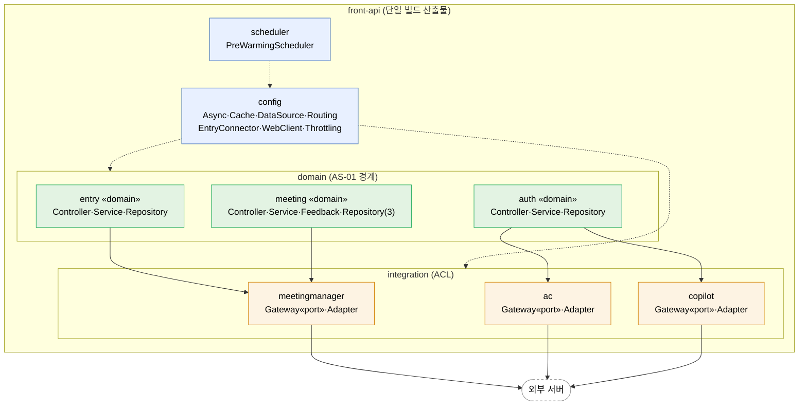

# 4.2.2. 모듈 뷰 (Module View)

모듈 뷰는 시스템을 구성하는 *정적 빌드 단위*(소스 코드·패키지·클래스)와 그 의존 관계를 보여준다. [4.2.1 실행 뷰](../4.2.1-runtime-view/overview.md)가 *런타임 컴포넌트*를 다뤘다면, 본 절은 *어떤 코드가 어떤 패키지에 속하고 어떻게 결합되어 빌드되는가*를 `com.example.frontapi` 실제 구현을 기준으로 다룬다.

> **본 절의 범위**: front-api *애플리케이션 코드*(`com.example.frontapi`)에 한정한다. Redis·MariaDB·외부 서버 등은 별도 운영 인프라이며 본 사업의 빌드 산출물이 아니다. 다만 코드 측에서 인프라·외부 서버와 결합하는 *Adapter 모듈*(`integration.*`)과 *설정 모듈*(`config.*`)은 본 절에 포함된다.

> **헥사고날 표기 규칙**: 각 도메인은 *port·adapter·application* 3구조로 기술한다. **port**(`integration.*.Gateway` 인터페이스)는 도메인이 외부 서버에 요구하는 계약, **adapter**(`integration.*.Adapter` 구현)는 그 계약을 특정 제품(RestTemplate·Resilience4j)으로 실현하는 코드, **application**(`domain.*.Service`)은 도메인 서비스·포트를 조합해 하나의 흐름을 완성하는 계층이다. 이 분리가 곧 설계이며, `domain.*` 코드는 외부 서버 SDK나 HTTP 클라이언트를 직접 import 하지 않는다.

## 모듈 분할 원칙

1. **AS-01 도메인 경계**: 입장(`domain.entry`)·권한(`domain.auth`)·회의(`domain.meeting`)를 독립 패키지로 분리한다. 각 도메인은 전용 Repository와 DataSource, 담당 유스케이스를 갖는다. front-api는 단일 빌드 산출물이므로 같은 JVM을 공유하되, 패키지 경계와 ArchUnit 규칙으로 결합을 통제한다.
2. **연계의 ACL 격리**: 외부 서버(Meeting Manager·AC·Copilot) 결합은 `integration.*` Adapter 패키지에 격리한다. 도메인은 `Gateway` 인터페이스(port)에만 의존하고, `Adapter`가 RestTemplate 호출·Circuit Breaker·fallback을 캡슐화한다.
3. **인프라 설정의 분리**: 스레드 풀·DataSource·캐시·라우팅·Connector 등 전략별 인프라 Bean은 `config.*`, 스케줄 작업은 `scheduler.*`로 분리한다.
4. **경계의 빌드 타임 강제**: `domain.*`이 `integration.*.adapter` 구현체를 직접 참조하는 것을 ArchUnit 규칙으로 빌드 타임에 차단한다.

## 시스템 모듈 뷰

`domain.*`은 `integration.*`의 `Gateway`(port)에만 의존하고, 각 `Adapter`가 이를 구현(`implements`)한다. `config.*`가 정의한 Bean(Executor·DataSource·CacheManager·Connector·RestTemplate)이 도메인·연계에 주입된다. 본 뷰는 코드 패키지·클래스와 빌드 의존만 다루며, 런타임 인프라(캐시·풀·DB)는 실행 뷰(4.2.1)·배치 뷰(4.2.3) 소관이다.

> **범례·의존 설명.** 실선 화살표는 `domain` → `integration`의 `Gateway`(port) 의존이며, Adapter 구현체 직접 참조는 ArchUnit이 빌드 타임에 차단한다. `integration.*` → 외부 서버 실선은 각 `Adapter`가 RestTemplate + `@CircuitBreaker`로 외부를 호출함을 뜻한다. 점선은 `config`의 Bean 주입(스레드 풀·DataSource·CacheManager·Connector·RestTemplate)과 `scheduler`의 config 사용이다.

> **모듈러 모놀리스 특성**: `domain`·`integration`·`config`·`scheduler`는 모두 하나의 `front-api` 빌드 산출물 안의 패키지다. 서비스별 독립 배포(MSA)가 아니라, *같은 JVM 안에서 패키지 경계·ArchUnit·전용 DataSource로 격리*하는 구조다(ADR-001). 외부 호출은 세 `Adapter`가 RestTemplate로 수행하며, 각 메서드에 `@CircuitBreaker`(Resilience4j)와 내부 fallback 메서드가 붙는다(별도 Fallback 클래스 없음).

## 모듈별 역할

| 패키지 | 주요 클래스 | 역할 | 관련 AS |
|---|---|---|---|
| `domain.entry` | `MeetingJoinController` · `MeetingJoinService` · `EntryRepository` · `EntryRecord` | 회의 입장·conference-token 발급(UC-04). `MeetingManagerGateway`로 입장 정보 조회 | AS-01·04·08 |
| `domain.auth` | `AuthController` · `AuthService` · `AuthRepository` · `MemberPermission` | 권한 갱신(UC-01). `@Cacheable`(L1)로 캐시, AC·Copilot 조회, CB Open 시 DB Fallback | AS-01·03·09 |
| `domain.meeting` | `MeetingController` · `MeetingService` · `ParticipantFeedbackController` · `ParticipantFeedbackService` · `MeetingRepository` · `MeetingQueryRepository` · `ParticipantRepository` · `Meeting`·`Participant` | 회의 시작·조회·종료, cPaaS 참석자 상태 피드백 write(ISSUE-07). Command/Query Repository 분리 | AS-01·07·08 |
| `integration.meetingmanager` | `MeetingManagerGateway`(port) · `MeetingManagerAdapter` | Meeting Manager 연계(입장 정보·conference-token·회의 시작 통보). RestTemplate + `@CircuitBreaker` | AS-09·02 |
| `integration.ac` | `AcServerGateway`(port) · `AcServerAdapter` | AC서버 권한 조회. CB Open 시 fallback null → DB Fallback | AS-09 |
| `integration.copilot` | `CopilotAdminGateway`(port) · `CopilotAdapter` | Copilot 권한 조회. CB Open 시 Redis→DB 계층 Fallback | AS-09·03 |
| `config` | `AsyncConfig` · `CacheConfig` · `DataSourceConfig` · `RoutingDataSource` · `DataSourceRoutingAspect` · `DataSourceContextHolder` · `EntryConnectorConfig` · `WebClientConfig` · `ThrottlingConfig` · `PeakDetector` · `ThrottlingInterceptor` | 스레드 풀(AS-02)·L1/L2 캐시(AS-03)·기능별 DataSource(AS-08)·readOnly 라우팅(AS-07)·입장 전용 Connector(AS-04)·RestTemplate 정의·피크 Throttling(AS-06) | AS-02·03·04·06·07·08 |
| `scheduler` | `PreWarmingScheduler` | 예약 회의 기반 L2 선제 적재(AS-05) | AS-05 |

> AS-06(피크 구간 Throttling)은 `config.ThrottlingConfig`(WebMvcConfigurer)가 `ThrottlingInterceptor`를 등록하는 구조로 구현되어 있다. `PeakDetector`는 고정 시간창 자동 판정과 AS-05 `PreWarmingScheduler`의 피크 임박 `setActive` 트리거를 공유하며, 활성 구간에서 `@ThrottleExempt`가 없는 비핵심 API에만 Bucket4j 상한(기본 초당 1,000)을 적용한다. 전용 부하 검증 시나리오는 프로토타입 범위에 포함하지 않는다.

## 의존 방향: 단방향 보장

- **상위(`domain`) → 하위(`integration.Gateway`·`config` Bean)** 단방향. `integration`·`config`는 `domain`에 역의존하지 않는다.
- **도메인 간 직접 호출 없음**: `entry`·`auth`·`meeting`은 서로의 Service를 직접 호출하지 않는다.
- **ArchUnit 규칙**: `domain..`에서 `integration..*Adapter` 참조 시 빌드 실패. 도메인이 `Gateway` 인터페이스만 보도록 강제해 외부 연계 구현 교체가 도메인에 파급되지 않는다.

각 패키지의 상세 클래스 구조는 하위 절에서 다룬다.

| 절 | 패키지 | 담당 전략 |
|---|---|---|
| [4.2.2.1 entry](4.2.2.1-entry.md) | `domain.entry` | AS-01 · AS-02 · AS-08 |
| [4.2.2.2 auth](4.2.2.2-auth.md) | `domain.auth` | AS-01 · AS-03 · AS-09 |
| [4.2.2.3 meeting](4.2.2.3-meeting.md) | `domain.meeting` | AS-01 · AS-07 · AS-08 |
| [4.2.2.4 integration](4.2.2.4-integration.md) | `integration.*` | AS-09 · AS-02 |
| [4.2.2.5 config·scheduler](4.2.2.5-config-scheduler.md) | `config.*` · `scheduler.*` | AS-02·03·04·05·06·07·08 |

각 패키지가 어느 노드에 배치되는지는 [4.2.3 배치 뷰](../4.2.3-deployment-view/overview.md)에서 다룬다.
