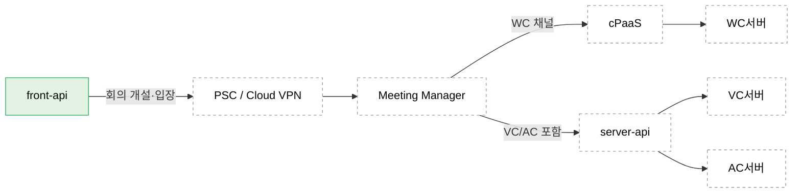

# 4.2.3.4. 외부 연계 경계 (아웃바운드)

front-api가 직접 연계하는 외부 서버는 Meeting Manager·AC서버·Copilot Admin 세 개다. GKE에서 외부로 나가는 트래픽은 Private Service Connect(PSC) 또는 Cloud VPN으로 한정해, 게이트웨이 외 임의 아웃바운드를 차단한다.

## 외부 연계 경계

| 외부 서버 | 연계 목적 | 호출 | CB |
|---|---|---|:---:|
| Meeting Manager | 회의 개설·참석자·입장 정보(conference-token) | front-api → (PSC) → Meeting Manager. RestTemplate + `@CircuitBreaker` | 50% / 10s |
| AC서버 | AC 권한 갱신 | front-api → (PSC) → AC서버 | 60% / 30s |
| Copilot Admin | LLM·용어사전 권한 | front-api → (PSC) → Copilot Admin | 70% / 60s |

세 연계는 `integration.*`의 `Adapter`가 서버별 `RestTemplate`(`WebClientConfig` 정의)로 호출하며, 각 메서드에 서버별 차등 `@CircuitBreaker`가 적용된다(AS-09).

## Meeting Manager 뒤단 (외부 소유)

Meeting Manager는 회의 타입에 따라 뒤단으로 분기한다. front-api 배치 관심사는 Meeting Manager 경계까지이며, 그 뒤단은 외부 소유다.

AC서버는 두 경로에서 호출된다. front-api의 권한 갱신 직접 호출과, 회의 개설 시 Meeting Manager → server-api를 경유한 AC 회의 개설이다. 배치 뷰의 아웃바운드 경계는 front-api 직접 연계(권한)를 대상으로 한다.

## 검증 환경의 외부 서버

검증 환경에서는 외부 서버를 `stub-server` 컨테이너로 대체한다. stub은 정상 응답과 장애/지연 주입(`POST/DELETE /stub/{server}/fault`)을 지원해, AS-09 Circuit Breaker 동작(IV-04)을 운영 외부 서버 없이 검증한다.
