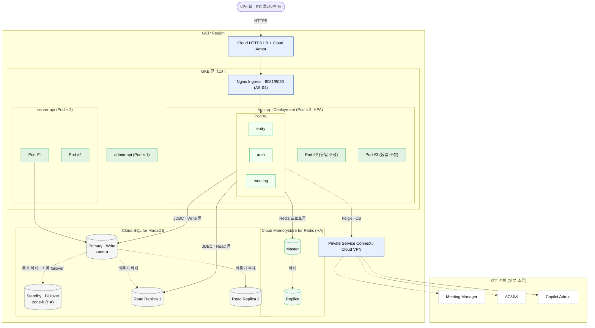

# 4.2.3. 배치 뷰 (Deployment View)

배치 뷰는 4.2.1의 런타임 컴포넌트와 4.2.2의 빌드 산출물(front-api)이 운영 환경에서 어떤 하드웨어·소프트웨어 자원에 할당되는지를 결정한다. 각 인프라 컴포넌트가 어느 AS 전략을 실현하는지, 그리고 공유 인프라의 이중화를 함께 기술한다.

> **본 절의 범위**: front-api와 그 직접 결합 인프라(Nginx·Tomcat·Redis·MariaDB·커넥션 풀)의 자원 할당에 집중한다. 모니터링·CI/CD 파이프라인은 별도 운영 결정으로 위임하고, Meeting Manager 뒤단 인프라(cPaaS·server-api·WC/VC/AC 서버)는 외부 소유라 경계까지만 표현한다.

## 배치 결정 원칙

| 원칙 | 근거 | 적용 결과 |
|---|---|---|
| **입장 경로의 물리 분리** | AS-04 · QA-02 | Nginx가 `/join`·`/conference-token`을 8081 Connector로 라우팅, 그 외를 8080으로 분리 |
| **수평 확장 + 로컬 캐시** | AS-03 · QA-01 | front-api 다중 인스턴스, 각 인스턴스에 L1 Caffeine 로컬 배치. L2 Redis는 공유 |
| **공유 인프라 이중화** | RK-07 · QA-05 | L2 Redis와 MariaDB Replica를 이중화해 단일 장애점 완화 (4.2.3.3) |
| **커넥션 총량 상한** | RK-01 · CR-02 | 기능별 풀 크기 합을 DB 최대 커넥션 이내로 설계, 인스턴스 수 증가 시 확대 경로 명시 |
| **읽기·쓰기 물리 분리** | AS-07 | Primary는 Write, Replica는 Read 전담. readOnly 트랜잭션으로 라우팅 |

## 종합 배치도

## 컴포넌트별 할당 요약

| 컴포넌트 | 배치 | 이중화 | 관련 AS |
|---|---|---|---|
| Nginx | front-api 앞단 (또는 인스턴스 사이드카) | LB 하위 다중 | AS-04 |
| front-api (Tomcat) | 수평 확장 인스턴스 N대 | LB 분산 | AS-01·02·04 |
| L1 Caffeine | 각 인스턴스 로컬 (JVM 내) | 인스턴스별 독립 | AS-03 |
| L2 Redis | 공유 캐시 노드 | Sentinel/Cluster HA | AS-03 |
| MariaDB Primary | Write 전담 노드 | Replica 승격 경로 | AS-07 |
| MariaDB Replica | Read 전담 노드 | 다중 Replica | AS-07 |

각 계층의 상세 설정은 하위 절에서 다룬다: [4.2.3.1 네트워크·엣지](4.2.3.1-network-edge.md), [4.2.3.2 애플리케이션](4.2.3.2-app.md), [4.2.3.3 데이터](4.2.3.3-data.md), [4.2.3.4 외부 연계](4.2.3.4-external.md).
