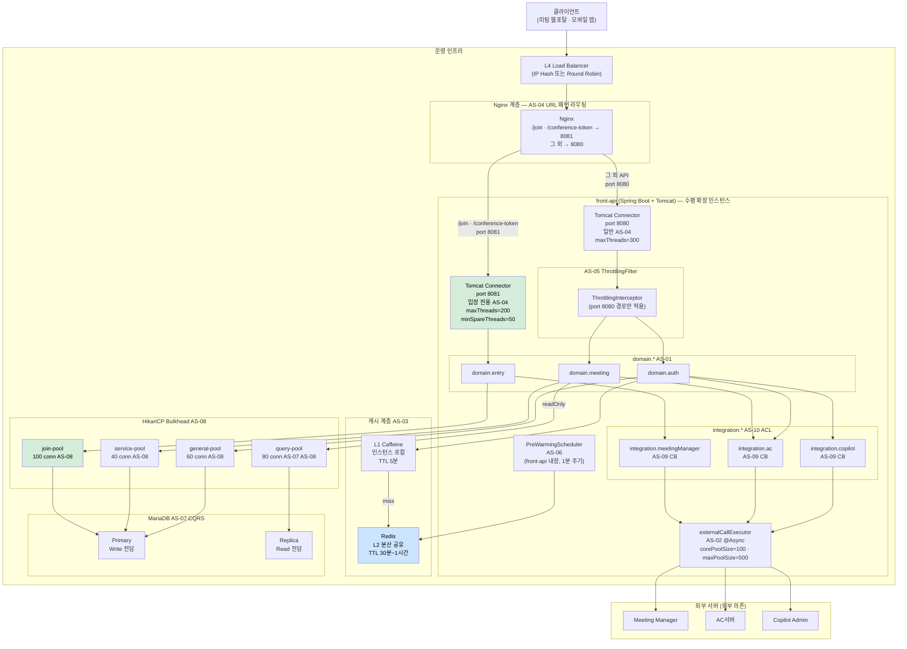

# 4.2.3. 배치 뷰 (Deployment View)

배치 뷰는 front-api가 운영 환경에서 어떤 하드웨어·소프트웨어 구성으로 배포되는지를 기술한다. 각 인프라 컴포넌트가 AS 전략과 어떻게 대응되는지를 함께 명시한다.

---

## 인프라 토폴로지

---

## 컴포넌트별 설정 요약

### Nginx 라우팅 설정

| 패턴 | 라우팅 대상 | 비고 |
|-----|-----------|------|
| `/meetings/*/join` | front-api:8081 | AS-04: 입장 전용 Connector |
| `/meetings/*/conference-token` | front-api:8081 | AS-04: 입장 전용 Connector |
| 그 외 모든 경로 | front-api:8080 | AS-04: 일반 Connector |

### Tomcat Connector 설정 (AS-04)

| Connector | 포트 | maxThreads | minSpareThreads | 용도 |
|---------|-----|-----------|----------------|------|
| 입장 전용 | 8081 | 200 | 50 | /join, /conference-token 전용 |
| 일반 | 8080 | 300 | 기본값 | 조회·권한 갱신·관리 |

### AsyncTaskExecutor 설정 (AS-02)

| Bean | corePoolSize | maxPoolSize | queueCapacity | 용도 |
|-----|------------|------------|--------------|------|
| `externalCallExecutor` | 100 | 500 | 2,000 | 외부 서버 Feign 호출 전담 |
| `preWarmExecutor` | 10 | 50 | 1,000 | Pre-warming 전담 (저우선순위) |

### HikariCP 커넥션 풀 구성 (AS-08)

| 풀 이름 | 대상 DataSource | maximumPoolSize | connectionTimeout | 용도 |
|--------|--------------|----------------|-----------------|------|
| join-pool | joinDataSource (Primary) | 100 | 3,000ms | 입장 처리 전용 |
| service-pool | serviceDataSource (Primary) | 40 | 5,000ms | 회의 시작·초대 |
| general-pool | generalDataSource (Primary) | 60 | 5,000ms | 권한 갱신·일반 조회 |
| query-pool | queryDataSource (Replica) | 80 | 3,000ms | Read 전용 (AS-07 CQRS) |

### 캐시 계층 구성 (AS-03)

| 계층 | 구현체 | TTL | 범위 | 비고 |
|-----|------|-----|-----|------|
| L1 | Caffeine | 5분 | 인스턴스 로컬 | front-api 인스턴스마다 독립 |
| L2 | Redis | AC 권한 1시간 / LLM·용어사전 권한 30분 | 분산 공유 | 다중 인스턴스 간 공유 |

### MariaDB 구성 (AS-07)

| 노드 | 역할 | 라우팅 조건 | 연결 풀 |
|-----|-----|-----------|--------|
| Primary | Write 전담 | `@Transactional(readOnly=false)` | join-pool · service-pool · general-pool |
| Replica | Read 전담 | `@Transactional(readOnly=true)` | query-pool |
