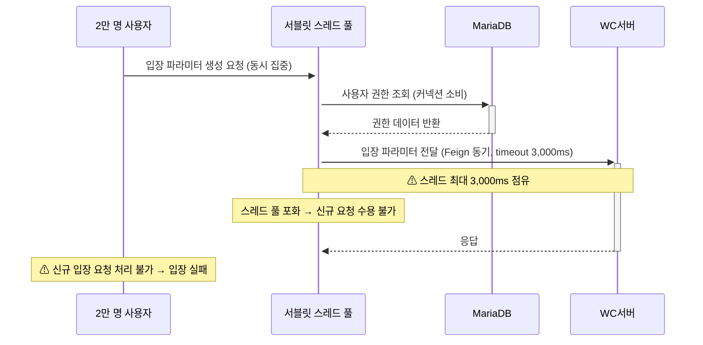
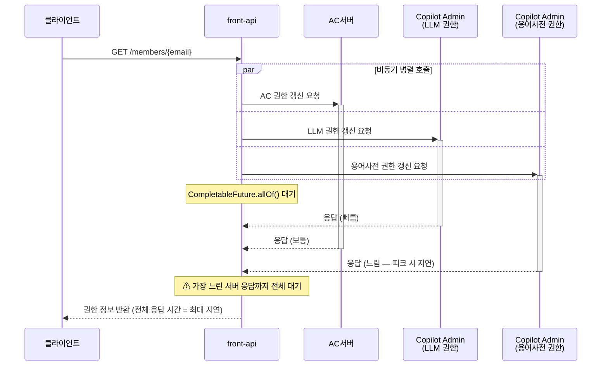
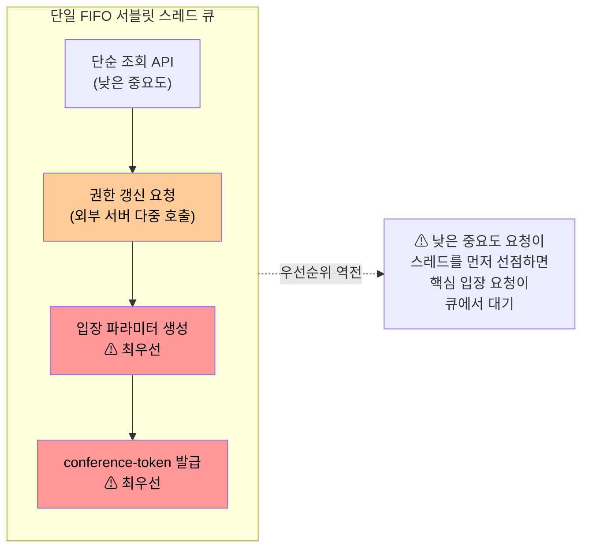
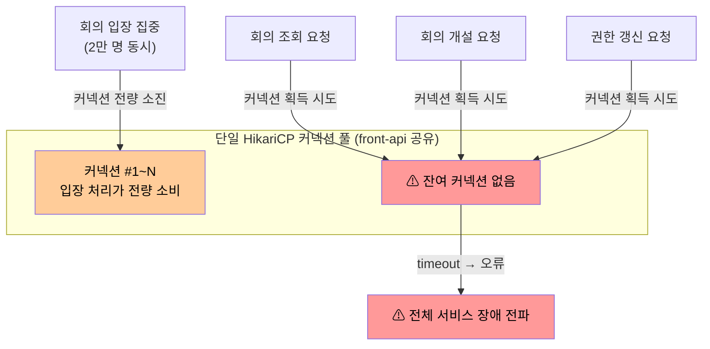
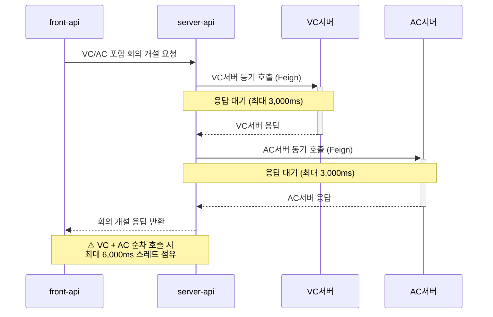
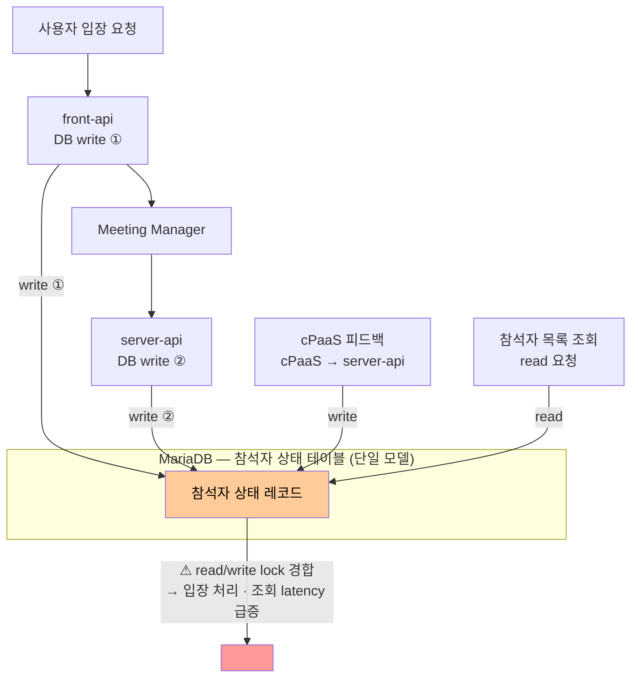

### 1.2. 이슈

As-is 구조에서 발생하고 있는 9개 비즈니스·기술 이슈를 식별하였다. 각 이슈는 요청 집중 구간(피크 시간대, 대규모 스트리밍 서비스 시작 시점 등)에서 심화되며, 서비스 가용성과 사용자 경험에 직접 영향을 미친다.

---

#### ISSUE-01. 2만 명 동시 입장 시 스레드·커넥션 풀 고갈

**현황**

2만 명 규모 스트리밍 서비스에서 방송 시작 직전 대규모 사용자가 동시에 입장 버튼을 클릭하는 순간적인 요청 집중이 발생한다. 입장 파라미터 생성 API는 DB에서 사용자 권한을 조회하고 입장 파라미터를 생성한 후, WC서버에 입장 파라미터(사용자 권한 정보 포함)를 Feign 동기 호출(read timeout 3,000ms)로 전달하고 응답을 받아 반환한다.

현재 시스템은 요청을 완충하거나 처리 속도를 조절하는 큐·버퍼 메커니즘 없이, 모든 요청이 단일 서블릿 스레드 풀에 직접 유입된다.

**문제점**

- WC서버에 입장 파라미터를 전달하는 Feign 동기 호출 동안 해당 요청의 스레드가 최대 3,000ms 점유 상태로 대기한다.
- 2만 요청이 순간적으로 집중될 경우 서버 스레드 풀 고갈과 DB 커넥션 고갈이 동시에 발생할 수 있다.
- 스레드 고갈 시 신규 요청에 대한 응답 자체가 불가능해지며, 입장 실패 사용자 경험으로 이어진다.

**영향**

- 2만 명 동시 입장 시 DB 커넥션 풀 사용률 80% 초과 위험 (→ QA-02 위반 위험)
- 스레드 고갈로 인한 핵심 기능 성공률 하락 (→ QA-04 위반 위험)
- WC서버 응답 지연 시 입장 처리 전반 지연

---

#### ISSUE-02. 로그인 시 권한 갱신 외부 서버 종속과 서버사이드 캐시 부재

**현황**

로그인(`POST /sign-in`) 완료 후 클라이언트는 자동으로 회원 정보 조회 API(`GET /members/{email}`)를 호출한다. 이 API는 AC서버(AC 회의 권한 갱신), Copilot Admin 서버(LLM 권한), Copilot Admin 서버(용어사전 권한) 등 다수의 외부 서버에 비동기 병렬 호출을 수행하고, `CompletableFuture.allOf()`로 모든 응답이 수신된 후 결과를 반환한다.

AC·LLM·용어사전 권한은 회사 계약 및 관리자 설정 기반으로 변경 빈도가 낮음에도, 서버사이드 캐시 없이 매 로그인마다 외부 서버에 갱신을 요청하는 구조다.

**문제점**

- 비동기 병렬 호출이지만 모든 서버의 응답을 기다리므로, 가장 느린 외부 서버의 응답 시간이 전체 응답 시간을 결정한다.
- 서버사이드 캐시 부재로 인해 변경 빈도가 낮은 권한 데이터임에도 매 로그인마다 모든 외부 서버에 갱신을 요청하여 불필요한 외부 호출이 반복된다.
- 향후 연계 서버 증가가 예정되어 있어 `allOf()` 대기 구조에서 구조적 지연이 심화될 것으로 예상된다.
- 업무 시작 시간대 동시 로그인 집중 시, 외부 서버에 대한 요청도 동시에 집중되어 외부 서버 응답 지연이 가중된다.

**영향**

- 피크 시간대 로그인 응답 시간 1초 초과 위험 (→ QA-01 위반 위험)
- 외부 서버 중 하나라도 응답 지연 발생 시 전체 로그인 흐름 지연
- 캐시 없이 반복되는 외부 호출이 피크 시간대 외부 서버 부하를 가중시키는 악순환
- 연계 서버 증가에 따른 구조적 성능 악화

---

#### ISSUE-03. 회의 입장 요청과 단순 조회의 처리 우선순위 미분리

**현황**

front-api의 서블릿 스레드 풀은 모든 API 요청을 단일 큐(FIFO)로 수신하여 처리한다. conference-token 발급·입장 파라미터 생성 등 회의 입장 처리, 단순 조회 API, 권한 갱신 요청 등 중요도와 처리 비용이 서로 다른 요청이 동일한 우선순위로 경쟁한다.

**문제점**

- 요청 집중 구간에 단순 조회 API가 스레드를 점유하면, 최우선으로 처리되어야 할 conference-token 발급·입장 파라미터 생성 요청이 큐에서 대기하게 된다.
- 처리 비용이 높은 권한 갱신(외부 서버 다중 호출)이 동시에 유입될 경우 입장 요청의 지연이 더욱 심화된다.
- 요청 유형 간 처리 순서를 제어할 수단이 없어, 트래픽 집중 시 중요한 요청부터 처리하는 전략적 대응이 불가능하다.

**요청 집중 구간에서의 심화**

오전 9시·오후 1시 업무 시작 시간대 및 오후 정시 트래픽 집중 구간에는 회의 입장·로그인·단순 조회 요청이 동시에 쏟아진다. 이 구간에서 우선순위 제어 없이 모든 요청이 동등하게 처리되면, 서비스 품질 기준상 가장 중요한 회의 입장 처리가 덜 중요한 요청에 의해 지연되는 역전 현상이 발생한다.

**영향**

- 요청 집중 구간에 회의 입장 latency 증가 및 사용자 경험 저하
- 중요도가 낮은 요청이 스레드 자원을 선점하여 시스템 전체 응답성 저하
- 트래픽 급증 시 회의 입장 실패 가능성 증가

---

#### ISSUE-04. 회의 입장 집중 시 단일 커넥션 풀 고갈의 전체 서비스 장애 전파

**현황**

front-api와 server-api는 단일 코드베이스에서 역할별로 배포되므로 인스턴스는 분리되어 있지만, 각 인스턴스 내부에서는 회의 입장 처리, 회의 조회, 회의 개설, 권한 갱신 등 모든 기능이 단일 HikariCP 커넥션 풀을 공유한다. 기능 단위로 커넥션 풀이 분리되어 있지 않아, 특정 기능의 DB 부하가 같은 인스턴스 내 전체 기능에 영향을 미치는 구조다.

> **ISSUE-01과의 구분**: ISSUE-01은 Feign 동기 호출로 인한 스레드 점유가 커넥션 소진으로 이어지는 발생 경로를 다룬다. 본 이슈는 그렇게 고갈된 풀이 단일 공유 구조이기 때문에 피해가 다른 기능으로 번지는 전파 구조를 다룬다.

**문제점**

- 2만 명 동시 입장 처리 시 입장 관련 DB 쿼리가 커넥션 풀 전체를 소진할 수 있다.
- 커넥션 풀 고갈 시 회의 조회, 회의 개설 등 다른 기능도 DB 접근이 불가능해진다.
- 특정 기능의 트래픽 집중이 전체 서비스 장애로 전파되는 연쇄 장애 구조다.
- 커넥션 획득 대기 시간 초과(timeout)가 연쇄적으로 발생하여 오류 응답이 급증한다.

**영향**

- 특정 기능의 커넥션 고갈 시 전체 서비스 가용성 저하 (→ QA-03 위반 위험)
- 핵심 기능(회의 조회, 회의 개설) 성공률 99.9% 미달 위험 (→ QA-04 위반 위험)
- 장애 범위가 입장 처리 기능을 넘어 전체 서비스로 확대

---

#### ISSUE-05. 외부 벤더 서버 동기 호출 연쇄로 인한 회의 개설 지연

**현황**

VC 또는 AC가 포함된 회의 개설 요청은 front-api에서 유효성 검사와 전처리를 마친 후 Meeting Manager를 거쳐 server-api로 전달된다. server-api는 VC서버, AC서버 등 외부 벤더 연동 서버에 **Feign(동기)** HTTP 호출을 수행하고, 모든 응답을 수신한 뒤 포털 서버 응답을 반환한다. 현재 Feign 타임아웃은 connect 1,000ms / read 3,000ms로 전체 외부 호출에 일괄 적용되며, 서버별 타임아웃 세분화나 차등 장애 차단 메커니즘 없이 운영된다.

**문제점**

- server-api의 VC/AC 벤더 서버 응답 지연이 포털 서버의 회의 개설 응답 지연으로 직접 연쇄된다.
- VC, AC 각 서버의 지연이 누적될 경우 응답 시간이 합산되어 증가한다.
- 피크 시간대에는 외부 서버 자체도 부하 증가로 인해 응답 지연이 증가하는 경향이 있다.
- 외부 서버 중 하나가 느려지거나 장애가 발생하면 해당 호출 스레드가 read timeout(3,000ms)까지 점유 상태로 유지된다. VC + AC 순차 호출 시 최대 **6,000ms** 스레드 고정이 가능하다.

**영향**

- 회의 개설 응답 시간 증가 (→ QA-01 위반 위험)
- 외부 서버 중 하나의 지연이 전체 개설 흐름을 지연시키는 구조
- 피크 시간대 회의 개설 성공률 저하 위험 (→ QA-04 위반 위험)

---

#### ISSUE-06. 외부 벤더 서버별 차등 장애 격리 정책 부재로 인한 포털 전체 가용성 저하

**현황**

포털 서버는 WC서버, VC서버, AC서버, AI서버, Copilot Admin 서버 등 다수의 외부 서버와 Feign(동기, read timeout 3,000ms) HTTP 호출로 연동한다. Feign에는 Hystrix 기반 서킷 브레이커가 적용되어 있으나, 전역 단일 설정으로 모든 외부 서버에 동일한 임계값이 적용된다. WC서버(입장 처리 필수, 빠른 감지 필요)·Copilot Admin 서버(DB 폴백 가능, 관대한 임계값 허용)·AC서버(선택적 연계)처럼 서버마다 장애 허용 범위와 복구 전략이 다름에도 차등 정책 없이 운영된다. 또한 Hystrix는 Netflix가 유지보수 중단을 선언한 이후 Spring Cloud에서도 공식 지원이 종료되어, Spring Boot 3.x 환경에서 장기적으로 신뢰할 수 없는 상태다.

**문제점**

- 외부 서버 장애 시 해당 호출 스레드가 3,000ms(read timeout)까지 점유되어 사실상 스레드 누수가 발생한다.
- 전역 일괄 CB 정책으로는 특정 외부 서버 장애를 서버 특성에 맞게 격리하지 못해, 해당 기능을 넘어 포털 서버 전체 가용성 저하로 이어진다.
- 장애 외부 서버와 무관한 기능(회의 조회 등)도 스레드 풀·커넥션 풀 고갈로 인해 함께 영향을 받는다.
- 연계 서버 수가 많을수록 장애 발생 가능 지점이 늘어 전체 장애 확률이 구조적으로 증가한다.

**영향**

- 외부 서버 한 곳의 장애가 포털 서버 전체 기능 중단으로 확대 (→ QA-04 위반 위험)
- 외부 서버 복구 전까지 포털 서비스 전체 가용성 저하 (→ QA-03 위반 위험)
- 장애 범위와 원인 파악이 어려워 복구 대응 시간 증가

---

#### ISSUE-07. 회의 입장·피드백 동시 유입 시 참석자 상태 DB lock 경합

**현황**

미팅 포털 서버는 회의 상태 변경(Command)과 조회(Query) 요청을 동일한 DB 테이블·도메인 모델로 처리한다. 하나의 미팅에 수십~수천 명이 동시에 참여하는 상황에서 입장, 퇴장, 참석자 추가/삭제, 회의/참석자의 권한 변경 등 빈번한 상태 변경이 발생하는 동시에, 참석자 목록·대기실 인원·미팅 상태 등 다수의 조회 요청도 함께 유입된다.

write 경합의 발생 경로는 두 가지다:
- **사용자 요청 경유**: `User → front-api(DB write) → Meeting Manager → server-api(DB write)` — 단일 입장 처리에서 front-api와 server-api가 각각 독립적인 트랜잭션으로 DB write를 수행한다.
- **피드백 흐름 경유**: `cPaaS → server-api → DB write` (퇴장, 연결 끊김 등 참석자 상태 변경)

**문제점**

- Command(상태 변경)와 Query(조회)가 동일 DB 레코드에 대해 read/write lock을 경쟁하여 lock 경합이 발생한다.
- 사용자 입장 처리 1건에 front-api write → server-api write의 두 단계 트랜잭션이 순차 실행된다. 두 트랜잭션 사이 구간에 조회 요청이 끼어들면 중간 상태를 읽거나 block되며, 동시 입장 시 사용자 요청 경유 write만으로도 최대 2배의 write 트랜잭션이 집중된다.
- write 작업이 집중되면 조회 쿼리의 응답 latency가 급격히 증가하고, 반대로 조회 요청이 몰리면 입장 파라미터 생성처럼 DB write가 필요한 처리가 지연된다.

**요청 집중 구간에서의 심화**

오후 정시 burst 또는 대규모 스트리밍 서비스처럼 수천 명이 동시에 입장하는 구간에서는 사용자 입장 요청(write), cPaaS 피드백(write), 참석자 목록·대기실 상태 조회(read) 세 유형이 동시에 폭발적으로 증가하며 단일 DB 모델에 부하가 집중된다. 가장 중요한 회의 입장 처리 자체가 피드백 write 및 조회 트래픽에 의해 지연되는 상황이 발생한다.

**영향**

- 대규모 미팅 시작 시점에 입장 처리 및 참석자 목록 조회 latency 동시 증가
- DB lock 경합으로 인한 회의 입장 처리 지연 및 타임아웃 위험
- 조회 확장과 상태 변경 처리 확장을 독립적으로 수행할 수 없어 수평 확장 효율 저하

---

#### ISSUE-08. 외부 연계 시스템 증가에 따른 단일 코드베이스 의존성 누적

**현황**

포털 서버는 10개 지역의 WC서버, 3개 지역의 VC서버, AC서버를 비롯해 신규 도입된 AI서버, Copilot Admin 서버, 연계시스템 A·B·C 등 10개 이상의 외부 시스템과 통합 운영된다. 서비스 확대(대외 고객사, 공공기관, 스트리밍 서비스)에 따라 연계 대상은 계속 증가하는 추세이며, 모든 연계 로직이 단일 코드베이스에 집중되어 있다.

**문제점**

- 신규 외부 시스템 연계 추가 시 포털 서버 전체 코드를 수정하고 전체를 재배포해야 한다.
- 특정 연계 시스템의 인터페이스 변경이 동일 코드베이스 내 다른 연계 로직에 의도치 않게 영향을 미칠 수 있다.
- 단일 코드베이스에 모든 연계가 집중되어 있어, 연계 수가 늘어날수록 변경·운영·장애 원인 파악의 복잡도가 증가한다.

**요청 집중 구간에서의 심화**

- **선별적 격리 불가**: 특정 연계 설정을 긴급 조정하려면 전체 서비스 재배포를 거쳐야 한다. 피크 대응 중 즉각적인 정책 조정이 사실상 불가능하다.
- **연계별 독립 확장 불가**: 특정 연계 경로에 트래픽이 집중될 때 해당 연계 처리만 선택적으로 수평 확장하거나 리소스를 재배분하는 것이 불가능하다.
- **장애 원인 파악 지연**: 피크 구간에 장애가 발생했을 때 10개 이상의 연계가 동일 코드베이스에 혼재되어 있으면 원인이 되는 연계 시스템을 신속히 특정하기 어렵다.

**영향**

- 신규 연계 추가·변경 시마다 전체 서비스 재배포가 강제되어 서비스 가용성에 영향
- 연계 시스템 증가에 따른 코드 복잡도 증가로 개발·운영 효율 저하
- 개별 연계 시스템의 독립적 확장·교체가 불가능하여 서비스 진화 속도 저하
- 요청 집중 구간 대응을 위한 연계별 세밀한 정책 조정(타임아웃·격리·스로틀링)이 불가능하여 피크 대응 전략의 실효성 저하

---

#### ISSUE-09. 예약 회의 기반 트래픽 예측에도 선제 대응 구조 부재

**현황**

미팅 서비스의 트래픽 집중 패턴은 상당 부분 예측 가능하다. 오전 9시·오후 1시 등 업무 시작 시간대의 일별 반복 패턴, 오후 정시 회의 시작 집중에 따른 트래픽 급증, 사전 예약된 대규모 스트리밍 서비스(2만 명 규모) 등은 예약 회의 데이터와 참석자 수를 통해 집중 시점과 규모를 미리 파악할 수 있다.

그러나 현재 시스템은 이러한 예측 정보를 활용하는 구조를 갖추지 못하고 있으며, 트래픽이 실제로 집중된 이후에 반응적으로 처리하는 구조다.

**문제점**

- 예약 회의 데이터와 참석자 수가 DB에 존재함에도 이를 활용한 사전 대응(캐시 워밍, 커넥션 예열 등)이 이루어지지 않는다.
- 트래픽 집중 직전에 유입되는 초기 요청이 캐시 미스와 cold start 상태에서 처리되어 응답 latency가 가장 높은 시점에 사용자 경험이 가장 나빠진다.
- 피크 트래픽이 지속되는 동안 과부하 상태에서 요청을 처리하면서 시스템 전체 안정성이 저하되지만, 부하를 분산하거나 지연 허용이 가능한 요청을 조절하는 수단이 없다.

**요청 집중 구간에서의 심화**

피크 트래픽은 예고 없이 오는 것이 아니라 예약 데이터로 충분히 예측 가능하다. 그럼에도 아무런 선제 조치 없이 집중 구간을 맞이하면, 초입에서 캐시 미스·커넥션 풀 소진·외부 서버 연쇄 호출이 겹쳐 시스템이 가장 취약한 상태에 놓이게 된다. 2만 명 규모 스트리밍 서비스처럼 특정 시점에 대규모 동시 입장이 예정된 경우 이 위험은 더욱 크다.

**영향**

- 피크 집중 구간 초입에 캐시 미스 집중으로 인한 지연 증폭 (cold start 문제)
- 예측 가능한 과부하에 대비한 사전 리소스 준비 불가로 서비스 안정성 저하
- 피크 구간에 덜 중요한 요청 유입을 조절하는 throttling 수단 부재로 핵심 처리 경로 보호 불가
