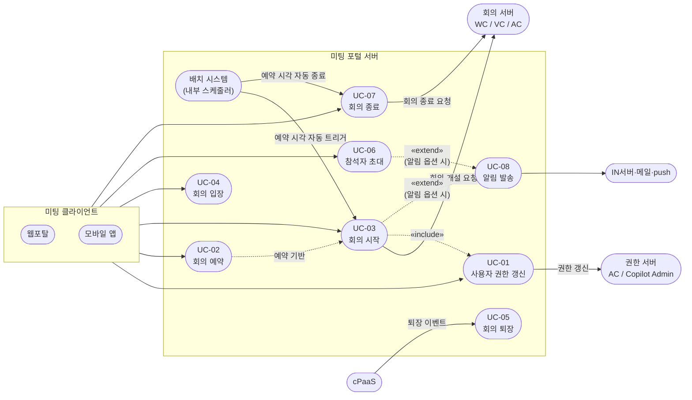

### 2.1. 기능 요구사항

본 절은 미팅 포털 서버 아키텍처 개선 설계의 대상이 되는 기능 요구사항을 정의한다. 각 요구사항은 유스케이스로 상세화되며, 식별된 이슈(→ 1.2 이슈 참조)와 연결된다.

#### 2.1.1. 기능 요구사항 목록

| ID | 요구사항명 | 설명 | 우선순위 | 관련 유스케이스 | 관련 이슈 |
| :---: | ----- | ----- | :---: | ----- | ----- |
| FR-01 | 사용자 권한 갱신 | 로그인 완료 후 AC서버로부터 AC 권한을, Copilot Admin 서버로부터 LLM 권한·용어사전 권한을 갱신하여 반환한다. 피크 시간대에도 안정적으로 처리되어야 한다. | 상 | UC-01 | ISSUE-02 |
| FR-02 | 회의 예약 | 미래 시점의 회의를 사전 예약한다. 예약 데이터(시작 시각, 참석자 수)는 피크 트래픽 예측 및 선제 대응(캐시·커넥션 워밍)의 기반이 된다. | 중 | UC-02 | ISSUE-09 |
| FR-03 | 회의 시작 | 사용자 또는 배치 시스템에 의해 트리거되어 회의를 시작한다. 외부 서버(WC/VC/AC) 호출을 포함하며, 회의 시작 시점에 사용자 권한 갱신이 수행된다. 동기 호출 구간을 최소화하여 응답 시간을 단축한다. | 상 | UC-03 | ISSUE-05, ISSUE-06 |
| FR-04 | 회의 입장 처리 | 입장 파라미터를 생성하여 응답한다. 8만 명 동시 입장 상황에서도 안정적으로 처리되어야 한다. | 상 | UC-04 | ISSUE-01, ISSUE-03 |
| FR-05 | 참석자 상태 피드백 처리 | 인미팅 클라이언트 퇴장·연결 끊김 등 이벤트를 cPaaS로부터 수신하여 참석자 상태를 DB에 반영한다. | 상 | UC-05 | ISSUE-07 |
| FR-06 | 참석자 초대 | Knox 임직원 포탈 서버를 통해 참석자를 검색하고 회의에 초대한다. | 중 | UC-06 | ISSUE-04, ISSUE-07 |
| FR-07 | 회의 종료 | 진행 중인 회의를 종료하고 외부 서버(WC/VC/AC)에 종료를 전파한다. | 중 | UC-07 | ISSUE-05, ISSUE-06 |
| FR-08 | 회의 초대/참석 알림 발송 | 회의 초대 및 참석 관련 알림을 IN서버(SMS), 메일 서버, push 서버를 통해 발송한다. 알림 발송 실패가 핵심 회의 기능에 영향을 주지 않아야 한다. | 중 | UC-08 | ISSUE-05, ISSUE-06, ISSUE-08 |

<em>[표 13] 기능 요구사항 목록</em>

#### 2.1.2. 외부 연계 시스템 참조

기능 요구사항 수행에 관련된 외부 연계 시스템은 다음과 같다.

| 시스템 | 역할 | 관련 기능 요구사항 |
| ----- | ----- | ----- |
| WC서버 | 웹 컨퍼런스 시작·종료 | FR-03, FR-07 |
| VC서버 | 비디오 컨퍼런스 시작·종료, 회의실 참석 처리 | FR-03, FR-07 |
| AC서버 | 오디오 컨퍼런스 시작·종료, 전화 참석 처리, AC 권한 갱신 | FR-01, FR-03, FR-07 |
| Knox 임직원 포탈 서버 | 임직원 정보 조회를 통한 회의 참석자 검색 | FR-06 |
| cPaaS | 인미팅 클라이언트의 퇴장·연결 끊김 이벤트를 포털 서버로 전달 | FR-05 |
| 배치 시스템 | 예약 회의의 자동 시작 트리거 | FR-03 |
| Copilot Admin 서버 | LLM 권한 갱신, 용어사전 권한 갱신 | FR-01 |
| IN서버 (SMS) | SMS 알림 발송 | FR-08 |
| 메일 서버 | 이메일 알림 발송 | FR-08 |
| push 서버 | 모바일 push 알림 발송 | FR-08 |

<em>[표 14] 외부 연계 시스템 참조</em>

#### 2.1.3. Use Case 목록

**Use Case 목록표**

| UC ID | Use Case명 | 주요 행위자 | 관련 FR | 관련 이슈 |
| :---: | ----- | ----- | :---: | ----- |
| UC-01 | 사용자 권한 갱신 | 미팅 웹포탈, 미팅 모바일 앱 | FR-01 | ISSUE-02 |
| UC-02 | 회의 예약 | 미팅 웹포탈, 미팅 모바일 앱 | FR-02 | ISSUE-09 |
| UC-03 | 회의 시작 | 미팅 웹포탈, 미팅 모바일 앱, 배치 시스템 | FR-03 | ISSUE-05, ISSUE-06 |
| UC-04 | 회의 입장 | 미팅 웹포탈, 미팅 모바일 앱 | FR-04 | ISSUE-01, ISSUE-03 |
| UC-05 | 회의 퇴장 | 인미팅 클라이언트 (via cPaaS) | FR-05 | ISSUE-07 |
| UC-06 | 참석자 초대 | 미팅 웹포탈, 미팅 모바일 앱 | FR-06 | ISSUE-04, ISSUE-07 |
| UC-07 | 회의 종료 | 미팅 웹포탈, 미팅 모바일 앱 | FR-07 | ISSUE-05, ISSUE-06 |
| UC-08 | 회의 초대/참석 알림 발송 | 시스템 (자동 발송) | FR-08 | ISSUE-05, ISSUE-06, ISSUE-08 |

<em>[표 15] Use Case 목록</em>

**Use Case 관계**

- **«include» (UC-03 → UC-01)**: 회의 시작 시점에 사용자 권한 갱신이 수행된다.
- **조건부 실행 (UC-03 → UC-08)**: 예약 시 알림 발송 옵션이 설정된 경우에만 알림 발송이 수행된다.
- **조건부 실행 (UC-06 → UC-08)**: 참석자 초대 시 알림 발송 옵션이 설정된 경우에만 알림 발송이 수행된다.
- **UC-03 시작 경로 (2가지)**:
  - 즉시 개설: 미팅 클라이언트가 UC-03을 직접 트리거한다.
  - 예약 기반: UC-02(회의 예약) 데이터를 배치 시스템이 읽어 예약 시각에 UC-03을 자동 트리거한다.
- **UC-07 시작 경로 (2가지)**:
  - 수동 종료: 미팅 클라이언트가 UC-07을 직접 트리거한다.
  - 예약 기반 자동 종료: 배치 시스템이 예약 종료 시각에 UC-07을 자동 트리거한다.
- **선행 조건 (UC-05)**: 회의 입장(UC-04) 완료 후 인미팅 클라이언트가 실행된 상태에서 퇴장 이벤트가 발생한다.

**Use Case Diagram**

<!-- 이미지 파일명(draw.io → PNG 교체 시): report/images/2.1-usecase-diagram.png -->

<em>[그림 8] 미팅 포털 서비스 Use Case 다이어그램</em>

**UC-01. 사용자 권한 갱신**

| UC-01 | |
| :---: | :---- |
| 설명 | 로그인 완료 후 클라이언트가 자동으로 권한 갱신을 요청한다. 포털 서버가 AC서버(AC 권한)와 Copilot Admin 서버(LLM 권한·용어사전 권한)에 비동기 병렬 호출을 수행하고, 모든 응답 수신 후 갱신된 권한 정보를 클라이언트에 반환한다. |
| 행위자 | 미팅 웹포탈, 미팅 모바일 앱 |
| 선행조건 | 로그인이 완료되어 액세스 토큰이 발급된 상태이다. |
| 후행조건 | AC 권한, LLM 권한, 용어사전 권한이 반환된다. 정상 갱신된 권한은 DB에 저장되고, 외부 서버 오류·지연으로 갱신에 실패한 권한은 DB에 저장된 기존 값이 반환된다. |
| 기본동작 | 1. 클라이언트가 로그인 완료 직후 자동으로 회원 정보 조회(`GET /members/{email}?type=detail`)를 요청한다. 2. 포털 서버가 AC서버, Copilot Admin 서버(LLM 권한), Copilot Admin 서버(용어사전 권한)에 비동기 병렬 호출을 시작한다. 3. 포털 서버가 모든 외부 서버의 응답을 수신한다. 4. 포털 서버가 갱신된 권한 정보를 DB에 저장한다. 5. 포털 서버가 권한 정보를 포함한 회원 정보를 클라이언트에 반환한다. 6. 클라이언트가 응답을 수신하고 사용자에게 서비스 화면을 표시한다. |
| 추가동작 | **외부 서버 응답 지연**: timeout이 발생한 서버의 권한을 DB에 저장된 기존 값으로 대체하여 반환한다. **외부 서버 오류**: 오류가 발생한 서버의 권한을 DB에 저장된 기존 값으로 대체하여 반환한다. |

<em>[표 16] UC-01 사용자 권한 갱신</em>

**UC-02. 회의 예약**

| UC-02 | |
| :---: | :---- |
| 설명 | 사용자가 미래 시점의 회의를 사전 예약한다. 저장된 예약 정보(시작 시각, 참석자 수)는 배치 시스템의 자동 회의 시작 트리거 기반이 되며, 피크 트래픽 예측 및 선제 대응의 근거 데이터로 활용된다. |
| 행위자 | 미팅 웹포탈, 미팅 모바일 앱 |
| 선행조건 | 회의 개설 권한을 보유한 사용자가 로그인된 상태이다. |
| 후행조건 | 예약 정보가 DB에 저장되고, 배치 시스템이 예약 시각에 회의 시작(UC-03)을 자동 트리거할 수 있는 상태가 된다. |
| 기본동작 | 1. 사용자가 회의 제목, 시작 시각, 참석자, 회의 타입(WC/VC/AC) 등 예약 정보를 입력한다. 2. 포털 서버가 입력값의 유효성을 검사한다. 3. 예약 정보가 DB에 저장된다. 4. 예약 완료 안내가 클라이언트에 반환된다. |
| 추가동작 | **권한 없음**: 회의 개설 권한이 없는 사용자가 예약을 시도하면 포털 서버가 권한 오류를 반환한다. |

<em>[표 17] UC-02 회의 예약</em>

**UC-03. 회의 시작**

| UC-03 | |
| :---: | :---- |
| 설명 | 사용자가 즉시 회의를 시작하거나, 배치 시스템이 예약 시각에 자동으로 회의를 시작한다. front-api가 미팅 타입 결정·권한 확인·유효성 검사를 수행한 후 Meeting Manager에 회의 개설을 요청한다. Meeting Manager는 WC 채널 설정(cPaaS 경유)을 처리하고, VC/AC가 포함된 경우 개설 요청을 server-api에 전달한다. |
| 행위자 | 미팅 웹포탈, 미팅 모바일 앱, 배치 시스템 |
| 선행조건 | 회의 개설 권한을 보유한 사용자가 로그인된 상태이다. 배치 트리거의 경우 회의 예약(UC-02)이 완료된 상태이다. |
| 후행조건 | 회의가 생성되어 외부 서버(WC/VC/AC)에 등록된다. 알림 발송 옵션이 설정된 경우 참석자 알림 발송(UC-08)이 수행된다. |
| 기본동작 | 1. 사용자 또는 배치 시스템이 회의 시작을 요청한다. 2. 포털 서버가 회의 타입을 결정하고 사용자의 권한(SDC)을 확인한다. 3. 사용자 권한 갱신(UC-01)이 수행된다. 4. front-api가 참석자 유효성 검사 및 전처리를 수행한 후 Meeting Manager에 회의 개설을 요청한다. &nbsp;&nbsp;4.1 WC 포함 회의: Meeting Manager → cPaaS (채널 생성·actor 매핑)으로 WC 개설이 완결된다. WC 전용 회의는 server-api 호출 없이 완결된다. &nbsp;&nbsp;4.2 VC 또는 AC 포함 회의: Meeting Manager → server-api → VC서버/AC서버 (Feign 동기 호출). 외부 연동 실패 시 전체 회의 생성이 실패한다. 5. 회의 생성이 완료된다. 알림 발송 옵션이 설정된 경우 알림 발송(UC-08)이 수행된다. |
| 추가동작 | **외부 벤더 서버 응답 지연**: VC/AC서버 read timeout(3,000ms) 만료 후 전체 회의 생성 요청이 실패로 반환된다. VC + AC 순차 호출 시 최대 6,000ms 스레드가 고정될 수 있다. **외부 벤더 서버 장애**: VC/AC서버 오류 응답 시 전체 회의 생성 요청이 실패한다. **권한 없음**: 회의 개설 권한이 없는 사용자가 시작을 요청하면 포털 서버가 권한 오류를 반환한다. |

<em>[표 18] UC-03 회의 시작</em>

**UC-04. 회의 입장**

| UC-04 | |
| :---: | :---- |
| 설명 | 사용자가 예약 상태 또는 진행 중인 회의에 입장한다. 포털 서버가 DB에서 입장 가능 여부를 확인하고 conference-token을 발급한 후, Meeting Manager에 Feign 동기 호출(read timeout 3,000ms)로 참석자 입장 관련 정보를 조회한다. 포털 서버는 MM 응답값과 다른 값들을 조합하여 wyzProParam(클라이언트 규격)을 생성하고 웹/모바일에 반환한다. |
| 행위자 | 미팅 웹포탈, 미팅 모바일 앱 |
| 선행조건 | 입장 대상 회의가 예약 상태 또는 진행 중인 상태이다. |
| 후행조건 | 포털 서버가 wyzProParam을 웹/모바일에 반환하고, 웹/모바일이 런처를 통해 인미팅 클라이언트에 전달한다. 인미팅 클라이언트가 실행되어 사용자가 회의에 참여한 상태가 된다. |
| 기본동작 | 1. 사용자가 회의 번호, 회의 URL, 또는 참석자 목록에서 입장을 요청한다. 2. 포털 서버가 DB에서 입장 가능 여부를 확인한다. (참석자 초대 여부 또는 오픈 회의 여부 확인) 3. 확인이 통과되면 포털 서버가 conference-token을 발급한다. 4. 포털 서버가 Meeting Manager에 Feign 동기 호출(read timeout 3,000ms)로 참석자 입장 관련 정보를 조회한다. 5. 포털 서버가 Meeting Manager 응답값과 다른 값들을 조합하여 wyzProParam(클라이언트 규격)을 생성한다. 6. 포털 서버가 wyzProParam을 웹/모바일에 반환한다. 7. 웹/모바일이 런처를 통해 인미팅 클라이언트를 실행하며 wyzProParam을 전달한다. 클라이언트가 cPaaS에 접속 성공하면 회의에 참여한다. |
| 추가동작 | **입장 불가**: 사용자가 참석자로 초대되어 있지 않고, 오픈 회의도 아닌 경우 포털 서버가 입장 불가 오류를 반환한다. **Meeting Manager 응답 지연**: read timeout 만료 시 입장 요청이 실패로 반환된다. 8만 명 동시 입장 시 대량의 스레드가 동시에 점유 상태가 되어 스레드 풀 고갈 위험이 있다. **DB 커넥션 풀 고갈**: 동시 입장 집중으로 DB 커넥션 풀이 고갈되면 입장 처리가 실패하고, 단일 풀 공유 구조에서 다른 기능도 함께 영향을 받는다. |

<em>[표 19] UC-04 회의 입장</em>

**UC-05. 회의 퇴장**

| UC-05 | |
| :---: | :---- |
| 설명 | 인미팅 클라이언트에서 사용자가 퇴장하면 cPaaS를 통해 포털 server-api에 역방향으로 퇴장 이벤트가 전달되고, 참석자 상태가 DB에 반영된다. |
| 행위자 | 인미팅 클라이언트 (via cPaaS) |
| 선행조건 | 회의 입장(UC-04)이 완료되어 인미팅 클라이언트가 실행 중인 상태이다. |
| 후행조건 | 참석자 상태가 DB에 '퇴장'으로 업데이트된다. |
| 기본동작 | 1. 사용자가 인미팅 클라이언트에서 퇴장한다. 2. cPaaS가 포털 server-api에 퇴장 이벤트를 전달한다. 3. server-api가 참석자 상태를 DB에 업데이트한다. |
| 추가동작 | **비정상 연결 끊김**: 네트워크 단절 또는 클라이언트 강제 종료 시 cPaaS가 연결 타임아웃 감지 후 연결 끊김 이벤트를 포털 server-api에 전달한다. server-api가 참석자 상태를 '연결 끊김'으로 업데이트한다. **DB write 경합**: 대규모 미팅 시작 시점에 사용자 입장(write)과 cPaaS 피드백(write)이 동시에 집중되면 참석자 상태 테이블에 lock 경합이 발생한다. |

<em>[표 20] UC-05 회의 퇴장</em>

**UC-06. 참석자 초대**

| UC-06 | |
| :---: | :---- |
| 설명 | 진행 예정 또는 진행 중인 회의에 참석자를 추가 초대한다. 참석자 검색은 Knox 임직원 포탈 서버를 통해 이루어지며, 알림 발송 옵션이 설정된 경우 초대 알림 발송(UC-08)이 수행된다. |
| 행위자 | 미팅 웹포탈, 미팅 모바일 앱 |
| 선행조건 | 초대 권한을 보유한 사용자가 로그인된 상태이다. 초대 대상 회의가 존재하는 상태이다. |
| 후행조건 | 참석자 정보가 DB 및 외부 서버에 등록된다. 알림 발송 옵션이 설정된 경우 초대 알림 발송(UC-08)이 수행된다. |
| 기본동작 | 1. 사용자가 Knox 임직원 포탈 서버를 통해 초대할 참석자를 검색하고 선택한다. 2. 포털 서버가 외부 서버(WC/VC/AC)에 참석자 정보를 업데이트한다. 3. 참석자 정보가 DB에 저장된다. 4. 알림 발송 옵션이 설정된 경우 초대 알림 발송(UC-08)이 수행된다. |
| 추가동작 | **이미 참석 중인 사용자**: 이미 회의에 참석 중이거나 초대된 사용자를 중복 초대하면 포털 서버가 중복 안내 메시지를 반환한다. **참석자 검색 외부 시스템 연계 오류**: 참석자 검색 단계에서 외부 시스템 연계에 오류가 발생하면 참석자 목록을 불러올 수 없어 초대가 실패한다. |

<em>[표 21] UC-06 참석자 초대</em>

**UC-07. 회의 종료**

| UC-07 | |
| :---: | :---- |
| 설명 | 진행 중인 회의를 종료하고 WC/VC/AC 외부 서버에 종료를 전파한다. |
| 행위자 | 미팅 웹포탈, 미팅 모바일 앱 |
| 선행조건 | 회의가 진행 중인 상태이다. 종료 권한을 보유한 사용자가 로그인된 상태이다. |
| 후행조건 | 회의 상태가 DB에 '종료'로 업데이트된다. 외부 서버(WC/VC/AC)에 종료가 전파된다. |
| 기본동작 | 1. 사용자가 회의 종료를 요청한다. 2. 포털 server-api가 WC/VC/AC 서버에 종료를 전파한다. 3. 회의 상태가 DB에 '종료'로 업데이트된다. |
| 추가동작 | **외부 서버 종료 전파 실패**: WC/VC/AC 서버에 종료 전파 요청이 실패하면 포털 DB는 종료 처리되었으나 외부 서버 상태와 불일치가 발생한다. |

<em>[표 22] UC-07 회의 종료</em>

**UC-08. 회의 초대/참석 알림 발송**

| UC-08 | |
| :---: | :---- |
| 설명 | 회의 시작(UC-03) 또는 참석자 초대(UC-06) 시 알림 발송 옵션이 설정된 경우 IN서버(SMS), 메일 서버, push 서버를 통해 관련 알림을 발송한다. 알림 발송 실패가 회의 시작·참석자 초대 등 핵심 기능에 영향을 주지 않도록 처리된다. |
| 행위자 | 시스템 (UC-03 또는 UC-06에서 조건부 실행) |
| 선행조건 | 알림 발송 대상 참석자 목록이 존재한다. UC-03(회의 시작) 또는 UC-06(참석자 초대)에서 알림 발송 옵션이 설정된 상태이다. |
| 후행조건 | 알림 발송 요청이 IN서버(SMS), 메일 서버, push 서버에 전달된다. 발송 결과와 무관하게 상위 UC(UC-03 또는 UC-06)의 흐름이 정상 완료된다. |
| 기본동작 | 1. 상위 UC(UC-03 또는 UC-06)가 알림 발송 대상 목록을 전달한다. 2. 포털 서버가 IN서버(SMS), 메일 서버, push 서버에 발송을 요청한다. 3. 발송 요청 전달이 완료된다. |
| 추가동작 | **특정 채널 발송 실패**: 일부 채널에서 발송이 실패해도 다른 채널 발송 및 상위 UC의 정상 흐름에 영향을 주지 않는다. 실패 내역이 기록된다. |

<em>[표 23] UC-08 회의 초대/참석 알림 발송</em>

