### 3.2. 아키텍처 문제 분석 및 설계 전략

3.1 아키텍처 드라이버(AD)가 *무엇이 필요한지*를 정리한 것에 대응해, 본 절은 *어떻게 푸는지*를 결정한다. 각 AD에 대해 **기본 설계 전략(AS)**을 결정하고, 그 기본 결정이 1.4·2.3 제약과 결합하여 새로 부각되는 문제에 대해 **파생 설계 전략**을 연쇄적으로 결정한다. 파생 전략은 선행 AS의 결정을 전제로 존재하므로 AS 번호 순서가 곧 결정·의존 순서다.

각 AS는 **대척점이 명확한 둘 이상의 대안**을 비교하여 선정한다. 한 대안 *내부*에서 여러 요소를 결합하는 것은 허용하나, 서로 다른 대안을 *결합*하여 제3의 대안을 만드는 형태는 결정의 본질을 흐리고 트레이드오프 비교를 무력화하므로 평가 대상에서 제외한다.

#### 설계 전략 요약

| 순서 | AD | AS | 관련 ISSUE / AS | 해결할 문제 (트리거) | 대안 대척점 |
| :---: | ----- | ----- | ----- | ----- | ----- |
| 1 | AD-03·04·09 | AS-01. 입장 처리 도메인 경계 분리 | ISSUE-04·07·08 | 단일 DataSource·경계 부재로 Bulkhead·CQRS 적용 기반이 없음 | 현행 유지 ↔ 완전 MSA ↔ 선별적 모듈 분리 |
| 2 | AD-02·04·05 | AS-02. 입장 처리 경로 비동기 전환 | ISSUE-01·05·06 | 외부 동기 호출이 서블릿 스레드를 점유해 8만 건 동시 요청에 고갈 | 동기 유지 ↔ WebFlux 전면 ↔ @Async 하이브리드 |
| 3 | AD-01·04·05 | AS-03. 외부 권한 조회 다층 캐시 적용 | ISSUE-02·05·09 | 매 로그인 외부 서버 반복 호출로 응답 지연 | 캐시 없음 ↔ DB 캐시 ↔ L1+L2 계층 캐시 |
| 4 | AD-02 | AS-04. 입장 전용 처리 경로 확보 | ISSUE-01·03 | 단일 FIFO 큐에서 단순 조회가 입장 요청을 선점(우선순위 역전) | 단일 FIFO 유지 ↔ 우선순위 큐 재정렬 ↔ 전용 Connector 분리 |
| 5 | AD-04 | AS-05. 예약 기반 피크 자원 선제 초기화 | ISSUE-09 (AS-03 파생) | 피크 초입 캐시 miss 폭주(Thundering Herd) | 사후 대응 ↔ 고정 스케줄 워밍 ↔ 예약 데이터 동적 워밍 |
| 6 | AD-02·04 | AS-06. 피크 구간 요청 유입 제한 | ISSUE-03·09 (AS-05 파생) | 피크 구간 비핵심 요청이 핵심 경로 자원을 잠식 | 제한 없음 ↔ 균일 Rate Limiting ↔ 피크 예측 차등 Throttling |
| 7 | AD-04 | AS-07. 조회·입장 DB 경로 분리 | ISSUE-07 (AS-01 파생) | 입장 write와 조회 read가 Primary에서 노드 자원 경합 | 선택적 수동 라우팅 ↔ 이벤트 소싱 CQRS ↔ readOnly 트랜잭션 라우팅 |
| 8 | AD-03·04·05 | AS-08. 기능별 커넥션·스레드 Bulkhead 분리 | ISSUE-01·04·06 (AS-01 파생) | 단일 풀 공유로 입장 고갈이 전 기능·외부 장애로 전파 | 단일 풀 확대 ↔ 커넥션 풀만 분리 ↔ 이중 Bulkhead |
| 9 | AD-01·04·05 | AS-09. 외부 서버 장애 차단 및 계층 복구 | ISSUE-02·06·08 | 전역 단일 CB로 서버 특성별 정밀 제어 불가, Hystrix 중단 | Hystrix 유지 ↔ Resilience4j 균일 ↔ 서버별 차등 CB |
<p align="center"><em>[표 43] 아키텍처 문제 분석 및 설계 전략</em></p>

#### AS 결정 의존 그래프

기반 전략이 파생 전략의 전제가 되며, 이 의존 순서가 곧 AS 번호 순서다.

```
AS-01 (도메인 경계 분리)
  ├── AS-07 (DB 경로 분리): 경계 내 Command/Query 경로 분리
  └── AS-08 (Bulkhead 분리): 도메인 경계별 커넥션·스레드 풀 격리

AS-03 (다층 캐시)
  └── AS-05 (선제 초기화): 캐시 인프라가 있어야 피크 전 선제 적재 가능
        └── AS-06 (유입 제한): 선제 초기화 스케줄러의 피크 감지를 유입 제한과 공유

AS-02 (비동기 전환) · AS-04 (전용 경로) · AS-09 (외부 장애 차단): 선행 전제 없는 독립 전략
```


#### 3.2.1. AS-01. 입장 처리 도메인 경계 분리

**적용 대상:** AD-03, AD-04, AD-09 / ISSUE-04, ISSUE-07, ISSUE-08

**[설계 근거]**

현행 미팅 포털 서버는 Java Spring Boot 단일 코드베이스에서 front-api / server-api / admin-api 인스턴스로 역할을 분리해 배포한다. 코드 수준에서도 도메인별 패키지(member, auth, conference 등)와 외부 연계 패키지(api/meetingmanager, api/copilot, api/ac 등 서버별 분리)가 이미 존재한다. 그러나 이 분리는 **컨벤션 수준**에 머물러 있어, 파생 전략 적용을 가로막는 두 가지 구조적 문제가 아직 해소되지 않았다.

첫째, 도메인별 패키지가 나뉘어 있어도 모든 Repository가 단일 HikariCP DataSource를 공유한다. 기능별 커넥션 풀 분리(AS-08 Bulkhead 분리)를 적용하려면 `domain.entry`에 전용 DataSource Bean을 분리 주입해야 하는데, DataSource Bean이 하나로 묶여 있으면 입장 처리 Repository와 회의 조회 Repository를 서로 다른 풀에 귀속시킬 수단이 없다. 둘째, 도메인 간 참조 규칙이 없어 빌드 타임에 경계를 강제할 방법이 없다. 입장 처리 코드가 권한 갱신 도메인 구현체를 직접 참조해도 이를 잡아내지 못하며, 경계가 이렇게 지켜지지 않으면 AS-07·AS-08 파생 전략의 도메인별 경계 기준도 함께 흐려진다.

이 제약 조합에서 코드 경계를 세우는 단위가 세 가지 패러다임으로 갈린다.

- 경계를 강제하지 않고 현행 컨벤션 수준의 패키지 분리를 그대로 둔다.
- 서비스·DB·배포 단위를 도메인별로 물리적으로 완전 분리한다(MSA).
- 단일 코드베이스를 유지한 채 도메인 논리 경계를 세우고 빌드 타임 규칙으로 강제한다.

**후보1. 현행 구조 유지.**

도메인별 패키지와 외부 연계 패키지는 나뉘어 있지만, 모든 Repository가 단일 HikariCP DataSource를 공유하는 구조는 그대로다. 패키지만 갈렸을 뿐 하나의 DataSource를 함께 쓰다 보니, 입장 처리 Repository와 회의 조회 Repository를 서로 다른 풀에 귀속시킬 수단이 없다. DataSource Bean 분리 없이는 AS-08 Bulkhead 분리를 위한 기능별 커넥션 풀 귀속 기준이 없으며, ISSUE-04·ISSUE-08이 구조적으로 해소되지 않아 파생 전략의 전제 조건을 충족할 수 없다.

- 장점
  - 구조 변경이 없어 즉시 운영 가능하고 추가 학습·검증 비용이 없다.
- 단점
  - 단일 DataSource 공유가 유지되어 AS-08 Bulkhead 분리의 귀속 기준을 세울 수 없다.
  - 경계 규칙이 없어 ISSUE-04·08의 구조적 원인이 그대로 잔존한다.

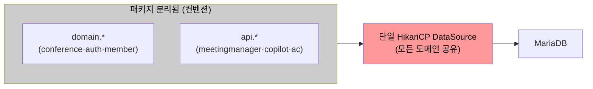
<p align="center"><em>[그림 9] 대안1: 현행 구조 유지 (단일 DataSource 공유)</em></p>

**후보2. 완전한 마이크로서비스 분리.**

서비스·DB·배포 단위를 도메인별로 완전히 독립시킨다. 각 서비스가 자기 DB·프로세스를 소유하므로 코드 경계가 물리적으로 명확해지고 커넥션 풀 고갈도 서비스 경계 안에서 끝난다. 그러나 단일 DB 트랜잭션으로 처리되던 "입장 가능 여부 확인 → conference-token 발급 → 입장 파라미터 생성"이 서비스 경계를 넘게 되어, front-api와 server-api 간 트랜잭션을 Saga 패턴 등 분산 트랜잭션으로 재설계해야 한다. 메시지 브로커 등 신규 인프라 도입이 전제되어 C-04(점진적 적용) 제약을 위반하며, 분산 트랜잭션 설계 복잡도도 크게 늘어난다.

- 장점
  - 서비스·DB·배포 단위가 물리적으로 분리되어 결함·자원 고갈이 서비스 경계 안에 갇힌다.
- 단점
  - 분산 트랜잭션(Saga) 재설계와 신규 인프라가 필요해 C-04(점진적 적용)를 위반한다.
  - 서비스 간 통신·운영 오버헤드가 단기 개선 사이클에서 소화하기 어렵다.

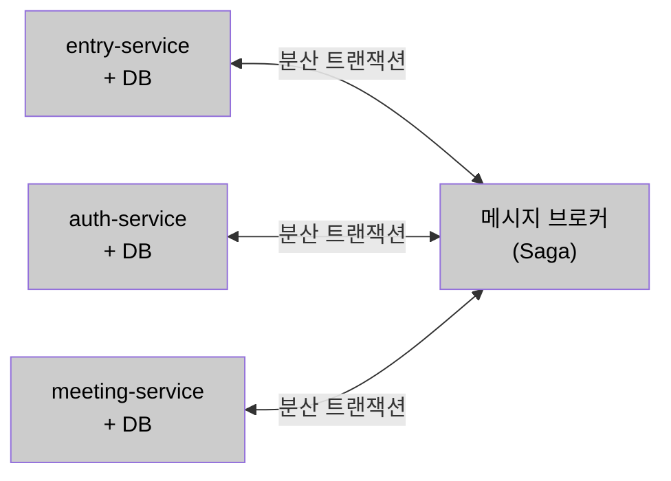
<p align="center"><em>[그림 10] 대안2: 완전한 마이크로서비스 분리</em></p>

**후보3. 선별적 도메인 모듈 분리 (채택).**

기존 도메인 패키지 구조를 유지하면서 `domain.entry` 전용 DataSource Bean을 분리 설정하여 AS-08 Bulkhead의 기술적 전제 조건을 마련한다. 도메인 간 참조는 인터페이스만 허용하도록 ArchUnit으로 빌드 타임에 강제하여 직접 구현체 참조를 차단한다. 같은 JVM·배포 단위를 유지하므로 분산 트랜잭션이 발생하지 않으면서, 이렇게 세운 논리 경계가 AS-08·AS-07 파생 전략이 적용될 범위의 기준이 된다.

- 장점
  - 배포 구조·기술 스택 변경 없이 AS-08·AS-07 파생 전략의 전제 조건(전용 DataSource·경계 규칙)을 확보한다.
  - 단일 DB 트랜잭션이 유지되어 분산 트랜잭션 문제가 발생하지 않는다.
  - 필요 시 특정 도메인 모듈을 독립 서비스로 추출하는 점진적 MSA 발판이 된다.
- 단점
  - ArchUnit 경계 규칙을 지속 관리해야 하며 위반 시 빌드가 실패한다.
  - 같은 JVM·프로세스를 공유해 완전 MSA 수준의 물리적 격리는 얻지 못한다.

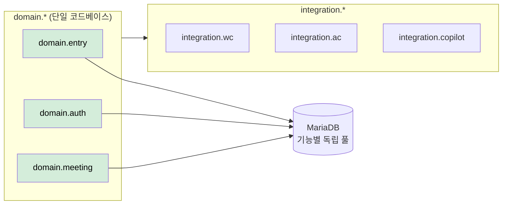
<p align="center"><em>[그림 11] 대안3: 선별적 도메인 모듈 분리 (채택)</em></p>

**[후보별 비교 검토]**

| 비교 축 | 후보1. 현행 구조 유지 | 후보2. 완전한 MSA 분리 | 후보3. 선별적 도메인 모듈 분리 (채택) |
| --- | --- | --- | --- |
| 경계 단위 | 컨벤션(패키지) | 서비스·DB·배포 물리 분리 | 코드 논리 경계(단일 코드베이스) |
| DataSource 분리 기반 | ✗ 단일 풀 공유 | ○ 서비스별 독립 | ○ domain.entry 전용 Bean |
| 경계 규칙 강제 | ✗ 미강제 | ○ 물리적 | ○ ArchUnit 빌드 타임 |
| 트랜잭션 경계 | 단일 DB 유지 | ✗ 분산 트랜잭션(Saga) | ○ 단일 DB 유지 |
| C-04 점진적 적용 | ○ | ✗ 신규 인프라·재설계 | ○ 배포·스택 변경 없음 |
| ISSUE-04·07·08 해소 | ✗ | ○ (과잉) | ○ |
| 물리적 장애 격리 | ✗ | ○ | △ (런타임 격리는 AS-08 보완) |

<p align="center"><em>[표 46] AS-01 후보 비교 (도메인 경계 분리)</em></p>

**후보3(선별적 도메인 모듈 분리)을 채택한다.**

배포 구조와 기술 스택을 바꾸지 않으면서 AS-08·AS-07 파생 전략의 전제 조건(전용 DataSource·경계 규칙)을 확보하는 유일한 안이기 때문이다.

후보1은 단일 DataSource 공유가 유지되어 AS-08 Bulkhead 분리의 귀속 기준을 세울 수 없고 ISSUE-04·08이 구조적으로 잔존한다. 후보2는 가장 강한 물리적 격리를 주지만 두 가지가 걸린다.

- 단일 DB 트랜잭션 경계가 서비스 경계를 넘어 Saga 등 분산 트랜잭션 재설계가 필요하다.
- 메시지 브로커 등 신규 인프라 도입이 C-04(점진적 적용)를 위반한다.

후보3은 물리적 격리가 완전 MSA에 못 미치는 약한 격리지만, 단일 코드베이스·단일 DB 트랜잭션을 유지한 채 논리 경계만 세워 파생 전략의 전제 조건을 충족하고, 부족한 런타임 격리는 AS-08(커넥션·스레드 Bulkhead)이 보완한다.

**[설계 원칙]**

1. **경계 기준:** 도메인은 `domain.entry`·`domain.auth`·`domain.meeting`, 외부 연계는 `integration.*`로 패키지 경계를 세운다.
2. **참조 규칙:** 도메인 간 참조는 인터페이스만 허용하고 직접 구현체 참조를 금지하며, ArchUnit으로 빌드 타임에 강제한다.
3. **DataSource 분리:** `domain.entry` 전용 DataSource Bean(`entryDataSource`)을 분리해 AS-08 Bulkhead 분리의 귀속 기준을 마련한다.
4. **외부 연계 캡슐화:** `integration.*`에 외부 서버별 Feign Client와 AS-09 CB를 캡슐화해 연계 로직을 포털 도메인에서 격리한다.

**[위험 요인]**

- **R1. ArchUnit 규칙 관리 부담(위반 시 빌드 실패):** CI 파이프라인에 규칙을 포함해 자동 검증으로 흡수
- **R2. 같은 JVM 공유로 물리적 격리 제한:** 런타임 자원 격리는 AS-08(커넥션·스레드 Bulkhead)으로 보완
- **R3. 경계 침식(직접 참조 재발):** 인터페이스 전용 참조 원칙 + ArchUnit 상시 검증

**[파생 전략]:** AS-08(Bulkhead 분리): 도메인 경계별 HikariCP 풀 격리 / AS-07(DB 경로 분리): 경계 내 Command·Query 분리

#### 3.2.2. AS-02. 입장 처리 경로 비동기 전환

**적용 대상:** AD-02, AD-04, AD-05 / ISSUE-01, ISSUE-05, ISSUE-06

**[설계 근거]**

ISSUE-01의 핵심 병목은 Meeting Manager Feign 동기 호출 구간이다. "DB 입장 가능 여부 확인 → conference-token 발급" 단계까지는 포털 서버 내부에서 빠르게 처리된다. 그러나 "Meeting Manager에 참석자 입장 정보 조회(Feign 동기, 3,000ms)"가 완료될 때까지 해당 요청의 서블릿 스레드가 블로킹된다. MM 응답값을 받아야 wyzProParam을 생성하고 클라이언트에 응답할 수 있으므로 이 호출은 생략할 수 없다. 8만 건이 동시에 이 단계에 도달하면 8만 개의 스레드가 Meeting Manager 응답을 대기하는 상태가 된다. 해결의 핵심은 **외부 서버 호출 구간에서 서블릿 스레드를 즉시 반환**시키는 것이다.

이 제약 조합에서 외부 호출 구간의 스레드 점유를 푸는 방식이 세 가지 패러다임으로 갈린다.

- 동기 모델을 유지한 채 스레드 풀을 키워 간접 완충한다.
- 이벤트 루프 기반 논블로킹 모델로 전면 전환한다.
- 병목이 되는 외부 호출 구간만 선택적으로 비동기화한다(하이브리드).

**후보1. 현행 Feign 동기 호출 유지.**

`maxThreads` 증가로 처리 용량을 간접 확대하는 방식이다. 8만 건이 동시에 Meeting Manager Feign 호출 단계에 도달하면 8만 개 서블릿 스레드가 최대 3,000ms 블로킹되는 구조적 문제가 해소되지 않는다. 스레드 수 증가는 컨텍스트 스위칭 오버헤드와 JVM 힙 압박을 증가시키며, QA-02 달성의 구조적 한계를 극복하지 못한다.

- 장점
  - 코드 변경이 없고 설정만으로 즉시 적용된다.
- 단점
  - 처리량이 외부 서버 응답 시간에 종속되는 구조가 그대로여서 8만 건 규모를 감당하지 못한다.
  - 스레드 증설은 컨텍스트 스위칭·힙 압박을 키워 오히려 처리량을 떨어뜨린다.


<p align="center"><em>[그림 13] 대안1: 현행 Feign 동기 호출 유지</em></p>

**후보2. Spring WebFlux 전환.**

이벤트 루프 기반 논블로킹 처리를 전면 적용한다. 소수의 스레드로 대량 요청을 처리할 수 있어 이론적으로는 최적이나, 전체 컨트롤러·서비스·레포지토리를 Reactive 타입으로 재작성해야 하고 JPA·HikariCP 기반 동기 DB 접근도 R2DBC 등으로 대체해야 한다. C-01(Spring MVC 유지) 및 C-04(점진적 적용) 제약을 동시에 위반한다.

- 장점
  - 소수 스레드로 대량 동시 요청을 논블로킹으로 처리해 이론적 처리 효율이 가장 높다.
- 단점
  - 코드베이스 전면 Reactive 재작성 + DB 접근 계층 교체가 필요해 C-01·C-04를 동시에 위반한다.
  - Reactive 모델의 디버깅·테스트 복잡도가 급증한다.


<p align="center"><em>[그림 14] 대안2: Spring WebFlux 전환</em></p>

**후보3. Spring @Async + 전용 처리 큐 하이브리드 (채택).**

Meeting Manager Feign 호출 구간만 `@Async("externalCallExecutor")`로 선택적 비동기화하고, Spring MVC와 HikariCP를 그대로 유지한다. 컨트롤러가 `CompletableFuture<ResponseEntity>`를 반환하면 Spring MVC가 서블릿 스레드를 즉시 반환하고, externalCallExecutor에서 Meeting Manager 조회 + wyzProParam 생성이 완료된 후 응답을 전송한다. 서블릿 스레드 풀과 외부 호출 스레드 풀이 분리되어, 8만 건 동시 요청에서도 서블릿 스레드 풀 고갈이 발생하지 않는다.

- 장점
  - 현행 Spring MVC·HikariCP를 유지한 채 병목 구간만 비동기화해 C-01·C-04를 준수한다.
  - 서블릿 풀과 외부 호출 풀이 분리되어 외부 지연이 서블릿 처리 용량에 영향을 주지 않는다.
- 단점
  - externalCallExecutor 스레드 풀 자체가 새로운 고갈 지점이 된다.
  - CompletableFuture 반환으로 트랜잭션·보안 컨텍스트(ThreadLocal) 전파와 예외 처리가 복잡해지고, 동기·비동기 코드가 혼재한다.

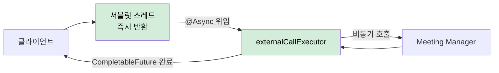
<p align="center"><em>[그림 15] 대안3: Spring @Async + 전용 처리 큐 하이브리드 (채택)</em></p>

**[후보별 비교 검토]**

| 비교 축 | 후보1. 현행 동기 유지 | 후보2. WebFlux 전면 전환 | 후보3. @Async 하이브리드 (채택) |
| --- | --- | --- | --- |
| 처리 모델 | 동기 블로킹 | 이벤트 루프 논블로킹 | 병목 구간만 비동기 |
| 서블릿 스레드 반환 | ✗ 외부 응답까지 점유 | ○ 논블로킹 | ○ 외부 호출 위임 후 즉시 반환 |
| 8만 건 동시 대응 | ✗ 구조적 한계 | ○ | ○ |
| 기술 스택 변경 | 없음 | ✗ 전면 Reactive·R2DBC | △ @Async·Executor 추가 |
| C-01·C-04 준수 | ○ | ✗ 동시 위반 | ○ |
| 잔여 위험 | 처리량이 외부 응답에 종속 | 디버깅·테스트 복잡도 급증 | Executor 고갈·컨텍스트 전파 복잡도 |

<p align="center"><em>[표 47] AS-02 후보 비교 (비동기 전환)</em></p>

**후보3(Spring @Async + 전용 처리 큐 하이브리드)을 채택한다.**

현행 Spring MVC·HikariCP를 유지한 채 병목 구간(Meeting Manager Feign 호출)만 선별 비동기화하여, 기술 스택 제약 안에서 서블릿 스레드 고갈을 해소하기 때문이다.

후보1은 처리량이 외부 서버 응답 시간에 종속되는 구조가 그대로여서 QA-02(8만 명 동시 입장)를 구조적으로 달성할 수 없다. 후보2는 소수 스레드로 대량 요청을 처리하는 이상적 모델이지만, 코드베이스 전면 Reactive 재작성과 DB 접근 계층 교체가 C-01(Spring MVC 유지)·C-04(점진적 적용)를 동시에 위반한다. 후보3은 externalCallExecutor라는 새 고갈 지점과 컨텍스트 전파 복잡도를 남기지만, 이는 설계 원칙과 AS-09로 흡수 가능하다.

**[설계 원칙]**

1. **선택적 비동기화:** Meeting Manager 참석자 입장 정보 조회, VC/AC 서버 회의 개설 호출 등 외부 서버 호출 메서드에만 `@Async("externalCallExecutor")`를 적용한다.
2. **전용 Executor 분리:** `externalCallExecutor`(corePoolSize 100, maxPoolSize 500, queueCapacity 2,000)를 서블릿 스레드 풀과 분리해 외부 지연이 서블릿 처리 용량에 전이되지 않게 한다.
3. **비동기 응답 계약:** 컨트롤러는 `CompletableFuture<ResponseEntity>`를 반환해 Spring MVC 비동기 처리로 서블릿 스레드를 즉시 반환하고, Executor 완료 시 자동 응답한다.
4. **컨텍스트 전파:** 트랜잭션·보안 컨텍스트(ThreadLocal)는 TaskDecorator로 명시 복사한다.

**[위험 요인]**

- **R1. externalCallExecutor 자체의 고갈:** AS-09(CB)로 외부 지연을 조기 차단해 스레드 누적을 방지
- **R2. ThreadLocal 컨텍스트 유실:** TaskDecorator로 트랜잭션·보안 컨텍스트를 명시 복사
- **R3. 동기·비동기 코드 혼재로 예외 처리 복잡도 증가:** fallback을 AS-09 장애 차단과 연동해 일관 처리

#### 3.2.3. AS-03. 외부 권한 조회 다층 캐시 적용

**적용 대상:** AD-01, AD-04, AD-05 / ISSUE-02, ISSUE-05, ISSUE-09

**[설계 근거]**

ISSUE-02의 구조적 문제는 `CompletableFuture.allOf()` 대기 패턴이다. AC서버·Copilot Admin 서버 응답이 모두 도달해야 `GET /members/{email}`이 응답을 반환할 수 있으므로, 가장 느린 외부 서버의 응답 시간이 전체 API 응답 시간을 결정한다. QA-01(평균 응답시간 1초 이내)을 충족하려면 **외부 서버 호출 자체를 줄이는 것**이 근본 해법이다. AC 권한·LLM 권한·용어사전 권한은 매 로그인마다 변경되는 데이터가 아니다.

단, AS-03은 **변경 빈도가 낮은 외부 서버 권한 데이터(AC 권한·LLM 권한·용어사전 권한)에만 선택적으로 적용**한다. 실시간 반영이 필요한 참석자 상태·회의 진행 상태 등 강한 정합성이 요구되는 데이터는 AS-03 적용 범위 밖이며, 이 데이터들은 기존대로 DB 직접 조회를 유지한다.

또한 ISSUE-09에서 지적된 cold start 문제는, 캐시가 존재하더라도 피크 진입 시점에 캐시가 비어 있으면 해소되지 않는다. 따라서 캐시 인프라 자체가 AS-05(선제 초기화)의 선제 워밍 기반이 되어야 한다.

이 제약 조합에서 외부 권한 조회 부하를 완충하는 위치가 세 가지 패러다임으로 갈린다.

- 완충 없이 매 로그인마다 외부 서버를 직접 호출한다.
- 단일 저장소(DB)에 캐싱해 외부 호출을 줄인다.
- 인스턴스 로컬(L1)과 분산 공유(L2)를 계층화한 캐시로 완충한다.

**후보1. 캐시 없음 (현행).**

현행 구조 유지. 매 로그인마다 AC서버·Copilot Admin 서버에 권한 갱신 요청을 전송하고, 모든 응답이 수신될 때까지 대기한다. `GET /members/{email}` API에서 `CompletableFuture.allOf(acFuture, llmFuture, glossaryFuture).get()` 패턴이 그대로 유지되어, 피크 시간대 동시 로그인이 집중될수록 외부 서버 요청도 함께 집중되어 응답 지연이 선형 이상으로 증가한다.

- 장점
  - 캐시 정합성 관리 부담이 없고 항상 최신 권한을 반영한다.
- 단점
  - QA-01(응답시간 1초) 달성이 가장 느린 외부 서버의 응답 시간에 종속된다.
  - 동시 로그인 집중이 그대로 외부 서버 부하로 전이되어 피크에 지연이 증폭된다.

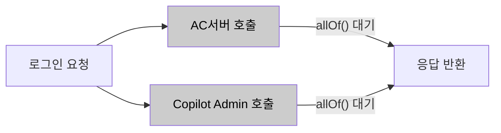
<p align="center"><em>[그림 18] 대안1: 캐시 없음 (현행)</em></p>

**후보2. DB 캐시 전용.**

외부 서버 호출 후 결과를 DB에만 저장·조회한다. 단일 인스턴스 환경에서는 유효하나, 다중 인스턴스 스케일아웃 시 인스턴스 간 캐시 공유가 되지 않아 모든 인스턴스에서 각각 외부 서버를 호출하게 된다. DB 커넥션을 추가로 소비하고 피크 진입 시점의 cold start 문제를 해소하지 못한다.

- 장점
  - 별도 캐시 인프라 없이 기존 DB만으로 외부 호출을 줄인다.
- 단점
  - 인스턴스 간 캐시 공유가 불가해 스케일아웃 시 인스턴스마다 외부 호출이 반복된다.
  - 응답 경로에 DB 조회가 들어가 피크 시 DB 커넥션을 추가 소비하고, cold start를 해소하지 못한다.

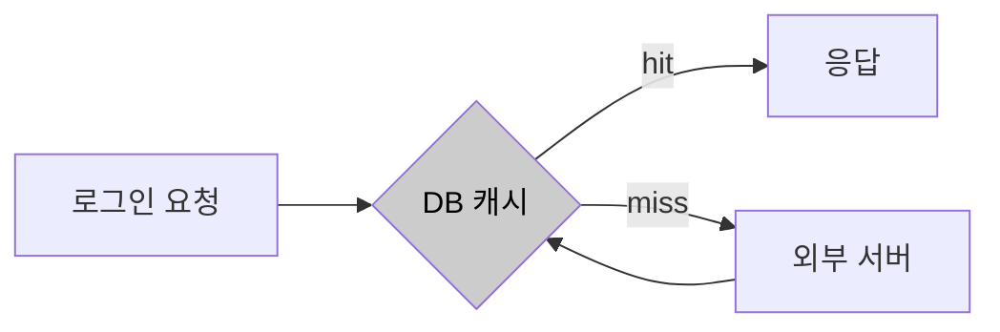
<p align="center"><em>[그림 19] 대안2: DB 캐시 전용</em></p>

**후보3. 계층화 캐시 L1+L2 (채택).**

인스턴스 로컬 L1 Caffeine(TTL 5분)과 분산 공유 L2 Redis(TTL 30분~1시간)를 계층적으로 구성한다. L1 hit 시 네트워크 없이 즉시 반환, L2 hit 시 외부 서버 호출 없이 반환하여 다중 인스턴스 환경에서도 외부 서버 호출을 일괄 완충한다. Cache-Aside 패턴으로 Spring `@Cacheable` + CacheManager 교체만으로 적용되며, L2 Redis 인프라가 AS-05 선제 초기화의 실질적 기반이 된다.

- 장점
  - L1·L2 hit로 피크 외부 요청을 대부분 흡수하고, 인스턴스가 늘어도 L2 공유로 외부 호출이 선형 증가하지 않는다.
  - L2 Redis가 AS-05 선제 적재의 저장소가 되어 피크 초입 cold start를 제거할 기반이 된다.
- 단점
  - TTL 구간 동안 stale 데이터를 허용해 권한 변경 반영이 지연될 수 있다.
  - Redis가 추가 운영·장애 지점이 되고 L1·L2 무효화 동기화가 복잡해진다.

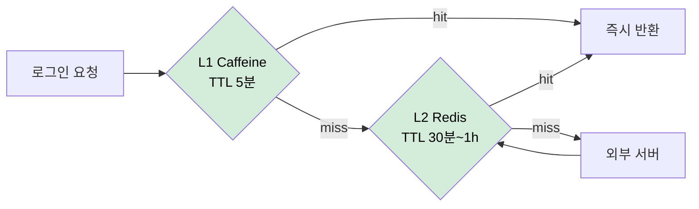
<p align="center"><em>[그림 20] 대안3: 계층화 캐시 L1+L2 (채택)</em></p>

**[후보별 비교 검토]**

| 비교 축 | 후보1. 캐시 없음(현행) | 후보2. DB 캐시 전용 | 후보3. 계층화 캐시 L1+L2 (채택) |
| --- | --- | --- | --- |
| 완충 위치 | 없음(외부 직접 호출) | 단일 DB | L1 로컬 + L2 분산 |
| 외부 호출 감소 | ✗ | △ 인스턴스별 반복 | ○ L2 공유로 일괄 완충 |
| 스케일아웃 대응 | ✗ | ✗ 인스턴스 간 공유 불가 | ○ L2 Redis 공유 |
| cold start 해소 기반 | ✗ | ✗ | ○ AS-05 선제 적재 기반 |
| DB 커넥션 영향 | 없음 | 응답 경로에서 추가 소비 | 없음 |
| 잔여 위험 | 외부 응답에 종속 | 공유 불가·cold start | TTL stale·Redis 장애·무효화 동기화 |

<p align="center"><em>[표 48] AS-03 후보 비교 (다층 캐시)</em></p>

**후보3(계층화 캐시 L1+L2)을 채택한다.**

인스턴스 스케일아웃 환경에서도 외부 서버 호출을 일괄 완충하면서, AS-05 선제 초기화의 실질적 기반(L2 Redis)을 함께 확보하기 때문이다.

후보1은 QA-01 달성이 외부 서버 응답 시간에 전적으로 종속되어 근본 해법이 되지 못한다. 후보2는 외부 호출을 줄이지만 인스턴스 간 캐시 공유가 불가하고 DB 커넥션을 추가 소비하며 cold start를 해소하지 못한다. 후보3은 TTL stale과 Redis 장애 지점을 남기지만, Spring `@Cacheable` + CacheManager 설정만으로 구현되어 C-04(점진적 적용)를 준수하고, 잔여 위험은 설계 원칙으로 흡수된다.

**[설계 원칙]**

1. **적용 범위 한정:** 변경 빈도가 낮은 권한 데이터(AC 권한·LLM 권한·용어사전 권한)에만 적용하고, 강한 정합성이 필요한 참석자·회의 진행 상태는 DB 직접 조회를 유지한다.
2. **계층 구성:** `CompositeCacheManager`로 L1(CaffeineCacheManager) → L2(RedisCacheManager) 순서를 구성하고, `@Cacheable(cacheNames = "memberAuth", key = "#email")`를 적용한다.
3. **TTL 차등:** AC 권한 1시간 / LLM·용어사전 권한 30분으로 변경 빈도에 맞춰 신선도를 둔다.
4. **무효화:** 권한 갱신 이벤트 발생 시 `@CacheEvict`로 L1·L2를 동기 무효화한다.

**[위험 요인]**

- **R1. TTL 구간 stale 데이터로 권한 변경 반영 지연:** 적용 범위를 저빈도 권한으로 한정 + 변경 이벤트 시 `@CacheEvict` 즉시 무효화
- **R2. Redis 추가 장애 지점:** 캐시 miss·장애 시 외부 서버/DB Fallback으로 기능 지속(AS-09 연동)
- **R3. L1·L2 무효화 동기화 복잡도:** 무효화 경로를 이벤트 단일 지점으로 표준화

**[파생 전략]:** AS-05(선제 초기화): L2 Redis 캐시가 존재해야 피크 전 선제 적재가 가능

#### 3.2.4. AS-04. 입장 전용 처리 경로 확보

**적용 대상:** AD-02 / ISSUE-01, ISSUE-03

**[설계 근거]**

오전 9시·오후 1시 업무 시작 시간대와 대규모 스트리밍 서비스 시작 시점에는 회의 입장 요청·로그인 요청·단순 조회 요청이 동시에 폭발적으로 증가한다. 이 구간에서 모든 요청이 동일한 서블릿 스레드 FIFO 큐에 유입되면, 처리 비용이 낮은 단순 조회 요청이 스레드를 먼저 선점하는 상황이 반복된다. Tomcat 서블릿 스레드 풀이 포화 상태에 가까워지면 `acceptCount` 큐에 대기 중인 요청들이 선착순으로 스레드를 할당받아, 단순 조회가 conference-token 발급 요청보다 먼저 처리될 수 있다.

이 제약 조합에서 핵심 입장 요청의 우선 처리를 보장하는 위치가 세 가지 패러다임으로 갈린다.

- 단일 FIFO 큐를 유지한 채 스레드를 증설해 간접 완화한다.
- 요청 진입 계층(Connector·포트)에서 입장 전용 경로를 물리적으로 분리한다.
- 애플리케이션 계층에서 우선순위 큐로 요청을 재정렬한다.

**후보1. 현행 단일 FIFO 서블릿 스레드 풀.**

`maxThreads` 증가로 처리 용량을 확대한다. 스레드 수를 늘려도 모든 요청이 동일 큐에서 FIFO로 처리되므로, 단순 조회 API가 conference-token 발급 요청보다 먼저 스레드를 점유하는 우선순위 역전 자체가 해소되지 않는다. 트래픽 집중 시 핵심 입장 요청이 덜 중요한 요청 뒤에서 대기하는 상황이 반복된다.

- 장점
  - 설정 변경만으로 즉시 적용되고 별도 라우팅 인프라가 필요 없다.
- 단점
  - 도착 순서로만 스레드를 배정해 우선순위 역전이 구조적으로 남는다.
  - 스레드 증설은 메모리·컨텍스트 스위칭 오버헤드를 키운다.

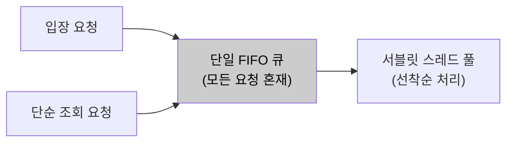
<p align="center"><em>[그림 22] 대안1: 현행 단일 FIFO 서블릿 스레드 풀</em></p>

**후보2. URL 패턴 기반 전용 Connector·스레드 풀 분리 (채택).**

Tomcat Connector를 포트 단위(8080/8081)로 분리하여 `/join`, `/conference-token` 경로를 입장 전용 포트로 수신한다. 입장 전용 스레드 풀이 항상 일정 수의 스레드를 보유하므로, 피크 시 일반 요청이 8080 스레드를 포화시켜도 8081 입장 요청은 전용 스레드에서 즉시 처리된다. `WebServerFactoryCustomizer` 설정만으로 기존 코드 변경 없이 적용 가능하다.

- 장점
  - Tomcat이 제공하는 Connector 분리를 활용해 애플리케이션 코드 변경 없이 진입 계층에서 격리한다.
  - 입장 전용 스레드가 예약되어 단순 조회 폭증에도 핵심 입장 처리 스레드가 보호된다.
- 단점
  - 포트 라우팅을 위한 LB·방화벽 설정이 추가된다.
  - 두 풀이 정적 배분이라 트래픽 편중 시 한쪽 유휴·한쪽 포화가 생기고 총 스레드 수가 증가한다.

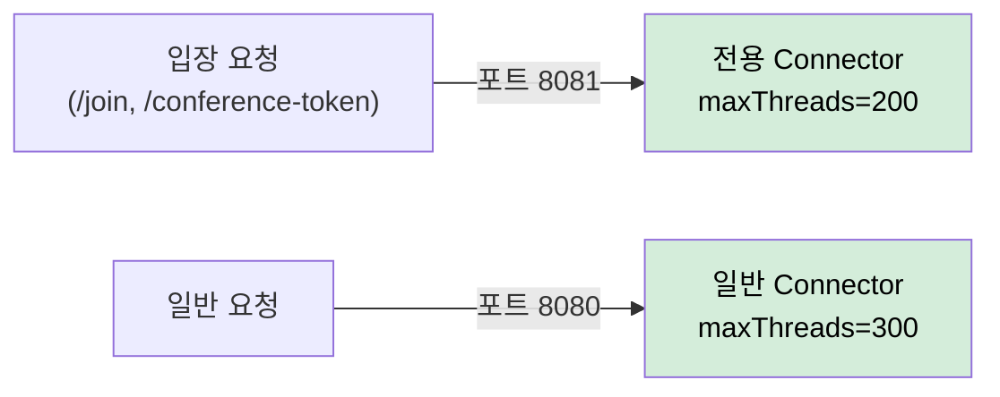
<p align="center"><em>[그림 23] 대안2: URL 패턴 기반 전용 Connector·스레드 풀 분리 (채택)</em></p>

**후보3. HandlerInterceptor + 인메모리 우선순위 큐 재정렬.**

요청을 가로채 `PriorityBlockingQueue`로 우선순위를 재정렬하는 방식이다. 서블릿 스레드는 이미 응답 객체에 귀속되어 있어 재정렬 후 다른 스레드로 처리를 이전하는 것이 구조적으로 불가능하다. 타임아웃 처리와 응답 객체 수명 관리가 복잡해지고 서블릿 모델과 구조적으로 맞지 않아 구현 복잡도와 운영 위험이 크다.

- 장점
  - 포트·인프라 변경 없이 애플리케이션 계층에서 우선순위를 세밀하게 정의할 수 있다.
- 단점
  - 서블릿 스레드-응답 객체 귀속 때문에 다른 스레드로 처리 이전이 구조적으로 불가능하다.
  - 타임아웃·응답 객체 수명·큐 메모리 관리가 복잡하고 운영 가시성이 저하된다.


<p align="center"><em>[그림 24] 대안3: HandlerInterceptor + 인메모리 우선순위 큐 재정렬</em></p>

**[후보별 비교 검토]**

| 비교 축 | 후보1. 단일 FIFO 유지 | 후보2. Connector·포트 분리 (채택) | 후보3. 우선순위 큐 재정렬 |
| --- | --- | --- | --- |
| 격리 계층 | 없음 | 요청 진입(Tomcat Connector) | 애플리케이션(Interceptor) |
| 우선순위 역전 해소 | ✗ 도착 순서 처리 | ○ 전용 스레드 예약 | △ 재정렬은 되나 처리 이전 불가 |
| 코드 변경 | 설정만 | 없음(설정 커스터마이징) | 큼(dispatcher·큐 구현) |
| 서블릿 모델 적합성 | ○ | ○ | ✗ 응답 객체 귀속 충돌 |
| 추가 인프라 | 없음 | LB·방화벽 포트 라우팅 | 없음 |
| 잔여 위험 | 역전 상시 잔존 | 정적 배분 편중·총 스레드 증가 | 타임아웃·수명 관리·가시성 저하 |
<p align="center"><em>[표 49] AS-04 후보 비교 (입장 전용 처리 경로)</em></p>

**후보2(URL 패턴 기반 전용 Connector·스레드 풀 분리)를 채택한다.**

Tomcat이 이미 제공하는 Connector 분리를 활용해 기존 코드 변경 없이 진입 계층에서 입장 전용 스레드를 예약하여, 우선순위 역전을 구조적으로 차단하기 때문이다.

후보1은 도착 순서로만 스레드를 배정해 우선순위 역전이 그대로 남는다. 후보3은 애플리케이션 계층에서 우선순위를 정의할 수 있으나, 서블릿 스레드-응답 객체 귀속 때문에 재정렬 후 처리를 다른 스레드로 이전하는 것이 구조적으로 불가능하고 타임아웃·수명 관리 복잡도가 크다. 후보2는 정적 배분에 따른 편중·총 스레드 증가를 남기지만, 이는 모니터링 기반 조정으로 흡수 가능하다.

**[설계 원칙]**

1. **전용 Connector:** `TomcatServletWebServerFactory` 커스터마이징으로 포트 8081에 입장 전용 Connector를 추가한다(`maxThreads=200`, `minSpareThreads=50`).
2. **일반 Connector 분리:** 단순 조회·권한 갱신 등은 포트 8080(`maxThreads=300`)으로 수신한다.
3. **URL 라우팅:** API Gateway 또는 Nginx에서 `/meetings/*/join`, `/meetings/*/conference-token`을 포트 8081로 라우팅한다.
4. **AS-08 결합:** 입장 전용 Connector 스레드는 `join-pool` HikariCP DataSource만 사용하도록 구성한다.

**[위험 요인]**

- **R1. 정적 배분에 따른 한쪽 유휴·한쪽 포화:** 각 Connector `maxThreads`를 트래픽 프로파일 기반으로 설정하고 모니터링으로 조정
- **R2. 포트 라우팅 인프라(LB·방화벽) 추가:** 1회성 설정으로 흡수, 표준 라우팅 규칙으로 관리
- **R3. 총 스레드 수 증가로 자원 압박:** AS-08 커넥션 풀 상한(CR-02)과 정렬해 총량 통제

#### 3.2.5. AS-05. 예약 기반 피크 자원 선제 초기화

> **전제**: AS-03(외부 권한 조회 다층 캐시 적용)의 파생 전략. AS-03의 L2 Redis 캐시 인프라가 없으면 Pre-warming 적재 대상이 존재하지 않는다.

**적용 대상:** AD-04 / ISSUE-09

**[설계 근거]**

AS-03(캐시)이 도입되면, 캐시가 채워진 상태에서는 외부 서버 호출 없이 빠른 응답이 가능하다. 그러나 캐시가 도입되더라도 **피크 진입 시점에 캐시가 비어 있으면** (TTL 만료, 서버 재시작, 신규 사용자 등) 피크 초입의 대량 캐시 miss가 일시에 외부 서버로 쏟아지는 "Thundering Herd" 현상이 발생한다. Pre-warming은 이 문제를 해소하는 전략이다. 트래픽이 실제로 집중되기 N분 전에, DB의 예약 회의 데이터를 조회하여 해당 회의 참석자들의 권한 캐시를 선제적으로 L2 Redis에 적재한다.

미팅 서비스의 트래픽 집중 패턴은 두 가지 유형으로 나뉜다. 첫째, **일별 반복 패턴**: 오전 9시·오후 1시 업무 시작 시간대에 로그인·권한 갱신·회의 입장 요청이 집중된다. 둘째, **이벤트 기반 패턴**: DB에 예약된 대규모 회의(8만 명 스트리밍 서비스 등) 시작 시점에 입장 요청이 집중된다.

이 제약 조합에서 예측 가능한 피크의 cold start를 대비하는 방식이 세 가지 패러다임으로 갈린다.

- 사후 반응, 즉 트래픽 집중 이후의 자연적 warm-up에 의존한다.
- 매일 고정된 시각에 일괄 캐시 워밍을 수행한다.
- 예약 회의 데이터로 피크 시점·규모를 인식해 동적으로 선제 워밍한다.

**후보1. 현행 사후 대응.**

트래픽이 실제로 집중된 이후 자연적 warm-up에 의존한다. 피크 초입에 대량의 캐시 miss가 일시에 외부 서버로 집중되는 "Thundering Herd" 현상이 발생한다. AS-03 캐시를 도입하더라도 피크 진입 시점에 캐시가 비어 있으면 이 문제는 해소되지 않는다.

- 장점
  - 추가 구성이 없고 트래픽에 따라 캐시가 자연스럽게 채워진다.
- 단점
  - 피크 초입에 대량 캐시 miss가 외부 서버로 몰려 Thundering Herd가 발생한다.
  - 가장 취약한 순간(피크 초입)에 QA-01 위반 위험이 가장 높다.


<p align="center"><em>[그림 26] 대안1: 현행 사후 대응</em></p>

**후보2. 고정 스케줄 워밍.**

매일 고정 시간(오전 8:50, 오후 12:50 등)에 일괄 캐시 워밍을 수행한다. 일별 반복 패턴에는 대응할 수 있으나, DB에 등록된 대규모 스트리밍 서비스처럼 특정 시점의 이벤트 기반 피크는 인식하지 못한다. TTL이 만료되기 전에 피크가 도달해야 효과가 있으며, 실제 피크와 시간이 어긋나면 캐시가 이미 만료된 상태일 수 있다.

- 장점
  - 일별 반복 패턴(9시·13시)에 단순한 cron 설정만으로 대응한다.
- 단점
  - 이벤트 기반 피크(예약 대규모 회의)를 인식하지 못한다.
  - 전체 사용자 일괄 워밍은 불필요한 외부 호출을 대규모로 유발한다.

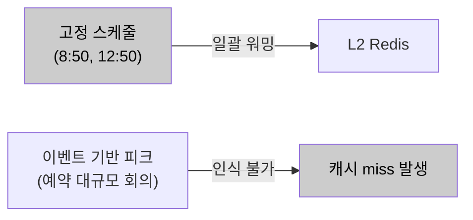
<p align="center"><em>[그림 27] 대안2: 고정 스케줄 워밍</em></p>

**후보3. 예약 회의 데이터 기반 동적 선제 초기화 (채택).**

DB의 예약 회의 시작 시각과 참석자 수를 주기적으로 조회하여, 임계값(예: 500명) 이상의 회의 N분 전에 해당 참석자 권한 캐시를 L2 Redis에 선제 적재한다. DB에 이미 존재하는 데이터를 활용하므로 외부 인프라 추가 없이 구현 가능하다. AS-06 Throttling과 연동하여 워밍 시작 시 피크 구간 유입 제한도 동시에 활성화한다.

- 장점
  - 워밍 대상을 실제 참석자 집합으로 한정해 불필요한 외부 호출을 최소화한다.
  - 이벤트 기반 피크를 동적으로 인식해 피크 진입 시점의 캐시 hit율을 높여 Thundering Herd를 방지한다.
- 단점
  - 예측이 실제와 어긋나면 워밍이 낭비되고 대규모 워밍 자체가 외부 부하가 된다.
  - 스케줄러 장애 시 조용히 실패해 보호가 사라질 수 있다.

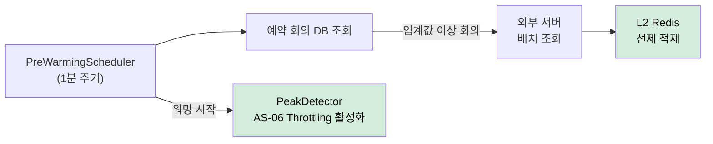
<p align="center"><em>[그림 28] 대안3: 예약 회의 데이터 기반 동적 선제 초기화 (채택)</em></p>

**[후보별 비교 검토]**

| 비교 축 | 후보1. 사후 대응(현행) | 후보2. 고정 스케줄 워밍 | 후보3. 예약 데이터 동적 선제 초기화 (채택) |
| --- | --- | --- | --- |
| 워밍 시점 | 없음(사후 자연 warm-up) | 고정 시각(8:50·12:50) | 예약 회의 N분 전 동적 |
| 일별 반복 피크 | ✗ | ○ | ○ (고정 스케줄 병행) |
| 이벤트 기반 피크 | ✗ | ✗ 인식 불가 | ○ 예약 데이터로 인식 |
| 워밍 대상 범위 | — | 전체(과다 호출) | 임계값 이상 회의 참석자 한정 |
| 추가 인프라 | 없음 | 없음 | 없음(DB·AS-03 재사용) |
| 잔여 위험 | Thundering Herd 상존 | 이벤트 피크 미대응 | 예측 오차·스케줄러 조용한 실패 |

<p align="center"><em>[표 50] AS-05 후보 비교 (선제 초기화)</em></p>

**후보3(예약 회의 데이터 기반 동적 선제 초기화)을 채택한다.**

DB에 이미 존재하는 예약 회의 데이터를 활용해 외부 인프라 추가 없이 이벤트 기반 피크까지 인식하고, AS-03 캐시·AS-06 Throttling과 자연스럽게 연동되기 때문이다.

후보1은 예측 가능한 피크에 사전 대응하지 않아 피크 초입 Thundering Herd를 해소하지 못한다. 후보2는 일별 반복 피크에는 대응하지만 예약 대규모 회의 같은 이벤트 기반 피크를 인식하지 못하고 전체 일괄 워밍이 불필요한 외부 호출을 유발한다. 후보3은 예측 오차·스케줄러 조용한 실패를 남기지만, 워밍이 실패해도 AS-03 캐시가 정상 동작하므로 치명적 실패로 이어지지 않는다.

**[설계 원칙]**

1. **스케줄러 분리:** `PreWarmingScheduler`는 `@Scheduled(fixedDelay = 60_000)` + `@Async("preWarmExecutor")`로 서블릿 스레드와 완전 분리한다.
2. **대상 선별:** 현재 시각 + N분 이내에 시작하는 참석자 수 임계값(예: 500명) 이상 예약 회의만 워밍 대상으로 조회한다.
3. **부하 분산:** 워밍 호출은 50명/배치, 배치 간 100ms 딜레이로 외부 서버 부하를 분산한다.
4. **연동:** 워밍 시작 시 `PeakDetector.setActive(true)`로 AS-06 Throttling을 동시 활성화하고, 오전 8:50·오후 12:50 고정 스케줄을 병행해 예약 회의 없는 일반 피크도 보완한다.

**[위험 요인]**

- **R1. 예측 오차로 워밍 낭비·외부 부하:** 워밍 대상을 임계값 이상 회의로 좁히고 배치·딜레이로 부하 분산
- **R2. 스케줄러 장애 시 조용한 실패:** 워밍 실패해도 AS-03 캐시가 정상 동작 + 스케줄러 상태 모니터링·알람
- **R3. 대규모 워밍 자체의 외부 서버 부하:** 배치 크기·딜레이로 순간 호출량 상한 통제

#### 3.2.6. AS-06. 피크 구간 요청 유입 제한

**적용 대상:** AD-02, AD-04 / ISSUE-03, ISSUE-09

**[설계 근거]**

AS-04(입장 전용 처리 경로 확보)가 "핵심 요청이 비핵심 요청보다 먼저 처리되도록" 하는 전략이라면, AS-06은 "피크 구간에 비핵심 요청의 유입량 자체를 줄여" 핵심 처리 경로의 리소스 여유를 확보하는 전략이다. 두 전략은 보완 관계다. AS-05(선제 초기화)이 예약 데이터를 활용해 캐시를 선제 적재한다면, AS-06은 동일한 피크 예측 정보를 활용해 **비핵심 요청의 유입을 시간 구간 기반으로 제어**한다.

이 제약 조합에서 피크 구간 비핵심 요청의 유입을 제어하는 방식이 세 가지 패러다임으로 갈린다.

- 제어하지 않고 모든 요청을 그대로 수용한다.
- 전체 API에 균일한 RPS 상한을 적용한다.
- 피크 예측 구간에만, 비핵심 API로 한정한 차등 제어를 적용한다.

**후보1. Throttling 없음 (현행).**

모든 요청을 제한 없이 수신하고 처리한다. 피크 구간에 비핵심 요청(단순 조회, 관리 API 등)이 입장 처리 경로와 동일한 스레드·커넥션 자원을 소비해도 제어 수단이 없다. AS-04 전용 Connector가 적용되더라도, 일반 Connector(8080)가 포화되면 비핵심 요청이 일반 자원을 과점하는 상황을 방치한다.

- 장점
  - 추가 구성이 없고 모든 요청이 지연 없이 수용된다.
- 단점
  - 피크 구간에 비핵심 요청이 핵심 경로 자원을 소비해도 제어할 수단이 없다.
  - 전체 과부하 시 핵심·비핵심 요청이 동등하게 실패한다.

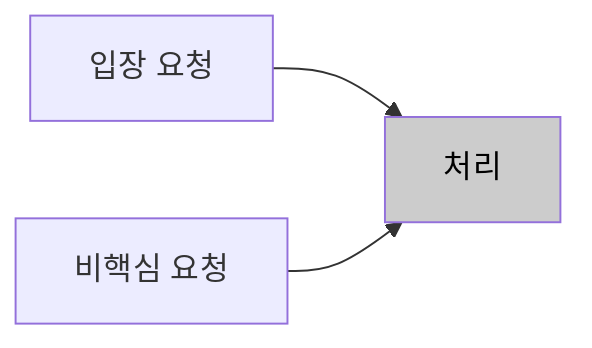
<p align="center"><em>[그림 30] 대안1: Throttling 없음 (현행)</em></p>

**후보2. 고정 Rate Limiting (균일 RPS 제한).**

전체 API에 동일한 RPS 상한을 적용한다. 비핵심 요청이 제한되는 효과가 있으나 입장 요청도 동일하게 제한되어 오히려 QA-02 달성을 방해하는 역효과 위험이 있다. 피크 구간이 아닌 시간대에도 불필요한 제한이 발생한다.

- 장점
  - Bucket4j 등으로 단순하게 구성되고 전체 유입량 상한을 보장한다.
- 단점
  - 핵심 입장 API까지 동일 상한에 걸려 QA-02를 방해하는 역효과 위험이 있다.
  - 피크가 아닌 시간대에도 불필요한 제한이 발생한다.

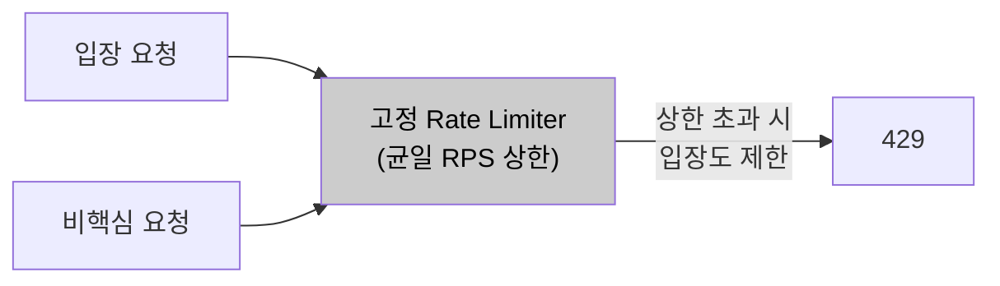
<p align="center"><em>[그림 31] 대안2: 고정 Rate Limiting (균일 RPS 제한)</em></p>

**후보3. 피크 예측 기반 차등 Throttling (채택).**

예약 회의 데이터 기반 피크 예상 구간에만 활성화하고, `@ThrottleExempt`가 없는 비핵심 API로만 Throttling 대상을 한정한다. 입장 요청은 Throttling에서 면제되므로 피크 구간에도 QA-02를 방해하지 않으면서 비핵심 요청의 자원 소비를 구간 기반으로 제어한다. AS-05 Pre-warming 스케줄러와 피크 감지 로직을 공유하여 별도 인프라 없이 구현된다.

- 장점
  - Throttling을 비핵심 API·피크 구간으로 한정해 핵심 입장 처리에 영향을 주지 않는다.
  - AS-05과 피크 예측 데이터를 재사용하고 Spring AOP 어노테이션 기반이라 개별 API 코드 변경이 없다.
- 단점
  - 예약에 없는 돌발 급증에는 작동하지 않는다.
  - Throttling된 비핵심 요청은 429로 UX가 저하되고 임계값 튜닝이 지속 필요하다.

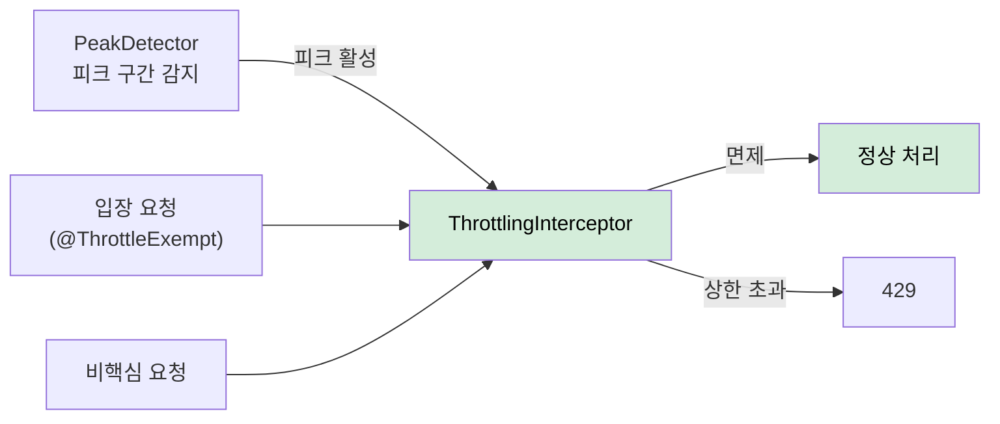
<p align="center"><em>[그림 32] 대안3: 피크 예측 기반 차등 Throttling (채택)</em></p>

**[후보별 비교 검토]**

| 비교 축 | 후보1. Throttling 없음(현행) | 후보2. 균일 Rate Limiting | 후보3. 피크 예측 차등 Throttling (채택) |
| --- | --- | --- | --- |
| 제어 대상 | 없음 | 전체 API 균일 | 비핵심 API 한정 |
| 활성 구간 | — | 상시 | 피크 예측 구간만 |
| 핵심 입장 영향 | 보호 수단 없음 | ✗ 핵심도 제한 | ○ `@ThrottleExempt` 면제 |
| QA-02 방해 | 과부하 시 동등 실패 | ✗ 역효과 위험 | ○ 방해 없음 |
| 추가 인프라 | 없음 | Rate Limiter | 없음(AS-05 피크 감지 공유) |
| 잔여 위험 | 자원 과점 방치 | 상시·핵심 제한 | 돌발 급증 미작동·429 UX·튜닝 |

<p align="center"><em>[표 51] AS-06 후보 비교 (요청 유입 제한)</em></p>

**후보3(피크 예측 기반 차등 Throttling)을 채택한다.**

Throttling 대상을 비핵심 API로 한정하고 피크 예측 구간에만 활성화하여, 핵심 처리 경로에 영향을 주지 않으면서 시스템 전체 리소스 여유를 확보하기 때문이다.

후보1은 비핵심 요청의 자원 과점을 방치해 피크 구간 핵심 경로를 보호하지 못한다. 후보2는 전체 유입량 상한을 보장하지만 핵심 입장 API까지 동일 상한에 걸려 QA-02를 방해하는 역효과 위험이 있고, 피크가 아닌 시간대에도 불필요한 제한이 발생한다. 후보3은 돌발 급증 미작동·429 UX 저하를 남기지만, AS-04(입장 전용 경로)가 최소 안전망으로 핵심 입장을 보호하고 429는 비핵심 API로만 한정된다.

**[설계 원칙]**

1. **피크 감지 공유:** `PeakDetector`는 DB 예약 회의 조회(Spring Scheduler 1분 주기)와 시간대 기반 고정 피크(9시·13시 전후 30분) 정의를 결합하며, AS-05 Pre-warming 스케줄러와 감지 로직을 공유한다.
2. **핵심 면제:** 회의 입장·conference-token 발급·회의 시작 등 핵심 API에는 `@ThrottleExempt`를 적용해 Throttling에서 면제한다.
3. **비핵심 한정 제어:** `ThrottlingInterceptor`가 피크 구간 중 `@ThrottleExempt`가 없는 API에만 Bucket4j `SlidingWindowCounter`(피크 구간 중 초당 1,000 req)를 적용한다.
4. **거부 응답 계약:** 상한 초과 시 429에 `Retry-After` 헤더와 안내 메시지를 포함한다.

**[위험 요인]**

- **R1. 예약에 없는 돌발 급증에 미작동:** AS-04(입장 전용 경로)가 최소 안전망으로 핵심 입장 처리를 보호
- **R2. Throttling된 비핵심 요청의 429 UX 저하:** 429를 비핵심 API로만 한정하고 `Retry-After`로 재시도 유도
- **R3. 임계값 지속 튜닝 필요:** 부하 프로파일 기반으로 상한을 조정하고 모니터링으로 보정

#### 3.2.7. AS-07. 조회·입장 DB 경로 분리

> **전제**: AS-01(입장 처리 도메인 경계 분리)의 파생 전략. AS-01이 설정한 도메인 경계 내에서 Command/Query 경로를 분리한다.

**적용 대상:** AD-04 / ISSUE-07

**[설계 근거]**

현재 미팅 포털 서버는 Primary-Replica 구성을 갖추고 있으며, 일부 느린 SELECT 쿼리는 개별적으로 Replica로 라우팅되어 있다. 그러나 이 라우팅은 쿼리 단위 수동 지정 방식으로 체계적이지 않으며, ISSUE-07의 핵심 원인인 write 경로 간 경합과 Primary 단일 노드의 write 처리량 포화는 여전히 해소되지 않은 상태다.

ISSUE-07의 경합 구조를 분석하면 두 가지 write 경로가 동시에 동일 테이블을 타격한다. 첫째 **front-api 경유 write (셀프 참석자 한정)** (`User → front-api → participants INSERT`, 오픈회의 셀프 참석자 입장 시), 둘째 **cPaaS 피드백 경유 write** (`cPaaS → server-api → participants UPDATE`, 입장 성공·퇴장·연결 끊김 등 모든 참석자 상태 변경). 두 write 경로는 독립적으로 발생하며, 대규모 회의 시작 시점에는 cPaaS 피드백 경유 UPDATE가 최고조에 달한다. 여기에 참석자 목록 조회(read)까지 집중되면, 동일 레코드에 대한 write 경합과 read·write의 노드 자원 경합이 최대화된다.

해결의 핵심은 **write(Command)와 read(Query)가 서로 다른 물리 노드에서 처리되어 노드 자원을 경쟁하지 않는 구조**를 만들어, Primary가 write 처리에 집중하도록 하는 것이다.

이 제약 조합에서 read/write 노드 경합을 분리하는 방식이 세 가지 패러다임으로 갈린다.

- 현행 쿼리 단위 수동 Replica 라우팅을 그대로 유지한다.
- 이벤트 소싱 + CQRS로 Command·Query 저장소를 완전히 분리한다.
- 기존 Primary-Replica를 readOnly 트랜잭션 기준으로 전면 체계화한다.

**후보1. 현행 선택적 Replica 라우팅 유지.**

Primary-Replica 인프라는 갖추어져 있으나, 응답 지연이 심한 일부 SELECT 쿼리에 한해 개별 수동으로 Replica를 지정하는 방식이다. 적용 기준이 일관되지 않아 트랜잭션 단위 readOnly 경계를 보장하지 못하고 누락 위험이 있다. 더 큰 문제는 ISSUE-07의 핵심인 write 집중 경합(셀프 참석자 front-api INSERT · cPaaS 피드백 경유 server-api UPDATE가 동일 Primary에 집중)은 SELECT를 Replica로 옮겨도 해소되지 않는다.

- 장점
  - 이미 구성된 인프라를 그대로 사용하고 즉시 일관성을 유지한다.
- 단점
  - 쿼리 단위 수동 지정이라 readOnly 경계가 보장되지 않고 누락 위험이 있다.
  - write 집중 경합이 그대로 남아 ISSUE-07을 구조적으로 해소하지 못한다.

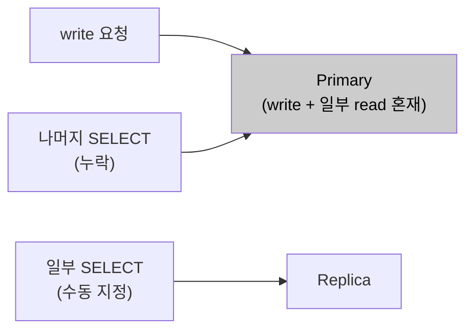
<p align="center"><em>[그림 34] 대안1: 현행 선택적 Replica 라우팅 유지</em></p>

**후보2. 완전한 이벤트 소싱 + CQRS.**

모든 Command를 이벤트 스트림으로 저장하고 Query는 별도 Read Model(투영)을 조회한다. Command와 Query 경로가 완전히 분리되는 이상적인 구조이나, 기존 JPA 엔티티 기반 도메인 모델을 이벤트 소싱 모델로 전면 재설계해야 한다. 이벤트 순서 보장·투영 복구·이벤트 버저닝 등 복잡한 문제가 따라오며 C-04(점진적 적용) 제약을 위반한다.

- 장점
  - Command·Query 저장소가 완전히 분리되어 read/write 경합이 원천적으로 사라진다.
- 단점
  - 기존 JPA 도메인 모델을 이벤트 소싱으로 전면 재설계해야 해 C-04를 위반한다.
  - 이벤트 순서 보장·투영 복구·버저닝 등 운영 복잡도가 크다.

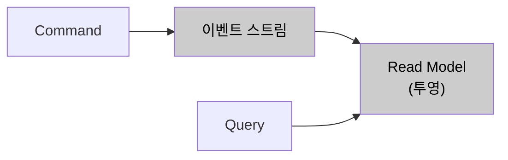
<p align="center"><em>[그림 35] 대안2: 완전한 이벤트 소싱 + CQRS</em></p>

**후보3. @Transactional 기반 Primary/Replica 전체 체계화 (채택).**

이미 갖추어진 Primary-Replica 인프라를 활용하되, 현행 쿼리 단위 수동 지정을 `AbstractRoutingDataSource` + `@Transactional(readOnly = true)` 기반 체계적 라우팅으로 전환한다. 기존 JPA 엔티티·레포지토리 코드 변경 없이 DataSource 설정 교체만으로 적용 가능하며, 모든 Query가 Replica로 일관되게 분리되어 Primary DB가 write 처리에만 집중할 수 있다.

- 장점
  - 이미 구성된 Primary-Replica를 활용해 기존 코드 최소 변경으로 C-04를 준수한다.
  - 트랜잭션 단위 readOnly 경계가 보장되어 누락 위험이 없고, Primary가 조회 부하에서 분리된다.
- 단점
  - 복제 지연으로 read-after-write 불일치가 생길 수 있다.
  - readOnly 경계 누락 시 Primary로 회귀하고, Replica 장애 시 read 경로 전체가 영향받는다.

```mermaid
%%{init: {'theme': 'default', 'themeVariables': {'background': '#ffffff'}}}%%
flowchart LR
    SVC["서비스 레이어"] --> ROUTER["DataSourceRouter\n(readOnly 속성 분기)"]
    ROUTER -->|"readOnly=false"| PRI["Primary\nwrite 전담"]
    ROUTER -->|"readOnly=true"| REP["Replica\nread 전담"]
    style ROUTER fill:#d4edda,color:#000
    style PRI fill:#d4edda,color:#000
    style REP fill:#d4edda,color:#000
```
<p align="center"><em>[그림 36] 대안3: @Transactional 기반 Primary/Replica 전체 체계화 (채택)</em></p>

**[후보별 비교 검토]**

| 비교 축 | 후보1. 선택적 Replica 유지 | 후보2. 이벤트 소싱 + CQRS | 후보3. @Transactional 체계화 (채택) |
| --- | --- | --- | --- |
| 분리 방식 | 쿼리 단위 수동 지정 | Command·Query 저장소 완전 분리 | readOnly 트랜잭션 기준 전면 라우팅 |
| readOnly 경계 보장 | ✗ 누락 위험 | ○ | ○ 트랜잭션 단위 |
| write 집중 경합 해소 | ✗ | ○ | ○ Primary가 write 전담 |
| 코드 변경 | 없음 | ✗ 도메인 전면 재설계 | DataSource 설정 교체만 |
| C-04 점진적 적용 | ○ | ✗ 위반 | ○ |
| 잔여 위험 | 경합 잔존·누락 | 이벤트 순서·투영 운영 복잡 | 복제 지연 read-after-write |

<p align="center"><em>[표 52] AS-07 후보 비교 (DB 경로 분리)</em></p>

**후보3(@Transactional 기반 Primary/Replica 전체 체계화)을 채택한다.**

이미 갖추어진 Primary-Replica 인프라를 활용해 기존 코드 최소 변경으로 트랜잭션 단위 readOnly 경계를 보장하고, Primary를 write 처리에 집중시켜 ISSUE-07의 경합을 해소하기 때문이다.

후보1은 쿼리 단위 수동 지정이라 readOnly 경계가 보장되지 않고 write 집중 경합이 그대로 남는다. 후보2는 read/write를 원천 분리하는 이상적 구조이지만 도메인 모델 전면 재설계가 C-04(점진적 적용)를 위반하고 이벤트 순서·투영 운영 복잡도가 크다. 후보3은 복제 지연에 따른 read-after-write 불일치를 남기지만, 강한 정합성이 필요한 경로를 Primary 읽기로 유지해 완화할 수 있다.

**[설계 원칙]**

1. **라우팅 기준:** `DataSourceRouter extends AbstractRoutingDataSource`가 현재 트랜잭션의 `readOnly` 속성으로 Primary/Replica DataSource를 반환한다.
2. **커넥션 지연 획득:** `LazyConnectionDataSourceProxy`로 래핑해 실제 커넥션 획득을 트랜잭션 시작(readOnly 판단 이후)까지 지연한다.
3. **Query 경계 지정:** 참석자 목록·대기실 상태·회의 목록 조회 등 모든 Query 서비스 메서드에 `@Transactional(readOnly = true)`를 적용해 전면 Replica 라우팅한다.
4. **AS-08 결합:** Primary DataSource는 `join-pool`·`service-pool`, Replica DataSource는 `query-pool`로 별도 HikariCP 풀을 설정한다.

**[위험 요인]**

- **R1. 복제 지연 read-after-write 불일치:** 입장 직후 재조회가 필요한 경로는 `readOnly=false`로 Primary에서 읽고, 강한 정합성이 필요 없는 조회만 Replica로 분산
- **R2. readOnly 경계 누락 시 Primary 회귀:** Query 메서드 readOnly 지정을 규칙화하고 리뷰로 검증
- **R3. Replica 장애 시 read 경로 전체 영향:** 헬스체크 기반 Primary Fallback 라우팅 구성

#### 3.2.8. AS-08. 기능별 커넥션·스레드 Bulkhead 분리

> **전제**: AS-01(입장 처리 도메인 경계 분리)의 파생 전략. AS-01이 설정한 도메인 경계별로 HikariCP 커넥션 풀을 분리 구성한다.

**적용 대상:** AD-03, AD-04, AD-05 / ISSUE-01, ISSUE-04, ISSUE-06

**[설계 근거]**

현행 구조에서 front-api·server-api·admin-api는 동일한 DB를 공유하며, 각 인스턴스 내 기능 간에도 단일 HikariCP 풀이 공유된다. 8만 명 동시 입장이 발생하면 입장 처리(UC-04)가 DB 조회를 위해 커넥션을 획득하고, HikariCP 풀 크기를 훨씬 초과하는 요청이 동시에 커넥션을 요구하면 `connectionTimeout` 만료까지 대기하다 예외가 발생한다. 이 예외는 입장 처리에서 그치지 않고, 동일 풀을 사용하는 회의 시작(UC-03), 참석자 초대(UC-06)에서도 동일하게 발생한다.

QA-03의 측정 기준은 "입장 전용 커넥션 풀 고갈 시 회의 시작 API 성공률 100%"다. 이를 충족하려면 **기능별로 독립된 커넥션 풀**이 필요하다.

이 제약 조합에서 기능 간 자원 격리를 어느 차원까지 세우는가가 세 가지 패러다임으로 갈린다.

- 단일 풀을 유지한 채 풀 크기만 키워 고갈을 지연한다.
- DB 커넥션 풀만 기능별로 분리한다.
- DB 커넥션 풀과 외부 호출 스레드 풀을 이중으로 격리한다.

**후보1. 현행 단일 HikariCP 풀.**

`maximumPoolSize` 증가로 커넥션 고갈을 지연시키는 방식이다. 풀 크기를 늘려도 입장 처리가 풀 전체를 소진하면 회의 조회·회의 개설 등 다른 기능의 DB 접근도 막힌다. QA-03(입장 풀 고갈 시 회의 시작 API 성공률 100%)은 단일 풀 구조에서 원칙적으로 충족 불가능하다.

- 장점
  - 설정 변경만으로 적용되고 풀 관리 단위가 단순하다.
- 단점
  - 구조적 격리가 없어 입장 처리 부하가 커지면 늘린 풀도 결국 소진된다.
  - QA-03(입장 풀 고갈 시 회의 시작 100%)을 단일 풀 구조에서 충족할 수 없다.

```mermaid
%%{init: {'theme': 'default', 'themeVariables': {'background': '#ffffff'}}}%%
flowchart LR
    JOIN["입장 처리"] --> POOL["HikariCP 단일 풀"]
    SVC["회의 시작·초대"] --> POOL
    AUTH["권한 갱신"] --> POOL
    POOL --> DB[("MariaDB")]
    style POOL fill:#cccccc,color:#000
```
<p align="center"><em>[그림 38] 대안1: 현행 단일 HikariCP 풀</em></p>

**후보2. 기능별 HikariCP 풀 분리만.**

`join-pool`, `service-pool`, `general-pool`으로 커넥션을 격리하여 QA-03을 충족한다. 그러나 외부 서버 호출 스레드 측면의 구조적 변화가 없다. deprecated Hystrix threadpool이 서비스별 외부 호출 실행 스레드를 분리하지만 서블릿 스레드는 여전히 `Future.get()`으로 블로킹되어, AS-02 연계를 통한 서블릿 스레드 즉시 반환 효과를 확보하지 못한다.

- 장점
  - 기능별 커넥션 풀 격리로 입장 풀 고갈이 타 기능으로 전파되지 않아 QA-03을 충족한다.
- 단점
  - 스레드 풀 차원의 격리가 없어 외부 서버 장애 시 서블릿 스레드 블로킹이 남는다.
  - AS-02 연계를 통한 서블릿 스레드 즉시 반환 효과를 얻지 못해 ISSUE-06을 완전히 해소하지 못한다.

```mermaid
%%{init: {'theme': 'default', 'themeVariables': {'background': '#ffffff'}}}%%
flowchart LR
    JOIN["입장 처리"] --> JP["join-pool"]
    SVC["회의 시작·초대"] --> SP["service-pool"]
    AUTH["권한 갱신"] --> GP["general-pool"]
    JP & SP & GP --> DB[("MariaDB")]
    style JP fill:#cccccc,color:#000
    style SP fill:#cccccc,color:#000
    style GP fill:#cccccc,color:#000
```
<p align="center"><em>[그림 39] 대안2: 기능별 HikariCP 풀 분리만</em></p>

**후보3. 이중 Bulkhead: DB 커넥션 풀 + 스레드 풀 동시 격리 (채택).**

HikariCP 풀을 기능별로 분리(QA-03 충족)하는 동시에, deprecated Hystrix threadpool을 `@Async` 기반 `externalCallExecutor`로 교체한다. AS-02와 결합하면 서블릿 스레드가 외부 서버 응답을 기다리지 않고 즉시 반환되어 ISSUE-06을 완전히 해소하고 QA-03·QA-05를 모두 충족한다.

- 장점
  - 커넥션·스레드 두 차원을 동시에 격리해 ISSUE-01·04·06을 함께 해소한다.
  - AS-02 비동기 기반 위에서 외부 장애가 서블릿 스레드로 전파되지 않아 QA-05도 충족한다.
- 단점
  - 풀 정적 분할로 총 커넥션·스레드 수가 늘어 CR-02(DB 총량 상한)를 압박한다.
  - 배분이 실제 트래픽과 어긋나면 특정 풀만 고갈될 수 있다.

```mermaid
%%{init: {'theme': 'default', 'themeVariables': {'background': '#ffffff'}}}%%
flowchart TD
    JOIN["입장 처리"] --> JP["join-pool\n100 conn"]
    SVC["회의 시작·초대"] --> SP["service-pool\n40 conn"]
    AUTH["권한 갱신"] --> GP["general-pool\n60 conn"]
    RD["read 조회"] --> QP["query-pool\n80 conn"]
    JOIN -->|"@Async"| EX["externalCallExecutor\n스레드 풀 격리"]
    JP & SP & GP --> PRI[("Primary")]
    QP --> REP[("Replica")]
    style JP fill:#d4edda,color:#000
    style EX fill:#d4edda,color:#000
```
<p align="center"><em>[그림 40] 대안3: 이중 Bulkhead (DB 커넥션 풀 + 스레드 풀 동시 격리) (채택)</em></p>

**[후보별 비교 검토]**

| 비교 축 | 후보1. 단일 풀 유지 | 후보2. 커넥션 풀만 분리 | 후보3. 이중 Bulkhead (채택) |
| --- | --- | --- | --- |
| 격리 차원 | 없음 | DB 커넥션 풀 | 커넥션 풀 + 스레드 풀 |
| 입장 풀 고갈 전파 차단 | ✗ | ○ | ○ |
| 외부 장애 스레드 전파 차단 | ✗ | ✗ Future.get() 블로킹 | ○ @Async 즉시 반환 |
| QA-03 충족 | ✗ | ○ | ○ |
| QA-05 충족 | ✗ | ✗ | ○ |
| 잔여 위험 | 전면 고갈 전파 | ISSUE-06 미해소 | 정적 분할 총량 압박·편중 |

<p align="center"><em>[표 53] AS-08 후보 비교 (Bulkhead 분리)</em></p>

**후보3(이중 Bulkhead: DB 커넥션 풀 + 스레드 풀 동시 격리)을 채택한다.**

AS-02의 `@Async` 기반 외부 호출 전환과 함께 DB 커넥션 풀과 스레드 풀을 동시에 격리하여, QA-03(커넥션 격리)과 QA-05(외부 장애 격리)를 모두 충족하기 때문이다.

후보1은 구조적 격리가 없어 늘린 풀도 결국 소진되고 QA-03을 충족할 수 없다. 후보2는 커넥션 풀은 격리하지만 스레드 풀 차원의 격리가 없어 외부 서버 장애 시 서블릿 스레드 블로킹이 남아 ISSUE-06을 완전히 해소하지 못한다. 후보3은 정적 분할로 총량이 늘어 CR-02를 압박하는 위험을 남기지만, 풀 합을 DB 상한 내로 설계하고 사용률 모니터링으로 조정해 완화한다.

**[설계 원칙]**

1. **커넥션 풀 격리:** `DataSourceConfig`에서 `joinDataSource`·`serviceDataSource`·`generalDataSource`를 별도 HikariCP Bean으로 분리하고, AS-01 도메인 경계 기반으로 각 Repository가 `@Qualifier`로 주입받는다.
2. **읽기 풀 결합:** AS-07 결합으로 Replica 연결 `queryDataSource`(query-pool)를 조회 전용으로 분리한다.
3. **스레드 풀 격리:** deprecated Hystrix threadpool을 `@Async` 기반 `externalCallExecutor`(AS-02 정의)로 교체하고, Pre-warming은 `preWarmExecutor`(AS-05 정의)로 분리한다.
4. **총량 통제·관측:** 풀 크기 합을 DB 서버 세션 상한(CR-02) 내로 설계하고, `HikariPoolMXBean` 메트릭을 Actuator로 노출해 풀별 사용률을 모니터링한다.

**[위험 요인]**

- **R1. 정적 분할로 총 커넥션·스레드 증가 → CR-02 압박:** 풀 크기 합을 DB 서버 상한 내로 설계
- **R2. 배분이 실제 트래픽과 어긋나 특정 풀만 고갈:** 풀별 사용률 메트릭 모니터링으로 배분 조정
- **R3. Executor 교체 시 컨텍스트 전파·예외 처리:** AS-02 TaskDecorator·fallback 규약 재사용

**풀 구성**

| 풀 이름 | 담당 기능 | maximumPoolSize | connectionTimeout |
| ----- | ----- | ----- | ----- |
| join-pool | 입장 처리 전용 | 100 | 3,000ms |
| service-pool | 회의 시작·초대 | 40 | 5,000ms |
| general-pool | 권한 갱신·일반 조회 | 60 | 5,000ms |
| query-pool | Read 전용 (Replica, AS-07) | 80 | 3,000ms |

<p align="center"><em>[표 54] AS-08 HikariCP 기능별 커넥션 풀 구성</em></p>

#### 3.2.9. AS-09. 외부 서버 장애 차단 및 계층 복구

**적용 대상:** AD-01, AD-04, AD-05 / ISSUE-02, ISSUE-06, ISSUE-08

**[설계 근거]**

피크 구간에 외부 서버 장애가 겹치면, Circuit Breaker가 개방되기 전까지 Feign 호출은 read timeout(3,000ms) 만료까지 블로킹된다. 8만 명 동시 입장 구간에 WC서버 장애가 겹치면, CB 개방 이전 구간에만 `externalCallExecutor` 스레드 풀에 3,000ms씩 블로킹된 스레드가 빠르게 누적된다. AS-08 Bulkhead로 스레드 풀이 격리되더라도 Circuit Breaker 없이는 `externalCallExecutor` 스레드 풀 자체가 소진된다.

현행 시스템은 `application.yml`에 `hystrix.command.default.*` 전역 기본값만 설정되어 있어, 모든 외부 서버에 동일한 CB 임계값이 적용된다. 그러나 외부 서버들은 특성이 서로 다르다. WC서버는 회의 개설·종료(UC-03, UC-07) 처리에 필수적이어서 빠른 감지·차단이 필요하고, Copilot Admin 서버(LLM·용어사전 권한)는 장애 시 DB 저장값으로 Fallback 가능하여 관대한 임계값을 허용한다. 전역 단일 설정으로는 이 차이를 반영한 정밀 제어가 불가능하며, 피크 구간에 한 서버의 장애가 다른 서버 처리 경로까지 동일하게 차단하는 과도한 제한이 발생할 수 있다.

이 제약 조합에서 외부 서버 장애 차단·복구 정책의 세분도가 세 가지 패러다임으로 갈린다.

- 현행 Hystrix 전역 일괄 설정을 유지한다.
- Resilience4j로 교체하되 모든 서버에 균일 설정을 적용한다.
- 서버별로 차등 CB를 두고 계층적 Fallback을 연계한다.

**후보1. 현행 Feign + Hystrix CB 유지.**

Circuit Breaker가 이미 적용되어 있으나, `application.yml`에 전역 기본값만 설정되어 모든 외부 서버에 동일 임계값이 적용된다. WC서버(회의 개설·종료 필수, 빠른 감지 필요)와 Copilot Admin 서버(DB Fallback 가능, 관대한 임계값 허용)에 동일 정책이 적용되어 서버 특성에 맞는 정밀 제어가 불가능하다. 또한 Hystrix는 Netflix가 2018년 유지보수를 중단하고 Spring Cloud에서도 공식 지원이 종료되어 보안 패치·버그픽스를 기대할 수 없다.

- 장점
  - 이미 적용된 CB라 추가 도입 없이 기본적 fail-fast는 동작한다.
- 단점
  - 전역 단일 설정이라 서버 특성별 정밀 제어가 불가능하다.
  - Hystrix 유지보수 중단(2018년 이후)으로 장기 관리 부담이 있고, 계층적 fallback 체인 구현이 어렵다.

```mermaid
%%{init: {'theme': 'default', 'themeVariables': {'background': '#ffffff'}}}%%
flowchart LR
    WC["WC서버"] --> CB["Hystrix CB\n전역 단일 설정"]
    AC["AC서버"] --> CB
    CP["Copilot Admin"] --> CB
    style CB fill:#cccccc,color:#000
```
<p align="center"><em>[그림 42] 대안1: 현행 Feign + Hystrix CB 유지</em></p>

**후보2. Resilience4j CB 일괄 적용 (균일 설정).**

Hystrix를 Resilience4j로 대체하여 deprecated 문제를 해소한다. 그러나 모든 외부 서버에 동일 설정을 적용하면 응답이 느리지만 정상인 서버를 과도하게 차단하거나, 빠르게 확대되는 장애를 늦게 감지하는 문제가 발생한다. 라이브러리 교체 효과만 있고 QA-05의 서버별 정밀 제어 요구를 충족하지 못한다.

- 장점
  - Hystrix deprecated 문제를 해소하고 유지보수되는 라이브러리로 전환한다.
- 단점
  - 균일 정책이라 서버 특성을 무시해 과도 차단 또는 늦은 감지가 발생한다.
  - fallback도 균일해 서버별 세밀한 복구가 불가능하다.

```mermaid
%%{init: {'theme': 'default', 'themeVariables': {'background': '#ffffff'}}}%%
flowchart LR
    WC["WC서버"] --> CB["Resilience4j CB\n균일 설정"]
    AC["AC서버"] --> CB
    CP["Copilot Admin"] --> CB
    style CB fill:#cccccc,color:#000
```
<p align="center"><em>[그림 43] 대안2: Resilience4j CB 일괄 적용 (균일 설정)</em></p>

**후보3. 외부 서버별 차등 CB + 계층적 Fallback (채택).**

WC서버·VC서버·AC서버·Copilot Admin 서버의 역할과 장애 허용 범위에 따라 `slidingWindowSize`, `failureRateThreshold`, `waitDuration`을 독립적으로 설정한다. 각 서버별로 역할에 맞는 Fallback 전략(fail-fast, DB Fallback, Redis→DB 계층 Fallback)을 연계하고 각 연계 모듈(`integration.*`) 내에 CB 정책을 캡슐화하여, 단일 외부 서버 장애가 포털 전체 가용성에 미치는 영향을 최소화한다.

- 장점
  - 서버 특성에 맞는 정책으로 과도 차단·과소 차단 없이 정밀하게 동작한다.
  - fallback이 AS-03 캐시·AS-02 비동기 큐와 연동해 서비스 연속성을 최대화하고, 정책이 모듈별로 캡슐화된다.
- 단점
  - 서버별 CB 파라미터 튜닝 부담이 있고 오설정 시 과도 차단·늦은 감지가 발생한다.
  - Fallback으로 반환하는 DB·Redis 값이 stale일 수 있고 서버별 상태 관리 복잡도가 증가한다.

```mermaid
%%{init: {'theme': 'default', 'themeVariables': {'background': '#ffffff'}}}%%
flowchart LR
    WC["WC서버"] --> WCB["wcServer CB\n실패율 50%\nwait 10s"]
    AC["AC서버"] --> ACB["acServer CB\n실패율 60%\nwait 30s"]
    CP["Copilot Admin"] --> CPB["copilotAdmin CB\n실패율 70%\nwait 60s"]
    WCB -->|"Open"| WF["fail-fast"]
    ACB -->|"Open"| AF["DB Fallback"]
    CPB -->|"Open"| CF["Redis→DB 계층 Fallback"]
    style WCB fill:#d4edda,color:#000
    style ACB fill:#d4edda,color:#000
    style CPB fill:#d4edda,color:#000
```
<p align="center"><em>[그림 44] 대안3: 외부 서버별 차등 CB + 계층적 Fallback (채택)</em></p>

**[후보별 비교 검토]**

| 비교 축 | 후보1. Hystrix 전역 유지 | 후보2. Resilience4j 균일 | 후보3. 서버별 차등 CB + 계층 Fallback (채택) |
| --- | --- | --- | --- |
| 정책 세분도 | 전역 단일 | 균일(라이브러리만 교체) | 서버별 차등 |
| 서버 특성 반영 | ✗ | ✗ | ○ |
| Fallback 계층화 | ✗ 구현 어려움 | 균일 | ○ Redis→DB·fail-fast·DB Fallback |
| 라이브러리 유지보수 | ✗ Hystrix 중단 | ○ | ○ |
| QA-05 정밀 충족 | ✗ | ✗ | ○ |
| 잔여 위험 | 정밀 제어 불가·관리 부담 | 과도/늦은 감지 | 서버별 튜닝 부담·fallback stale |

<p align="center"><em>[표 55] AS-09 후보 비교 (외부 서버 장애 차단)</em></p>

**후보3(외부 서버별 차등 CB + 계층적 Fallback)을 채택한다.**

외부 서버의 역할과 장애 영향 범위를 반영한 차등 정책과 계층적 Fallback으로 피크 구간 스레드 고갈 전파를 차단하고, QA-05(장애 격리)를 정밀하게 충족하기 때문이다.

후보1은 전역 일괄 설정으로 서버별 정밀 제어가 불가능하고 Hystrix 유지보수 중단으로 장기 관리 부담이 있어 QA-04·QA-05 달성에 불충분하다. 후보2는 Resilience4j로 전환해 deprecated 문제는 풀지만 균일 정책이라 서버 특성을 무시한다. 후보3은 서버별 CB 튜닝 부담과 fallback stale 위험을 남기지만, 서버 특성 기반 초기값(표 56)으로 튜닝 출발점을 명확히 하고 fallback을 저정합성 데이터에 한정해 완화하며, AS-02·AS-03·`integration.*` 모듈 구조와 연동해 효과를 극대화한다.

**[설계 원칙]**

1. **라이브러리·의존성:** `spring-boot-starter-actuator` + `resilience4j-spring-boot3`를 도입한다.
2. **서버별 CB 분리:** `application.yml`에 외부 서버별 `resilience4j.circuitbreaker.instances.{name}` 설정을 분리하고, 각 연계 모듈(`integration.wc`·`integration.ac`·`integration.copilot`) 내에 `@CircuitBreaker(name = "wcServer", fallbackMethod = "wcFallback")`를 적용한다.
3. **계층적 Fallback:** fallback 메서드는 AS-03 캐시 조회 → DB 조회 → 서비스 부분 제공 순서의 계층적 Fallback으로 구현한다.
4. **관측:** Actuator `/actuator/circuitbreakers`로 CB 상태를 실시간 모니터링한다.

**[위험 요인]**

- **R1. 서버별 CB 파라미터 오설정(과도 차단·늦은 감지):** 서버 특성 기반 초기값(표 56)을 출발점으로 제시하고 부하 시험으로 보정
- **R2. Fallback 반환값 stale:** fallback은 정합성 요구가 낮은 데이터에 한정
- **R3. 서버별 상태 관리 복잡도 증가:** CB 상태를 Actuator로 표준 관측하고 모듈별로 캡슐화

**외부 서버별 CB 설정**

| 외부 서버 | slidingWindowSize | failureRateThreshold | waitDuration | 근거 |
| ----- | ----- | ----- | ----- | ----- |
| WC서버 | 20 | 50% | 10s | 회의 개설·종료 필수. 빠른 감지·복구 필요 |
| VC서버 | 10 | 60% | 30s | AC 포함 회의 개설에만 영향. 일시 장애 허용 범위 넓음 |
| AC서버 | 10 | 60% | 30s | AC 권한 갱신. DB Fallback 가능하므로 관대한 임계값 |
| Copilot Admin | 5 | 70% | 60s | 권한 변경 빈도 낮음. DB Fallback으로 충분히 운영 가능 |

<p align="center"><em>[표 56] AS-09 외부 서버별 Circuit Breaker 설정</em></p>

**계층적 Fallback 전략**
- **Copilot Admin 서버 장애** → AS-03 L2 Redis 캐시(마지막 적재값)로 Fallback. Redis도 miss 시 DB 저장값 반환.
- **WC서버 장애** → 회의 개설(UC-03) 실패. fail-fast 후 사용자에게 오류 반환. 진행 중인 회의의 입장 흐름(front-api → Meeting Manager → cPaaS)은 직접 영향 없음.
- **AC서버 장애** → AC 권한 DB 저장값으로 Fallback. WC 전용·VC 포함 회의는 정상 처리 계속. AC 포함 회의 개설만 부분 차단.
- **VC서버 장애** → VC 포함 회의 개설 실패. WC 전용 회의 입장·시작은 정상. 에러 응답에 명확한 원인 메시지 포함.

