### 3.2. 아키텍처 문제 분석 및 설계 전략

3.1 아키텍처 드라이버(AD)가 *무엇이 요구되는지*를 정리한 것에 대응해, 본 절은 *어떻게 푸는지*를 결정한다. 각 AD에 대해 먼저 충족을 위한 **기본 설계 전략(AS)**을 결정하고, 그 기본 결정이 제약사항과 결합하여 새로 부각되는 문제에 대해 **파생 설계 전략**을 연쇄적으로 결정한다. 각 AS는 대척점이 명확한 둘 이상의 대안을 비교하여 선정한다.

#### 설계 전략 목록

| AS | 전략명 | 적용 레이어 |
| :---: | ----- | ----- |
| AS-01 | 입장 처리 도메인 경계 분리 | 애플리케이션 |
| AS-02 | 입장 처리 경로 비동기 전환 | 애플리케이션 |
| AS-03 | 외부 권한 조회 다층 캐시 적용 | 캐시 |
| AS-04 | 입장 전용 처리 경로 확보 | 요청 진입 |
| AS-05 | 피크 구간 요청 유입 제한 | 요청 진입 |
| AS-06 | 예약 기반 피크 자원 선제 초기화 | 캐시·인프라 |
| AS-07 | 조회·입장 DB 경로 분리 | DB 접근 |
| AS-08 | 기능별 커넥션·스레드 격벽 분리 | DB 접근 |
| AS-09 | 외부 서버 장애 차단 및 계층 복구 | 외부 연계 |

<p align="center"><em>[표 44] 아키텍처 설계 전략 목록 (AS-01 ~ AS-09)</em></p>

아래 표는 아키텍처 이슈별 설계 문제, 드라이버, 선정 전략을 요약한 것이다.

| 아키텍처 설계문제 | 아키텍처 드라이버 | 아키텍처 설계전략 | 설계전략 선정이유 |
| :---: | ----- | ----- | ----- |
| ISSUE-01. 동시 입장 시 스레드·커넥션 풀 고갈 | AD-02. 8만 명 동시 입장 처리 성능 | AS-02. 입장 처리 경로 비동기 전환 | Meeting Manager Feign 동기 호출 구간에서 서블릿 스레드를 즉시 반환하여 8만 건 동시 요청 스레드 고갈 방지 |
|  |  | AS-04. 입장 전용 처리 경로 확보 | 입장 전용 Connector(port 8081)와 전용 스레드 풀 분리로 단순 조회와의 스레드 경쟁 구조적 차단 |
|  |  | AS-08. 기능별 커넥션·스레드 격벽 분리 | join-pool 독립 분리로 입장 커넥션 고갈이 타 기능으로 전파되지 않도록 격리 |
| ISSUE-02. 로그인 시 권한 갱신 외부 서버 종속 | AD-01. 피크 시 권한 갱신 응답시간 | AS-03. 외부 권한 조회 다층 캐시 적용 | 변경 빈도가 낮은 권한 데이터를 L1+L2 캐시로 흡수하여 외부 서버 반복 호출 제거 |
|  |  | AS-09. 외부 서버 장애 차단 및 계층 복구 | CB 오픈 시 fallback 즉시 반환으로 외부 서버 응답 대기 누적 차단 |
| ISSUE-03. 입장 요청과 단순 조회 처리 우선순위 미분리 | AD-02. 8만 명 동시 입장 처리 성능 | AS-04. 입장 전용 처리 경로 확보 | 입장 전용 포트(8081) 분리로 단순 조회와 스레드 경쟁 구조적으로 차단 |
|  |  | AS-05. 피크 구간 요청 유입 제한 | 피크 구간 비핵심 API 처리량 상한을 Throttling Filter로 제한하여 입장 처리 우선 보장 |
| ISSUE-04. 단일 커넥션 풀 고갈의 전체 서비스 장애 전파 | AD-03. DB 커넥션 풀 장애 격리 | AS-01. 입장 처리 도메인 경계 분리 | domain.entry 패키지 경계 확립으로 기능별 커넥션 풀 격리 적용 기반 마련 |
|  |  | AS-08. 기능별 커넥션·스레드 격벽 분리 | HikariCP Bulkhead로 join-pool·service-pool·general-pool 독립 분리 |
| ISSUE-05. 외부 벤더 서버 동기 호출 연쇄 지연 | AD-04. 핵심 기능 성공률 99.9% | AS-02. 입장 처리 경로 비동기 전환 | 외부 서버 호출 구간을 AsyncTaskExecutor로 비동기화하여 서블릿 스레드 즉시 반환 |
|  |  | AS-03. 외부 권한 조회 다층 캐시 적용 | 캐시 hit 시 외부 서버 호출 자체를 제거하여 연쇄 지연 원천 차단 |
| ISSUE-06. 외부 서버 장애 시 스레드 고갈 연쇄 | AD-04. 핵심 기능 성공률 99.9% | AS-02. 입장 처리 경로 비동기 전환 | externalCallExecutor 비동기 처리로 외부 서버 timeout 구간 서블릿 스레드 미점유 |
|  |  | AS-08. 기능별 커넥션·스레드 격벽 분리 | 기능별 스레드 풀 격리로 특정 외부 서버 장애가 타 기능 스레드로 전파되지 않음 |
|  |  | AS-09. 외부 서버 장애 차단 및 계층 복구 | CB Open 시 fallback 즉시 반환으로 timeout 3,000ms 대기 누적 차단 |
| ISSUE-07. 입장·피드백 동시 유입 참석자 상태 DB lock 경합 | AD-03. DB 커넥션 풀 장애 격리 | AS-01. 입장 처리 도메인 경계 분리 | domain.entry와 domain.meeting 경계 설정으로 참석자 Command/Query 분리 기반 마련 |
|  |  | AS-07. 조회·입장 DB 경로 분리 | query-pool → Replica 라우팅으로 입장 write와 조회 read의 DB lock 경합 분리 |
| ISSUE-08. 외부 연계 의존성 누적 단일 코드베이스 | AD-09. 기술 스택 준수<br>AD-10. API 하위 호환성 유지 | AS-01. 입장 처리 도메인 경계 분리 | integration.* 패키지 경계로 외부 연계 로직을 포털 도메인 코드로부터 격리 |
|  |  | AS-09. 외부 서버 장애 차단 및 계층 복구 | 연계별 독립 CB 설정으로 특정 외부 서버만 선별 차단·정책 조정 가능 |
| ISSUE-09. 예약 회의 기반 선제 대응 구조 부재 | AD-01. 피크 시 권한 갱신 응답시간<br>AD-02. 8만 명 동시 입장 처리 성능<br>AD-04. 핵심 기능 성공률 99.9% | AS-03. 외부 권한 조회 다층 캐시 적용 | L2 Redis 캐시 인프라를 피크 전 선제 적재의 저장소로 활용 |
|  |  | AS-05. 피크 구간 요청 유입 제한 | 스케줄러 감지 기반 피크 임박 시 비핵심 API 처리량 자동 제한 활성화 |
|  |  | AS-06. 예약 기반 피크 자원 선제 초기화 | 예약 회의 데이터 기반 피크 N분 전 L2 캐시 선제 적재로 cold start 없이 피크 대응 |

<p align="center"><em>[표 45] 아키텍처 이슈·드라이버·설계전략 매핑</em></p>

#### 기본 전략과 파생 전략의 관계

일부 AS는 다른 AS의 설계 결정이 선행되어야 적용 가능하다. 아래 파생 관계를 기준으로 적용 순서를 결정한다.

```
AS-01 (도메인 경계 분리)
  ├── AS-08 (격벽 분리)     — AS-01이 설정한 도메인 경계별로 커넥션 풀 격리를 구현
  └── AS-07 (DB 경로 분리)  — AS-01의 도메인 경계 내에서 Command/Query 경로 분리

AS-02 (비동기 전환)

AS-03 (다층 캐시)
  └── AS-06 (선제 초기화)    — AS-03의 캐시 인프라가 존재해야 선제 적재 가능

AS-06 (선제 초기화)
  └── AS-05 (유입 제한)      — 선제 초기화 스케줄러가 피크 임박을 감지하면 유입 제한 동시 활성화
```

#### 기능 드라이버 충족 관계

AD-05(로그인 시 권한 갱신 처리), AD-06(8만 명 동시 회의 입장), AD-07(외부 서버 포함 회의 시작)은 기능 드라이버로, 대응하는 QA 드라이버 전략을 통해 충족된다.

| 기능 드라이버 | 충족하는 QA 전략 |
| ----- | ----- |
| AD-05 로그인 시 권한 갱신 처리 | AS-03 (다층 캐시) + AS-06 (선제 초기화) |
| AD-06 8만 명 동시 회의 입장 | AS-02 (비동기 전환) + AS-04 (전용 경로 확보) + AS-08 (격벽 분리) |
| AD-07 외부 서버 포함 회의 시작 | AS-02 (비동기 전환) + AS-09 (장애 차단 및 복구) |

<p align="center"><em>[표 46] 기능 드라이버 충족 전략</em></p>

---

#### AS-01. 입장 처리 도메인 경계 분리

**적용 대상**: AD-03, AD-09 / 해결 이슈: ISSUE-04, ISSUE-07, ISSUE-08

**설계 근거**

현행 미팅 포털 서버는 Java Spring Boot 단일 코드베이스에서 front-api / server-api / admin-api 인스턴스로 역할을 분리해 배포한다. 코드 수준에서도 도메인별 패키지(member, auth, conference 등)와 외부 연계 패키지(api/meetingmanager, api/copilot, api/ac 등 서버별 분리)가 이미 존재한다. 그러나 이 분리는 **컨벤션 수준**에 머물러 있으며, 파생 전략 적용을 가로막는 두 가지 구조적 문제가 해소되지 않은 상태다.

첫째, 도메인별 패키지가 존재하더라도 모든 Repository가 단일 HikariCP DataSource를 공유한다. 기능별 커넥션 풀 분리(AS-08 격벽 분리)를 적용하려면 `domain.entry`에 전용 DataSource Bean을 분리 주입해야 하는데, DataSource Bean이 단일로 묶여 있으면 입장 처리 Repository와 회의 조회 Repository를 서로 다른 풀에 귀속시킬 수단이 없다. 둘째, 도메인 간 참조 규칙이 강제되지 않아 빌드 타임에 경계 규칙을 강제할 방법이 없다. 입장 처리 코드가 권한 갱신 도메인 구현체를 직접 참조하는 상황이 발생해도 감지되지 않으며, 이렇게 경계가 지켜지지 않으면 AS-07·AS-08 파생 전략의 도메인별 경계 기준도 함께 흐려진다.

**대안**

**대안 1. 현행 구조 유지**

도메인별 패키지와 외부 연계 패키지가 존재하나, 모든 Repository가 단일 HikariCP DataSource를 공유하는 구조는 그대로다. DataSource Bean 분리 없이는 AS-08 격벽 분리를 위한 기능별 커넥션 풀 귀속 기준이 없으며, ISSUE-04·ISSUE-08이 구조적으로 해소되지 않아 파생 전략의 전제 조건을 충족할 수 없다.

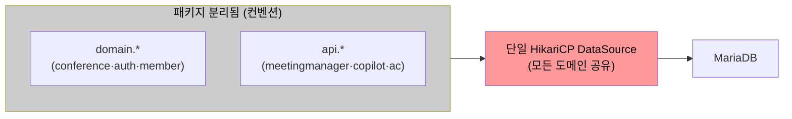
<p align="center"><em>[그림 9] 대안1 — 현행 구조 유지 (단일 DataSource 공유)</em></p>

**대안 2. 완전한 마이크로서비스 분리**

서비스·DB·배포 단위를 도메인별로 완전히 독립시킨다. 코드 경계가 물리적으로 명확해지는 장점이 있으나, 기존 front-api와 server-api 간 DB 트랜잭션 경계를 Saga 패턴 등 분산 트랜잭션으로 재설계해야 한다. 메시지 브로커 등 신규 인프라를 추가로 도입해야 하므로 C-04(점진적 적용) 제약을 위반하며, 분산 트랜잭션 설계 복잡도도 크게 늘어난다.

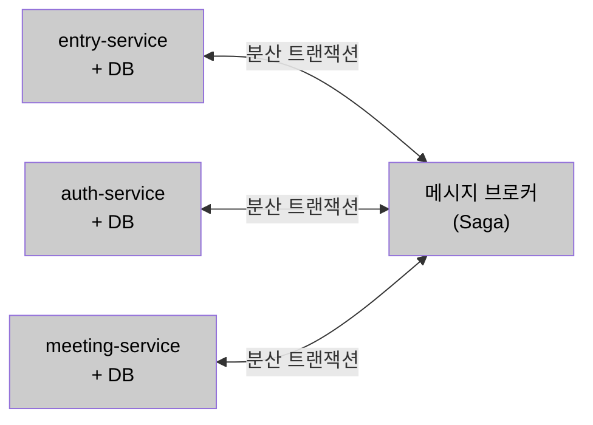
<p align="center"><em>[그림 10] 대안2 — 완전한 마이크로서비스 분리</em></p>

**대안 3. 선별적 도메인 모듈 분리 (채택)**

기존 도메인 패키지 구조를 유지하면서 `domain.entry` 전용 DataSource Bean을 분리 설정하여 AS-08 Bulkhead의 기술적 전제 조건을 마련한다. 도메인 간 참조는 인터페이스만 허용하도록 ArchUnit으로 빌드 타임에 강제하여 도메인 간 직접 참조를 차단한다. 기술 스택 변경 없이 AS-08·AS-07 파생 전략의 전제 조건을 충족한다.

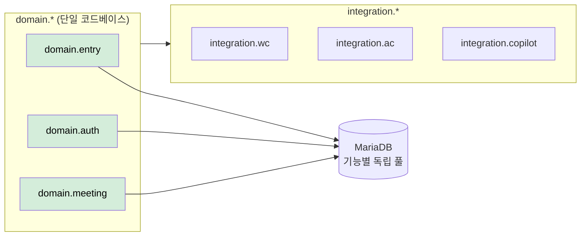
<p align="center"><em>[그림 11] 대안3 — 선별적 도메인 모듈 분리 (채택)</em></p>

**대안 비교**

| 대안 | 개념 | 한계 |
| :---: | ----- | ----- |
| 대안 1. 현행 구조 유지 | 도메인별 패키지 존재하나 단일 HikariCP DataSource 공유 유지 | DataSource Bean 분리 기준 없어 AS-08 격벽 분리 적용 불가. ISSUE-04·08이 구조적으로 해소되지 않음 |
| 대안 2. 완전한 마이크로서비스 분리 | 서비스·DB·배포 단위를 완전 독립 분리 | 분산 트랜잭션 문제(Saga 패턴 등) 즉시 부상. C-04(점진적 적용) 위반 |
| **대안 3. 선별적 도메인 모듈 분리 (채택)** | 기존 패키지 구조 활용 + domain.entry 전용 DataSource 분리 + ArchUnit 경계 규칙 강제 | — |

<p align="center"><em>[표 47] AS-01 도메인 경계 분리 대안 비교</em></p>

**채택 근거**: 완전 MSA(대안 2)는 분산 트랜잭션 설계와 신규 인프라 구성이 필요하여 C-04(점진적 적용) 제약을 위반한다. 대안 3은 배포 구조와 기술 스택을 변경하지 않으면서 DataSource Bean 분리와 ArchUnit 규칙으로 AS-08·AS-07 파생 전략의 전제 조건을 충족한다.

**적용 방향**
- 기존 도메인 패키지 구조 유지하며 `domain.entry` 전용 DataSource Bean(`entryDataSource`) 분리 설정 추가 → AS-08 격벽 분리 기반 마련
- 도메인 간 참조는 인터페이스만 허용, 직접 구현체 참조 금지 (ArchUnit 등으로 규칙 강제)
- `integration.*` 패키지에 외부 서버별 Feign Client + AS-09 CB 캡슐화
- `domain.entry` 전용 `DataSource` Bean 설정 → AS-08 격벽 분리 기반 마련

**도메인 모듈 경계 구조**


**파생 전략**: AS-08 (격벽 분리), AS-07 (DB 경로 분리)

---

#### AS-02. 입장 처리 경로 비동기 전환

**적용 대상**: AD-02, AD-04 / 해결 이슈: ISSUE-01, ISSUE-05, ISSUE-06

**설계 근거**

ISSUE-01의 핵심 병목은 Meeting Manager Feign 동기 호출 구간이다. "DB 입장 가능 여부 확인 → conference-token 발급" 단계까지는 포털 서버 내부에서 빠르게 처리된다. 그러나 "Meeting Manager에 참석자 입장 정보 조회(Feign 동기, 3,000ms)"가 완료될 때까지 해당 요청의 서블릿 스레드가 블로킹된다. MM 응답값을 받아야 wyzProParam을 생성하고 클라이언트에 응답할 수 있으므로 이 호출은 생략할 수 없다. 8만 건이 동시에 이 단계에 도달하면 8만 개의 스레드가 Meeting Manager 응답을 대기하는 상태가 된다. 해결의 핵심은 **외부 서버 호출 구간에서 서블릿 스레드를 즉시 반환**시키는 것이다.

**대안**

**대안 1. 현행 Feign 동기 호출 유지**

`maxThreads` 증가로 처리 용량을 간접 확대하는 방식이다. 8만 건이 동시에 Meeting Manager Feign 호출 단계에 도달하면 8만 개 서블릿 스레드가 최대 3,000ms 블로킹되는 구조적 문제가 해소되지 않는다. 스레드 수 증가는 컨텍스트 스위칭 오버헤드와 JVM 힙 압박을 증가시키며, QA-02 달성의 구조적 한계를 극복하지 못한다.

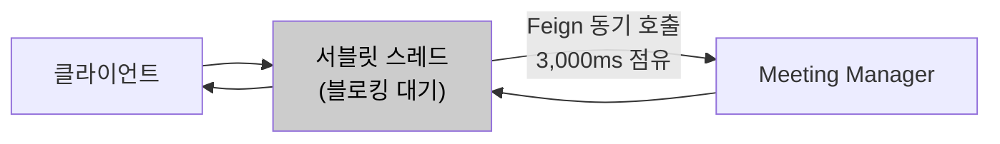
<p align="center"><em>[그림 13] 대안1 — 현행 Feign 동기 호출 유지</em></p>

**대안 2. Spring WebFlux 전환**

이벤트 루프 기반 논블로킹 처리를 전면 적용한다. 소수의 스레드로 대량 요청을 처리할 수 있어 이론적으로는 최적이나, 전체 코드베이스를 Reactive 모델로 재작성해야 한다. C-01(Spring MVC 유지) 및 C-04(점진적 적용) 제약을 동시에 위반한다.


<p align="center"><em>[그림 14] 대안2 — Spring WebFlux 전환</em></p>

**대안 3. Spring @Async + 전용 처리 큐 하이브리드 (채택)**

Meeting Manager Feign 호출 구간만 `@Async("externalCallExecutor")`로 선택적 비동기화하고, Spring MVC와 HikariCP를 그대로 유지한다. 컨트롤러가 `CompletableFuture<ResponseEntity>`를 반환하면 Spring MVC가 서블릿 스레드를 즉시 반환하고, externalCallExecutor에서 Meeting Manager 조회 + wyzProParam 생성이 완료된 후 응답을 전송한다. 8만 건 동시 요청에서도 서블릿 스레드 풀 고갈이 발생하지 않는다.

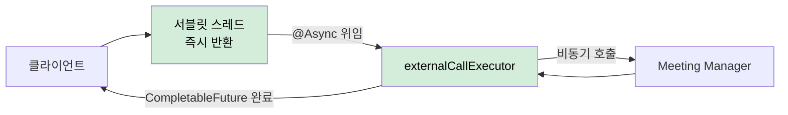
<p align="center"><em>[그림 15] 대안3 — Spring @Async + 전용 처리 큐 하이브리드 (채택)</em></p>

**대안 비교**

| 대안 | 개념 | 한계 |
| :---: | ----- | ----- |
| 대안 1. 현행 Feign 동기 호출 유지 | 스레드 풀 크기(maxThreads) 증가로 간접 대응 | 8만 건 동시 요청 규모에서 구조적 한계. 컨텍스트 스위칭 오버헤드·JVM 힙 압박 증가 |
| 대안 2. Spring WebFlux 전환 | 이벤트 루프 기반 논블로킹 처리 전면 적용 | 전체 코드베이스 Reactive 모델로 재작성 필요. C-01·C-04 동시 위반 |
| **대안 3. Spring @Async + 전용 처리 큐 하이브리드 (채택)** | 외부 서버 호출 구간만 선택적으로 비동기화 | — |

<p align="center"><em>[표 48] AS-02 비동기 전환 대안 비교</em></p>

**채택 근거**: 대안 1은 QA-02 목표를 구조적으로 달성할 수 없다. 대안 2는 기술 스택 전면 교체를 요구하여 C-01·C-04 제약을 동시에 위반한다. 대안 3은 현행 Spring MVC와 HikariCP를 그대로 유지하면서 병목 구간(Meeting Manager Feign 호출)만 선별적으로 비동기화하여 서블릿 스레드 고갈 문제를 해소한다.

**비동기 전환 흐름**


**적용 방향**
- `externalCallExecutor`: corePoolSize 100, maxPoolSize 500, queueCapacity 2,000으로 설정
- Meeting Manager 참석자 입장 정보 조회 메서드, VC/AC 서버 회의 개설 호출 메서드에 `@Async` 적용
- 컨트롤러에서 `CompletableFuture<ResponseEntity>` 반환 타입 적용 → Spring MVC 비동기 처리로 서블릿 스레드 즉시 반환, externalCallExecutor 완료 시 자동 응답
- 비동기 실패 처리는 AS-09 외부 서버 장애 차단과 연동하여 fallback 처리

---

#### AS-03. 외부 권한 조회 다층 캐시 적용

**적용 대상**: AD-01 / 해결 이슈: ISSUE-02, ISSUE-05, ISSUE-09

**설계 근거**

ISSUE-02의 구조적 문제는 `CompletableFuture.allOf()` 대기 패턴이다. AC서버·Copilot Admin 서버 응답이 모두 도달해야 `GET /members/{email}`이 응답을 반환할 수 있으므로, 가장 느린 외부 서버의 응답 시간이 전체 API 응답 시간을 결정한다. QA-01(평균 응답시간 1초 이내)을 충족하려면 **외부 서버 호출 자체를 줄이는 것**이 근본 해법이다. AC 권한·LLM 권한·용어사전 권한은 매 로그인마다 변경되는 데이터가 아니다.

단, AS-03은 **변경 빈도가 낮은 외부 서버 권한 데이터(AC 권한·LLM 권한·용어사전 권한)에만 선택적으로 적용**한다. 실시간 반영이 필요한 참석자 상태·회의 진행 상태 등 강한 정합성이 요구되는 데이터는 AS-03 적용 범위 밖이며, 이 데이터들은 기존대로 DB 직접 조회를 유지한다.

또한 ISSUE-09에서 지적된 cold start 문제는, 캐시가 존재하더라도 피크 진입 시점에 캐시가 비어 있으면 해소되지 않는다. 따라서 캐시 인프라 자체가 AS-06(선제 초기화)의 선제 워밍 기반이 되어야 한다.

**대안**

**대안 1. 캐시 없음 (현행)**

현행 구조 유지. 매 로그인마다 AC서버·Copilot Admin 서버에 권한 갱신 요청을 전송하고, 모든 응답이 수신될 때까지 대기한다.

`GET /members/{email}` API에서 `CompletableFuture.allOf(acFuture, llmFuture, glossaryFuture).get()` 패턴 그대로 유지. 피크 시간대 동시 로그인이 집중될수록 외부 서버 요청도 함께 집중되어 응답 지연이 선형 이상으로 증가한다.

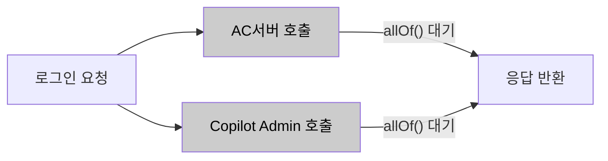
<p align="center"><em>[그림 18] 대안1 — 캐시 없음 (현행)</em></p>

**대안 2. DB 캐시 전용**

외부 서버 호출 후 결과를 DB에만 저장·조회한다. 단일 인스턴스 환경에서는 유효하나, 다중 인스턴스 스케일아웃 시 인스턴스 간 캐시 공유가 되지 않아 모든 인스턴스에서 각각 외부 서버를 호출하게 된다. DB 커넥션을 추가로 소비하고 피크 진입 시점의 cold start 문제를 해소하지 못한다.

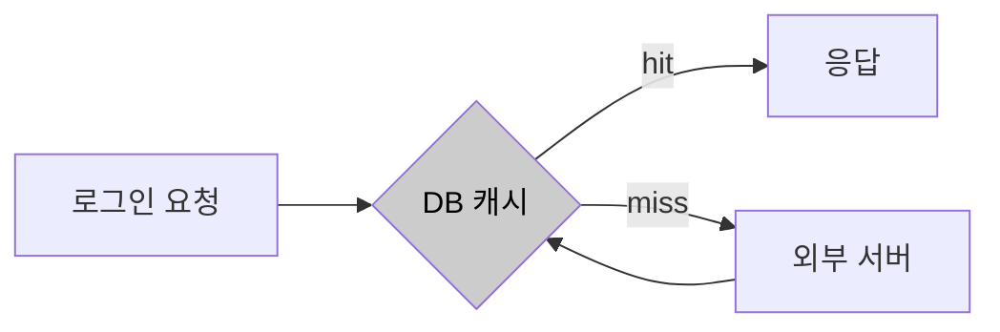
<p align="center"><em>[그림 19] 대안2 — DB 캐시 전용</em></p>

**대안 3. 계층화 캐시 L1+L2 (채택)**

인스턴스 로컬 L1 Caffeine(TTL 5분)과 분산 공유 L2 Redis(TTL 30분~1시간)를 계층적으로 구성한다. L1 hit 시 네트워크 없이 즉시 반환, L2 hit 시 외부 서버 호출 없이 반환하여 다중 인스턴스 환경에서도 외부 서버 호출을 일괄 완충한다. L2 Redis 인프라가 AS-06 선제 초기화의 실질적 기반이 된다.

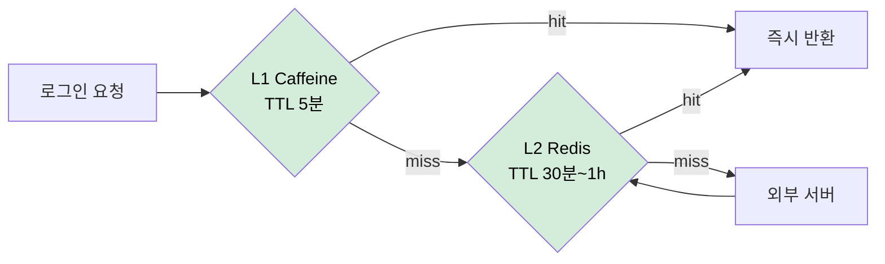
<p align="center"><em>[그림 20] 대안3 — 계층화 캐시 L1+L2 (채택)</em></p>

**대안 비교**

| 대안 | 개념 | 한계 |
| :---: | ----- | ----- |
| 대안 1. 캐시 없음 (현행) | 현행 유지. 매 로그인마다 외부 서버 직접 호출 | 피크 시 외부 서버 요청 집중으로 응답 지연 심화. QA-01 달성이 외부 서버 응답 시간에 종속 |
| 대안 2. DB 캐시 전용 | 외부 서버 호출 후 DB에만 저장·조회 | 인스턴스 간 캐시 공유 불가. DB 커넥션 추가 소비. cold start 미해소 |
| **대안 3. 계층화 캐시 L1+L2 (채택)** | L1 Caffeine(로컬, TTL 5분) + L2 Redis(분산, TTL 30분~1시간) | — |

<p align="center"><em>[표 49] AS-03 다층 캐시 대안 비교</em></p>

**채택 근거**: 대안 2(DB 캐시)는 외부 서버 호출을 줄이지만 인스턴스 간 캐시 공유 불가, DB 커넥션 추가 소비, cold start 미해소 등의 한계가 있다. 대안 3은 인스턴스 스케일아웃 환경에서도 외부 서버 호출을 일괄 완충하며, AS-06 선제 초기화의 실질적 기반이 된다. Spring `@Cacheable`과 Caffeine·Redis 통합은 Spring Boot 내에서 코드 변경 없이 CacheManager 설정만으로 구현 가능하므로 C-04(점진적 적용) 제약도 준수한다.

**적용 방향**
- `spring-boot-starter-cache` + `Caffeine` + `spring-data-redis` 의존성 추가
- `@Cacheable(cacheNames = "memberAuth", key = "#email")` 적용
- `CompositeCacheManager`로 L1(CaffeineCacheManager) → L2(RedisCacheManager) 순서 구성
- 권한 갱신 이벤트 발생 시 `@CacheEvict`로 L1·L2 동기 무효화
- 권한 유형별 TTL 차등: AC 권한 1시간 / LLM·용어사전 권한 30분

**파생 전략**: AS-06 (선제 초기화)

---

#### AS-04. 입장 전용 처리 경로 확보

**적용 대상**: AD-02 / 해결 이슈: ISSUE-01, ISSUE-03

**설계 근거**

오전 9시·오후 1시 업무 시작 시간대와 대규모 스트리밍 서비스 시작 시점에는 회의 입장 요청·로그인 요청·단순 조회 요청이 동시에 폭발적으로 증가한다. 이 구간에서 모든 요청이 동일한 서블릿 스레드 FIFO 큐에 유입되면, 처리 비용이 낮은 단순 조회 요청이 스레드를 먼저 선점하는 상황이 반복된다. Tomcat 서블릿 스레드 풀이 포화 상태에 가까워지면 `acceptCount` 큐에 대기 중인 요청들이 선착순으로 스레드를 할당받아, 단순 조회가 conference-token 발급 요청보다 먼저 처리될 수 있다.

**대안**

**대안 1. 현행 단일 FIFO 서블릿 스레드 풀**

`maxThreads` 증가로 처리 용량을 확대한다. 스레드 수를 늘려도 모든 요청이 동일 큐에서 FIFO로 처리되므로, 단순 조회 API가 conference-token 발급 요청보다 먼저 스레드를 점유하는 우선순위 역전 자체가 해소되지 않는다. 트래픽 집중 시 핵심 입장 요청이 덜 중요한 요청 뒤에서 대기하는 상황이 반복된다.

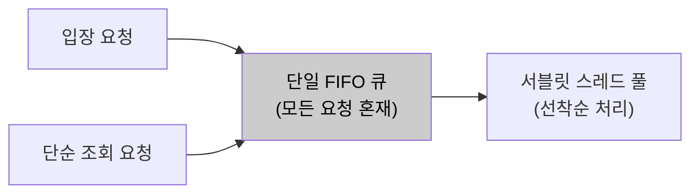
<p align="center"><em>[그림 22] 대안1 — 현행 단일 FIFO 서블릿 스레드 풀</em></p>

**대안 2. URL 패턴 기반 전용 Connector·스레드 풀 분리 (채택)**

Tomcat Connector를 포트 단위(8080/8081)로 분리하여 `/join`, `/conference-token` 경로를 입장 전용 포트로 수신한다. 입장 전용 스레드 풀이 항상 일정 수의 스레드를 보유하므로, 피크 시 일반 요청이 8080 스레드를 포화시켜도 8081 입장 요청은 전용 스레드에서 즉시 처리된다. `WebServerFactoryCustomizer` 설정만으로 기존 코드 변경 없이 적용 가능하다.

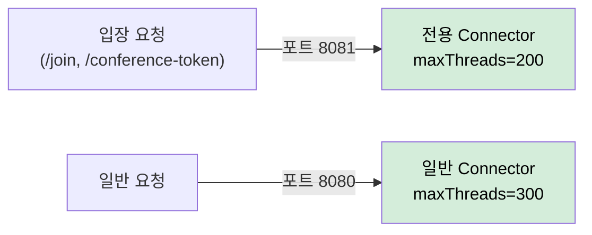
<p align="center"><em>[그림 23] 대안2 — URL 패턴 기반 전용 Connector·스레드 풀 분리 (채택)</em></p>

**대안 3. HandlerInterceptor + 인메모리 우선순위 큐 재정렬**

요청을 가로채 `PriorityBlockingQueue`로 우선순위를 재정렬하는 방식이다. 서블릿 스레드는 이미 응답 객체에 귀속되어 있어 재정렬 후 다른 스레드로 처리를 이전하는 것이 구조적으로 불가능하다. 타임아웃 처리와 응답 객체 수명 관리가 복잡해지고 서블릿 모델과 구조적으로 맞지 않아 구현 복잡도와 운영 위험이 크다.


<p align="center"><em>[그림 24] 대안3 — HandlerInterceptor + 인메모리 우선순위 큐 재정렬</em></p>

**대안 비교**

| 대안 | 개념 | 한계 |
| :---: | ----- | ----- |
| 대안 1. 현행 단일 FIFO 서블릿 스레드 풀 | maxThreads 증가로 처리 용량 확대 | 스레드 수 증가는 메모리·컨텍스트 스위칭 오버헤드 유발. 우선순위 역전 자체는 해소 불가 |
| **대안 2. URL 패턴 기반 전용 Connector·스레드 풀 분리 (채택)** | Tomcat Connector를 포트 단위로 분리, 핵심 API 전용 스레드 풀 예약 | — |

| 대안 3. HandlerInterceptor + 인메모리 우선순위 큐 재정렬 | 요청 가로채기 후 PriorityBlockingQueue로 우선순위 재정렬 | 서블릿 모델과 구조적으로 맞지 않음. 응답 객체 스레드 귀속 문제, 타임아웃 처리 복잡 |
<p align="center"><em>[표 50] AS-04 입장 전용 처리 경로 대안 비교</em></p>

**채택 근거**: 대안 3은 서블릿 스레드 모델과 구조적으로 맞지 않아 구현 복잡도와 운영 위험이 크다. 대안 2는 Tomcat이 이미 제공하는 Connector 분리 기능을 활용하므로, 기존 코드 변경 없이 `WebServerFactoryCustomizer` 설정만으로 적용 가능하다.

**적용 방향**
- `TomcatServletWebServerFactory` Bean 커스터마이징으로 포트 8081에 입장 전용 Connector 추가
- 입장 전용 Connector: `maxThreads=200`, `minSpareThreads=50`
- 일반 Connector(8080): `maxThreads=300`
- API Gateway 또는 Nginx에서 `/meetings/*/join`, `/meetings/*/conference-token` URL 패턴을 포트 8081로 라우팅
- AS-08(격벽 분리)와 결합 시: 입장 전용 Connector 스레드는 `join-pool` HikariCP DataSource만 사용하도록 구성

---

#### AS-05. 피크 구간 요청 유입 제한

**적용 대상**: AD-02, AD-04 / 해결 이슈: ISSUE-03, ISSUE-09

**설계 근거**

AS-04(입장 전용 처리 경로 확보)가 "핵심 요청이 비핵심 요청보다 먼저 처리되도록" 하는 전략이라면, AS-05은 "피크 구간에 비핵심 요청의 유입량 자체를 줄여" 핵심 처리 경로의 리소스 여유를 확보하는 전략이다. 두 전략은 보완 관계다. AS-06(선제 초기화)이 예약 데이터를 활용해 캐시를 선제 적재한다면, AS-05은 동일한 피크 예측 정보를 활용해 **비핵심 요청의 유입을 시간 구간 기반으로 제어**한다.

**대안**

**대안 1. 스로틀링 없음 (현행)**

모든 요청을 제한 없이 수신하고 처리한다. 피크 구간에 비핵심 요청(단순 조회, 관리 API 등)이 입장 처리 경로와 동일한 스레드·커넥션 자원을 소비해도 제어 수단이 없다. AS-04 전용 Connector가 적용되더라도, 일반 Connector(8080)가 포화되면 비핵심 요청이 일반 자원을 과점하는 상황을 방치한다.

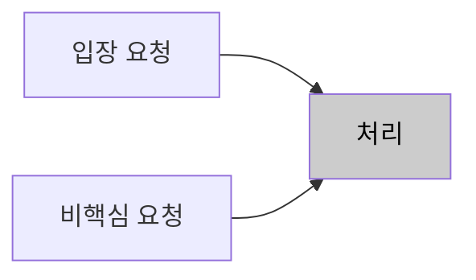
<p align="center"><em>[그림 26] 대안1 — 스로틀링 없음 (현행)</em></p>

**대안 2. 고정 Rate Limiting (균일 RPS 제한)**

전체 API에 동일한 RPS 상한을 적용한다. 비핵심 요청이 제한되는 효과가 있으나 입장 요청도 동일하게 제한되어 오히려 QA-02 달성을 방해하는 역효과 위험이 있다. 피크 구간이 아닌 시간대에도 불필요한 제한이 발생한다.

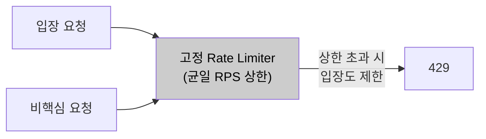
<p align="center"><em>[그림 27] 대안2 — 고정 Rate Limiting (균일 RPS 제한)</em></p>

**대안 3. 피크 예측 기반 차등 스로틀링 (채택)**

예약 회의 데이터 기반 피크 예상 구간에만 활성화하고, `@ThrottleExempt`가 없는 비핵심 API로만 스로틀링 대상을 한정한다. 입장 요청은 스로틀링에서 면제되므로 피크 구간에도 QA-02를 방해하지 않으면서 비핵심 요청의 자원 소비를 구간 기반으로 제어한다.

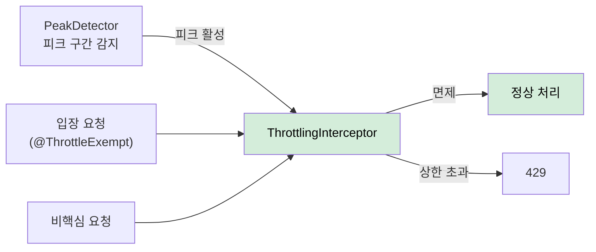
<p align="center"><em>[그림 28] 대안3 — 피크 예측 기반 차등 스로틀링 (채택)</em></p>

**대안 비교**

| 대안 | 개념 | 한계 |
| :---: | ----- | ----- |
| 대안 1. 스로틀링 없음 (현행) | 모든 요청을 제한 없이 수신하고 처리 | 피크 구간에 비핵심 요청이 핵심 처리 경로의 스레드·커넥션을 소비해도 제어 수단 없음 |
| 대안 2. 고정 Rate Limiting (균일 RPS 제한) | 전체 API에 동일한 RPS 상한 적용 | 핵심 API도 제한될 수 있어 QA-02 달성을 방해하는 역효과 위험 |
| **대안 3. 피크 예측 기반 차등 스로틀링 (채택)** | 예약 회의 데이터 기반 피크 예상 구간 감지 후 비핵심 API만 선별 처리 속도 제한 | — |

<p align="center"><em>[표 51] AS-05 요청 유입 제한 대안 비교</em></p>

**채택 근거**: 대안 2(균일 Rate Limiting)는 핵심 API까지 제한하는 역효과 위험이 있다. 대안 3은 스로틀링 대상을 비핵심 API로 한정하고 피크 예측 구간에만 활성화한다.

**적용 방향**
- `PeakDetector` 컴포넌트: DB 예약 회의 조회(Spring Scheduler로 1분 주기) + 시간대 기반 고정 피크 정의
- `@ThrottleExempt` 커스텀 어노테이션: 핵심 API 컨트롤러 메서드에 적용
- `ThrottlingInterceptor` (HandlerInterceptor): 피크 구간 중 `@ThrottleExempt`가 없는 API에 Bucket4j 적용
- Bucket4j `SlidingWindowCounter`: 비핵심 API 전역 처리량 상한 (피크 구간 중 초당 1,000 req)

---

#### AS-06. 예약 기반 피크 자원 선제 초기화

> **전제**: AS-03(외부 권한 조회 다층 캐시 적용)의 파생 전략. AS-03의 L2 Redis 캐시 인프라가 없으면 Pre-warming 적재 대상이 존재하지 않는다.

**적용 대상**: AD-01, AD-02, AD-04 / 해결 이슈: ISSUE-09

**설계 근거**

AS-03(캐시)이 도입되면, 캐시가 채워진 상태에서는 외부 서버 호출 없이 빠른 응답이 가능하다. 그러나 캐시가 도입되더라도 **피크 진입 시점에 캐시가 비어 있으면** (TTL 만료, 서버 재시작, 신규 사용자 등) 피크 초입의 대량 캐시 miss가 일시에 외부 서버로 쏟아지는 "Thundering Herd" 현상이 발생한다. Pre-warming은 이 문제를 해소하는 전략이다. 트래픽이 실제로 집중되기 N분 전에, DB의 예약 회의 데이터를 조회하여 해당 회의 참석자들의 권한 캐시를 선제적으로 L2 Redis에 적재한다.

미팅 서비스의 트래픽 집중 패턴은 두 가지 유형으로 나뉜다. 첫째, **일별 반복 패턴**: 오전 9시·오후 1시 업무 시작 시간대에 로그인·권한 갱신·회의 입장 요청이 집중된다. 둘째, **이벤트 기반 패턴**: DB에 예약된 대규모 회의(8만 명 스트리밍 서비스 등) 시작 시점에 입장 요청이 집중된다.

**대안**

**대안 1. 현행 사후 대응**

트래픽이 실제로 집중된 이후 자연적 warm-up에 의존한다. 피크 초입에 대량의 캐시 miss가 일시에 외부 서버로 집중되는 "Thundering Herd" 현상이 발생한다. AS-03 캐시를 도입하더라도 피크 진입 시점에 캐시가 비어 있으면 이 문제는 해소되지 않는다.


<p align="center"><em>[그림 30] 대안1 — 현행 사후 대응</em></p>

**대안 2. 고정 스케줄 워밍**

매일 고정 시간(오전 8:50, 오후 12:50 등)에 일괄 캐시 워밍을 수행한다. 일별 반복 패턴에는 대응할 수 있으나, DB에 등록된 대규모 스트리밍 서비스처럼 특정 시점의 이벤트 기반 피크는 인식하지 못한다. TTL이 만료되기 전에 피크가 도달해야 효과가 있으며, 실제 피크와 시간이 어긋나면 캐시가 이미 만료된 상태일 수 있다.

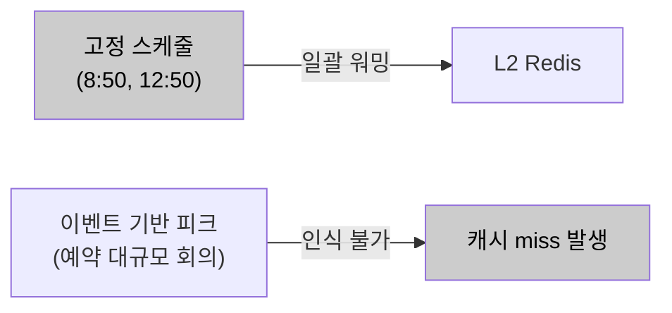
<p align="center"><em>[그림 31] 대안2 — 고정 스케줄 워밍</em></p>

**대안 3. 예약 회의 데이터 기반 동적 선제 초기화 (채택)**

DB의 예약 회의 시작 시각과 참석자 수를 주기적으로 조회하여, 임계값(예: 500명) 이상의 회의 N분 전에 해당 참석자 권한 캐시를 L2 Redis에 선제 적재한다. DB에 이미 존재하는 데이터를 활용하므로 외부 인프라 추가 없이 구현 가능하다. AS-05 Throttling과 연동하여 워밍 시작 시 피크 구간 유입 제한도 동시에 활성화한다.


<p align="center"><em>[그림 32] 대안3 — 예약 회의 데이터 기반 동적 선제 초기화 (채택)</em></p>

**대안 비교**

| 대안 | 개념 | 한계 |
| :---: | ----- | ----- |
| 대안 1. 현행 사후 대응 | 트래픽 집중 후 자연적 warm-up에 의존 | 피크 초입에 Thundering Herd 발생. 예측 가능한 문제에 사전 대응하지 않음 |
| 대안 2. 고정 스케줄 워밍 | 매일 고정 시간(8:50, 12:50 등)에 일괄 캐시 워밍 | 이벤트 기반 피크(예약 대규모 회의)에 대응 불가. 불필요한 외부 서버 호출 대규모 발생 |
| **대안 3. 예약 회의 데이터 기반 동적 선제 초기화 (채택)** | DB 예약 회의 시작 시간·참석자 수 조회 후 임계값 이상 회의 N분 전 선제 적재 | — |

<p align="center"><em>[표 52] AS-06 선제 초기화 대안 비교</em></p>

**채택 근거**: 대안 1은 Thundering Herd를 해소하지 못한다. 대안 2는 이벤트 기반 피크를 인식하지 못한다. 대안 3은 DB에 이미 존재하는 예약 회의 데이터를 활용하므로 외부 인프라 추가 없이 구현 가능하며, AS-03 Redis 캐시와 AS-05 Throttling 양쪽과 자연스럽게 연동된다.

**적용 방향**
- `PreWarmingScheduler`: `@Scheduled(fixedDelay = 60_000)` + `@Async("preWarmExecutor")` 조합으로 서블릿 스레드와 완전 분리
- 대상 회의 쿼리: 현재 시각 + N분 이내에 시작하는 참석자 수 임계값(예: 500명) 이상 예약 회의 목록 조회
- 워밍 호출 배치 크기: 50명/배치, 배치 간 100ms 딜레이로 외부 서버 부하 분산
- `PeakDetector.setActive(true)`: 워밍 시작 시 AS-05 Throttling 동시 활성화
- 일별 반복 패턴 보완: 오전 8:50, 오후 12:50 고정 스케줄도 병행

---

#### AS-07. 조회·입장 DB 경로 분리

> **전제**: AS-01(입장 처리 도메인 경계 분리)의 파생 전략. AS-01이 설정한 도메인 경계 내에서 Command/Query 경로를 분리한다.

**적용 대상**: AD-03 / 해결 이슈: ISSUE-07

**설계 근거**

현재 미팅 포털 서버는 Primary-Replica 구성을 갖추고 있으며, 일부 느린 SELECT 쿼리는 개별적으로 Replica로 라우팅되어 있다. 그러나 이 라우팅은 쿼리 단위 수동 지정 방식으로 체계적이지 않으며, ISSUE-07의 핵심 원인인 write 경로 간 lock 경합은 여전히 해소되지 않은 상태다.

ISSUE-07의 경합 구조를 분석하면 두 가지 write 경로가 동시에 동일 테이블을 타격한다. 첫째 **front-api 경유 write (셀프 참석자 한정)** (`User → front-api → participants INSERT` — 오픈회의 셀프 참석자 입장 시), 둘째 **cPaaS 피드백 경유 write** (`cPaaS → server-api → participants UPDATE` — 입장 성공·퇴장·연결 끊김 등 모든 참석자 상태 변경). 두 write 경로는 독립적으로 발생하며, 대규모 회의 시작 시점에는 cPaaS 피드백 경유 UPDATE가 최고조에 달한다. 여기에 참석자 목록 조회(read)까지 집중되면, 동일 레코드에 대한 read/write lock 경합이 최대화된다.

해결의 핵심은 **write(Command)와 read(Query)가 서로의 DB lock을 경쟁하지 않는 구조**를 만드는 것이다.

**대안**

**대안 1. 현행 선택적 Replica 라우팅 유지**

Primary-Replica 인프라는 갖추어져 있으나, 응답 지연이 심한 일부 SELECT 쿼리에 한해 개별 수동으로 Replica를 지정하는 방식이다. 적용 기준이 일관되지 않아 트랜잭션 단위 readOnly 경계를 보장하지 못하고 누락 위험이 있다. 더 큰 문제는 ISSUE-07의 핵심인 write lock 경합(셀프 참석자 front-api INSERT · cPaaS 피드백 경유 server-api UPDATE가 동일 Primary에 집중)은 SELECT를 Replica로 옮겨도 해소되지 않는다.

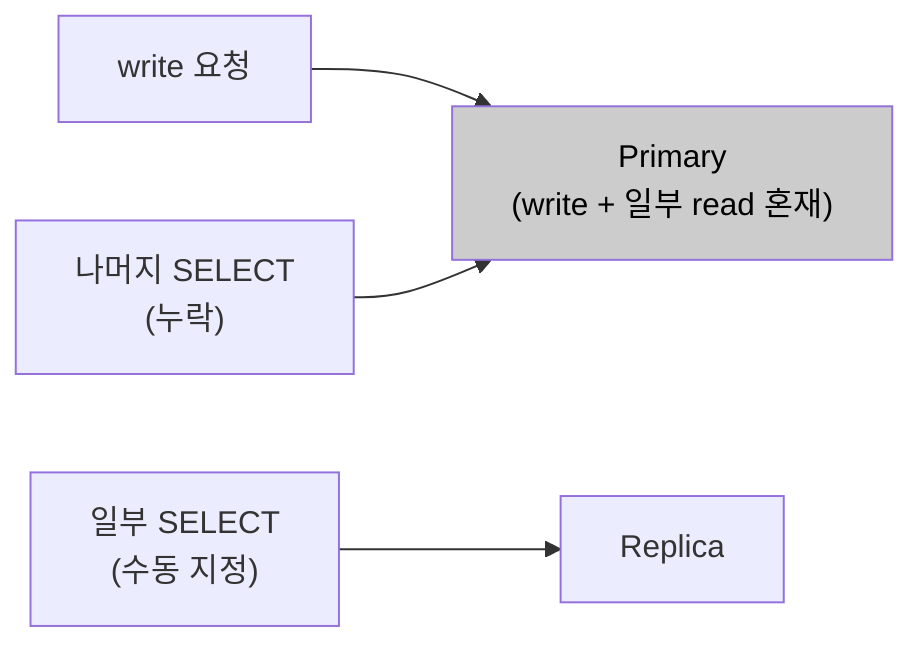
<p align="center"><em>[그림 34] 대안1 — 현행 선택적 Replica 라우팅 유지</em></p>

**대안 2. 완전한 이벤트 소싱 + CQRS**

모든 Command를 이벤트 스트림으로 저장하고 Query는 별도 Read Model(투영)을 조회한다. Command와 Query 경로가 완전히 분리되는 이상적인 구조이나, 기존 JPA 엔티티 기반 도메인 모델을 이벤트 소싱 모델로 전면 재설계해야 한다. 이벤트 순서 보장·투영 복구·이벤트 버저닝 등 복잡한 문제가 따라오며 C-04(점진적 적용) 제약을 위반한다.

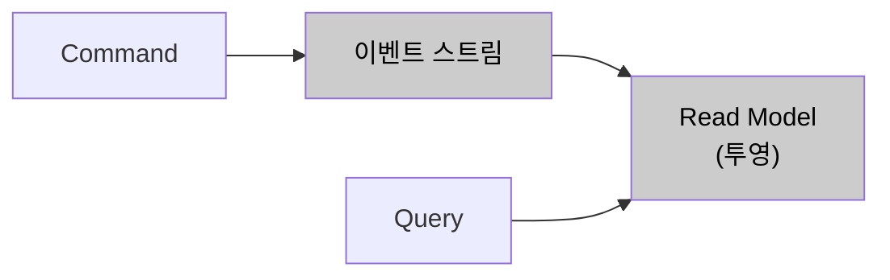
<p align="center"><em>[그림 35] 대안2 — 완전한 이벤트 소싱 + CQRS</em></p>

**대안 3. @Transactional 기반 Primary/Replica 전체 체계화 (채택)**

이미 갖추어진 Primary-Replica 인프라를 활용하되, 현행 쿼리 단위 수동 지정을 `AbstractRoutingDataSource` + `@Transactional(readOnly = true)` 기반 체계적 라우팅으로 전환한다. 기존 JPA 엔티티·레포지토리 코드 변경 없이 DataSource 설정 교체만으로 적용 가능하며, 모든 Query가 Replica로 일관되게 분리되어 Primary DB가 write 처리에만 집중할 수 있다.

```mermaid
flowchart LR
    SVC["서비스 레이어"] --> ROUTER["DataSourceRouter\n(readOnly 속성 분기)"]
    ROUTER -->|"readOnly=false"| PRI["Primary\nwrite 전담"]
    ROUTER -->|"readOnly=true"| REP["Replica\nread 전담"]
    style ROUTER fill:#d4edda,color:#000
    style PRI fill:#d4edda,color:#000
    style REP fill:#d4edda,color:#000
```
<p align="center"><em>[그림 36] 대안3 — @Transactional 기반 Primary/Replica 전체 체계화 (채택)</em></p>

**대안 비교**

| 대안 | 개념 | 한계 |
| :---: | ----- | ----- |
| 대안 1. 현행 선택적 Replica 라우팅 유지 | 응답 지연이 심한 일부 SELECT만 수동으로 Replica 지정 | 트랜잭션 단위 readOnly 경계 미보장, 누락 위험. write lock 경합(셀프 참석자 front-api INSERT · cPaaS 피드백 경유 server-api UPDATE) 구조적 미해소 |
| 대안 2. 완전한 이벤트 소싱 + CQRS | 모든 Command를 이벤트 스트림으로 저장, Query는 별도 Read Model 조회 | 기존 JPA 엔티티 기반 도메인 모델 전면 재설계 필요. C-04 위반 |
| **대안 3. @Transactional 기반 Primary/Replica 전체 체계화 (채택)** | 기존 Primary-Replica 인프라 활용, 수동 지정 방식을 AbstractRoutingDataSource + @Transactional(readOnly) 전면 전환 | — |

<p align="center"><em>[표 53] AS-07 DB 경로 분리 대안 비교</em></p>

**채택 근거**: 대안 1의 선택적 Replica 라우팅은 체계적 기준이 없어 ISSUE-07의 write lock 경합을 구조적으로 해소하지 못한다. 대안 2는 도메인 모델 전면 재설계로 C-04 위반이다. 대안 3은 이미 갖추어진 Primary-Replica 인프라를 활용하며 기존 코드 최소 변경으로 구현 가능하다. 참석자 목록 조회를 Replica로 전면 분산하면 Primary DB의 write 처리(입장·피드백)가 조회 lock 경합에서 벗어난다.

**적용 방향**
- `DataSourceRouter extends AbstractRoutingDataSource`: 현재 트랜잭션의 `readOnly` 속성 조회 후 Primary/Replica DataSource 반환
- `LazyConnectionDataSourceProxy`로 래핑하여 실제 커넥션 획득을 트랜잭션 시작까지 지연
- AS-08(기능별 격벽 분리)와 결합: Primary DataSource는 `join-pool`·`service-pool`, Replica DataSource는 `query-pool`로 별도 HikariCP 풀 설정

---

#### AS-08. 기능별 커넥션·스레드 격벽 분리

> **전제**: AS-01(입장 처리 도메인 경계 분리)의 파생 전략. AS-01이 설정한 도메인 경계별로 HikariCP 커넥션 풀을 분리 구성한다.

**적용 대상**: AD-03, AD-04 / 해결 이슈: ISSUE-01, ISSUE-04, ISSUE-06

**설계 근거**

현행 구조에서 front-api·server-api·admin-api는 동일한 DB를 공유하며, 각 인스턴스 내 기능 간에도 단일 HikariCP 풀이 공유된다. 8만 명 동시 입장이 발생하면 입장 처리(UC-04)가 DB 조회를 위해 커넥션을 획득하고, HikariCP 풀 크기를 훨씬 초과하는 요청이 동시에 커넥션을 요구하면 `connectionTimeout` 만료까지 대기하다 예외가 발생한다. 이 예외는 입장 처리에서 그치지 않고, 동일 풀을 사용하는 회의 시작(UC-03), 참석자 초대(UC-06)에서도 동일하게 발생한다.

QA-03의 측정 기준은 "입장 전용 커넥션 풀 고갈 시 회의 시작 API 성공률 100%"다. 이를 충족하려면 **기능별로 독립된 커넥션 풀**이 필요하다.

**대안**

**대안 1. 현행 단일 HikariCP 풀**

`maximumPoolSize` 증가로 커넥션 고갈을 지연시키는 방식이다. 풀 크기를 늘려도 입장 처리가 풀 전체를 소진하면 회의 조회·회의 개설 등 다른 기능의 DB 접근도 막힌다. QA-03(입장 풀 고갈 시 회의 시작 API 성공률 100%)은 단일 풀 구조에서 원칙적으로 충족 불가능하다.

```mermaid
flowchart LR
    JOIN["입장 처리"] --> POOL["HikariCP 단일 풀"]
    SVC["회의 시작·초대"] --> POOL
    AUTH["권한 갱신"] --> POOL
    POOL --> DB[("MariaDB")]
    style POOL fill:#cccccc,color:#000
```
<p align="center"><em>[그림 38] 대안1 — 현행 단일 HikariCP 풀</em></p>

**대안 2. 기능별 HikariCP 풀 분리만**

`join-pool`, `service-pool`, `general-pool`으로 커넥션을 격리하여 QA-03을 충족한다. 그러나 외부 서버 호출 스레드 측면의 구조적 변화가 없다. deprecated Hystrix threadpool이 서비스별 외부 호출 실행 스레드를 분리하지만 서블릿 스레드는 여전히 `Future.get()`으로 블로킹되어, AS-02 연계를 통한 서블릿 스레드 즉시 반환 효과를 확보하지 못한다.

```mermaid
flowchart LR
    JOIN["입장 처리"] --> JP["join-pool"]
    SVC["회의 시작·초대"] --> SP["service-pool"]
    AUTH["권한 갱신"] --> GP["general-pool"]
    JP & SP & GP --> DB[("MariaDB")]
    style JP fill:#cccccc,color:#000
    style SP fill:#cccccc,color:#000
    style GP fill:#cccccc,color:#000
```
<p align="center"><em>[그림 39] 대안2 — 기능별 HikariCP 풀 분리만</em></p>

**대안 3. 이중 Bulkhead — DB 커넥션 풀 + 스레드 풀 동시 격리 (채택)**

HikariCP 풀을 기능별로 분리(QA-03 충족)하는 동시에, deprecated Hystrix threadpool을 `@Async` 기반 `externalCallExecutor`로 교체한다. AS-02와 결합하면 서블릿 스레드가 외부 서버 응답을 기다리지 않고 즉시 반환되어 ISSUE-06을 완전히 해소하고 QA-03·QA-05를 모두 충족한다.

```mermaid
flowchart TD
    JOIN["입장 처리"] --> JP["join-pool\n100 conn"]
    SVC["회의 시작·초대"] --> SP["service-pool\n40 conn"]
    AUTH["권한 갱신"] --> GP["general-pool\n60 conn"]
    RD["read 조회"] --> QP["query-pool\n80 conn"]
    JOIN -->|"@Async"| EX["externalCallExecutor\n스레드 풀 격리"]
    JP & SP & GP --> PRI[("Primary")]
    QP --> REP[("Replica")]
    style JP fill:#d4edda,color:#000
    style EX fill:#d4edda,color:#000
```
<p align="center"><em>[그림 40] 대안3 — 이중 Bulkhead (DB 커넥션 풀 + 스레드 풀 동시 격리) (채택)</em></p>

**대안 비교**

| 대안 | 개념 | 한계 |
| :---: | ----- | ----- |
| 대안 1. 현행 단일 HikariCP 풀 | maximumPoolSize 증가로 고갈 지연 | QA-03(입장 풀 고갈 시 회의 시작 100% 성공)은 단일 풀 구조에서 원칙적으로 충족 불가 |
| 대안 2. 기능별 HikariCP 풀 분리만 | 커넥션 격리하되 Hystrix threadpool(deprecated) 교체 없음 | 서블릿 스레드는 여전히 Future.get()으로 블로킹, AS-02 연계 서블릿 스레드 즉시 반환 효과 미확보 |
| **대안 3. 이중 Bulkhead — DB 커넥션 풀 + 스레드 풀 동시 격리 (채택)** | HikariCP 풀 기능별 분리 + Hystrix threadpool을 `@Async` externalCallExecutor로 교체 (AS-02 연계 서블릿 스레드 즉시 반환) | — |

<p align="center"><em>[표 54] AS-08 격벽 분리 대안 비교</em></p>

**채택 근거**: 대안 2는 Hystrix threadpool(deprecated) 교체와 AS-02 연계를 통한 서블릿 스레드 즉시 반환이 없어 ISSUE-06 완전 해소 불가. 대안 3은 AS-02의 `@Async` 기반 외부 서버 호출 전환과 함께 DB 커넥션 풀과 스레드 풀을 동시에 격리하여 QA-03·QA-05를 모두 충족한다.

**풀 구성**

| 풀 이름 | 담당 기능 | maximumPoolSize | connectionTimeout |
| ----- | ----- | ----- | ----- |
| join-pool | 입장 처리 전용 | 100 | 3,000ms |
| service-pool | 회의 시작·초대 | 40 | 5,000ms |
| general-pool | 권한 갱신·일반 조회 | 60 | 5,000ms |
| query-pool | Read 전용 (Replica, AS-07) | 80 | 3,000ms |

<p align="center"><em>[표 55] AS-08 HikariCP 기능별 커넥션 풀 구성</em></p>

---

#### AS-09. 외부 서버 장애 차단 및 계층 복구

**적용 대상**: AD-04 / 해결 이슈: ISSUE-02, ISSUE-06, ISSUE-08

**설계 근거**

피크 구간에 외부 서버 장애가 겹치면, 서킷 브레이커가 개방되기 전까지 Feign 호출은 read timeout(3,000ms) 만료까지 블로킹된다. 8만 명 동시 입장 구간에 WC서버 장애가 겹치면, CB 개방 이전 구간에만 `externalCallExecutor` 스레드 풀에 3,000ms씩 블로킹된 스레드가 빠르게 누적된다. AS-08 Bulkhead로 스레드 풀이 격리되더라도 서킷 브레이커 없이는 `externalCallExecutor` 스레드 풀 자체가 소진된다.

현행 시스템은 `application.yml`에 `hystrix.command.default.*` 전역 기본값만 설정되어 있어, 모든 외부 서버에 동일한 CB 임계값이 적용된다. 그러나 외부 서버들은 특성이 서로 다르다. WC서버는 회의 개설·종료(UC-03, UC-07) 처리에 필수적이어서 빠른 감지·차단이 필요하고, Copilot Admin 서버(LLM·용어사전 권한)는 장애 시 DB 저장값으로 폴백 가능하여 관대한 임계값을 허용한다. 전역 단일 설정으로는 이 차이를 반영한 정밀 제어가 불가능하며, 피크 구간에 한 서버의 장애가 다른 서버 처리 경로까지 동일하게 차단하는 과도한 제한이 발생할 수 있다.

**대안**

**대안 1. 현행 Feign + Hystrix CB 유지**

서킷 브레이커가 이미 적용되어 있으나, `application.yml`에 전역 기본값만 설정되어 모든 외부 서버에 동일 임계값이 적용된다. WC서버(회의 개설·종료 필수, 빠른 감지 필요)와 Copilot Admin 서버(DB 폴백 가능, 관대한 임계값 허용)에 동일 정책이 적용되어 서버 특성에 맞는 정밀 제어가 불가능하다. 또한 Hystrix는 Netflix가 2018년 유지보수를 중단하고 Spring Cloud에서도 공식 지원이 종료되어 보안 패치·버그픽스를 기대할 수 없다.

```mermaid
flowchart LR
    WC["WC서버"] --> CB["Hystrix CB\n전역 단일 설정"]
    AC["AC서버"] --> CB
    CP["Copilot Admin"] --> CB
    style CB fill:#cccccc,color:#000
```
<p align="center"><em>[그림 42] 대안1 — 현행 Feign + Hystrix CB 유지</em></p>

**대안 2. Resilience4j CB 일괄 적용 (균일 설정)**

Hystrix를 Resilience4j로 대체하여 deprecated 문제를 해소한다. 그러나 모든 외부 서버에 동일 설정을 적용하면 응답이 느리지만 정상인 서버를 과도하게 차단하거나, 빠르게 확대되는 장애를 늦게 감지하는 문제가 발생한다. 라이브러리 교체 효과만 있고 QA-05의 서버별 정밀 제어 요구를 충족하지 못한다.

```mermaid
flowchart LR
    WC["WC서버"] --> CB["Resilience4j CB\n균일 설정"]
    AC["AC서버"] --> CB
    CP["Copilot Admin"] --> CB
    style CB fill:#cccccc,color:#000
```
<p align="center"><em>[그림 43] 대안2 — Resilience4j CB 일괄 적용 (균일 설정)</em></p>

**대안 3. 외부 서버별 차등 CB + 계층적 Fallback (채택)**

WC서버·VC서버·AC서버·Copilot Admin 서버의 역할과 장애 허용 범위에 따라 `slidingWindowSize`, `failureRateThreshold`, `waitDuration`을 독립적으로 설정한다. 각 서버별로 역할에 맞는 Fallback 전략(fail-fast, DB 폴백, Redis→DB 계층 폴백)을 연계하여, 단일 외부 서버 장애가 포털 전체 가용성에 미치는 영향을 최소화한다.

```mermaid
flowchart LR
    WC["WC서버"] --> WCB["wcServer CB\n실패율 50%\nwait 10s"]
    AC["AC서버"] --> ACB["acServer CB\n실패율 60%\nwait 30s"]
    CP["Copilot Admin"] --> CPB["copilotAdmin CB\n실패율 70%\nwait 60s"]
    WCB -->|"Open"| WF["fail-fast"]
    ACB -->|"Open"| AF["DB 폴백"]
    CPB -->|"Open"| CF["Redis→DB 계층 폴백"]
    style WCB fill:#d4edda,color:#000
    style ACB fill:#d4edda,color:#000
    style CPB fill:#d4edda,color:#000
```
<p align="center"><em>[그림 44] 대안3 — 외부 서버별 차등 CB + 계층적 Fallback (채택)</em></p>

**대안 비교**

| 대안 | 개념 | 한계 |
| :---: | ----- | ----- |
| 대안 1. 현행 Feign + Hystrix CB 유지 | 현행 전역 일괄 Hystrix 설정 유지 | 전역 일괄 설정으로 서버 특성별 정밀 제어 불가. Hystrix 유지보수 중단(2018년 이후 보안 패치·버그픽스 없음). AS-03·AS-02 연동 계층적 fallback 체인 구현 어려움 |
| 대안 2. Resilience4j CB 일괄 적용 (균일 설정) | Resilience4j로 전환하되 모든 외부 서버에 동일 설정 적용 | 균일 정책으로 외부 서버 특성 무시. 응답이 느리지만 정상인 서버를 과도하게 차단하거나 빠르게 확대되는 장애를 늦게 감지할 수 있음 |
| **대안 3. 외부 서버별 차등 CB + 계층적 Fallback (채택)** | 외부 서버 특성에 따라 timeout·실패율 임계값·halfOpen 요청 수를 차등 적용 | — |

<p align="center"><em>[표 56] AS-09 외부 서버 장애 차단 대안 비교</em></p>

**채택 근거**: 대안 1은 전역 일괄 설정으로 서버별 정밀 제어가 불가능하고 Hystrix 유지보수 중단으로 장기 관리 부담이 있어 QA-04·QA-05 달성 불충분. 대안 2는 Resilience4j로 전환하나 균일 정책이라 서버 특성 무시. 대안 3은 외부 서버의 역할과 장애 영향 범위를 반영한 차등 정책과 계층적 Fallback으로 피크 구간 스레드 고갈 전파를 차단하고 QA-05를 정밀하게 충족한다.

**외부 서버별 CB 설정**

| 외부 서버 | slidingWindowSize | failureRateThreshold | waitDuration | 근거 |
| ----- | ----- | ----- | ----- | ----- |
| WC서버 | 20 | 50% | 10s | 회의 개설·종료 필수. 빠른 감지·복구 필요 |
| VC서버 | 10 | 60% | 30s | AC 포함 회의 개설에만 영향. 일시 장애 허용 범위 넓음 |
| AC서버 | 10 | 60% | 30s | AC 권한 갱신. DB 폴백 가능하므로 관대한 임계값 |
| Copilot Admin | 5 | 70% | 60s | 권한 변경 빈도 낮음. DB 폴백으로 충분히 운영 가능 |

<p align="center"><em>[표 57] AS-09 외부 서버별 Circuit Breaker 설정</em></p>

**계층적 Fallback 전략**
- **Copilot Admin 서버 장애** → AS-03 L2 Redis 캐시(마지막 적재값)로 폴백. Redis도 miss 시 DB 저장값 반환.
- **WC서버 장애** → 회의 개설(UC-03) 실패. fail-fast 후 사용자에게 오류 반환. 진행 중인 회의의 입장 흐름(front-api → Meeting Manager → cPaaS)은 직접 영향 없음.
- **AC서버 장애** → AC 권한 DB 저장값으로 폴백. WC 전용·VC 포함 회의는 정상 처리 계속. AC 포함 회의 개설만 부분 차단.
- **VC서버 장애** → VC 포함 회의 개설 실패. WC 전용 회의 입장·시작은 정상. 에러 응답에 명확한 원인 메시지 포함.

**적용 방향**
- `spring-boot-starter-actuator` + `resilience4j-spring-boot3` 의존성 추가
- `application.yml`에 외부 서버별 `resilience4j.circuitbreaker.instances.{name}` 설정 분리
- 각 연계 모듈(integration.wc, integration.ac, integration.copilot) 내에 `@CircuitBreaker(name = "wcServer", fallbackMethod = "wcFallback")` 어노테이션 적용

