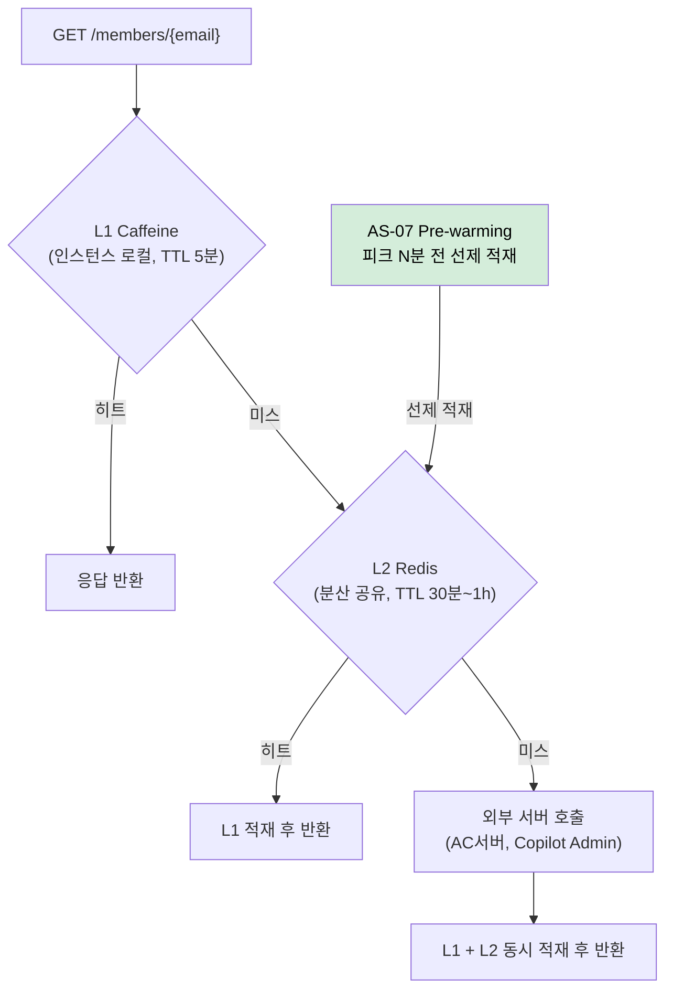
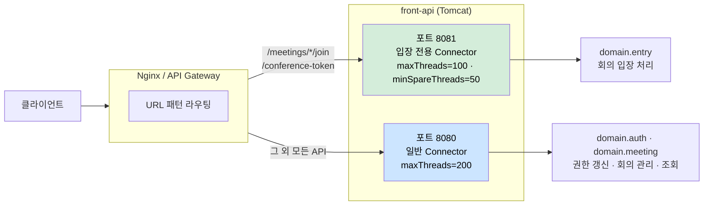
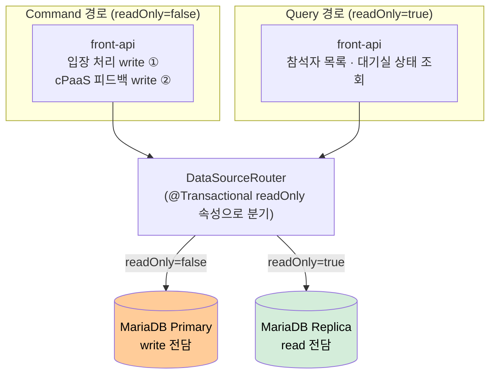
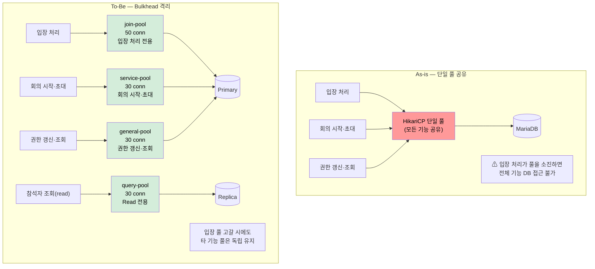
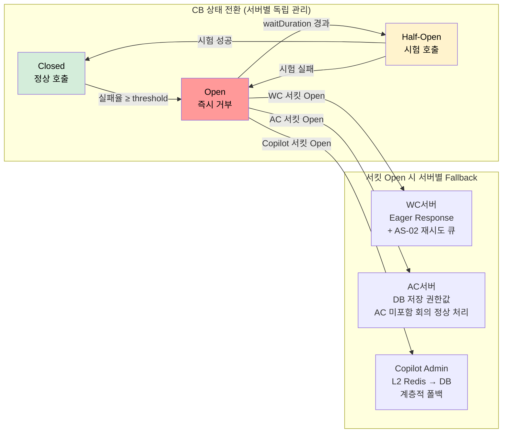

### 3.2. 아키텍처 문제 분석 및 설계 전략

3.1 아키텍처 드라이버(AD)가 *무엇이 요구되는지*를 정리한 것에 대응해, 본 절은 *어떻게 푸는지*를 결정한다. 각 AD에 대해 먼저 충족을 위한 **기본 설계 전략(AS)**을 결정하고, 그 기본 결정이 제약사항과 결합하여 새로 부각되는 문제에 대해 **파생 설계 전략**을 연쇄적으로 결정한다. 각 AS는 대척점이 명확한 둘 이상의 대안을 비교하여 선정한다.

#### 설계 전략 목록

| AS | 전략명 | 해결 이슈 | 핵심 드라이버 |
|----|--------|---------|-------------|
| AS-01 | MSA / 도메인 서비스 분리 | ISSUE-04, ISSUE-07, ISSUE-08 | AD-03 |
| AS-02 | 메시지 큐 기반 비동기 처리 | ISSUE-01, ISSUE-05, ISSUE-06 | AD-02, AD-04 |
| AS-03 | 캐시 기반 응답 속도 개선 | ISSUE-02, ISSUE-05, ISSUE-09 | AD-01 |
| AS-04 | 요청 우선순위 큐 | ISSUE-01, ISSUE-03 | AD-02 |
| AS-05 | Eager Response + 비동기 후처리 | ISSUE-01, ISSUE-02, ISSUE-05 | AD-02, AD-04 |
| AS-06 | Time-based Throttling | ISSUE-03, ISSUE-09 | AD-02, AD-04 |
| AS-07 | Predictive Pre-warming | ISSUE-09 | AD-01, AD-02, AD-04 |
| AS-08 | CQRS | ISSUE-07 | AD-03 |
| AS-09 | Bulkhead 격리 | ISSUE-01, ISSUE-04, ISSUE-06 | AD-03, AD-04 |
| AS-10 | Circuit Breaker / Fallback | ISSUE-02, ISSUE-06, ISSUE-08 | AD-04 |
| AS-11 | Anti-Corruption Layer (ACL) | ISSUE-08 | AD-09, AD-10 |

#### 기본 전략과 파생 전략의 관계

일부 AS는 다른 AS의 설계 결정이 선행되어야 적용 가능하다. 아래 파생 관계를 기준으로 적용 순서를 결정한다.

```
AS-01 (도메인 모듈 분리)
  ├── AS-09 (Bulkhead)     — AS-01이 설정한 도메인 경계별로 커넥션 풀 격리를 구현
  ├── AS-08 (CQRS)         — AS-01의 도메인 경계 내에서 Command/Query 모델 분리
  └── AS-11 (ACL)          — AS-01의 외부 연계 모듈 분리를 구현하는 패턴

AS-02 (메시지 큐 비동기)
  └── AS-05 (Eager Response) — AS-02의 비동기 처리 기반 위에서 응답 패턴 정의

AS-03 (캐시)
  └── AS-07 (Pre-warming)    — AS-03의 캐시 인프라가 존재해야 선제 적재 가능

AS-07 (Pre-warming)
  └── AS-06 (Throttling)     — Pre-warming 스케줄러가 피크 임박을 감지하면 Throttling 동시 활성화
```

#### 기능 드라이버 충족 관계

AD-05(로그인 시 권한 갱신 처리), AD-06(2만 명 동시 회의 입장), AD-07(외부 서버 포함 회의 시작)은 기능 드라이버로, 대응하는 QA 드라이버 전략을 통해 충족된다.

| 기능 드라이버 | 충족하는 QA 전략 |
|-------------|---------------|
| AD-05 로그인 시 권한 갱신 처리 | AS-03 (캐시) + AS-07 (Pre-warming) |
| AD-06 2만 명 동시 회의 입장 | AS-02 (비동기) + AS-04 (우선순위 큐) + AS-09 (Bulkhead) |
| AD-07 외부 서버 포함 회의 시작 | AS-02 (비동기) + AS-10 (Circuit Breaker) |

---

#### AS-01. MSA / 도메인 서비스 분리

**적용 대상**: AD-03, AD-09 / 해결 이슈: ISSUE-04, ISSUE-07, ISSUE-08

**설계 근거**

현행 미팅 포털 서버는 Java Spring Boot 단일 코드베이스에서 front-api / server-api / admin-api 인스턴스로 역할을 분리해 배포한다. 그러나 이는 **런타임 배포 분리**일 뿐, 코드 수준에서 도메인 경계는 존재하지 않는다. 회의 입장 처리, 참석자 상태 관리, 권한 갱신, WC/VC/AC 외부 연계가 동일한 패키지 레이어에 혼재한다.

이 구조에서 파생되는 아키텍처 문제는 세 가지다. 첫째, 도메인 경계가 없으므로 기능별 HikariCP 커넥션 풀을 분리(AS-09 Bulkhead)하더라도 어떤 DB 접근이 어느 도메인에 속하는지 명확히 구분할 수 없다. 둘째, 참석자 상태 Command(입장·퇴장 write)와 Query(목록 조회 read)가 동일 도메인 모델을 공유하므로 CQRS 분리(AS-08) 적용 시 경계 기준이 모호하다. 셋째, WC서버·VC서버·AC서버·Copilot Admin 서버 등 10개 이상의 외부 연계 로직이 동일 서비스 레이어에 혼재하여(ISSUE-08), 특정 연계만 긴급 차단하거나 타임아웃을 조정하려면 전체 재배포가 강제된다.

**대안 비교**

| 대안 | 개념 | 한계 |
|------|------|------|
| 대안 1. 현행 구조 유지 | URI prefix로 역할 분리, 코드 레벨 도메인 경계 없음 | AS-09·AS-11 파생 전략의 전제 조건 충족 불가. ISSUE-04·08이 구조적으로 해소되지 않음 |
| 대안 2. 완전한 마이크로서비스 분리 | 서비스·DB·배포 단위를 완전 독립 분리 | 분산 트랜잭션 문제(Saga 패턴 등) 즉시 부상. C-04(점진적 적용) 위반 |
| **대안 3. 선별적 도메인 모듈 분리 (채택)** | 단일 코드베이스 유지 + 도메인별 패키지 모듈 경계 설정 | — |

**채택 근거**: 완전 MSA(대안 2)는 분산 트랜잭션 설계와 신규 인프라 구성이 수반되어 C-04(점진적 적용) 제약을 위반한다. 대안 3은 배포 구조와 기술 스택을 변경하지 않으면서 코드 수준 도메인 경계를 확보한다.

**적용 방향**
- 패키지 구조를 `domain.entry`, `domain.auth`, `domain.meeting`, `integration.wc`, `integration.ac`, `integration.copilot` 등으로 재편
- 도메인 간 참조는 인터페이스만 허용, 직접 구현체 참조 금지 (ArchUnit 등으로 규칙 강제)
- `integration.*` 패키지에 외부 서버별 Feign Client + AS-10 CB + AS-11 ACL 변환 캡슐화
- `domain.entry` 전용 `DataSource` Bean 설정 → AS-09 Bulkhead 기반 마련

**파생 전략**: AS-09 (Bulkhead), AS-08 (CQRS), AS-11 (ACL)

---

#### AS-02. 메시지 큐 기반 비동기 처리

**적용 대상**: AD-02, AD-04 / 해결 이슈: ISSUE-01, ISSUE-05, ISSUE-06

**설계 근거**

ISSUE-01의 핵심 병목은 WC서버 Feign 동기 호출 구간이다. "DB 입장 가능 여부 확인 → conference-token 발급 → 입장 파라미터 생성" 단계까지는 포털 서버 내부에서 빠르게 처리된다. 그러나 "WC서버에 입장 파라미터 전달(Feign 동기, 3,000ms)"이 완료될 때까지 해당 요청의 서블릿 스레드가 블로킹된다. 2만 건이 동시에 이 단계에 도달하면 2만 개의 스레드가 WC서버 응답을 대기하는 상태가 된다. 해결의 핵심은 **외부 서버 호출 구간에서 서블릿 스레드를 해방**시키는 것이다.

**대안 비교**

| 대안 | 개념 | 한계 |
|------|------|------|
| 대안 1. 현행 Feign 동기 호출 유지 | 스레드 풀 크기(maxThreads) 증가로 간접 대응 | 2만 건 동시 요청 규모에서 구조적 한계. 컨텍스트 스위칭 오버헤드·JVM 힙 압박 증가 |
| 대안 2. Spring WebFlux 전환 | 이벤트 루프 기반 논블로킹 처리 전면 적용 | 전체 코드베이스 Reactive 모델로 재작성 필요. C-01·C-04 동시 위반 |
| **대안 3. Spring @Async + 전용 처리 큐 하이브리드 (채택)** | 외부 서버 호출 구간만 선택적으로 비동기화 | — |

**채택 근거**: 대안 1은 QA-02 목표를 구조적으로 달성할 수 없다. 대안 2는 기술 스택 전면 교체를 요구하여 C-01·C-04 제약을 동시에 위반한다. 대안 3은 현행 Spring MVC와 HikariCP를 그대로 유지하면서 병목 구간(WC서버 Feign 호출)만 선별적으로 비동기화하여 서블릿 스레드 고갈 문제를 해소한다.

**적용 방향**
- `externalCallExecutor`: corePoolSize 50, maxPoolSize 200, queueCapacity 1,000으로 설정
- WC서버 입장 파라미터 전달 메서드, VC/AC 서버 회의 개설 호출 메서드에 `@Async` 적용
- `CompletableFuture` 반환 타입 적용으로 AS-05 Eager Response에서 결과 추적 가능
- 비동기 실패 처리는 AS-10 Circuit Breaker와 연동하여 fallback 처리

**파생 전략**: AS-05 (Eager Response)

---

#### AS-03. 캐시 기반 응답 속도 개선

**적용 대상**: AD-01 / 해결 이슈: ISSUE-02, ISSUE-05, ISSUE-09

**설계 근거**

ISSUE-02의 구조적 문제는 `CompletableFuture.allOf()` 대기 패턴이다. AC서버·Copilot Admin 서버 응답이 모두 도달해야 `GET /members/{email}`이 응답을 반환할 수 있으므로, 가장 느린 외부 서버의 응답 시간이 전체 API 응답 시간을 결정한다. QA-01(평균 응답시간 1초 이내)을 충족하려면 **외부 서버 호출 자체를 줄이는 것**이 근본 해법이다. AC 권한·LLM 권한·용어사전 권한은 매 로그인마다 변경되는 데이터가 아니다.

또한 ISSUE-09에서 지적된 cold start 문제는, 캐시가 존재하더라도 피크 진입 시점에 캐시가 비어 있으면 해소되지 않는다. 따라서 캐시 인프라 자체가 AS-07(Predictive Pre-warming)의 선제 워밍 기반이 되어야 한다.

**캐시 계층 구조**


<!-- 이미지 파일명(draw.io → PNG 교체 시): report/images/as03-cache-flow.png -->
<p align="center"><em>[그림 AS03-1] L1(Caffeine) · L2(Redis) 계층 캐시 조회 흐름</em></p>

**대안 비교**

| 대안 | 개념 | 한계 |
|------|------|------|
| 대안 1. 캐시 없음 (현행) | 매 로그인마다 외부 서버 호출 및 allOf() 대기 유지 | QA-01 달성이 외부 서버 응답 시간에 전적으로 종속. 피크 시간대 응답 지연 구조적 심화 |
| 대안 2. DB 캐시 전용 | 외부 서버 호출 후 DB에만 저장·조회 | 인스턴스 간 캐시 공유 불가. DB 커넥션 추가 소비. cold start 미해소 |
| **대안 3. 계층화 캐시 L1+L2 (채택)** | L1 Caffeine(로컬, TTL 5분) + L2 Redis(분산, TTL 30분~1시간) | — |

**채택 근거**: 대안 2는 인스턴스 간 캐시 공유 불가, DB 커넥션 추가 소비, cold start 미해소 등의 한계가 있다. 대안 3은 인스턴스 스케일아웃 환경에서도 외부 서버 호출을 일괄 완충하며, AS-07 Pre-warming의 실질적 기반이 된다.

**적용 방향**
- `spring-boot-starter-cache` + `Caffeine` + `spring-data-redis` 의존성 추가
- `@Cacheable(cacheNames = "memberAuth", key = "#email")` 적용
- `CompositeCacheManager`로 L1(CaffeineCacheManager) → L2(RedisCacheManager) 순서 구성
- 권한 갱신 이벤트 발생 시 `@CacheEvict`로 L1·L2 동기 무효화
- 권한 유형별 TTL 차등: AC 권한 1시간 / LLM·용어사전 권한 30분

**파생 전략**: AS-07 (Predictive Pre-warming)

---

#### AS-04. 요청 우선순위 큐

**적용 대상**: AD-02 / 해결 이슈: ISSUE-01, ISSUE-03

**설계 근거**

오전 9시·오후 1시 업무 시작 시간대와 대규모 스트리밍 서비스 시작 시점에는 회의 입장 요청·로그인 요청·단순 조회 요청이 동시에 폭발적으로 증가한다. 이 구간에서 모든 요청이 동일한 서블릿 스레드 FIFO 큐에 유입되면, 처리 비용이 낮은 단순 조회 요청이 스레드를 먼저 선점하는 상황이 반복된다. Tomcat 서블릿 스레드 풀이 포화 상태에 가까워지면 `acceptCount` 큐에 대기 중인 요청들이 선착순으로 스레드를 할당받아, 단순 조회가 conference-token 발급 요청보다 먼저 처리될 수 있다.

**Connector 분리 구조**


<!-- 이미지 파일명(draw.io → PNG 교체 시): report/images/as04-priority-connector.png -->
<p align="center"><em>[그림 AS04-1] Tomcat Connector 포트 분리 — 입장 전용(8081)과 일반(8080) 구분</em></p>

**대안 비교**

| 대안 | 개념 | 한계 |
|------|------|------|
| 대안 1. 현행 단일 FIFO 서블릿 스레드 풀 | maxThreads 증가로 처리 용량 확대 | 스레드 수 증가는 메모리·컨텍스트 스위칭 오버헤드 유발. 우선순위 역전 자체는 해소 불가 |
| **대안 2. URL 패턴 기반 전용 Connector·스레드 풀 분리 (채택)** | Tomcat Connector를 포트 단위로 분리, 핵심 API 전용 스레드 풀 예약 | — |
| 대안 3. HandlerInterceptor + 인메모리 우선순위 큐 재정렬 | 요청 가로채기 후 PriorityBlockingQueue로 우선순위 재정렬 | 서블릿 모델과 구조적으로 맞지 않음. 응답 객체 스레드 귀속 문제, 타임아웃 처리 복잡 |

**채택 근거**: 대안 3은 서블릿 스레드 모델과 구조적으로 맞지 않아 구현 복잡도와 운영 위험이 크다. 대안 2는 Tomcat이 이미 제공하는 Connector 분리 메커니즘을 활용하므로, 기존 코드 변경 없이 `WebServerFactoryCustomizer` 설정만으로 적용 가능하다.

**적용 방향**
- `TomcatServletWebServerFactory` Bean 커스터마이징으로 포트 8081에 입장 전용 Connector 추가
- 입장 전용 Connector: `maxThreads=100`, `minSpareThreads=50`
- 일반 Connector(8080): `maxThreads=200`
- API Gateway 또는 Nginx에서 `/meetings/*/join`, `/meetings/*/conference-token` URL 패턴을 포트 8081로 라우팅
- AS-09(Bulkhead)와 결합 시: 입장 전용 Connector 스레드는 `join-pool` HikariCP DataSource만 사용하도록 구성

---

#### AS-05. Eager Response + 비동기 후처리

> **전제**: AS-02(메시지 큐 기반 비동기 처리)의 파생 전략. AS-02의 `@Async` 기반 비동기 처리 기반이 없으면 이 전략은 단독 적용 불가.

**적용 대상**: AD-02, AD-04 / 해결 이슈: ISSUE-01, ISSUE-02, ISSUE-05

**설계 근거**

UC-04(회의 입장)의 현행 처리 흐름을 단계별로 분해하면:

```
① DB에서 입장 가능 여부 확인         (포털 서버 내부, 빠름)
② conference-token 발급              (포털 서버 내부, 빠름)
③ 입장 파라미터 생성                  (포털 서버 내부, 빠름)
④ WC서버에 입장 파라미터 전달·확인   (Feign 동기, 최대 3,000ms ← 병목)
⑤ 클라이언트에 입장 파라미터 반환
```

①~③은 포털 서버 내부에서 처리되어 빠르다. ④에서 WC서버 Feign 동기 호출이 완료되어야 ⑤를 반환할 수 있는 구조가 병목이다. 핵심 질문은 **"⑤를 반환하기 위해 ④가 반드시 완료되어야 하는가?"**이다. WC서버에 파라미터 전달이 미완료 상태에서 클라이언트가 접속을 시도하면 WC서버에서 거부될 수 있으나, 이 간격을 재시도 메커니즘으로 흡수할 수 있다.

**대안 비교**

| 대안 | 개념 | 한계 |
|------|------|------|
| 대안 1. 현행 동기 응답 | WC서버 응답 완료 후 클라이언트 반환 | 2만 건 동시 입장 시 2만 개 서블릿 스레드 블로킹. QA-02 달성이 WC서버 응답 속도에 종속 |
| 대안 2. 폴링 방식 | 처리 ID 즉시 반환 + 클라이언트 폴링 | C-02(API 하위 호환성) 위반. 기존 클라이언트 변경 필요 |
| **대안 3. 즉시 응답 + 비동기 후처리 (채택)** | ①~③ 완료 즉시 클라이언트에 응답 반환, ④ WC서버 전달은 AsyncTaskExecutor에서 후처리 | — |

**채택 근거**: 대안 1은 QA-02 달성이 WC서버 응답 속도에 종속. 대안 2는 C-02 위반으로 선택 불가. 대안 3은 기존 API 스키마를 유지하면서 서블릿 스레드 점유 시간을 외부 서버 호출 시간(최대 3,000ms)에서 포털 내부 처리 시간(수십~수백ms)으로 단축한다.

**적용 방향**
- `MeetingJoinService.join()` 메서드에서 ①~③ 완료 직후 응답 객체 구성 및 반환
- WC서버 전달 로직을 `@Async("externalCallExecutor")`가 붙은 별도 메서드로 추출
- `CompletableFuture`로 비동기 결과를 추적하여 실패 시 재시도 큐(Spring Retry + `@Retryable`) 연동
- WC서버 전달 재시도 최대 3회, 최종 실패 시 conference-token 무효화 처리 및 모니터링 알림

---

#### AS-06. Time-based Throttling

**적용 대상**: AD-02, AD-04 / 해결 이슈: ISSUE-03, ISSUE-09

**설계 근거**

AS-04(요청 우선순위 큐)가 "핵심 요청이 비핵심 요청보다 먼저 처리되도록" 하는 전략이라면, AS-06은 "피크 구간에 비핵심 요청의 유입량 자체를 줄여" 핵심 처리 경로의 리소스 여유를 확보하는 전략이다. 두 전략은 보완 관계다. AS-07(Predictive Pre-warming)이 예약 데이터를 활용해 캐시를 선제 적재한다면, AS-06은 동일한 피크 예측 정보를 활용해 **비핵심 요청의 유입을 시간 구간 기반으로 제어**한다.

**대안 비교**

| 대안 | 개념 | 한계 |
|------|------|------|
| 대안 1. 스로틀링 없음 (현행) | 모든 요청을 제한 없이 수신하고 처리 | 피크 구간에 비핵심 요청이 핵심 처리 경로의 스레드·커넥션을 소비해도 제어 수단 없음 |
| 대안 2. 고정 Rate Limiting (균일 RPS 제한) | 전체 API에 동일한 RPS 상한 적용 | 핵심 API도 제한될 수 있어 QA-02 달성을 방해하는 역효과 위험 |
| **대안 3. 피크 예측 기반 차등 스로틀링 (채택)** | 예약 회의 데이터 기반 피크 예상 구간 감지 후 비핵심 API만 선별 처리 속도 제한 | — |

**채택 근거**: 대안 2(균일 Rate Limiting)는 핵심 API까지 제한하는 역효과 위험이 있다. 대안 3은 스로틀링 대상을 비핵심 API로 한정하고 피크 예측 구간에만 활성화한다.

**적용 방향**
- `PeakDetector` 컴포넌트: DB 예약 회의 조회(Spring Scheduler로 1분 주기) + 시간대 기반 고정 피크 정의
- `@ThrottleExempt` 커스텀 어노테이션: 핵심 API 컨트롤러 메서드에 적용
- `ThrottlingInterceptor` (HandlerInterceptor): 피크 구간 중 `@ThrottleExempt`가 없는 API에 Bucket4j 적용
- Bucket4j `SlidingWindowCounter`: 비핵심 API 전역 처리량 상한 (피크 구간 중 초당 500 req)

---

#### AS-07. Predictive Pre-warming

> **전제**: AS-03(캐시 기반 응답 속도 개선)의 파생 전략. AS-03의 L2 Redis 캐시 인프라가 없으면 Pre-warming 적재 대상이 존재하지 않는다.

**적용 대상**: AD-01, AD-02, AD-04 / 해결 이슈: ISSUE-09

**설계 근거**

AS-03(캐시)이 도입되면, 캐시가 채워진 상태에서는 외부 서버 호출 없이 빠른 응답이 가능하다. 그러나 캐시가 도입되더라도 **피크 진입 시점에 캐시가 비어 있으면** (TTL 만료, 서버 재시작, 신규 사용자 등) 피크 초입의 대량 캐시 미스가 일시에 외부 서버로 쏟아지는 "Thundering Herd" 현상이 발생한다. Pre-warming은 이 역설을 깨는 전략이다. 트래픽이 실제로 집중되기 N분 전에, DB의 예약 회의 데이터를 조회하여 해당 회의 참석자들의 권한 캐시를 선제적으로 L2 Redis에 적재한다.

미팅 서비스의 트래픽 집중 패턴은 두 가지 유형으로 나뉜다. 첫째, **일별 반복 패턴**: 오전 9시·오후 1시 업무 시작 시간대에 로그인·권한 갱신·회의 입장 요청이 집중된다. 둘째, **이벤트 기반 패턴**: DB에 예약된 대규모 회의(2만 명 스트리밍 서비스 등) 시작 시점에 입장 요청이 집중된다.

**대안 비교**

| 대안 | 개념 | 한계 |
|------|------|------|
| 대안 1. 현행 피동 대응 | 트래픽 집중 후 자연적 warm-up에 의존 | 피크 초입에 Thundering Herd 발생. 예측 가능한 문제에 사전 대응하지 않음 |
| 대안 2. 고정 스케줄 워밍 | 매일 고정 시간(8:50, 12:50 등)에 일괄 캐시 워밍 | 이벤트 기반 피크(예약 대규모 회의)에 대응 불가. 불필요한 외부 서버 호출 대규모 발생 |
| **대안 3. 예약 회의 데이터 기반 동적 Pre-warming (채택)** | DB 예약 회의 시작 시간·참석자 수 조회 후 임계값 이상 회의 N분 전 선제 적재 | — |

**채택 근거**: 대안 1은 Thundering Herd를 해소하지 못한다. 대안 2는 이벤트 기반 피크를 인식하지 못한다. 대안 3은 DB에 이미 존재하는 예약 회의 데이터를 활용하므로 외부 인프라 추가 없이 구현 가능하며, AS-03 Redis 캐시와 AS-06 Throttling 양쪽과 자연스럽게 연동된다.

**적용 방향**
- `PreWarmingScheduler`: `@Scheduled(fixedDelay = 60_000)` + `@Async("preWarmExecutor")` 조합으로 서블릿 스레드와 완전 분리
- 대상 회의 쿼리: 현재 시각 + N분 이내에 시작하는 참석자 수 임계값(예: 500명) 이상 예약 회의 목록 조회
- 워밍 호출 배치 크기: 50명/배치, 배치 간 100ms 딜레이로 외부 서버 부하 분산
- `PeakDetector.setActive(true)`: 워밍 시작 시 AS-06 Throttling 동시 활성화
- 일별 반복 패턴 보완: 오전 8:50, 오후 12:50 고정 스케줄도 병행

---

#### AS-08. CQRS

> **전제**: AS-01(MSA / 도메인 서비스 분리)의 파생 전략. AS-01이 설정한 도메인 경계 내에서 Command/Query 모델을 분리한다.

**적용 대상**: AD-03 / 해결 이슈: ISSUE-07

**설계 근거**

ISSUE-07의 경합 구조를 분석하면 두 가지 write 경로가 동시에 동일 테이블을 타격한다. 첫째 **사용자 요청 경유 write** (`User → front-api → Meeting Manager → server-api → participants 테이블 write`), 둘째 **cPaaS 피드백 경유 write** (`cPaaS → Meeting Manager → server-api → participants 테이블 write`). 두 write 경로는 사용자 요청과 무관하게 독립적으로 발생하므로, 대규모 회의 시작 시점에는 두 경로의 write가 동시에 최고조에 달한다. 여기에 참석자 목록 조회(read)까지 집중되면, 동일 레코드에 대한 read/write lock 경합이 최대화된다.

해결의 핵심은 **write(Command)와 read(Query)가 서로의 DB lock을 경쟁하지 않는 구조**를 만드는 것이다.

**CQRS 라우팅 구조**


<!-- 이미지 파일명(draw.io → PNG 교체 시): report/images/as08-cqrs-routing.png -->
<p align="center"><em>[그림 AS08-1] Primary(write) · Replica(read) 분리 라우팅 구조</em></p>

**대안 비교**

| 대안 | 개념 | 한계 |
|------|------|------|
| 대안 1. 현행 단일 DB 모델 | Command/Query 동일 DataSource | DB 레벨에서 lock 경합을 피할 방법이 없음. 2만 명 동시 입장 규모에서 구조적 한계 |
| 대안 2. 완전한 이벤트 소싱 + CQRS | 모든 Command를 이벤트 스트림으로 저장, Query는 별도 Read Model 조회 | 기존 JPA 엔티티 기반 도메인 모델 전면 재설계 필요. C-04 위반 |
| **대안 3. 경량 CQRS (Primary/Replica 라우팅 분리) (채택)** | 동일한 MariaDB 구조 유지, Primary(write) / Replica(read) 인스턴스 분리, AbstractRoutingDataSource로 라우팅 | — |

**채택 근거**: 대안 2는 도메인 모델 전면 재설계를 요구하여 C-04 위반이다. 대안 3은 `AbstractRoutingDataSource`와 `@Transactional(readOnly = true)` 조합으로 기존 코드 최소 변경으로 구현 가능하다. 대규모 회의 시작 시점에 참석자 목록 조회(read 집중)를 Replica로 분산하면, Primary DB의 write 처리(입장·피드백)가 조회 lock 경합에서 벗어난다.

**적용 방향**
- `DataSourceRouter extends AbstractRoutingDataSource`: 현재 트랜잭션의 `readOnly` 속성 조회 후 Primary/Replica DataSource 반환
- `LazyConnectionDataSourceProxy`로 래핑하여 실제 커넥션 획득을 트랜잭션 시작까지 지연
- AS-09(Bulkhead)와 결합: Primary DataSource는 `join-pool`·`service-pool`, Replica DataSource는 `query-pool`로 별도 HikariCP 풀 설정

---

#### AS-09. Bulkhead 격리

> **전제**: AS-01(MSA / 도메인 서비스 분리)의 파생 전략. AS-01이 설정한 도메인 경계별로 HikariCP 커넥션 풀을 분리 구성한다.

**적용 대상**: AD-03, AD-04 / 해결 이슈: ISSUE-01, ISSUE-04, ISSUE-06

**설계 근거**

현행 구조에서 front-api·server-api·admin-api는 동일한 DB를 공유하며, 각 인스턴스 내 기능 간에도 단일 HikariCP 풀이 공유된다. 2만 명 동시 입장이 발생하면 입장 처리(UC-04)가 DB 조회를 위해 커넥션을 획득하고, HikariCP 풀 크기를 훨씬 초과하는 요청이 동시에 커넥션을 요구하면 `connectionTimeout` 만료까지 대기하다 예외가 발생한다. 이 예외는 입장 처리에서 그치지 않고, 동일 풀을 사용하는 회의 시작(UC-03), 참석자 초대(UC-06)에서도 동일하게 발생한다.

QA-03의 측정 기준은 "입장 전용 커넥션 풀 고갈 시 회의 시작 API 성공률 100%"다. 이를 충족하려면 **기능별로 독립된 커넥션 풀**이 필요하다.

**Bulkhead 격리 구조**


<!-- 이미지 파일명(draw.io → PNG 교체 시): report/images/as09-bulkhead.png -->
<p align="center"><em>[그림 AS09-1] HikariCP 커넥션 풀 — 단일 풀(As-is)과 도메인별 Bulkhead(To-Be) 비교</em></p>

**대안 비교**

| 대안 | 개념 | 한계 |
|------|------|------|
| 대안 1. 현행 단일 HikariCP 풀 | maximumPoolSize 증가로 고갈 지연 | QA-03(입장 풀 고갈 시 회의 시작 100% 성공)은 단일 풀 구조에서 원칙적으로 충족 불가 |
| 대안 2. 기능별 HikariCP 풀 분리만 | 커넥션 격리하되 서블릿 스레드 풀은 공유 | ISSUE-06의 외부 서버 장애 시 스레드 고갈 전파 막을 수 없음 |
| **대안 3. 이중 Bulkhead — DB 커넥션 풀 + 스레드 풀 동시 격리 (채택)** | HikariCP 풀 기능별 분리 + 외부 서버 호출 전담 AsyncTaskExecutor 스레드 풀 분리 | — |

**채택 근거**: 대안 2는 스레드 풀 격리가 없어 ISSUE-06 해소 불가. 대안 3은 AS-02의 `@Async` 기반 외부 서버 호출 분리가 전제된 상태에서 커넥션 풀과 스레드 풀을 동시에 격리하여 QA-03·QA-05를 모두 충족한다.

**풀 구성**

| 풀 이름 | 담당 기능 | maximumPoolSize | connectionTimeout |
|--------|---------|----------------|-----------------|
| join-pool | 입장 처리 전용 | 50 | 3,000ms |
| service-pool | 회의 시작·초대 | 30 | 5,000ms |
| general-pool | 권한 갱신·일반 조회 | 30 | 5,000ms |
| query-pool | Read 전용 (Replica, AS-08) | 30 | 3,000ms |

---

#### AS-10. Circuit Breaker / Fallback

**적용 대상**: AD-04 / 해결 이슈: ISSUE-02, ISSUE-06, ISSUE-08

**설계 근거**

ISSUE-06의 핵심 메커니즘: WC서버가 장애 상태에 빠지면 Hystrix CB가 개방되기 전까지 Feign 호출은 read timeout(3,000ms) 만료까지 블로킹된다. 2만 명 동시 입장 구간에 WC서버 장애가 겹치면, CB 개방 이전 구간에만 `externalCallExecutor` 스레드 풀에 3,000ms씩 블로킹된 스레드가 빠르게 누적된다.

외부 서버들은 특성이 서로 다르다. WC서버는 모든 입장 처리에 필수적이고, Copilot Admin 서버(LLM·용어사전 권한)는 장애 시 DB 저장값으로 폴백 가능하다. 외부 서버별로 timeout·실패율 임계값·fallback 전략이 달라야 하는 이유다.

**CB 상태 전환 및 Fallback 구조**


<!-- 이미지 파일명(draw.io → PNG 교체 시): report/images/as10-circuit-breaker.png -->
<p align="center"><em>[그림 AS10-1] CB 상태 전환(Closed · Open · Half-Open)과 외부 서버별 계층적 Fallback 경로</em></p>

**대안 비교**

| 대안 | 개념 | 한계 |
|------|------|------|
| 대안 1. 현행 Feign + Hystrix CB 유지 | 현행 전역 일괄 Hystrix 설정 유지 | Hystrix deprecated(Spring Boot 3.x 공식 지원 종료). 전역 일괄 설정으로 서버 특성별 정밀 제어 불가. AS-03·AS-02 연동 fallback 체인 구현 어려움 |
| 대안 2. Resilience4j CB 일괄 적용 (균일 설정) | Resilience4j로 전환하되 모든 외부 서버에 동일 설정 적용 | 균일 정책으로 외부 서버 특성 무시. 응답이 느리지만 정상인 서버를 과도하게 차단하거나 빠르게 확대되는 장애를 늦게 감지할 수 있음 |
| **대안 3. 외부 서버별 차등 CB + 계층적 Fallback (채택)** | 외부 서버 특성에 따라 timeout·실패율 임계값·halfOpen 요청 수를 차등 적용 | — |

**채택 근거**: 대안 1은 deprecated 라이브러리와 전역 일괄 설정의 한계로 QA-04·QA-05 달성 불충분. 대안 2는 균일 정책으로 서버 특성 무시. 대안 3은 외부 서버의 역할과 장애 영향 범위를 반영한 정책으로 QA-05를 정밀하게 충족한다.

**외부 서버별 CB 설정**

| 외부 서버 | slidingWindowSize | failureRateThreshold | waitDuration | 근거 |
|---------|-------------------|---------------------|-------------|------|
| WC서버 | 20 | 50% | 10s | 입장 처리 필수. 빠른 감지·복구 필요 |
| VC서버 | 10 | 60% | 30s | AC 포함 회의 개설에만 영향. 일시 장애 허용 범위 넓음 |
| AC서버 | 10 | 60% | 30s | AC 권한 갱신. DB 폴백 가능하므로 관대한 임계값 |
| Copilot Admin | 5 | 70% | 60s | 권한 변경 빈도 낮음. DB 폴백으로 충분히 운영 가능 |

**계층적 Fallback 전략**
- **Copilot Admin 서버 장애** → AS-03 L2 Redis 캐시(마지막 적재값)로 폴백. Redis도 미스 시 DB 저장값 반환.
- **WC서버 장애** → AS-05 Eager Response 패턴과 결합: conference-token·입장 파라미터는 정상 생성·반환. WC서버 전달은 AS-02 재시도 큐에 등록.
- **AC서버 장애** → AC 권한 DB 저장값으로 폴백. WC 전용·VC 포함 회의는 정상 처리 계속. AC 포함 회의 개설만 부분 차단.
- **VC서버 장애** → VC 포함 회의 개설 실패. WC 전용 회의 입장·시작은 정상. 에러 응답에 명확한 원인 메시지 포함.

**적용 방향**
- `spring-boot-starter-actuator` + `resilience4j-spring-boot3` 의존성 추가
- `application.yml`에 외부 서버별 `resilience4j.circuitbreaker.instances.{name}` 설정 분리
- AS-11 ACL의 각 연계 모듈 내에 `@CircuitBreaker(name = "wcServer", fallbackMethod = "wcFallback")` 어노테이션 적용

---

#### AS-11. Anti-Corruption Layer (ACL)

**적용 대상**: AD-09, AD-10 / 해결 이슈: ISSUE-08

**설계 근거**

현행 서비스 레이어의 외부 연계 구조를 살펴보면, `MeetingJoinService`가 `WcServerFeignClient`를 직접 의존하고, `MeetingService`가 `VcServerFeignClient`와 `AcServerFeignClient`를 직접 의존하는 패턴이 반복된다. 이 구조의 문제는 두 가지다.

첫째, **포털 도메인 모델이 외부 서버의 API 스키마에 직접 노출**된다. WC서버가 API 스키마를 변경하면 서비스 레이어까지 변경 파급이 일어나, AD-10(기존 API 하위 호환성 유지) 달성이 외부 서버 스키마 변경에 의해 위협받을 수 있다.

둘째, **연계별 정책이 단일 코드베이스에 산재하여 독립적으로 변경·배포할 수 없다**. WC서버 타임아웃을 1,500ms로 줄이거나 AC서버 재시도 로직을 조정하려면, 해당 연계 설정 하나의 변경이 전체 코드베이스 빌드·배포 사이클을 거쳐야 한다. 피크 대응 시 긴급하게 특정 연계만 정책을 조정하는 것이 구조적으로 불가능하다.

**대안 비교**

| 대안 | 개념 | 한계 |
|------|------|------|
| 대안 1. 현행 서비스 레이어 직접 연계 | 서비스 레이어에서 Feign Client를 직접 의존하고 호출 | 포털 도메인 모델이 외부 서버 API 스키마에 직접 종속. 연계별 독립 정책 관리 불가 |
| 대안 2. 외부 서버별 Adapter 인터페이스 추상화 | 포털 도메인 인터페이스 정의 + Feign Client 기반 구현체 별도 작성 | 변환 레이어(Adapter)는 생기지만 연계별 독립 정책 관리 구조는 없음. 전체 재배포 강제 |
| **대안 3. 연계별 독립 모듈 ACL (정책 캡슐화 + 도메인 격리) (채택)** | AS-01 도메인 모듈 구조 기반으로 각 외부 연계를 독립 패키지 모듈로 분리 | — |

**채택 근거**: 대안 2(Adapter 추상화)는 변환 레이어만 제공하며 연계별 독립 정책 관리 구조가 없다. 대안 3은 AS-01이 설정한 패키지 모듈 구조를 활용하여 연계별 완전한 캡슐화를 달성한다.

**패키지 모듈 구조**

```
integration/
  wc/
    WcServerGateway.java          ← 포털 도메인이 의존하는 인터페이스
    WcServerFeignClient.java      ← Feign Client (외부 WC서버 스키마 매핑)
    WcServerAdapter.java          ← DTO 변환 (외부 모델 ↔ 포털 도메인 모델)
    WcCircuitBreakerConfig.java   ← CB 정책 (slidingWindowSize, threshold, timeout 등)
    WcFallbackHandler.java        ← Fallback 전략 (AS-05 재시도 큐 등록 등)
  ac/
    AcServerGateway.java
    AcCircuitBreakerConfig.java   ← CB 정책 독립 설정
    AcFallbackHandler.java        ← DB 저장값 폴백 등
  copilot/
    CopilotAdminGateway.java
    CopilotCircuitBreakerConfig.java
    CopilotFallbackHandler.java   ← Redis → DB 계층적 폴백

domain/
  entry/
    MeetingJoinService.java       ← WcServerGateway 인터페이스만 의존
  meeting/
    MeetingService.java           ← AcServerGateway, VcServerGateway 인터페이스만 의존
  auth/
    AuthService.java              ← CopilotAdminGateway 인터페이스만 의존
```

**적용 방향**
- AS-01에서 정의한 `integration.*` 패키지를 ACL 모듈로 확정
- 도메인 레이어(`domain.*`)에서 `integration.*`으로의 직접 참조를 금지하고 인터페이스만 허용 (ArchUnit 규칙으로 빌드 타임 강제)
- 외부 서버 스키마 DTO는 `integration.*` 패키지 내부에만 존재하며, `domain.*`에 노출되지 않음
- 신규 외부 연계 추가 시 `integration.{newServer}` 패키지 모듈 신설만으로 완결
