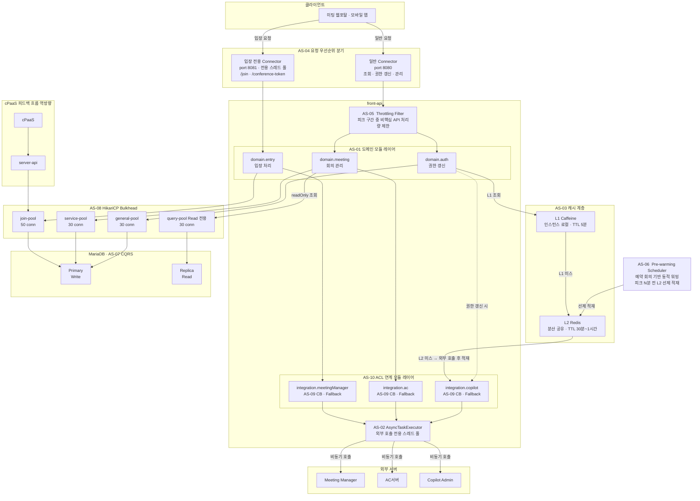

### 4.1. 개념 아키텍처

#### 4.1.1. 아키텍처 개념도

3.2절의 설계 전략(AS-01~AS-10)이 적용된 To-Be 아키텍처의 전체 구조다. 요청 집중 구간 대응을 중심으로 각 전략이 어느 경계에서 동작하는지를 시각화한다.

<!-- 이미지 파일명(draw.io → PNG 교체 시): report/images/4.1-tobe-architecture.png -->

<em>[그림 49] TO-BE 미팅 포털 서버 아키텍처 개념도</em>

---

#### 주요 설계 결정 요약

| 경계 | 적용 전략 | 해결 이슈 |
| ----- | ----- | ----- |
| 요청 진입 분기 | AS-04 우선순위 큐 · AS-05 Throttling | ISSUE-01, ISSUE-03, ISSUE-09 |
| 도메인 모듈 경계 | AS-01 도메인 분리 | ISSUE-04, ISSUE-07, ISSUE-08 |
| 캐시 계층 | AS-03 L1+L2 캐시 · AS-06 Pre-warming | ISSUE-02, ISSUE-05, ISSUE-09 |
| 외부 연계 경계 | AS-10 ACL · AS-09 Circuit Breaker | ISSUE-02, ISSUE-06, ISSUE-08 |
| 외부 호출 스레드 | AS-02 Async | ISSUE-01, ISSUE-05, ISSUE-06 |
| 커넥션 풀 격리 | AS-08 HikariCP Bulkhead | ISSUE-01, ISSUE-04, ISSUE-06 |
| DB 읽기/쓰기 분리 | AS-07 경량 CQRS (Primary/Replica) | ISSUE-07 |

---

#### 흐름별 설명

**주 요청 흐름 (회의 입장)**

1. 클라이언트가 `/join` 요청을 전송한다.
2. **AS-04**: 입장 전용 Connector(port 8081)가 전용 스레드 풀에서 요청을 수신한다.
3. **AS-04 / AS-05**: 입장 전용 Connector(port 8081)는 Throttling Filter를 경유하지 않고 `domain.entry`로 직접 라우팅된다. 일반 Connector(port 8080) 경로의 비핵심 API는 Throttling Filter가 처리량을 제한한다.
4. **AS-01**: `domain.entry`가 입장 처리를 담당한다.
5. **AS-10 + AS-09**: `integration.meetingManager`(ACL 모듈)를 통해 Meeting Manager를 호출한다. CB가 장애를 감지하면 fallback 처리.
6. **AS-02**: Meeting Manager 참석자 입장 정보 조회는 `AsyncTaskExecutor`에서 비동기 실행. 컨트롤러가 `CompletableFuture`를 반환하여 서블릿 스레드를 즉시 반환하고, MM 응답 후 wyzProParam을 조립하여 응답한다.
7. **AS-08**: `domain.entry` → `join-pool` → MariaDB Primary. 다른 기능의 풀과 격리.

**권한 갱신 흐름**

1. 로그인 후 `GET /members/{email}` 호출.
2. **AS-03**: `domain.auth`가 L1 Caffeine 조회 → 미스 시 L2 Redis 조회.
3. L2도 미스인 경우에만 `integration.copilot`(ACL)을 통해 Copilot Admin 서버 호출 후 L1·L2 동시 적재.
4. **AS-06**: Pre-warming Scheduler가 피크 N분 전에 대상 참석자 권한을 L2에 선제 적재하여 cold start 방지.

**cPaaS 피드백 흐름 (역방향)**

- `cPaaS → Meeting Manager → server-api (GET /entrance-info) → join-pool → MariaDB Primary`
- 참석자 상태 변경(퇴장, 연결 끊김)이 사용자 요청과 독립적으로 발생한다.
- **AS-07**: 참석자 목록 조회(read)는 `query-pool → Replica`로 라우팅하여 피드백 write와 lock 경합을 분리한다.

---

#### 4.1.2. 설계 전략 적용 범위

3.2절의 설계 전략(AS-01~AS-10)이 아키텍처의 어느 레이어·컴포넌트에 적용되는지를 정리한다.

**설계 전략 적용 매핑**

| AS | 전략명 | 적용 레이어 | 적용 컴포넌트 | 관련 드라이버 |
| :---: | ----- | ----- | ----- | ----- |
| AS-01 | 입장 처리 도메인 경계 분리 | 애플리케이션 | domain.entry · domain.auth · domain.meeting | AD-03 |
| AS-02 | 입장 처리 경로 비동기 전환 | 애플리케이션 | AsyncTaskExecutor (외부 호출 전용 스레드 풀) | AD-02, AD-04 |
| AS-03 | 외부 권한 조회 다층 캐시 적용 | 캐시 | L1 Caffeine (TTL 5분) · L2 Redis (TTL 30분~1시간) | AD-01 |
| AS-04 | 입장 전용 처리 경로 확보 | 요청 진입 | 입장 전용 Connector (port 8081) · 일반 Connector (port 8080) | AD-02 |
| AS-05 | 피크 구간 요청 유입 제한 (Time-based Throttling) | 요청 진입 | Throttling Filter (front-api 공통 필터 체인) | AD-02, AD-04 |
| AS-06 | 예약 기반 피크 자원 선제 초기화 (Predictive Pre-warming) | 캐시 / 인프라 | Pre-warming Scheduler · L2 Redis (AS-03 캐시 인프라 전제) | AD-01, AD-02, AD-04 |
| AS-07 | 조회·입장 DB 경로 분리 (CQRS) | DB 접근 | query-pool → MariaDB Replica · 나머지 풀 → Primary | AD-03 |
| AS-08 | 기능별 커넥션·스레드 격벽 분리 (Bulkhead) | DB 접근 | join-pool (50conn) · service-pool (30conn) · general-pool (30conn) · query-pool (30conn) | AD-03, AD-04 |
| AS-09 | 외부 서버 장애 차단 및 계층 복구 (Circuit Breaker) | 외부 연계 | integration.meetingManager · integration.ac · integration.copilot (CB + Fallback) | AD-04 |
| AS-10 | 외부 연계 의존성 캡슐화 (ACL) | 외부 연계 | integration.meetingManager · integration.ac · integration.copilot (ACL 구조, AS-09과 동일 모듈) | AD-09, AD-10 |

**레이어별 전략 요약**

| 레이어 | 적용 전략 | 핵심 목적 |
| ----- | ----- | ----- |
| 요청 진입 | AS-04, AS-05 | 피크 시 입장 요청 우선 처리 · 비핵심 API 처리량 제한 |
| 애플리케이션 | AS-01, AS-02 | 도메인 경계 설정 · 외부 호출 비동기화 |
| 캐시 | AS-03, AS-06 | 외부 호출 대체 · 피크 전 선제 적재로 cold start 방지 |
| 외부 연계 | AS-09, AS-10 | 외부 서버 장애 격리 · 연계별 독립 정책 적용 |
| DB 접근 | AS-07, AS-08 | 기능별 커넥션 풀 격리 · Read/Write DB 분리 |

---

#### 4.1.3. 구현 및 검증 대상

**개념도 표기 범례**

| 표기 | 의미 |
| :---: | ----- |
| `subgraph 이름["레이블"]` | 아키텍처 경계 · 레이어 |
| 노드 레이블의 `AS-XX` 접두사 | 해당 컴포넌트에 적용된 설계전략 |
| `-->` 실선 화살표 | 주 요청 · 응답 흐름 |
| `--->` 긴 실선 화살표 | 캐시 조회 흐름 |
| `-.->` 점선 화살표 | 조건부 · 선택적 흐름 |
| `style ... fill:#ff9999` | 오류 · 고갈 상태 노드 |

**전체 설계 범위 vs 프로토타입 구현 범위**

O: 프로토타입에서 구현 및 시나리오 기반 검증 / △: 구현하되 전용 검증 시나리오 없이 동작으로 확인

| AS | 전략명 | 프로토타입 구현 | 검증 항목 | 비고 |
| :---: | ----- | :---: | :---: | ----- |
| AS-01 | 입장 처리 도메인 경계 분리 | △ | — | 패키지 경계 구조로 확인 |
| AS-02 | 입장 처리 경로 비동기 전환 | O | IV-01 | |
| AS-03 | 외부 권한 조회 다층 캐시 적용 | O | IV-03 | L1 Caffeine + L2 Redis 모두 구현 |
| AS-04 | 입장 전용 처리 경로 확보 | O | IV-01 | |
| AS-05 | 피크 구간 요청 유입 제한 (Time-based Throttling) | △ | — | IV-01 시나리오 중 비핵심 요청 제한 동작으로 확인 |
| AS-06 | 예약 기반 피크 자원 선제 초기화 (Predictive Pre-warming) | O | IV-03 | |
| AS-07 | 조회·입장 DB 경로 분리 (CQRS) | △ | — | IV-01 시나리오 중 Replica 라우팅 동작으로 확인 |
| AS-08 | 기능별 커넥션·스레드 격벽 분리 (Bulkhead) | O | IV-01, IV-02 | 핵심 검증 대상 |
| AS-09 | 외부 서버 장애 차단 및 계층 복구 (Circuit Breaker) | O | IV-04 | 외부 서버 Stub 대체 (C-05) |
| AS-10 | 외부 연계 의존성 캡슐화 (ACL) | △ | — | 외부 서버 Stub 대체 (C-05), 모듈 구조로 확인 |

**검증 항목 (IV)**

각 IV는 아키텍처 품질 요구사항(QA)의 달성 여부를 프로토타입으로 검증한다.

| IV | 검증 목표 | 관련 QA | 관련 AS | 검증 방법 | 프로토타입 제약 |
| :---: | ----- | :---: | :---: | ----- | ----- |
| IV-01 | 동시 입장 집중 구간에서 DB 커넥션 풀 사용률 80% 이하, 평균 응답시간 1초 이내 | QA-02 | AS-02, AS-04, AS-08 | k6 부하 · HikariCP activeConnections 메트릭 · 응답시간 분포 | C-06: 2만 명 축소 시뮬레이션 (단일 서버) |
| IV-02 | join-pool 고갈 시 service-pool 격리 — 회의 조회 API 성공률 100% 유지 | QA-03 | AS-08 | join-pool 의도적 포화 후 조회 API 동시 호출 · 성공률 확인 | — |
| IV-03 | 피크 시 권한 갱신 응답시간 1초 이내 — 캐시 히트율 90% 이상 | QA-01 | AS-03, AS-06 | k6 로그인 부하 · L1/L2 캐시 히트율 · 외부 호출 횟수 비교 | — |
| IV-04 | 외부 서버 장애 주입 시 핵심 기능 성공률 99.9% 이상 | QA-04, QA-05 | AS-09 | Stub 장애 주입 (응답 지연 / 오류) 후 입장 · 조회 API 성공률 측정 | C-05: 외부 서버 Stub 대체 |
