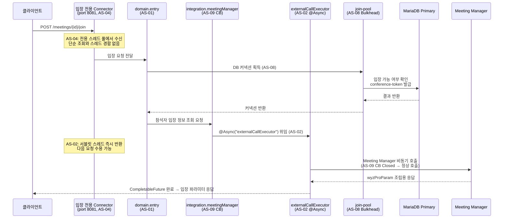
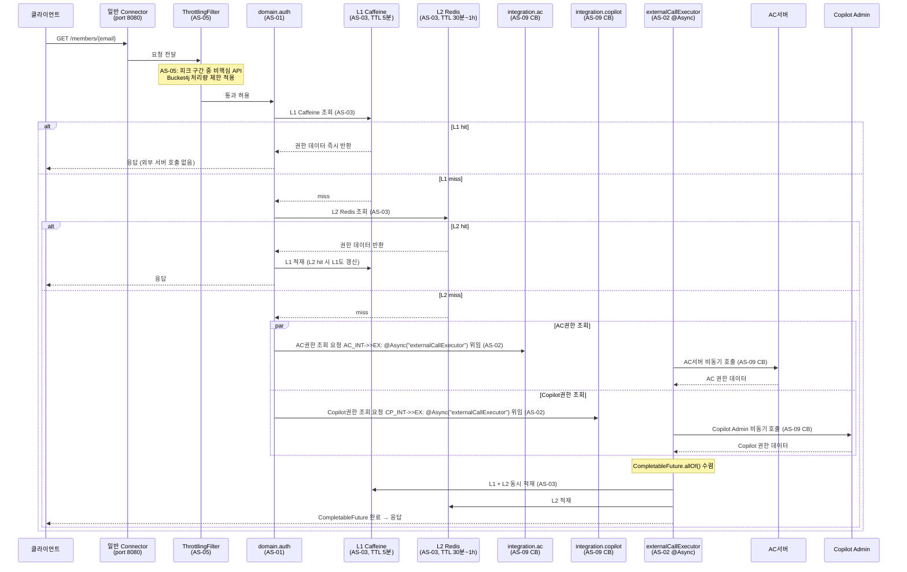
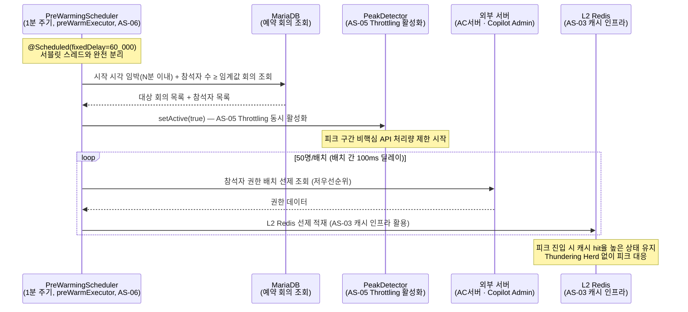
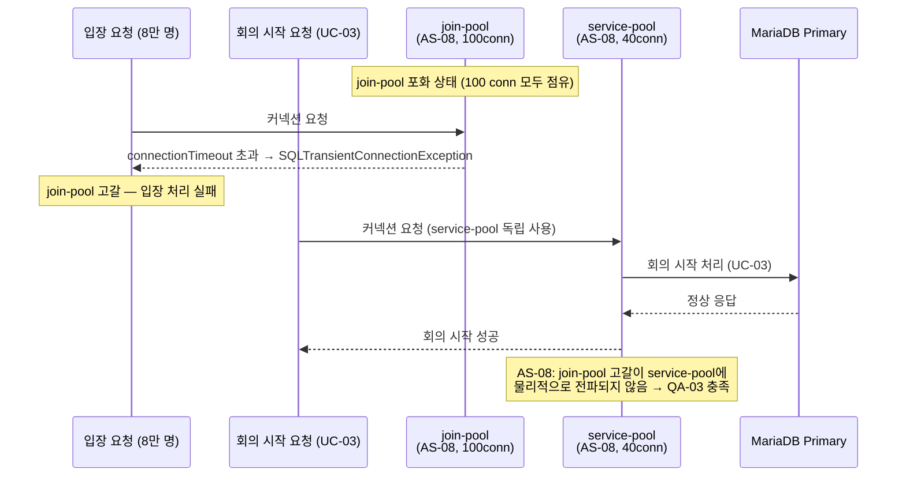
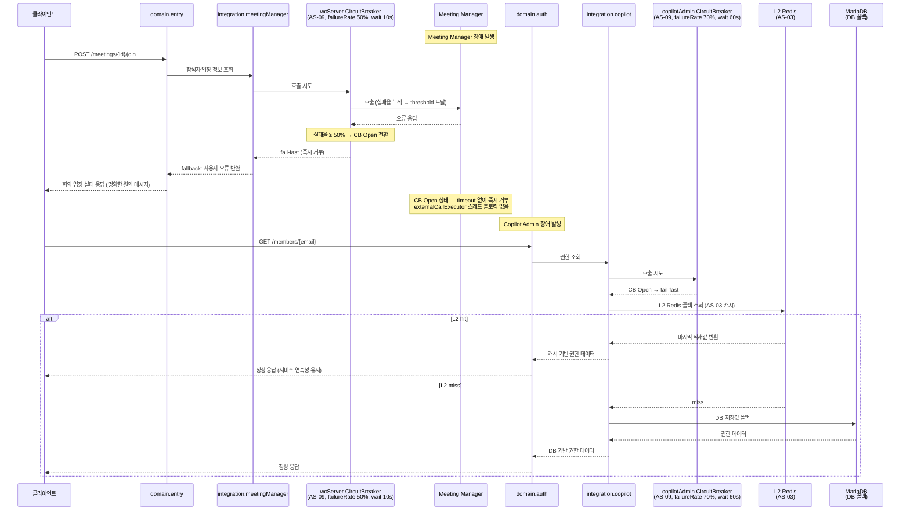
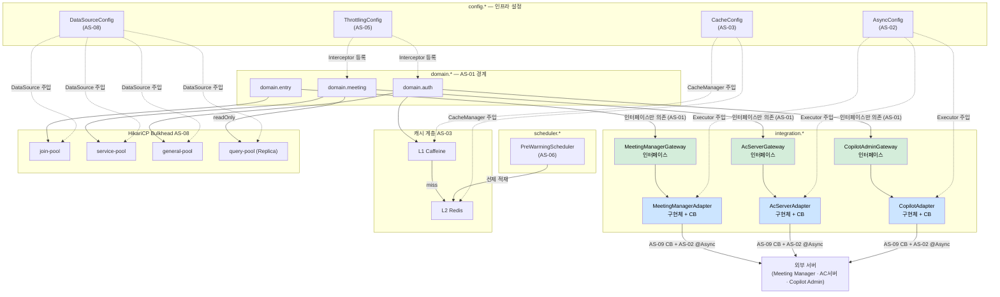
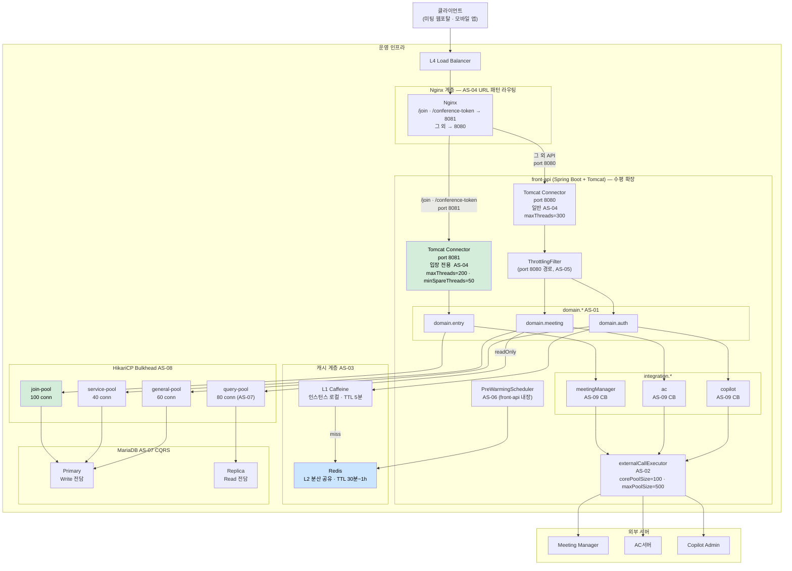

### 4.2. 아키텍처 실행 설계

#### 4.2.1. 실행 뷰 (Runtime View)

실행 뷰는 주요 유스케이스에서 컴포넌트 간 런타임 상호작용을 시퀀스 다이어그램으로 기술한다. 각 시나리오에서 AS 설계 전략이 어느 지점에서 동작하는지를 명시한다.

---

**시나리오 1. UC-04 회의 입장 — 피크 집중 정상 처리**

피크 시간대 8만 명 동시 입장 요청을 AS-04·AS-02·AS-08이 협력하여 처리하는 흐름이다.


<!-- 이미지 파일명(draw.io → PNG 교체 시): report/images/4.2-seq-uc04-join.png -->
<p align="center"><em>[그림 50] UC-04 회의 입장 — 피크 집중 정상 처리 시퀀스</em></p>

| 지점 | 적용 AS | 효과 |
| ----- | ----- | ----- |
| 입장 전용 Connector (port 8081) | AS-04 | 단순 조회·권한 갱신 요청과 스레드 경합 차단 |
| domain.entry → join-pool | AS-08 | 입장 커넥션 고갈이 service-pool·general-pool에 전파되지 않음 |
| integration.meetingManager (ACL) | AS-09 | CB 장애 감지·fallback 및 포털 도메인 모델 Meeting Manager API 스키마 노출 차단 |
| externalCallExecutor @Async | AS-02 | 서블릿 스레드 즉시 반환 → 8만 건 동시 요청 스레드 풀 고갈 방지 |
| CB 상태 (Closed) | AS-09 | 정상 상태에서 Meeting Manager 직접 호출 |
<p align="center"><em>[표 65] UC-04 회의 입장 시나리오 AS 적용 지점</em></p>

---

**시나리오 2. UC-01 권한 갱신 — 캐시 hit/miss 분기**

로그인 후 권한 갱신 시 L1·L2 캐시 분기 흐름이다.


<!-- 이미지 파일명(draw.io → PNG 교체 시): report/images/4.2-seq-uc01-auth.png -->
<p align="center"><em>[그림 51] UC-01 권한 갱신 — L1·L2 캐시 hit/miss 분기 시퀀스</em></p>

| 지점 | 적용 AS | 효과 |
| ----- | ----- | ----- |
| ThrottlingFilter | AS-05 | 피크 구간 비핵심 API 처리량 제한 |
| L1 Caffeine 조회 | AS-03 | 인스턴스 로컬 hit → 네트워크 없이 즉시 반환 |
| L2 Redis 조회 | AS-03 | 분산 인스턴스 간 공유 캐시로 외부 서버 중복 호출 방지 |
| AC·Copilot 병렬 호출 | AS-09 + AS-02 | AC권한·Copilot권한 CompletableFuture 병렬 조회 후 L1·L2 동시 적재 |
| L1 + L2 동시 적재 | AS-03 | L2 miss 후 외부 호출 결과를 양 계층에 동시 적재 |
<p align="center"><em>[표 66] UC-01 권한 갱신 시나리오 AS 적용 지점</em></p>

---

**시나리오 3. AS-06 Pre-warming 동작**

피크 N분 전 PreWarmingScheduler가 L2 Redis를 선제 적재하고 ThrottlingFilter를 활성화하는 흐름이다.


<!-- 이미지 파일명(draw.io → PNG 교체 시): report/images/4.2-seq-as06-prewarm.png -->
<p align="center"><em>[그림 52] AS-06 Pre-warming — 예약 기반 L2 Redis 선제 적재 및 Throttling 활성화 시퀀스</em></p>

| 지점 | 적용 AS | 효과 |
| ----- | ----- | ----- |
| PreWarmingScheduler (preWarmExecutor) | AS-06 | 예약 회의 데이터 기반 동적 피크 감지 |
| setActive(true) → PeakDetector | AS-05 | 워밍 시작과 동시에 비핵심 API 처리량 제한 활성화 |
| L2 Redis 선제 적재 | AS-06 + AS-03 | 피크 진입 시점 cold start 없이 캐시 hit율 유지 |
| 50명/배치 분할 + 100ms 딜레이 | AS-06 | 워밍 호출이 외부 서버에 순간 부하를 주지 않도록 분산 |
<p align="center"><em>[표 67] AS-06 Pre-warming 시나리오 AS 적용 지점</em></p>

---

**시나리오 4. AS-08 Bulkhead 격리 — join-pool 고갈 시 service-pool 독립**

join-pool이 포화 상태에서도 service-pool을 사용하는 UC-03(회의 시작)이 독립적으로 정상 처리됨을 보여준다.


<!-- 이미지 파일명(draw.io → PNG 교체 시): report/images/4.2-seq-as08-bulkhead.png -->
<p align="center"><em>[그림 53] AS-08 Bulkhead — join-pool 고갈 시 service-pool 독립 처리 시퀀스</em></p>

| 지점 | 적용 AS | 효과 |
| ----- | ----- | ----- |
| join-pool 독립 DataSource | AS-08 | 입장 커넥션 고갈이 회의 시작·초대 커넥션에 영향 없음 |
| service-pool 독립 DataSource | AS-08 | join-pool 상태와 무관하게 독립 운영 |
| QA-03 달성 구조 | AS-01 + AS-08 | domain.entry 경계 기반 DataSource Bean 분리로 격리 구현 |
<p align="center"><em>[표 68] AS-08 Bulkhead 격리 시나리오 AS 적용 지점</em></p>

---

**시나리오 5. AS-09 Circuit Breaker 동작**

외부 서버 장애 발생 시 CB Open 전환 및 서버별 차등 fallback 처리 흐름이다.


<!-- 이미지 파일명(draw.io → PNG 교체 시): report/images/4.2-seq-as09-cb.png -->
<p align="center"><em>[그림 54] AS-09 Circuit Breaker — 외부 서버 장애 시 CB Open 및 계층적 Fallback 시퀀스</em></p>

| 지점 | 적용 AS | 효과 |
| ----- | ----- | ----- |
| wcServer CB Open → fail-fast | AS-09 | Meeting Manager 장애 시 timeout 없이 즉시 거부 → 스레드 블로킹 방지 |
| copilotAdmin CB Open → L2 Redis 폴백 | AS-09 + AS-03 | Copilot Admin 장애 시 캐시 기반 계층적 복구 |
| DB 저장값 최종 폴백 | AS-09 | L2 miss 시 DB 저장 권한값으로 서비스 연속성 유지 |
| 서버별 독립 CB 정책 | AS-09 | WC서버(50%, 10s) vs Copilot Admin(70%, 60s) 차등 적용 |
<p align="center"><em>[표 69] AS-09 Circuit Breaker 시나리오 AS 적용 지점</em></p>

---

#### 4.2.2. 모듈 뷰 (Module View)

모듈 뷰는 front-api 코드베이스의 패키지 구조, 컴포넌트 간 의존 관계, 주요 Spring Bean 목록을 기술한다.

---

**패키지 구조**

```
front-api/
  domain/
    entry/                 ← AS-01: 입장 처리 전용 도메인
    auth/                  ← AS-01: 권한 갱신 도메인
    meeting/               ← AS-01: 회의 관리 도메인
  integration/             ← ACL 연계 모듈 레이어
    meetingManager/        ← ACL + AS-09 CB
    ac/                    ← ACL + AS-09 CB
    copilot/               ← ACL + AS-09 CB
  config/
    AsyncConfig            ← AS-02: externalCallExecutor Bean
    DataSourceConfig       ← AS-08: HikariCP 풀 분리
    CacheConfig            ← AS-03: L1/L2 CacheManager
    ThrottlingConfig       ← AS-05
  scheduler/
    PreWarmingScheduler    ← AS-06
```

---

**컴포넌트 의존 관계**

`domain.*`은 `integration.*`의 Gateway 인터페이스에만 의존한다. Adapter(구현체) 직접 참조는 ArchUnit 규칙으로 빌드 타임에 차단된다.


<!-- 이미지 파일명(draw.io → PNG 교체 시): report/images/4.2-module-dependency.png -->
<p align="center"><em>[그림 55] front-api 컴포넌트 의존 관계 — domain → integration 단방향 (AS-01 ArchUnit 경계 규칙)</em></p>

---

**주요 Bean 목록**

| Bean 명 | 타입 | 역할 | 관련 AS |
| ----- | ----- | ----- | :---: |
| `externalCallExecutor` | `ThreadPoolTaskExecutor` | 외부 서버 Feign 호출 전용 비동기 스레드 풀 (corePoolSize=100, maxPoolSize=500, queueCapacity=2,000) | AS-02 |
| `preWarmExecutor` | `ThreadPoolTaskExecutor` | Pre-warming 전담 저우선순위 스레드 풀 | AS-06 |
| `joinDataSource` | `HikariDataSource` | 입장 처리 전용 커넥션 풀 (maxPool=100, connTimeout=3,000ms) | AS-08 |
| `serviceDataSource` | `HikariDataSource` | 회의 시작·초대 전용 커넥션 풀 (maxPool=40, connTimeout=5,000ms) | AS-08 |
| `generalDataSource` | `HikariDataSource` | 권한 갱신·일반 조회 커넥션 풀 (maxPool=60, connTimeout=5,000ms) | AS-08 |
| `queryDataSource` | `HikariDataSource` | Read 전용 Replica 커넥션 풀 (maxPool=80, connTimeout=3,000ms) | AS-07, AS-08 |
| `caffeineCacheManager` | `CaffeineCacheManager` | L1 인스턴스 로컬 캐시 관리 (TTL 5분) | AS-03 |
| `redisCacheManager` | `RedisCacheManager` | L2 분산 공유 캐시 관리 (AC 권한 1시간 / LLM·용어사전 권한 30분) | AS-03 |
| `compositeCacheManager` | `CompositeCacheManager` | L1 → L2 순서 계층 캐시 라우팅 | AS-03 |
| `peakDetector` | `PeakDetector` | 예약 회의 DB 조회 + 고정 시간대 기반 피크 구간 활성화 | AS-05, AS-06 |
| `throttlingInterceptor` | `HandlerInterceptor` | 피크 구간 중 비핵심 API Bucket4j 처리량 제한 | AS-05 |
| `preWarmingScheduler` | `PreWarmingScheduler` | 1분 주기 예약 회의 기반 L2 Redis 선제 적재 스케줄러 | AS-06 |
| `dataSourceRouter` | `AbstractRoutingDataSource` | @Transactional readOnly 속성으로 Primary/Replica 라우팅 | AS-07 |
| `meetingManagerCircuitBreaker` | `CircuitBreaker` | Meeting Manager 전용 CB (failureRate 50%, wait 10s) | AS-09 |
| `acServerCircuitBreaker` | `CircuitBreaker` | AC서버 전용 CB (failureRate 60%, wait 30s) | AS-09 |
| `copilotAdminCircuitBreaker` | `CircuitBreaker` | Copilot Admin 전용 CB (failureRate 70%, wait 60s) | AS-09 |
<p align="center"><em>[표 70] front-api 주요 Spring Bean 목록</em></p>

---

#### 4.2.3. 배치 뷰 (Deployment View)

배치 뷰는 front-api가 운영 환경에서 어떤 하드웨어·소프트웨어 구성으로 배포되는지를 기술한다.

---

**인프라 토폴로지**


<!-- 이미지 파일명(draw.io → PNG 교체 시): report/images/4.2-deployment-topology.png -->
<p align="center"><em>[그림 56] front-api 인프라 토폴로지 — AS-04 Connector 분리 · AS-08 Bulkhead · AS-03 캐시 계층 · AS-07 CQRS</em></p>

---

**컴포넌트별 설정 요약**

Nginx URL 패턴 라우팅 (AS-04):

| 패턴 | 라우팅 대상 | 비고 |
| ----- | ----- | ----- |
| `/meetings/*/join` | front-api:8081 | 입장 전용 Connector |
| `/meetings/*/conference-token` | front-api:8081 | 입장 전용 Connector |
| 그 외 모든 경로 | front-api:8080 | 일반 Connector |
<p align="center"><em>[표 71] Nginx URL 패턴 라우팅 설정</em></p>

Tomcat Connector 설정 (AS-04):

| Connector | 포트 | maxThreads | minSpareThreads | 용도 |
| ----- | ----- | ----- | ----- | ----- |
| 입장 전용 | 8081 | 200 | 50 | /join, /conference-token 전용 |
| 일반 | 8080 | 300 | 기본값 | 조회·권한 갱신·관리 |
<p align="center"><em>[표 72] Tomcat Connector 설정</em></p>

AsyncTaskExecutor 설정 (AS-02):

| Bean | corePoolSize | maxPoolSize | queueCapacity | 용도 |
| ----- | ----- | ----- | ----- | ----- |
| `externalCallExecutor` | 100 | 500 | 2,000 | 외부 서버 Feign 호출 전담 |
| `preWarmExecutor` | 10 | 50 | 1,000 | Pre-warming 전담 (저우선순위) |
<p align="center"><em>[표 73] AsyncTaskExecutor 설정</em></p>

HikariCP 커넥션 풀 구성 (AS-08):

| 풀 이름 | 대상 DataSource | maximumPoolSize | connectionTimeout | 용도 |
| ----- | ----- | ----- | ----- | ----- |
| join-pool | joinDataSource (Primary) | 100 | 3,000ms | 입장 처리 전용 |
| service-pool | serviceDataSource (Primary) | 40 | 5,000ms | 회의 시작·초대 |
| general-pool | generalDataSource (Primary) | 60 | 5,000ms | 권한 갱신·일반 조회 |
| query-pool | queryDataSource (Replica) | 80 | 3,000ms | Read 전용 (AS-07 CQRS) |
<p align="center"><em>[표 74] HikariCP 기능별 커넥션 풀 구성</em></p>

캐시 계층 구성 (AS-03):

| 계층 | 구현체 | TTL | 범위 |
| ----- | ----- | ----- | ----- |
| L1 | Caffeine | 5분 | 인스턴스 로컬 |
| L2 | Redis | AC 권한 1시간 / LLM·용어사전 권한 30분 | 분산 공유 |
<p align="center"><em>[표 75] 캐시 계층 구성</em></p>

MariaDB 구성 (AS-07):

| 노드 | 역할 | 라우팅 조건 | 연결 풀 |
| ----- | ----- | ----- | ----- |
| Primary | Write 전담 | `@Transactional(readOnly=false)` | join-pool · service-pool · general-pool |
| Replica | Read 전담 | `@Transactional(readOnly=true)` | query-pool |
<p align="center"><em>[표 76] MariaDB Primary/Replica 구성</em></p>
