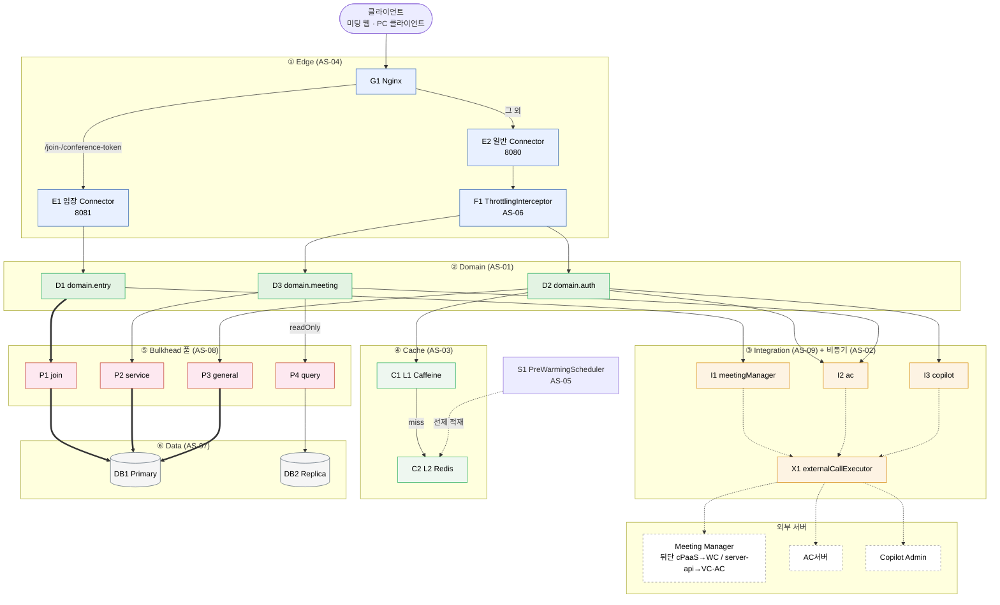
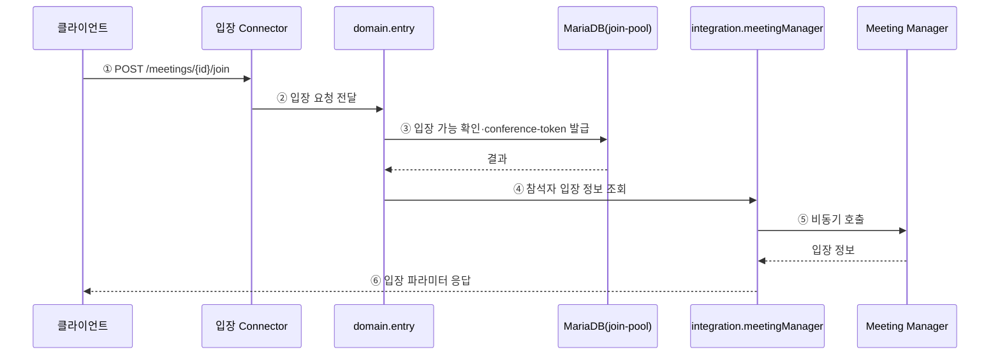
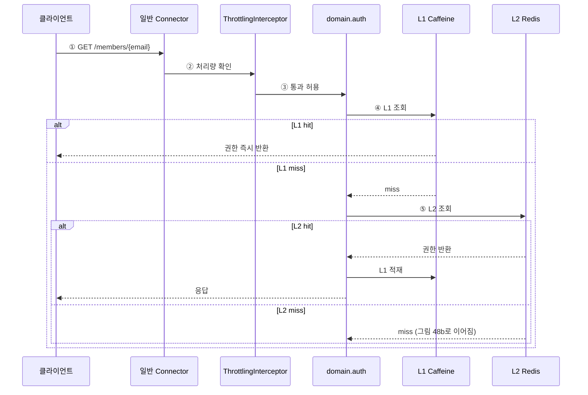
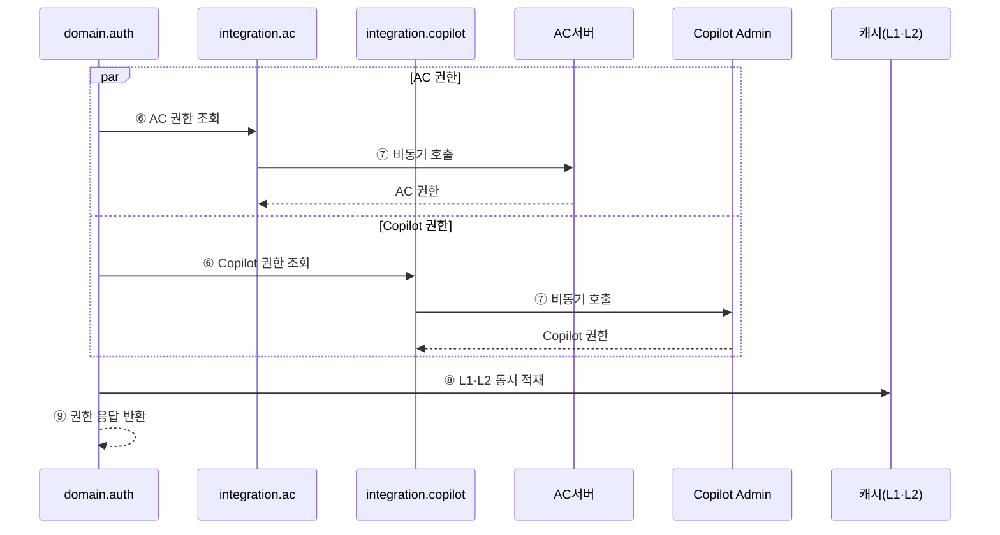
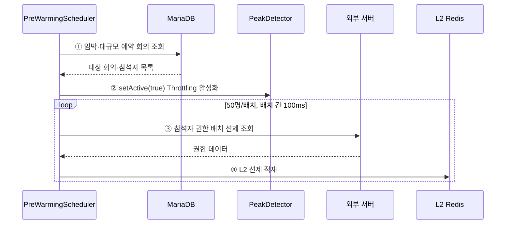
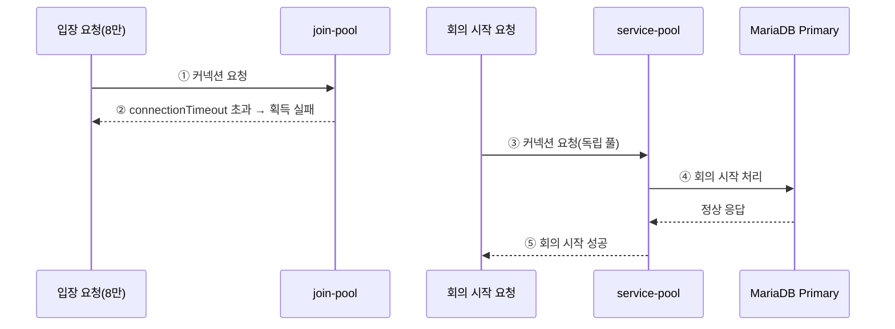
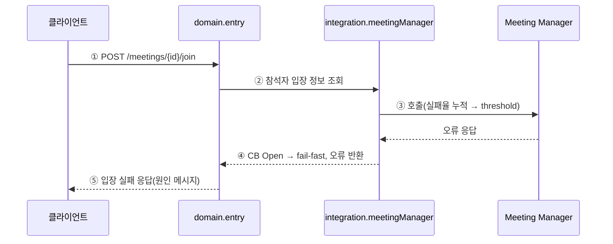
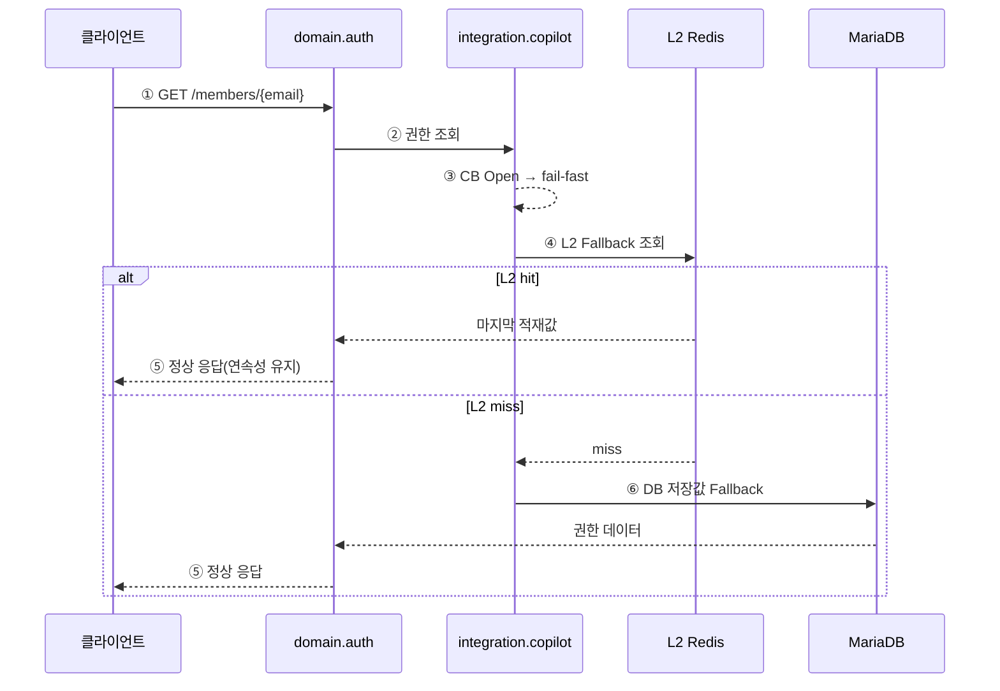

#### 4.2.1. 실행 뷰 (Runtime View)

실행 뷰는 런타임 상태의 컴포넌트 결합과 동작 흐름을 기술한다. Overall C&C View로 전체 정적 구조를 제시한 뒤, 요청 집중 구간의 주요 유스케이스를 동적 시퀀스로 확대한다. 각 시퀀스에서 어느 설계 전략이 작동하는지는 그림이 아니라 AS 적용 지점 표로 추적한다.

##### 4.2.1.1. Overall: 시스템 C&C View

front-api의 런타임 컴포넌트는 6개 계층으로 결합하며, 연결자는 네 종류(REST 동기 호출, DB 프로토콜, 캐시 조회, @Async 비동기 위임)다. 본 View는 회의 입장 백본(클라이언트 → 입장 Connector → domain.entry → join-pool → Primary)을 주축(굵은 화살표)으로 두고, 권한 캐시 경로와 비동기·선제 적재 경로를 그 위에 얹는다.

<!-- 이미지 파일명(draw.io → PNG 교체 시): report/images/4.2-overall-cnc.png -->

<em>[그림 46] 시스템 C&C View: 6계층 컴포넌트-커넥터 결합</em>

굵은 화살표는 회의 입장 백본(핵심 DB 경로), 점선은 @Async 비동기 위임, 실선은 REST 동기·캐시 조회다. 외부 서버 세 개(Meeting Manager · AC서버 · Copilot Admin)만 front-api가 직접 연계하며, WC·VC 서버는 Meeting Manager 뒤단이라 직접 결합이 아니다.

| ID | 컴포넌트 | 역할 | 관련 AS |
| ----- | ----- | ----- | :---: |
| G1 | Nginx | URL 패턴으로 입장(8081)과 그 외(8080)를 물리 분리 라우팅 | AS-04 |
| E1 | 입장 Connector | 입장 전용 Tomcat Connector. 단순 조회와 스레드 경합 없이 입장 스레드 예약 | AS-04 |
| E2 | 일반 Connector | 조회·권한 갱신·관리 수용. ThrottlingInterceptor가 앞단에 위치 | AS-04 |
| F1 | ThrottlingInterceptor | 피크 구간 중 비핵심 API 처리량 제한 | AS-06 |
| D1~D3 | domain.entry·auth·meeting | 입장·권한·회의 도메인. AS-01 경계로 분리 | AS-01 |
| I1~I3 | integration.* | Meeting Manager·AC·Copilot 연계(ACL), 서버별 차등 CB | AS-09 |
| X1 | externalCallExecutor | 외부 호출 전용 비동기 풀. 서블릿 스레드 즉시 반환 | AS-02 |
| C1·C2 | L1 Caffeine / L2 Redis | 로컬·분산 공유 계층 캐시로 외부 권한 호출 완충 | AS-03 |
| P1~P4 | join/service/general/query 풀 | 기능별 HikariCP Bulkhead | AS-08 |
| DB1·DB2 | Primary / Replica | Write·Read 전담. readOnly 트랜잭션으로 라우팅 | AS-07 |
| S1 | PreWarmingScheduler | 피크 N분 전 예약 회의 기반 L2 선제 적재 | AS-05 |

<em>[표 63] C&C View 컴포넌트별 역할</em>

데이터 흐름은 세 줄기다. (가) 입장 백본은 클라이언트부터 Primary까지의 핵심 동기 경로로 QA-02(8만 동시 입장)의 주 대상이다. (나) 권한 캐시는 L1·L2 조회로 외부 호출을 완충해 QA-01(권한 갱신 1초)을 지탱한다. (다) 비동기·선제 적재는 외부 호출을 X1이 전담하고 S1이 피크 진입 전 캐시를 채워, 어느 쪽도 동기 응답 경로에 끼어들지 않는다.

##### 4.2.1.2. UC-04 회의 입장

피크 시간대 8만 명 동시 입장 요청을 AS-04·AS-02·AS-08이 협력해 처리하는 흐름이다.

<!-- 이미지 파일명(draw.io → PNG 교체 시): report/images/4.2-seq-uc04-join.png -->

<em>[그림 47] UC-04 회의 입장: 피크 집중 정상 처리 시퀀스</em>

| 스텝 | 지점 | 적용 AS | 효과 |
| :---: | ----- | :---: | ----- |
| ① | 입장 Connector 수신(8081) | AS-04 | 단순 조회·권한 갱신과 스레드 경합 차단, 입장 스레드 예약 |
| ③ | join-pool 커넥션 획득 | AS-08 | 입장 커넥션 고갈이 service·general 풀에 전파되지 않음 |
| ④ | integration.meetingManager(ACL) | AS-09 | CB 감지·fallback, 외부 API 스키마의 도메인 노출 차단 |
| ⑤ | externalCallExecutor 비동기 위임 | AS-02 | 서블릿 스레드 즉시 반환, 8만 건 동시 요청 수용 |
| ⑤ | CB Closed 상태 | AS-09 | 정상 시 Meeting Manager 직접 호출 |

<em>[표 64] UC-04 회의 입장 시나리오 AS 적용 지점</em>

##### 4.2.1.3. UC-01 권한 갱신: 캐시 hit/miss

로그인 후 권한 갱신 시 L1·L2 캐시 분기 흐름이다. 캐시 적중 경로(그림 48a)와 L2 miss 시 외부 권한 병렬 조회 경로(그림 48b)로 나눈다.

<!-- 이미지 파일명(draw.io → PNG 교체 시): report/images/4.2-seq-uc01-auth-a.png -->

<em>[그림 48a] UC-01 권한 갱신 (1/2): L1·L2 캐시 적중 경로 시퀀스</em>

<!-- 이미지 파일명(draw.io → PNG 교체 시): report/images/4.2-seq-uc01-auth-b.png -->

<em>[그림 48b] UC-01 권한 갱신 (2/2): L2 miss 시 외부 권한 병렬 조회·적재 시퀀스</em>

| 스텝 | 지점 | 적용 AS | 효과 |
| :---: | ----- | :---: | ----- |
| ② | ThrottlingInterceptor | AS-06 | 피크 구간 비핵심 API 처리량 제한 |
| ④ | L1 Caffeine 조회 | AS-03 | 인스턴스 로컬 hit로 네트워크 없이 즉시 반환 |
| ⑤ | L2 Redis 조회 | AS-03 | 인스턴스 간 공유 캐시로 외부 중복 호출 방지 |
| ⑦ | externalCallExecutor 비동기 병렬 | AS-02 + AS-09 | AC·Copilot 병렬 조회, CB 보호 |
| ⑧ | L1·L2 동시 적재 | AS-03 | miss 후 외부 결과를 양 계층에 적재해 후속 hit 보장 |

<em>[표 65] UC-01 권한 갱신 시나리오 AS 적용 지점</em>

##### 4.2.1.4. AS-05 Pre-warming 선제 적재

피크 N분 전 PreWarmingScheduler가 L2 Redis를 선제 적재하고 ThrottlingInterceptor를 활성화하는 흐름이다. 서블릿 스레드와 완전히 분리된 스케줄 경로다.

<!-- 이미지 파일명(draw.io → PNG 교체 시): report/images/4.2-seq-as05-prewarm.png -->

<em>[그림 49] AS-05 Pre-warming: 예약 기반 L2 Redis 선제 적재 및 Throttling 활성화 시퀀스</em>

| 스텝 | 지점 | 적용 AS | 효과 |
| :---: | ----- | :---: | ----- |
| ① | PreWarmingScheduler (preWarmExecutor, 1분 주기) | AS-05 | 예약 회의 기반 동적 피크 감지, 서블릿 스레드와 분리 |
| ② | PeakDetector setActive | AS-06 | 워밍 시작과 동시에 비핵심 API 처리량 제한 활성화 |
| ③ | 50명/배치 + 100ms 딜레이 | AS-05 | 워밍 호출이 외부 서버에 순간 부하를 주지 않도록 분산 |
| ④ | L2 선제 적재 | AS-05 + AS-03 | 피크 진입 시 cold start 없이 캐시 hit율 유지 |

<em>[표 66] AS-05 Pre-warming 시나리오 AS 적용 지점</em>

##### 4.2.1.5. AS-08 Bulkhead 격리

join-pool이 포화 상태여도 service-pool을 사용하는 회의 시작(UC-03)이 독립적으로 정상 처리됨을 보여준다. AS-01 도메인 경계가 DataSource 분리의 귀속 기준을 제공한다.

<!-- 이미지 파일명(draw.io → PNG 교체 시): report/images/4.2-seq-as08-bulkhead.png -->

<em>[그림 50] AS-08 Bulkhead: join-pool 고갈 시 service-pool 독립 처리 시퀀스</em>

| 스텝 | 지점 | 적용 AS | 효과 |
| :---: | ----- | :---: | ----- |
| ② | join-pool 독립 DataSource | AS-08 | 입장 커넥션 고갈이 회의 시작·초대 커넥션에 영향 없음 |
| ③ | service-pool 독립 DataSource | AS-08 | join-pool 포화 상태와 무관하게 독립 운영 |
| ④~⑤ | QA-03 달성 구조 | AS-01 + AS-08 | domain 경계 기반 DataSource 분리로 물리 격리, 성공률 100% |

<em>[표 67] AS-08 Bulkhead 격리 시나리오 AS 적용 지점</em>

##### 4.2.1.6. AS-09 Circuit Breaker: 서버별 차등 fallback

외부 서버 장애 시 CB Open 전환과 서버별 차등 fallback 흐름이다. 필수 서버(Meeting Manager)의 fail-fast(그림 51a)와 Fallback 가능 서버(Copilot Admin)의 계층적 복구(그림 51b)로 나눈다.

<!-- 이미지 파일명(draw.io → PNG 교체 시): report/images/4.2-seq-as09-cb-a.png -->

<em>[그림 51a] AS-09 Circuit Breaker (1/2): Meeting Manager 장애 시 CB Open·fail-fast 시퀀스</em>

<!-- 이미지 파일명(draw.io → PNG 교체 시): report/images/4.2-seq-as09-cb-b.png -->

<em>[그림 51b] AS-09 Circuit Breaker (2/2): Copilot Admin 장애 시 CB Open·계층적 Fallback(L2→DB) 시퀀스</em>

| 스텝 | 지점 | 적용 AS | 효과 |
| :---: | ----- | :---: | ----- |
| 51a-④ | meetingManager CB Open → fail-fast | AS-09 | Meeting Manager 장애 시 timeout 없이 즉시 거부, 스레드 블로킹 방지 |
| 51b-③④ | copilotAdmin CB Open → L2 Fallback | AS-09 + AS-03 | Copilot Admin 장애 시 캐시 기반 계층 복구 |
| 51b-⑥ | DB 저장값 최종 Fallback | AS-09 | L2 miss 시 DB 저장 권한값으로 서비스 연속성 유지 |
| 전체 | 서버별 독립 CB 정책 | AS-09 | Meeting Manager 50%/10s, AC서버 60%/30s, Copilot Admin 70%/60s 차등 |

<em>[표 68] AS-09 Circuit Breaker 시나리오 AS 적용 지점</em>

